```mermaid
gantt
    title 底半部执行时机对比
    dateFormat X
    axisFormat %s

    section 顶半部返回
    硬件中断完成     :milestone, 0, 0

    section softirq
    软中断执行       :active, 5, 15

    section tasklet
    tasklet执行      :active, 8, 20

    section workqueue
    工作队列执行     :active, 50, 200

    section 进程调度
    普通进程运行     :active, 100, 500
```

# 10.3.1 为什么需要底半部

> 所属章节：第10章 中断与时间 > 10.3 底半部机制
>
> 难度：[I] 中级 | 预计阅读时间：15分钟

## <span class="blue"> 本节导读

想象一下：你的网卡每秒收到成千上万个数据包，每次中断都在CPU里"赖着不走"，其他设备干瞪眼。这不就是急诊室里一个病人占着诊室做全身检查，后面心梗的患者活活等死吗？<br>
本节带你看懂**底半部（Bottom Half）**的设计哲学——怎么把中断处理一拆为二，让"紧急的"赶紧完事，"耗时的"排队慢慢做。学完后，你将掌握拆分的黄金法则，告别"中断屏蔽过长"这类经典失误。

---

## <span class="blue"> 顶半部的"原罪"：霸占CPU不放

先想个问题：中断处理函数运行在什么上下文？<br>
**中断上下文**。而中断上下文有个硬性规定——**不能睡眠**。这意味着你的顶半部（Top Half）必须像闪电一样快。

但现实中，驱动工程师常干的事是什么？<br>
收到网卡中断 → 读寄存器确认 → **拷贝整个数据包到内存** → 解析协议头 → 唤醒用户进程 → 清中断。一套下来，几百微秒没了。

```c
// ❌ 典型的"大杂烩"中断处理——500us的噩梦
static irqreturn_t bad_irq_handler(int irq, void *dev_id)
{
    struct my_device *dev = dev_id;
    
    spin_lock(&dev->lock);          // 加锁
    status = readl(dev->regs + ISR); // 读中断状态
    
    while (packets_pending(dev)) {
        pkt = alloc_skb(MAX_PKT, GFP_ATOMIC);  // 分配缓冲区
        copy_packet_from_hw(dev, pkt);         // 拷贝数据！慢！
        parse_protocol_header(pkt);            // 解析协议！更慢！
        netif_rx(pkt);                         // 递交给网络栈
    }
    
    writel(status, dev->regs + ICR);  // 清中断
    spin_unlock(&dev->lock);
    
    return IRQ_HANDLED;
}
```

在这段500us里，同一个中断线被屏蔽了。如果这时候同一个设备又发来一个中断？<br>
**丢了。** 如果是其他共享这条中断线的设备有急事？<br>
**等着。** 这就是**中断屏蔽窗口过长**的恶果。

> ⚠️ **陷阱**：新手最容易犯的错——"反正逻辑都相关，放一起得了"。什么都往顶半部塞，结果系统在负载一高就漏中断、掉包、卡顿。

---

## <span class="blue"> 黄金法则：接诊要快，治疗可以等

内核的解决方案简单粗暴：**拆。**

把中断处理拆成两段，就像医院的急诊分诊：

```
病人进门 → 护士分诊（30秒） → 医生慢慢治疗（30分钟）
中断触发 → 顶半部确认（几us） → 底半部慢慢处理（几百us）
```

**顶半部（Top Half）**的职责就三条：<br>
1. 读中断状态寄存器，确认中断来源<br>
2. 做最紧急的硬件操作（比如关中断源防重入）<br>
3. 标记"底半部需要跑"，立刻返回<br>

**底半部（Bottom Half）**才做脏活累活：<br>
- 数据拷贝、协议解析、内存分配
- 唤醒等待的进程
- 所有"可以晚点做"的事

| 特性 | 顶半部 (Top Half) | 底半部 (Bottom Half) |
|:---|:---|:---|
| **运行上下文** | 硬中断上下文 | 软中断/tasklet/进程上下文 |
| **可睡眠？** | ❌ 绝对不能 | softirq/tasklet: ❌ 不能；workqueue: ✅ 可以 |
| **执行延迟** | 立即执行 | 通常几us到几ms内 |
| **核心任务** | 硬件确认 + 紧急ACK | 数据处理、协议栈、唤醒进程 |
| **并发限制** | 同中断线被屏蔽 | 可被打断、可被抢占 |
| **代码要求** | 越短越好（< 50us） | 可较长，但别太过分 |

说白了：**顶半部是抢救室门口的分诊台，底半部是住院部的病房。** 分诊台必须快，否则后面的病人进不来。

> 💡 **提示**：判断该不该放顶半部的标准——问自己："如果我不立刻做这个操作，硬件会坏掉吗？会丢数据吗？会爆炸吗？" 如果都不会 → 滚去底半部。

---

## <span class="blue"> 不拆分的后果有多惨

来看一个真实案例。某嵌入式设备的SPI驱动，中断处理里做了这些：

```
读取FIFO数据      ~100us
DMA映射           ~200us
内存拷贝          ~150us
通知上层          ~50us
---------------------
总计              ~500us
```

500us听着不长？但这设备的SPI时钟是10MHz，500us意味着**错过500个字节的数据**。更惨的是，这条中断线上还挂着温度传感器——温度报警来了也得等这500us，等轮到它时，芯片已经过热保护关机了。

连锁反应：<br>
1. 中断丢失 → 数据包/事件丢失<br>
2. 同级softirq饥饿 → 网络/块设备延迟飙升<br>
3. 用户态感知到卡顿 → **这系统怎么这么卡？**

> 🔴 **危险**：在实时系统（PREEMPT_RT）中，中断屏蔽窗口过长会直接破坏实时性保证，导致任务错过截止时间。这是生产事故的常见根因。

---

## <span class="blue"> 底半部的"三兄弟"

Linux内核提供了三种底半部机制，按"执行时机"和"可睡眠性"排列：



| 机制 | 上下文 | 可睡眠 | 同类型并发 | 适用场景 |
|:---|:---|:---|:---|:---|
| **softirq** | 软中断上下文 | ❌ | 可在多CPU并行 | 网络收发、块设备——性能敏感 |
| **tasklet** | 软中断上下文 | ❌ | 同一tasklet串行，不同类型并行 | 大多数驱动——简单够用 |
| **workqueue** | 进程上下文 | ✅ | 完全串行（per-CPU或全局） | 需要睡眠、耗时较长 |
| **NAPI** | 软中断上下文 | ❌ | 轮询模式 | 高吞吐网卡——批量处理 |

三种机制的共同点：**都在顶半部之后、延后执行**。差异在于"延后多少"、"能不能睡"、"并不并发"。<br>
下几节我们会逐个拆开讲。先记住这张图的时间线，心里有个谱。

---

## <span class="blue"> 本节总结

| 要点 | 内容 |
|:---|:---|
| **核心问题** | 顶半部过长导致中断屏蔽窗口扩大，丢失中断、系统卡顿 |
| **解决思路** | 拆分：顶半部只做硬件确认+紧急ACK，其余推迟到底半部 |
| **黄金法则** | "接诊要快，稳定生命体征就转病房慢慢治" |
| **拆分标准** | 问自己：不立刻做，硬件会坏/会丢数据吗？不会→底半部 |
| **三种机制** | softirq（高性能）、tasklet（简单够用）、workqueue（可睡眠） |
| **典型踩坑** | 数据拷贝、协议解析、内存分配放顶半部 |

---

## <span class="blue"> 下一步

底半部的三兄弟里，**softirq**是最底层、最复杂、也最高效的那个。它是网络栈和块设备的"发动机"。<br>
10.3.2 节我们深入 softirq 的实现——看看 `ksoftirqd` 是怎么干活的，为什么它在高负载下会把CPU吃到100%。

---

## <span class="blue"> 配套资源

| 资源 | 路径 | 说明 |
|:---|:---|:---|
| 内核源码 | `kernel/softirq.c` | softirq核心实现 |
| 内核源码 | `include/linux/interrupt.h` | tasklet/workqueue声明 |
| 案例代码 | 本节上述 `bad_irq_handler` | 反面教材——别这么写 |
| 推荐阅读 | LWN "A new API for bottom halves" | 历史背景与API演进 |
