# 10.3.1 为什么需要底半部

> 所属章节：第10章 中断与时间 > 10.3 底半部机制
>
> 难度：[I] | 预计阅读时间：15分钟

## <span class="blue"> 本节导读

网卡每秒收成千上万个包，如果每次中断都在 CPU 里"赖着不走"，其他中断只能干等。上一节（10.2.3）已经用 irqsoff 量化了"顶半部太长"的代价，本节回答它的解法：为什么要把中断处理拆成顶半部 + 底半部两段。<BR>
本节覆盖：顶半部"什么都干"的典型反面教材、顶/底半部的职责划分与拆分标准、不拆分的连锁后果、三种底半部机制的定位速览。

---

## <span class="blue"> 顶半部的问题：占着关中断的窗口不放

先回顾一个前提：中断处理函数运行在**中断上下文**，不能睡眠，且 v6.6 起一律在关本地中断的状态下执行（10.2.1 已展开）。这决定了顶半部必须快进快出。

但现实中，驱动里常见的写法是什么？收到网卡中断 → 读寄存器确认 → **拷贝整个数据包到内存** → 解析协议头 → 唤醒用户进程 → 清中断。一套下来，几百微秒没了。

```c
/* ❌ 典型的"大杂烩"中断处理——500μs 都耗在顶半部 */
static irqreturn_t bad_irq_handler(int irq, void *dev_id)
{
    struct my_device *dev = dev_id;

    spin_lock(&dev->lock);           /* 加锁 */
    status = readl(dev->regs + ISR); /* 读中断状态 */

    while (packets_pending(dev)) {
        pkt = alloc_skb(MAX_PKT, GFP_ATOMIC);  /* 分配缓冲区 */
        copy_packet_from_hw(dev, pkt);         /* 拷贝数据！慢！ */
        parse_protocol_header(pkt);            /* 解析协议！更慢！ */
        netif_rx(pkt);                         /* 递交给网络栈 */
    }

    writel(status, dev->regs + ICR);  /* 清中断 */
    spin_unlock(&dev->lock);

    return IRQ_HANDLED;
}
```

在这 500μs 里，本地 CPU 收不到任何中断。同一个设备又发来中断？边沿触发只补记一次（10.2.3 已讲），多来的丢了。共享这条线的其他设备有急事？等着。这就是**中断屏蔽窗口过长**的代价。

> ⚠️ 新手最容易犯的错——"反正逻辑都相关，放一起得了"。什么都往顶半部塞，负载一高就漏中断、掉包、卡顿。

---

## <span class="blue"> 黄金法则：确认要快，处理可以等

内核的解决方案：**拆。**

把中断处理拆成两段：

```
中断触发 → 顶半部确认（几μs） → 底半部慢慢处理（几百μs）
```

**顶半部（Top Half）**的职责就三条：

1. 读中断状态寄存器，确认中断来源
2. 做最紧急的硬件操作（比如清除中断标志防重入）
3. 标记"底半部需要跑"，立刻返回

**底半部（Bottom Half）**才做耗时的工作：

- 数据拷贝、协议解析、内存分配
- 唤醒等待的进程
- 所有"可以晚点做"的事

| 特性 | 顶半部 (Top Half) | 底半部 (Bottom Half) |
|:---|:---|:---|
| **运行上下文** | 硬中断上下文 | softirq/tasklet 上下文，或进程上下文（workqueue） |
| **可睡眠？** | ❌ 绝对不能 | softirq/tasklet: ❌ 不能；workqueue: ✅ 可以 |
| **执行延迟** | 立即执行 | 通常几μs到几ms内 |
| **核心任务** | 硬件确认 + 清标志 | 数据处理、协议栈、唤醒进程 |
| **并发限制** | 关本地中断 | 可被硬中断打断 |
| **代码要求** | 越短越好（经验值 < 100μs，高速外设更低） | 可较长，但别失控 |

> 💡 判断一个操作该不该放顶半部，问自己：**不立刻做，硬件会出错、数据会丢吗？** 不会 → 放底半部。读取状态寄存器和清中断标志通常是仅有的两个"必须立刻做"的事。

---

## <span class="blue"> 不拆分的后果有多惨

来看一个真实案例。某嵌入式设备的 SPI 驱动，中断处理里做了这些：

```
读取FIFO数据      ~100us
DMA映射           ~200us
内存拷贝          ~150us
通知上层          ~50us
---------------------
总计              ~500us
```

500μs 听着不长？但这设备的 SPI 时钟是 10MHz（约 1.25MB/s），500μs 意味着**约 600 字节的数据**在此期间到达而无人接收。更麻烦的是，这条中断线上还挂着温度传感器——温度报警来了也得等这 500μs，等轮到它时，芯片可能已经过热保护关机了。

连锁反应：

1. 中断丢失 → 数据包/事件丢失
2. `irq_exit()` 推迟 → softirq 延迟，网络/块设备响应变差（10.2.3 已展开）
3. 用户态感知到卡顿

> 🔴 在实时系统（PREEMPT_RT）中，中断屏蔽窗口过长会直接破坏实时性保证，导致任务错过截止时间。这是生产事故的常见根因。

---

## <span class="blue"> 三种底半部机制速览

Linux内核提供了三种底半部机制，按"执行时机"和"可睡眠性"区分：

```mermaid
gantt
    title 底半部执行时机对比
    dateFormat X
    axisFormat %s

    section 顶半部返回
    硬件中断完成     :milestone, 0, 0

    section softirq
    软中断执行       :active, 5, 15

    section tasklet
    tasklet执行      :active, 8, 20

    section workqueue
    工作队列执行     :active, 50, 200

    section 进程调度
    普通进程运行     :active, 100, 500
```



| 机制 | 上下文 | 可睡眠 | 并发行为 | 适用场景 |
|:---|:---|:---|:---|:---|
| **softirq** | softirq 上下文（禁抢占） | ❌ | 同类型可多 CPU 并行 | 网络收发、块设备——性能敏感 |
| **tasklet** | 基于 softirq 实现 | ❌ | 同一 tasklet 串行，不同 tasklet 可并行 | 普通驱动——简单够用 |
| **workqueue** | 进程上下文 | ✅ | 默认 per-CPU worker pool，可多 CPU 并行 | 需要睡眠、耗时较长 |
| **NAPI** | 基于 softirq 的轮询 | ❌ | 轮询模式批量处理 | 高吞吐网卡（10.3.5 展开） |

三种机制的共同点：**都在顶半部之后、延后执行**。差异在于延后多少、能不能睡、并发行为。后面三节逐个拆解。

---

## <span class="blue"> 本节总结

| 要点 | 内容 |
|:---|:---|
| **核心问题** | 顶半部过长扩大关中断窗口：丢中断、softirq 推迟、系统卡顿 |
| **解决思路** | 拆分：顶半部只做硬件确认+清标志，其余推迟到底半部 |
| **拆分标准** | 不立刻做硬件会出错/丢数据吗？不会 → 底半部 |
| **三种机制** | softirq（高性能）、tasklet（简单够用）、workqueue（可睡眠） |
| **典型踩坑** | 数据拷贝、协议解析、可能睡眠的内存分配放进顶半部 |

---

## <span class="blue"> 下一步

三种机制里，**softirq** 是最底层、最高效的那个，网络栈和块设备都跑在它上面。10.3.2 深入 softirq 的实现：类型体系、`irq_exit()` 里的执行时机，以及高负载下把 CPU 吃到 100% 的 `ksoftirqd` 是怎么回事。

---

## <span class="blue"> 配套资源

| 资源 | 路径 | 说明 |
|:---|:---|:---|
| 内核源码 | `kernel/softirq.c` | softirq核心实现 |
| 内核源码 | `include/linux/interrupt.h` | tasklet/softirq 类型声明 |
| 案例代码 | 本节上述 `bad_irq_handler` | 反面教材——别这么写 |
| 关联小节 | 10.2.3 | 顶半部过长的量化测量（irqsoff） |
