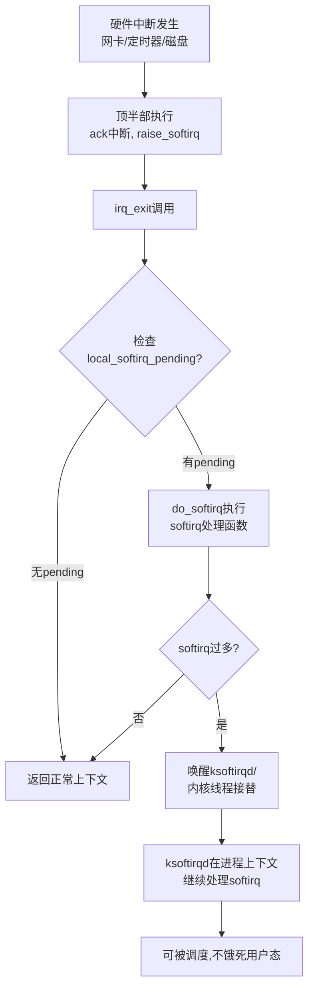

# 10.3.2 softirq详解

> 所属章节：第10章 中断与时间 > 10.3 底半部机制
>
> 难度：[E][M] | 预计阅读时间：20分钟

## <span class="blue"> 本节导读

上一节你知道了中断必须拆成"顶半部+底半部"。那底半部里头谁的优先级最高、跑得最快？答案是 **softirq**。

本节带你深入 softirq 的静态类型体系、执行时机，以及那个让无数运维半夜惊醒的 ksoftirqd。我们会跟着一个网络数据包从网卡中断到进入协议栈的完整路径，看 softirq 到底在哪个环节"暗中发力"。<br>
学完后，你将能读懂 `/proc/softirqs` 的输出，定位 softirq 风暴，并明白为什么 softirq 里绝对不能调用 `schedule()`。

## <span class="blue"> softirq 的类型与静态定义 [E]

softirq 是 Linux 里**优先级最高的底半部机制**。它和硬件中断一样，在设计上追求极致的速度。

说个数字你就懂了：softirq 最多只有 32 种，而且内核已经占用了其中约 10 个。这意味着什么？它不是给驱动开发者随便注册着玩的——它是内核核心子系统的"专用快车道"。

| 类型宏 | 名称 | 用途 | 典型触发者 |
|--------|------|------|-----------|
| `HI_SOFTIRQ` | 高优先级 tasklet | 执行高优先级 tasklet | `tasklet_hi_schedule()` |
| `TIMER_SOFTIRQ` | 定时器 | 处理到期的定时器 | `run_timer_softirq()` |
| `NET_TX_SOFTIRQ` | 网络发包 | 发送网络数据包 | `dev_queue_xmit()` 后 |
| `NET_RX_SOFTIRQ` | 网络收包 | 接收网络数据包 | NAPI 轮询完成时 |
| `BLOCK_SOFTIRQ` | 块设备 | 处理块设备 I/O 完成 | I/O 调度器 |
| `IRQ_POLL_SOFTIRQ` | IRQ 轮询 | 替代中断的轮询模式 | 高 IOPS 存储设备 |
| `TASKLET_SOFTIRQ` | 普通 tasklet | 执行普通 tasklet | `tasklet_schedule()` |
| `SCHED_SOFTIRQ` | 负载均衡 | 调度域负载均衡 | `smp_balance_exec()` |
| `HRTIMER_SOFTIRQ` | 高精度定时器 | 处理高精度定时器到期 | hrtimer 子系统 |
| `RCU_SOFTIRQ` | RCU 回调 | 执行 RCU 宽限期回调 | `rcu_process_callbacks()` |

看看这张表，softirq 几乎被内核的"命脉子系统"瓜分一空：网络、块设备、定时器、调度、RCU……你的驱动想申请一个新的 softirq？基本上没门。这也是内核留给你的信号：**普通驱动用 tasklet 或 workqueue，softirq 这个快车道不是给你准备的。**

```c
// kernel/softirq.c
static struct softirq_action softirq_vec[NR_SOFTIRQS] __cacheline_aligned;
// NR_SOFTIRQS = 10 (实际已定义数量)
```

每个 softirq 类型对应一个 `softirq_action` 结构体，里面只有一个成员：`void (*action)(struct softirq_action *)`。说白了，就是一个函数指针。

## <span class="blue"> softirq 的执行机制：谁在什么时候跑？ [E]

softirq 的执行遵循一个核心原则：**在中断上下文退出时"顺路"跑**。这个设计非常精巧，既保证了低延迟，又不会无限抢占 CPU。

执行流程是这样的：



代码调用链如下：

```c
// 1. 某个地方标记 softirq 需要执行
raise_softirq(NET_RX_SOFTIRQ);

// 2. 中断退出时检查并执行
void irq_exit(void)
{
    // ... 其他处理 ...
    invoke_softirq();  // 内部调用 do_softirq()
}

// 3. do_softirq 的核心逻辑（kernel/softirq.c）
asmlinkage __visible void do_softirq(void)
{
    u32 pending = local_softirq_pending();  // 读取 pending 位图
    
    // 关中断，防止重入
    __local_bh_disable_ip(_RET_IP_, SOFTIRQ_OFFSET);
    
    while (pending) {
        struct softirq_action *h = softirq_vec;
        int vec_nr;
        
        do {
            if (pending & 1) {
                // 执行注册的 softirq 处理函数
                h->action(h);
            }
            h++;
            pending >>= 1;
            vec_nr++;
        } while (pending);
    }
    
    // 开中断
    __local_bh_enable(SOFTIRQ_OFFSET);
}
```

关键细节：`do_softirq()` 执行前会调用 `__local_bh_disable()`，这意味着在 softirq 运行期间，**同一 CPU 上不会再重入 softirq**。但你注意，这只限制同一 CPU——`NET_RX_SOFTIRQ` 可以在 CPU0 跑的同时，CPU1 也在跑 `NET_RX_SOFTIRQ`。这就是 softirq 的一个重要特性：**同类型 softirq 可在多 CPU 上真正并行。**

## <span class="blue"> ksoftirqd：softirq 的"保险丝" [M]

现在想一个问题：如果网卡疯狂收包，`NET_RX_SOFTIRQ` 被一次次 raise，那 `do_softirq()` 岂不是永远跑不完？用户态进程岂不是永远拿不到 CPU？

内核当然想到了这个问题，解决方案就是 **ksoftirqd**。

```
CPU0:  ksoftirqd/0
CPU1:  ksoftirqd/1
CPU2:  ksoftirqd/2
...    每个 CPU 一个 ksoftirqd 线程
```

`ksoftirqd` 的本质是**每个 CPU 绑定一个内核线程**。触发条件很简单：`do_softirq()` 执行完一轮后，如果发现还有 pending 的 softirq，且已经处理超过一定阈值，内核就会唤醒对应的 `ksoftirqd`。后续的 softirq 处理就交给这个线程，在**进程上下文**里慢慢跑。

> ⚠️ **陷阱**：`ksoftirqd` 占用 100% CPU 是生产环境经典故障。当你在 `top` 里看到 `ksoftirqd/0` 吃满一个核，说明这个 CPU 上的 softirq 流量已经爆表。常见原因：
> - 网卡流量过大（DDoS、广播风暴）
> - 块设备 I/O 过于密集
> - 某个驱动在 softirq 里做了太多事情
>
> 排查利器：`watch -n1 'cat /proc/softirqs'` 看哪个类型的计数器在暴涨。

> 💡 **提示**：`/proc/softirqs` 是一个只读伪文件，显示每个 CPU 上各类 softirq 的触发次数。格式如下：
> ```
> CPU0       CPU1       CPU2       CPU3
> HI:          0          0          0          0
> TIMER:   12345      12350      12340      12348
> NET_TX:    890        912        870        905
> NET_RX:  45678      46000      45200      45800
> BLOCK:    5670       5680       5660       5675
> ```
> 通过对比各 CPU 的分布，可以判断负载是否均衡、哪个子系统最繁忙。

## <span class="blue"> 实战：网络收包的完整 NAPI 流程 [M]

说了半天 softirq 的理论，来看一个最经典的实战场景——网络收包。这是 softirq 最高频的触发场景，也是你面试时大概率被问到的问题。

```
网卡收到数据包
    │
    ▼
┌─────────────┐
│  硬件中断    │  ← 顶半部开始，关本地中断
│  irq_handler │
└──────┬──────┘
       │
       ▼
┌─────────────┐
│ napi_schedule│  ← 将 napi_struct 加入 CPU 的 poll_list
│              │     并 raise NET_RX_SOFTIRQ
└──────┬──────┘
       │
       ▼
┌─────────────┐
│  irq_exit()  │  ← 顶半部结束
│ invoke_softirq│
└──────┬──────┘
       │
       ▼
┌─────────────┐
│ NET_RX_SOFTIRQ│ ← do_softirq() 执行
│  net_rx_action │  ← 遍历 poll_list，调用 napi->poll()
└──────┬──────┘
       │
       ▼
┌─────────────┐
│  napi_poll() │  ← 真正从 ring buffer 取包
│              │     交给协议栈处理
└─────────────┘
```

关键代码路径：

```c
// drivers/net/ethernet/intel/igb/igb_main.c (以 igb 网卡为例)
static irqreturn_t igb_msix_ring(int irq, void *data)
{
    struct igb_q_vector *q_vector = data;
    
    // 写寄存器，ack 中断
    writel(0, q_vector->itr_reg);
    
    // NAPI 调度——精髓在这里！
    napi_schedule_irqoff(&q_vector->napi);
    
    return IRQ_HANDLED;
}

// net/core/dev.c
static inline void ____napi_schedule(struct softnet_data *sd,
                                      struct napi_struct *napi)
{
    // 把 napi 结构体挂到当前 CPU 的 poll_list
    list_add_tail(&napi->poll_list, &sd->poll_list);
    // 标记 NET_RX_SOFTIRQ pending
    __raise_softirq_irqoff(NET_RX_SOFTIRQ);
}

// net/core/dev.c
static __latent_entropy void net_rx_action(struct softirq_action *h)
{
    struct softnet_data *sd = this_cpu_ptr(&softnet_data);
    struct list_head *list = &sd->poll_list;
    
    while (!list_empty(list)) {
        struct napi_struct *n;
        int work, weight;
        
        n = list_first_entry(list, struct napi_struct, poll_list);
        weight = n->weight;
        
        // 调用网卡驱动的 poll 函数，收取数据包
        work = n->poll(n, weight);
        
        // 如果 quota 没用完，说明没包可收了
        // 把 napi 从 poll_list 移除，重新开中断
        if (likely(work < weight))
            list_del(&n->poll_list);
        // 如果 quota 用完了，还有包
        // 保留在 poll_list，下次 softirq 继续处理
    }
}
```

这个设计的精妙之处：**一次中断可以收多个包**。传统方式每来一个包触发一次中断，中断 overhead 极高。NAPI 模式下，网卡中断触发后关中断，然后通过 `NET_RX_SOFTIRQ` 批量轮询收包，收完再开中断。高流量下中断率大幅下降，CPU 利用率反而更高。

## <span class="blue"> softirq 的限制与红线 [E]

softirq 运行在**中断上下文**（或者说 "softirq 上下文"），这个上下文有一些铁律：

1. **不能睡眠**：没有进程绑在这个上下文上，调度器不知道切给谁。
2. **不能访问用户态内存**：中断上下文和用户进程无关。
3. **执行时间要尽量短**：虽然比硬中断宽松，但太长会堆积 pending。

> 🔴 **危险**：在 softirq 中调用 `schedule()` 会导致内核 panic 或不可预测的行为。`schedule()` 需要进程上下文，而 softirq 没有 `task_struct` 支撑。如果你需要睡眠，请改用 **workqueue**，它在进程上下文中运行，可以安全地调用 `schedule()`。

```c
// 这是错的！千万别这么干！
static void my_softirq_handler(struct softirq_action *h)
{
    mutex_lock(&my_mutex);  // ❌ 可能睡眠！softirq 里禁止！
    schedule();              // ❌ 绝对禁止！会导致崩溃！
}
```

| 特性 | softirq | tasklet | workqueue |
|------|---------|---------|-----------|
| 执行上下文 | 中断上下文（原子） | 中断上下文（原子） | 进程上下文 |
| 可否睡眠 | ❌ 不可 | ❌ 不可 | ✅ 可以 |
| 同类型并行 | ✅ 多 CPU 并行 | ❌ 同一时刻仅一个 CPU | ✅ 多 CPU 并行 |
| 注册方式 | 静态编译时 | 动态运行时 | 动态运行时 |
| 适用场景 | 网络/块设备等核心子系统 | 普通驱动底半部 | 需要睡眠的操作 |

## <span class="blue"> 本节总结

| 要点 | 内容 |
|------|------|
| softirq 的本质 | 最高优先级底半部，静态定义，内核核心子系统专用 |
| 执行时机 | `irq_exit()` 中检查 pending，调用 `do_softirq()` 处理 |
| ksoftirqd 的作用 | softirq 过多时接手处理，避免用户态饥饿 |
| 并行特性 | 同类型 softirq 可在多 CPU 上同时执行 |
| 绝对红线 | 不能睡眠，不能调用 `schedule()` |
| 排查工具 | `/proc/softirqs` 看各 CPU softirq 分布 |
| 经典故障 | `ksoftirqd` 100% → 检查网络流量或块设备 I/O |
| NAPI 核心 | `NET_RX_SOFTIRQ` + `net_rx_action()` + `napi_poll()` 批量收包 |

## <span class="blue"> 下一步

softirq 虽然快，但它静态且门槛高。那普通驱动开发者用什么？下一节 **`10.3.3 tasklet 详解`**，带你了解 softirq 的"亲民版"——基于 `TASKLET_SOFTIRQ` 和 `HI_SOFTIRQ` 构建的动态底半部机制，看看它怎么在保持高效的同时降低使用门槛。

## <span class="blue"> 配套资源

| 资源 | 路径/命令 | 说明 |
|------|----------|------|
| softirq 核心代码 | `kernel/softirq.c` | `raise_softirq()`, `do_softirq()`, ksoftirqd 线程 |
| 网络 NAPI 入口 | `net/core/dev.c` | `net_rx_action()`, `napi_schedule()` |
| 查看 softirq 统计 | `cat /proc/softirqs` | 各 CPU 各类 softirq 计数 |
| 实时监控 | `watch -n1 'cat /proc/softirqs'` | 观察哪个类型在涨 |
| ksoftirqd 源码 | `kernel/softirq.c` 中 `run_ksoftirqd()` | 内核线程主循环 |
| NAPI 轮询示例 | `drivers/net/ethernet/intel/igb/igb_main.c` | igb 驱动的 poll 实现 |
