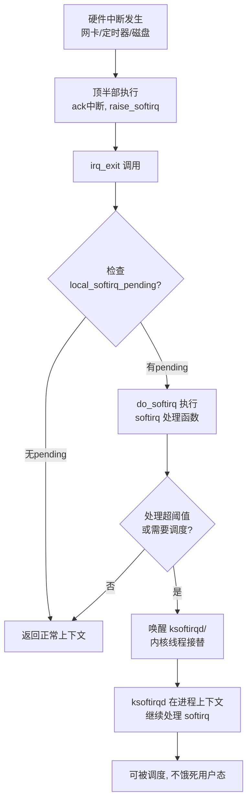

# 10.3.2 softirq详解

> 所属章节：第10章 中断与时间 > 10.3 底半部机制
>
> 难度：[E→M] | 预计阅读时间：20分钟

## <span class="blue"> 本节导读

上一节确定了中断必须拆成"顶半部+底半部"。底半部机制里优先级最高、跑得最快的是 **softirq**——网络收发包、块设备 IO 完成、定时器到期，全跑在它上面。<BR>
本节覆盖：softirq 的静态类型体系（v6.6 共 10 种）、`irq_exit()` 处的执行时机与 `do_softirq()` 的真实代码、防重入与多 CPU 并行的机制、`ksoftirqd` 的触发条件与 100% CPU 故障排查、`/proc/softirqs` 的读法，以及 NAPI 收包链上 softirq 的位置。

## <span class="blue"> softirq 的类型与静态定义 [E]

softirq 是 Linux 里**优先级最高的底半部机制**，设计上追求极致的速度。

先看数量约束：softirq 最多 32 种，v6.6 实际定义了 10 种（`include/linux/interrupt.h`），已全部被内核核心子系统占用：

| 类型宏 | 名称 | 用途 | 典型触发者 |
|--------|------|------|-----------|
| `HI_SOFTIRQ` | 高优先级 tasklet | 执行高优先级 tasklet | `tasklet_hi_schedule()` |
| `TIMER_SOFTIRQ` | 定时器 | 处理到期的普通定时器 | tick 处理 |
| `NET_TX_SOFTIRQ` | 网络发包 | 发送网络数据包 | 发送路径 |
| `NET_RX_SOFTIRQ` | 网络收包 | 接收网络数据包 | NAPI 调度 |
| `BLOCK_SOFTIRQ` | 块设备 | 处理块设备 I/O 完成 | I/O 完成路径 |
| `IRQ_POLL_SOFTIRQ` | IRQ 轮询 | 替代中断的轮询模式 | 高 IOPS 存储设备 |
| `TASKLET_SOFTIRQ` | 普通 tasklet | 执行普通 tasklet | `tasklet_schedule()` |
| `SCHED_SOFTIRQ` | 调度 | 调度域负载均衡等 | 调度器 |
| `HRTIMER_SOFTIRQ` | 高精度定时器 | 处理高精度定时器到期 | hrtimer 子系统 |
| `RCU_SOFTIRQ` | RCU 回调 | 执行 RCU 宽限期回调 | RCU 子系统 |

这张表说明两件事：softirq 被网络、块设备、定时器、调度、RCU 这些"命脉子系统"瓜分完毕；普通驱动**不能**新增 softirq 类型——这是内核的明确信号：**普通驱动用 tasklet 或 workqueue，softirq 不对外开放。**

```c
/* kernel/softirq.c:59 */
static struct softirq_action softirq_vec[NR_SOFTIRQS] __cacheline_aligned_in_smp;
```

每个 softirq 类型对应一个 `softirq_action`，核心就是一个函数指针 `action`。

## <span class="blue"> softirq 的执行机制：谁在什么时候跑？ [E]

softirq 的执行遵循一个核心原则：**在中断退出路径上"顺路"跑**。既保证低延迟，又不无限占用 CPU。



真实代码（v6.6，`kernel/softirq.c:441`）：

```c
asmlinkage __visible void do_softirq(void)
{
    __u32 pending;
    unsigned long flags;

    if (in_interrupt())
        return;                       /* 中断嵌套层里不重复执行 */

    local_irq_save(flags);
    pending = local_softirq_pending();
    if (pending)
        do_softirq_own_stack();       /* → __do_softirq() 逐位执行 */
    local_irq_restore(flags);
}
```

逐位执行的处理循环在 `__do_softirq()` 里，两个关键细节：

1. **处理期间中断是打开的**。`__do_softirq()` 进入循环前重新 `local_irq_enable()`——softirq 可以被硬中断打断，这正是它比硬中断"软"的地方。
2. **防重入靠计数，不靠关中断**。执行前把 `preempt_count` 加上 `SOFTIRQ_OFFSET`，同一 CPU 上 softirq 不会嵌套重入；但这只限制本 CPU——`NET_RX_SOFTIRQ` 在 CPU0 跑的同时，CPU1 可以跑同一个 `NET_RX_SOFTIRQ`。**同类型 softirq 可在多 CPU 上真正并行**，写 softirq 处理函数必须考虑这一点。

## <span class="blue"> ksoftirqd：softirq 的限流阀 [M]

如果网卡疯狂收包，`NET_RX_SOFTIRQ` 被一次次 raise，`__do_softirq()` 岂不是永远跑不完、用户态永远拿不到 CPU？

内核的解法是 **ksoftirqd**：每个 CPU 一个内核线程（`ksoftirqd/0`、`ksoftirqd/1`……）。`__do_softirq()` 的处理循环有两道上限（`kernel/softirq.c:474` 附近）：

- **时间上限 `MAX_SOFTIRQ_TIME`**：2ms；
- **重启次数上限 `MAX_SOFTIRQ_RESTART`**：10 次。

任一超限（或者 `need_resched()` 置位）而 pending 还没清完，就唤醒 `ksoftirqd`，把剩余处理移交进程上下文慢慢跑——用户态因此不会被饿死。

> ⚠️ `ksoftirqd` 占用 100% CPU 是生产环境经典故障。`top` 里看到 `ksoftirqd/0` 吃满一个核，说明这个 CPU 上的 softirq 流量已爆表。常见原因：网卡流量过大（DDoS、广播风暴）、块设备 I/O 过于密集、某个驱动在 softirq 里做了太多事。排查：`watch -n1 'cat /proc/softirqs'`，看哪个类型的计数在暴涨。

> 💡 `/proc/softirqs` 显示每个 CPU 上各类 softirq 的触发次数：
> ```
>            CPU0       CPU1       CPU2       CPU3
> HI:          0          0          0          0
> TIMER:   12345      12350      12340      12348
> NET_TX:    890        912        870        905
> NET_RX:  45678      46000      45200      45800
> BLOCK:    5670       5680       5660       5675
> ```
> 对比各 CPU 的分布，可以判断负载是否均衡、哪个子系统最繁忙。

## <span class="blue"> 实战：网络收包链上的 softirq [M]

理论讲完，看最经典的场景——网络收包，softirq 最高频的触发场景：

```
网卡收到数据包
    │
    ▼
┌─────────────┐
│  硬件中断    │  ← 顶半部开始，关本地中断
│  irq_handler │
└──────┬──────┘
       │
       ▼
┌─────────────┐
│ napi_schedule│  ← 将 napi_struct 加入 CPU 的 poll_list
│              │     并 raise NET_RX_SOFTIRQ
└──────┬──────┘
       │
       ▼
┌─────────────┐
│  irq_exit()  │  ← 顶半部结束
│ invoke_softirq│
└──────┬──────┘
       │
       ▼
┌─────────────┐
│ NET_RX_SOFTIRQ│ ← __do_softirq() 执行
│  net_rx_action │  ← 遍历 poll_list，调用 napi->poll()
└──────┬──────┘
       │
       ▼
┌─────────────┐
│  napi->poll() │  ← 真正从 ring buffer 取包
│              │     交给协议栈处理
└─────────────┘
```

关键代码路径（节选）：

```c
/* drivers/net/ethernet/intel/igb/igb_main.c —— igb 网卡中断处理（节选） */
static irqreturn_t igb_msix_ring(int irq, void *data)
{
    struct igb_q_vector *q_vector = data;
    ...
    napi_schedule_irqoff(&q_vector->napi);   /* 精髓：只调度，不收包 */
    return IRQ_HANDLED;
}

/* net/core/dev.c —— NAPI 调度（节选） */
static inline void ____napi_schedule(struct softnet_data *sd,
                                      struct napi_struct *napi)
{
    list_add_tail(&napi->poll_list, &sd->poll_list);      /* 挂到本 CPU 轮询表 */
    __raise_softirq_irqoff(NET_RX_SOFTIRQ);               /* 标记 pending */
}

/* net/core/dev.c —— NET_RX_SOFTIRQ 的处理函数（节选） */
static __latent_entropy void net_rx_action(struct softirq_action *h)
{
    struct softnet_data *sd = this_cpu_ptr(&softnet_data);
    struct list_head *list = &sd->poll_list;

    while (!list_empty(list)) {
        struct napi_struct *n;
        int work, weight;

        n = list_first_entry(list, struct napi_struct, poll_list);
        weight = n->weight;

        work = n->poll(n, weight);     /* 调用网卡驱动的 poll 收包 */

        if (likely(work < weight))
            list_del(&n->poll_list);   /* 配额没用完：收干净了，摘下并重新开中断 */
        /* 配额用完：还有包，留在 poll_list 上下一轮继续 */
    }
}
```

这个设计的精妙之处：**一次中断可以收多个包**。传统方式每包一次中断，中断开销极高；NAPI 模式下中断触发后先关该中断源，通过 `NET_RX_SOFTIRQ` 批量轮询收包，收完再开。高流量下中断率大幅下降。NAPI 的完整机制在 10.3.5 展开。

## <span class="blue"> softirq 的限制与红线 [E]

softirq 运行在原子上下文，铁律与顶半部同源：

1. **不能睡眠**：虽然执行时 `current` 指向被中断的进程，但这个执行流不属于任何可调度的任务，调度器不能在这里切换。
2. **不能访问用户态内存**：中断/softirq 上下文与具体用户进程无关。
3. **执行时间要尽量短**：比硬中断宽松，但太长会堆积 pending、触发 ksoftirqd 兜底。

> 🔴 在 softirq 中调用 `schedule()` 或 `mutex_lock()` 会导致 `scheduling while atomic` 错误乃至崩溃。需要睡眠的场景，改用 **workqueue**——它在进程上下文中运行，可以安全睡眠。

| 特性 | softirq | tasklet | workqueue |
|------|---------|---------|-----------|
| 执行上下文 | 原子（softirq） | 原子（基于 softirq） | 进程上下文 |
| 可否睡眠 | ❌ 不可 | ❌ 不可 | ✅ 可以 |
| 同类型并行 | ✅ 多 CPU 并行 | ❌ 同一 tasklet 串行 | ✅ 多 CPU 并行 |
| 注册方式 | 静态编译时 | 动态运行时 | 动态运行时 |
| 适用场景 | 网络/块设备等核心子系统 | 普通驱动底半部 | 需要睡眠的操作 |

## <span class="blue"> 本节总结

| 要点 | 内容 |
|------|------|
| softirq 的本质 | 最高优先级底半部，静态定义（v6.6 共 10 种），内核核心子系统专用 |
| 执行时机 | `irq_exit()` 中检查 pending，经 `do_softirq()` → `__do_softirq()` 处理 |
| 两个关键细节 | 处理期间中断打开；防重入靠 `SOFTIRQ_OFFSET` 计数而非关中断 |
| ksoftirqd 的作用 | 处理超 2ms/10 次上限后接手，避免用户态饥饿 |
| 并行特性 | 同类型 softirq 可在多 CPU 上同时执行 |
| 绝对红线 | 不能睡眠，不能调用 `schedule()` |
| 排查工具 | `/proc/softirqs` 看各 CPU softirq 分布 |
| NAPI 核心 | `NET_RX_SOFTIRQ` + `net_rx_action()` + `napi->poll()` 批量收包 |

## <span class="blue"> 下一步

softirq 快但静态、不对外开放。普通驱动用什么？下一节 **10.3.3 tasklet详解**——基于 `TASKLET_SOFTIRQ` 和 `HI_SOFTIRQ` 构建的动态底半部机制，看它怎么在保持高效的同时降低使用门槛。

## <span class="blue"> 配套资源

| 资源 | 路径/命令 | 说明 |
|------|----------|------|
| softirq 核心代码 | `kernel/softirq.c` | `do_softirq()`（:441）、`__do_softirq()`、ksoftirqd |
| 类型定义 | `include/linux/interrupt.h` | 10 种 softirq 类型枚举 |
| 网络 NAPI 入口 | `net/core/dev.c` | `net_rx_action()`、`____napi_schedule()` |
| 查看 softirq 统计 | `cat /proc/softirqs` | 各 CPU 各类 softirq 计数 |
| 实时监控 | `watch -n1 'cat /proc/softirqs'` | 观察哪个类型在涨 |
| NAPI 轮询示例 | `drivers/net/ethernet/intel/igb/igb_main.c` | igb 驱动的 poll 实现 |
