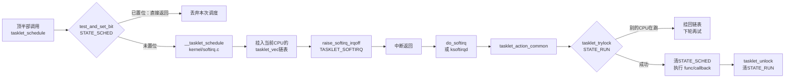

# 10.3.3 tasklet详解

> 所属章节：第10章 中断与时间 > 10.3 底半部机制
>
> 难度：[E→M] | 预计阅读时间：18分钟

## <span class="blue"> 本节导读

上一节拆解了 softirq 的底层机制——静态数组、位图、ksoftirqd。<br>
直接用 softirq 需要自己改内核静态数组、重新编译内核，驱动开发者没法这么干。<br>

tasklet 就是内核基于 softirq 封装好的可动态注册版本：注册、调度、执行全部打包成 API，驱动代码不用碰 softirq 的底层细节。<br>
限制和 softirq 一样严格：不能睡眠；另外内核保证同一个 tasklet 不会并行执行。<br>

> ⚠️ tasklet 已被内核官方标记为废弃接口，**新代码不应再使用**（`Documentation/core-api/softirq.rst`）。<br>
> 本节学它是为了读懂和维护存量驱动；写新驱动请直接用 10.3.4 的 workqueue 或 10.4 的 threaded IRQ。被淘汰的具体原因在本节"tasklet vs softirq vs workqueue"展开。

本节覆盖：

- tasklet 的内核实现与串行保证、
- 完整调用链、
- 一个完整的 tasklet 驱动示例，以及它被淘汰的原因。

---

## <span class="blue"> tasklet的本质： softirq的封装层 [E]

softirq 的十个向量在内核编译时就固定了，驱动不可能往里加自己的类型。<br>
tasklet 的做法是：占用其中两个向量，在这两个向量的执行函数里再去遍历驱动动态注册的 tasklet 链表。

| 类型 | 枚举值 | 优先级 | 说明 |
|------|--------|--------|------|
| `HI_SOFTIRQ` | 0 | 最高 | 高优先级 tasklet 专用 |
| `TASKLET_SOFTIRQ` | 6 | 普通 | 普通 tasklet 专用 |

> 💡 枚举值来自 v6.6 `include/linux/interrupt.h` 的 softirq 枚举：HI=0，其后依次是 TIMER、NET_TX、NET_RX、BLOCK、IRQ_POLL，TASKLET 排在第 6。<br>
> 很多资料写 TASKLET_SOFTIRQ=5，那是早期内核没有 IRQ_POLL_SOFTIRQ 时的编号。

两种 tasklet 共用同一套机制，只是挂在不同的 softirq 向量上，调度时分别用 `tasklet_schedule()` 和 `tasklet_hi_schedule()`。<br>
对延迟敏感的极短操作（比如 GPIO 状态翻转）可以用 `tasklet_hi_schedule()` 挂到 HI_SOFTIRQ 上，减少排队等待。

tasklet 和 softirq 最关键的区别：**同一种 tasklet 保证串行执行**。<br>

> 串行保证：以实例为单位——同一个 `tasklet_struct` 任意时刻最多在一个 CPU 上执行，哪怕多个 CPU 同时触发它，内核也保证不并行。<br>
> 注意约束只针对"同一个实例"：不同的 tasklet 实例之间不受限，可以并行。

- 同一个 `tasklet_struct` 实例，哪怕在多个 CPU 上同时被触发，内核也保证它不会并行运行。
- 而同一种 softirq（如 NET_RX_SOFTIRQ）是可以在多个 CPU 上并行的。
  
这个串行保证怎么实现的，看下面的结构体就清楚了。

---

## <span class="blue"> tasklet_struct与串行保证 [E]

tasklet 的核心结构体，v6.6 的真实定义（`include/linux/interrupt.h`）：

```c
struct tasklet_struct
{
	struct tasklet_struct *next;	/* 链表指针，链入 tasklet_vec */
	unsigned long state;		/* 状态：TASKLET_STATE_SCHED / RUN */
	atomic_t count;			/* 禁用计数；>0 时阻止执行 */
	bool use_callback;		/* true: 使用新 callback API */
	union {
		void (*func)(unsigned long data);       /* 旧 API：回调参数为 data */
		void (*callback)(struct tasklet_struct *t); /* 新 API：回调接收自身指针 */
	};
	unsigned long data;		/* 旧 API 的用户私有数据 */
};
```

- `state`：状态位，只有 `TASKLET_STATE_SCHED`（bit 0，已调度未执行）和 `TASKLET_STATE_RUN`（bit 1，正在执行）两个有效位。
- `count`：禁用计数器，`tasklet_disable()` 加一、`tasklet_enable()` 减一，大于 0 时 tasklet 不执行。
- `use_callback` 和 `union`：v6.6 里新旧两套回调原型并存（后面实战部分展开）。

串行语义就靠 `state` 的这两个位撑起来：

| 状态位 | 含义 | 作用 |
|--------|------|------|
| `TASKLET_STATE_SCHED` | 已调度未执行 | 防止重复入队 |
| `TASKLET_STATE_RUN` | 正在执行 | 防止同一 tasklet 在多 CPU 上并行 |

`tasklet_schedule()` 是 `include/linux/interrupt.h` 里的内联函数，逻辑很短：

```c
/* include/linux/interrupt.h */
static inline void tasklet_schedule(struct tasklet_struct *t)
{
	if (!test_and_set_bit(TASKLET_STATE_SCHED, &t->state))
		__tasklet_schedule(t);
}
```

`test_and_set_bit` 返回旧值：如果 STATE_SCHED 已经置位，说明这个 tasklet 正在某个 CPU 的队列里等着，直接返回——**排队期间的重复调度被静默丢弃**。

`__tasklet_schedule()` 在 `kernel/softirq.c`，把 tasklet 挂到当前 CPU 的 `tasklet_vec` 链表尾部，然后 `raise_softirq_irqoff(TASKLET_SOFTIRQ)` 点亮位图。

`TASKLET_STATE_RUN` 在执行函数 `tasklet_action_common()`（kernel/softirq.c）里起作用：取出 tasklet 后先 `tasklet_trylock()` 置 STATE_RUN，成功才执行回调；<BR>
如果另一个 CPU 正在执行同一个 tasklet，trylock 失败，就把它挂回链表尾部、重新触发 softirq，等下一轮再试。

> ⚠️ tasklet 运行在软中断上下文，**绝对不能睡眠**。<BR>
> 没有进程栈、没有调度实体，一旦调用 `msleep()`、`kmalloc(GFP_KERNEL)`、`mutex_lock()` 这类可能阻塞的函数，轻则触发 "scheduling while atomic" 警告，重则直接死锁。<br>
> 这三个函数为什么会睡眠：`msleep()` 主动让出 CPU；`kmalloc(GFP_KERNEL)` 内存不足时触发回收，回收要等磁盘 IO；`mutex_lock()` 拿不到锁时要挂入等待队列——三者都得靠调度器把当前执行流切走，而软中断上下文里根本没有"当前任务"可切（原理详见 10.2.1 铁律一）。

---

## <span class="blue"> tasklet从触发到执行的完整链路 [M]



沿着 v6.6 代码走一遍：

1. 顶半部调用 `tasklet_schedule(&my_tasklet)`（interrupt.h 内联）
2. STATE_SCHED 已置位就直接返回；未置位则进入 `__tasklet_schedule()`（softirq.c:730），挂到**当前 CPU** 的 `tasklet_vec` 链表
3. `raise_softirq_irqoff(TASKLET_SOFTIRQ)` 置位 pending 位图
4. 中断返回路径上检查到 pending softirq，进入 `do_softirq()` → `__do_softirq()`（见 10.3.2）
5. 位图中 TASKLET_SOFTIRQ 置位，调用 `tasklet_action()` → `tasklet_action_common()`（softirq.c:758）
6. 摘出整个链表后逐个处理：`tasklet_trylock()` 拿执行权，**先 `tasklet_clear_sched()` 清 STATE_SCHED，再执行回调**，最后 `tasklet_unlock()` 清 STATE_RUN

第 6 步里"先清 STATE_SCHED 再执行回调"这个顺序值得记住：**tasklet 在执行期间重新调度自己是合法的**<BR>
——因为 STATE_SCHED 已清，`tasklet_schedule()` 会正常把它重新入队，下一轮 softirq 再执行一次。<br>
老网卡驱动里就有这种自重新调度的写法。

> 🔴 真正要防的是另一种情况：tasklet 回调还在 CPU0 上执行（STATE_RUN 置位、STATE_SCHED 已清），此时 CPU1 的中断里调用 `tasklet_schedule()`，tasklet 会被正常挂到 CPU1 的链表；<br>
> CPU1 执行到它时 trylock 失败，挂回等待——不会并行，但会让执行时机变得不可预期。<br>
> 如果顶半部和 tasklet 访问共享数据，仍需要自旋锁保护，串行保证只解决"同一 tasklet 不并行"，不解决"顶半部与 tasklet 并发"。

---

## <span class="blue"> 实战：写一个完整的tasklet驱动 [E]

下面是一个 tasklet 从初始化到使用的完整示例，使用 v6.6 的新 API（`tasklet_setup`）：

```c
/* tasklet_demo.c - 完整tasklet驱动示例（v6.6 新API） */
#include <linux/module.h>
#include <linux/interrupt.h>
#include <linux/gpio.h>

static struct tasklet_struct my_tasklet;

/* 新API回调：参数是 tasklet_struct 自身，软中断上下文，不能睡眠 */
static void my_tasklet_handler(struct tasklet_struct *t)
{
	/* 可以读硬件状态、更新buffer、唤醒等待队列 */
	pr_info("tasklet running on CPU%d\n", smp_processor_id());

	/* 禁止的操作：
	 * msleep(10);              -- 会触发 scheduling while atomic
	 * kmalloc(100, GFP_KERNEL);-- GFP_KERNEL 可能睡眠
	 * mutex_lock(&lock);       -- 可能睡眠
	 * 安全操作：自旋锁、读寄存器、置标志位
	 */
}

static irqreturn_t my_irq_handler(int irq, void *dev_id)
{
	/* 顶半部：极短，只清中断源、调度底半部 */
	tasklet_schedule(&my_tasklet);
	return IRQ_HANDLED;
}

static int __init tasklet_demo_init(void)
{
	int irq = gpio_to_irq(GPIO_BUTTON);

	/* 新API：回调接收 tasklet_struct* */
	tasklet_setup(&my_tasklet, my_tasklet_handler);

	/* 静态场景可用宏：DECLARE_TASKLET(my_tasklet, my_tasklet_handler); */

	request_irq(irq, my_irq_handler,
		    IRQF_TRIGGER_FALLING, "tasklet_demo", NULL);

	pr_info("tasklet demo loaded\n");
	return 0;
}

static void __exit tasklet_demo_exit(void)
{
	int irq = gpio_to_irq(GPIO_BUTTON);

	/* 必须先释放中断再 kill tasklet，
	 * 否则还在跑的 tasklet 可能访问已释放的资源 */
	free_irq(irq, NULL);
	tasklet_kill(&my_tasklet);
}

module_init(tasklet_demo_init);
module_exit(tasklet_demo_exit);
```

几个关键点：

- **新旧两套 API**：v6.6 里 `tasklet_setup()`/`DECLARE_TASKLET()` 是新 API，回调原型为 `void (*)(struct tasklet_struct *t)`，需要上下文数据时用 `from_tasklet()`（container_of 变体）取回外层结构体。旧的 `tasklet_init()`/`DECLARE_TASKLET_OLD()` 回调原型为 `void (*)(unsigned long data)`，仍然存在但只用于兼容老代码。
- `tasklet_kill()`：模块卸载时**必须调用**，它会阻塞等待 tasklet 执行完成。少了这一步，rmmod 后 tasklet 还在跑，回调地址指向已卸载的模块代码段——直接 panic。
- 旧 API 的 `data` 参数是 `unsigned long`，传指针要强转；新 API 通过 `from_tasklet()` 取外层结构体，类型安全得多。

---

## <span class="blue"> tasklet vs softirq vs workqueue

| 特性 | softirq | tasklet | workqueue |
|------|---------|---------|-----------|
| 执行上下文 | 软中断上下文 | 软中断上下文 | **进程上下文** |
| 同类型并行性 | 同一种可在多 CPU **并行** | **同一个实例串行** | 可并行（受 max_active 限制） |
| 编程复杂度 | 改内核静态数组，重新编译 | 封装好的 API，动态注册 | 最直观 |
| 能否睡眠 | 不能 | 不能 | 可以 |
| 延迟 | 最低 | 低（略高于 softirq） | 较高（需调度 kworker） |
| 内核定位 | 内核子系统专用 | **文档明确：新代码勿用** | 驱动开发推荐 |

内核文档 `Documentation/core-api/softirq.rst` 写得很直接：tasklet 已被废弃，新代码应使用 threaded IRQ 或 workqueue。被淘汰的原因主要有两个：

1. **不能睡眠**的限制在复杂驱动里越来越难受。底半部里想访问用户空间、做 I/O、等 DMA 完成——tasklet 全干不了。
2. **串行语义成为扩展性瓶颈**。多队列网卡收了 8 个队列的包想并行处理，同一个 tasklet 实例帮不上忙。

那 tasklet 还需要学吗？<br>
需要——存量驱动里它大量存在，读懂老驱动、做维护性修改都绕不开它。但写新驱动，直接走 10.3.4 的 workqueue 或 10.4 的 threaded IRQ。

---

## <span class="blue"> 本节总结

tasklet 是 softirq 的封装层，也是内核明确判了死刑的接口——它的价值在存量代码里，不在你的新驱动里。<br>
读懂 `STATE_SCHED`/`STATE_RUN` 两个位就看懂了它全部的身手；而"不能睡眠"这条红线，正是它被 workqueue 取代的根本原因。

## <span class="blue"> 速查表

| 项目 | 内容 |
|------|------|
| tasklet 的本质 | 占用 HI_SOFTIRQ(0) 和 TASKLET_SOFTIRQ(6) 两个向量，提供可动态注册的 softirq 封装 |
| 串行保证机制 | `TASKLET_STATE_SCHED` 防重复入队 + `TASKLET_STATE_RUN` 防多 CPU 并行 |
| 核心 API | `tasklet_setup()`/`tasklet_schedule()`/`tasklet_kill()`（新 API） |
| 关键特性 | 不能睡眠；执行期间重新调度自己合法；排队期间重复调度被丢弃 |
| 适用场景 | 维护存量驱动；新驱动改用 workqueue 或 threaded IRQ |
| 易犯错误 | tasklet 里睡眠、卸载时忘 `tasklet_kill()` |

---

## <span class="blue"> 下一步

tasklet 不能睡眠的约束怎么破？

下一节 **10.3.4 workqueue详解** 把底半部搬到进程上下文——能睡眠、能阻塞、能用 `kmalloc(GFP_KERNEL)`，这是现代驱动底半部的主流方案。

---

## <span class="blue"> 配套资源

| 资源 | 路径/说明 |
|------|-----------|
| tasklet_struct 定义 | `include/linux/interrupt.h` — v6.6 含 use_callback 与回调 union |
| tasklet 核心实现 | `kernel/softirq.c` — `tasklet_action_common()`、`__tasklet_schedule()` |
| tasklet_schedule | `include/linux/interrupt.h` — 内联函数，STATE_SCHED 防重入 |
| 官方文档 | `Documentation/core-api/softirq.rst` — 新代码勿用 tasklet 的说明 |
| 代码清单 | 本节 `tasklet_demo.c` 完整驱动示例（新 API） |
| 验证方法 | `cat /proc/softirqs` 观察 HI/TASKLET 两列计数变化 |
