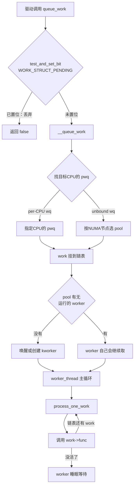

# 10.3.4 workqueue详解

> 所属章节：第10章 中断与时间 > 10.3 底半部机制
>
> 难度：[E→M] | 预计阅读时间：35分钟

## <span class="blue">本节导读

softirq 和 tasklet 够快，但有一个硬约束——**不能睡眠**。<br>
底半部里想调 `kmalloc(GFP_KERNEL)` 申请内存？不行。想拿 mutex？不行。想等一个 DMA 完成？更不行。<br>

workqueue 就是解除这个约束的方案：它把底半部搬到**进程上下文**的内核线程里执行，代价是上下文切换带来的额外延迟，换来的是可以调用任何内核 API 的自由。<br>

本节覆盖：

- workqueue 的核心数据结构、
- `queue_work()` 到函数真正执行的完整调用链、
- worker 线程池的运作方式、
- 三种内置 workqueue 的选择，
- 以及 ordered workqueue 的顺序保证。

---

## <span class="blue">workqueue：能睡眠的底半部 [E→M]

### 为什么要有workqueue？

tasklet 跑在软中断上下文，以下这些常见操作全部是红线：

- `kmalloc(size, GFP_KERNEL)` — 内存不足时会睡眠等待回收
- `mutex_lock(&lock)` — 拿不到锁时会睡眠
- `wait_event_timeout()` — 主动等待某个条件
- 访问用户空间内存（`copy_from_user`）— 可能触发缺页

如果底半部确实需要做这些事，唯一的出路是换执行上下文。workqueue 的做法很直接：**把活交给内核线程去干**。<br>
内核线程跑在进程上下文，和普通进程一样可以被调度、可以睡眠、可以阻塞。

### 核心数据结构

workqueue 的两个基本结构体（`include/linux/workqueue.h`）：

```c
struct work_struct {
	atomic_long_t data;     /* 标志位 + 关联的 pool 信息 */
	struct list_head entry; /* 挂到 pwq 的待处理链表 */
	work_func_t func;       /* 实际执行的函数指针 */
};

struct workqueue_struct {
	struct list_head pwqs;      /* pool_workqueue 链表 */
	struct list_head list;      /* 全局 workqueue 链表 */
	char name[WQ_NAME_LEN];     /* 名字，如 "events" */
	unsigned int flags;         /* WQ_UNBOUND、WQ_HIGHPRI 等 */
	/* ... 其余字段省略 */
};
```

`work_struct` 是要执行的任务本体，`workqueue_struct` 是任务的调度中心。<br>
典型的用法是把 `work_struct` 嵌在自己的设备结构体里，回调里用 `container_of()` 取回外层结构体。

驱动侧使用 workqueue 的基本动作只有两个：

1. **定义任务**：`INIT_WORK(&work, handler)` 把 `work_struct` 和处理函数绑定在一起（静态场景用 `DECLARE_WORK()` 宏）；
2. **提交任务**：`queue_work(wq, &work)` 把任务挂上队列（用内置 `system_wq` 时可简写为 `schedule_work(&work)`）。

顶半部里通常只做第 2 步，做完就返回。那么 `queue_work()` 之后，内核内部发生了什么？

### 从queue_work()到真正执行：完整调用链

调用 `queue_work()` 之后，内核走的是这条路（`kernel/workqueue.c`，v6.6）：

```c
bool queue_work_on(int cpu, struct workqueue_struct *wq,
		   struct work_struct *work)
{
	bool ret = false;
	unsigned long flags;

	local_irq_save(flags);		/* 关中断，防止并发操作 work->data */

	if (!test_and_set_bit(WORK_STRUCT_PENDING_BIT, work_data_bits(work))) {
		__queue_work(cpu, wq, work);	/* 首次提交，加入目标 CPU 的队列 */
		ret = true;
	}

	local_irq_restore(flags);	/* 恢复中断 */
	return ret;
}
```

注意第一行判断：`test_and_set_bit(WORK_STRUCT_PENDING_BIT, ...)`——**同一个 work 还没执行完时重复 queue，会被静默丢弃**（返回 false）。<br>
这和 tasklet 的 STATE_SCHED 防重入是同一类设计。

`__queue_work()` 找到目标 CPU 对应的 `pool_workqueue`（简称 pwq），把 `work_struct` 挂到 pwq 的待处理链表上；<br>
如果 pool 里没有正在运行的 worker，就唤醒或创建一个。

worker 线程的主体是 `worker_thread()`（workqueue.c:2729），主循环里不断调用 `process_one_work()` 处理队列中的 work。<br>
执行侧的核心代码（workqueue.c:2536，节选并精简）：

```c
static void process_one_work(struct worker *worker, struct work_struct *work)
{
	struct pool_workqueue *pwq = get_work_pwq(work); /* 这个 work 属于哪个 pwq */
	struct worker_pool *pool = worker->pool;

	/* claim：把自己标记为"正在处理这个 work"，调试转储能看到 */
	hash_add(pool->busy_hash, &worker->hentry, (unsigned long)work);
	worker->current_work = work;
	worker->current_func = work->func;               /* 当前在跑哪个函数，供调试 */
	strscpy(worker->desc, pwq->wq->name, WORKER_DESC_LEN); /* kworker 名后缀来源 */

	list_del_init(&work->entry);                     /* 从待处理链表摘下 */

	/* 清 PENDING 位——此后这个 work 才允许被再次 queue */
	set_work_pool_and_clear_pending(work, pool->id);

	raw_spin_unlock_irq(&pool->lock);                /* 放开 pool 锁，恢复中断 */
	...
	worker->current_func(work);                      /* 真正调用驱动注册的回调 */
	...
}
```

两个细节值得记住：

- **先清 PENDING 位再执行回调**——和 tasklet 先清 STATE_SCHED 同理，回调执行期间重新 `queue_work()` 自己是合法的；
- `worker->current_func` 和 `worker->desc` 这两行纯粹为调试服务——`ps` 里 kworker 名字后面的 `-events` 后缀、`/proc/<pid>/stack` 里的调用栈，信息来源都在这里，后面"调试workqueue"小节会用到。

执行到这里时，已经运行在进程上下文——可以睡眠、可以阻塞。

整个流程：



### 内核线程池：worker_pool的运作

workqueue 子系统采用 cmwq（Concurrency Managed Workqueue）设计：**workqueue_struct 本身不拥有线程**，<br>
真正拥有线程的是每个 CPU（或 NUMA 节点）上的 `worker_pool`，`pool_workqueue` 是两者之间的桥梁：

```
workqueue_struct (如 system_wq)
    ├── pwq[CPU0] ──→ worker_pool[CPU0]
    │                     ├── kworker/0:1-events
    │                     ├── kworker/0:2
    │                     └── ...
    ├── pwq[CPU1] ──→ worker_pool[CPU1]
    │                     └── ...
    └── ...
```

多个 workqueue 可以共用同一个 worker_pool。<br>
pool 根据负载**动态创建和回收** worker 线程：有活没人干就创建，空闲超时（5 分钟）就回收。

所以 `ps` 里看到的 kworker 数量是随负载变化的。<br>
终端里观察一下：

```
root         7  0.0  0.0      0     0 ?        S    09:00   0:00 [kworker/0:1-events]
root        18  0.0  0.0      0     0 ?        S    09:00   0:00 [kworker/0:2-mm_percpu_wq]
root        25  0.0  0.0      0     0 ?        S    08:00   0:00 [kworker/0:0H-events_highpri]
root        30  0.0  0.0      0     0 ?        S    09:00   0:00 [kworker/u16:1-events_unbound]
```

命名规则（workqueue.c 的 `create_worker()`）：`kworker/<cpu>:<id>` 是绑定 CPU 的 worker，`kworker/u<pool_id>:<id>` 是 unbound 的；名字里的 `H` 后缀表示高优先级 pool。<br>
线程名后面的 `-events` 等后缀来自它当前服务的 workqueue 名，是较新内核为方便排查加上的。

### 三种内置workqueue

内核在 `workqueue_init_early()`/`workqueue_init()` 里预建了一组系统级 workqueue（workqueue.c:6596 起），驱动直接用即可：

| 类型 | 绑定方式 | 调度特性 | max_active | 适用场景 |
|------|----------|----------|------------|----------|
| `system_wq`（events） | per-CPU 绑定 | 普通 nice | 256 | 通用异步任务，默认选择 |
| `system_highpri_wq` | per-CPU 绑定 | nice = -20 | 256 | 对延迟敏感的后台任务 |
| `system_unbound_wq` | 不绑定 CPU | 普通 nice | 512 | 跨 CPU 负载均衡的场景 |

- `system_wq` 最常用，work 在提交它的 CPU 上执行，有缓存局部性。
- `system_highpri_wq` 的 worker nice 值为 `MIN_NICE`（-20），调度上更优先——注意它走的是 CFS nice 优先级，**不是实时优先级**。
- `system_unbound_wq` 不挑 CPU，内核按 NUMA 节点选择 pool，适合 IO 等待型任务。

用法上有个容易踩的区别：**只有 `system_wq` 有专用封装函数**：

```c
schedule_work(&my_work);                     /* 等价 queue_work(system_wq, &my_work) */
schedule_delayed_work(&my_dwork, HZ);        /* 延迟 1 秒提交，仅 system_wq 有封装 */

queue_work(system_highpri_wq, &my_work);     /* 高优先级：没有封装，显式传 wq */
queue_work(system_unbound_wq, &my_work);     /* unbound 同理 */
```

v6.6 实际预建了 6 个系统 workqueue（workqueue.c:6596-6606），除表中三个外还有：

- `system_long_wq`（可能长时间运行的任务，避免拖累 events）、
- `system_freezable_wq`（系统休眠时可冻结）、
- `system_power_efficient_wq`（省电倾向，不绑 CPU 减少唤醒）。

驱动很少直接用后三个，看到名字知道是什么即可。

或者不走内置队列，创建专用 workqueue：
```c
struct workqueue_struct *my_wq;
my_wq = alloc_workqueue("my_wq", WQ_UNBOUND, 2);
/* 第 2 个参数 flags，第 3 个 max_active */
```

### workqueue vs softirq vs tasklet

| 特性 | softirq | tasklet | workqueue |
|------|---------|---------|-----------|
| 运行上下文 | 软中断 | 软中断 | **进程上下文** |
| 能否睡眠 | 不能 | 不能 | **可以** |
| 同一实例并行 | 同类型可多 CPU 并行 | 串行 | 受 max_active 限制 |
| 执行延迟 | 最低 | 低 | 较高（需唤醒 kworker） |
| 可用 mutex / 访问用户空间 | 否 | 否 | 是 |
| 代码复杂度 | 高（改内核） | 中 | 低 |

选择逻辑很直接：追求极致延迟且无需睡眠的场景（主要是内核网络、块层这类子系统）用 softirq；驱动开发的底半部，默认选 workqueue。<br>
tasklet 只在维护老代码时遇到。

### 完整代码示例

```c
/* workqueue_demo.c - workqueue 底半部完整示例（v6.6） */
#include <linux/module.h>
#include <linux/workqueue.h>
#include <linux/slab.h>

struct my_work_data {
	struct work_struct work;    /* 任务本体，内嵌而非指针——省一次 kmalloc */
	int irq_count;              /* 顶半部累计的中断次数，传给底半部 */
	void *buffer;               /* 底半部里动态申请的暂存区 */
};

static struct workqueue_struct *my_wq;
static struct my_work_data *work_data;

/* work 回调：进程上下文，允许睡眠 */
static void my_work_handler(struct work_struct *work)
{
	struct my_work_data *data =
		container_of(work, struct my_work_data, work);  /* 由成员反查外层结构体 */

	/* 软中断上下文里这里是红线，在 workqueue 里是合法操作 */
	data->buffer = kmalloc(1024, GFP_KERNEL);   /* GFP_KERNEL：内存不足时可睡眠等回收 */
	if (!data->buffer)
		return;

	msleep(10);                     /* 可以睡眠，但会占住这个 worker（见下方⚠️） */

	pr_info("Work executed, irq_count=%d\n", data->irq_count);

	kfree(data->buffer);
}

/* 顶半部：只计数 + 提交任务，立即返回 */
static irqreturn_t my_irq_handler(int irq, void *dev_id)
{
	work_data->irq_count++;
	queue_work(my_wq, &work_data->work);    /* work 未执行完时重复提交会被丢弃 */
	return IRQ_HANDLED;
}

static int __init my_init(void)
{
	/* 专用队列：unbound 不绑 CPU，每个 pool 最多并发 2 个本队列的 work */
	my_wq = alloc_workqueue("my_wq", WQ_UNBOUND, 2);
	if (!my_wq)
		return -ENOMEM;

	work_data = kzalloc(sizeof(*work_data), GFP_KERNEL);
	if (!work_data) {
		destroy_workqueue(my_wq);       /* 失败回滚：先建的后销 */
		return -ENOMEM;
	}

	INIT_WORK(&work_data->work, my_work_handler);   /* 绑定任务与回调 */

	/* request_irq(IRQ_NUM, my_irq_handler, 0, "my_dev", NULL); */
	return 0;
}

static void __exit my_exit(void)
{
	/* destroy_workqueue() 内部先 drain：等所有 pending/running 的 work
	 * 执行完才返回，所以 work_data 必须在它之后再释放 */
	destroy_workqueue(my_wq);
	kfree(work_data);
}

module_init(my_init);
module_exit(my_exit);
```

> ⚠️ 在 work 回调里长时间 `msleep()` 会占住这个 worker 线程。<br>
> 对 per-CPU 的 `system_wq` 来说，一个长时间睡眠的 work 会拖累同 pool 上排队的其他 work——内核检测到 pool 卡住会创建新 worker 补救，但这有代价。<br>
> 需要长时间等待的任务，应该用专门的线程或独立 workqueue。

<!-- -->

> 🔴 资源释放顺序：`destroy_workqueue()` 返回后，所有 work 保证已执行完毕。<br>
> 因此 work 回调里用到的资源（如 `work_data`）必须在 `destroy_workqueue()` **之后**释放；反过来，如果 work 已经 queue 出去但模块直接 `kfree(work_data)`，回调执行时访问的就是已释放内存。

---

## <span class="blue">并发控制与ordered workqueue [E]

### max_active：控制并发度

`alloc_workqueue()` 第三个参数 `max_active` 限制的是**这个 workqueue 在每个 pool 上最多同时执行几个 work**：

```c
/* 每个 pool 最多同时跑 2 个本 wq 的 work */
struct workqueue_struct *wq = alloc_workqueue("foo", WQ_UNBOUND, 2);

/* 传 0 = 用默认值 */
struct workqueue_struct *wq2 = alloc_workqueue("bar", WQ_UNBOUND, 0);
```

v6.6 的真实数值（workqueue.c:397-399）：传 0 时使用默认值 `WQ_DFL_ACTIVE` = **256**；传入值被 `clamp_val()` 限制在 1 到 `WQ_MAX_ACTIVE` = **512** 之间。<br>
所以"传 0 不限制"的说法不对——它实际是 256。

IO 等待型的 work（大部分时间在等硬件）适合较大的 max_active；CPU 密集型的 work 开大并发只会让 CPU 互相争抢。

### ordered workqueue：按提交顺序执行

需要保证 work **严格按提交顺序串行执行**时，用 ordered workqueue——本质是 `WQ_UNBOUND + max_active = 1`：

```c
/* 推荐方式：一个宏搞定 */
struct workqueue_struct *ordered_wq;
ordered_wq = alloc_ordered_workqueue("my_ordered", 0);

/* 等价的手动写法 */
ordered_wq = alloc_workqueue("my_ordered", WQ_UNBOUND, 1);
```

`alloc_ordered_workqueue()` 内部就是 `WQ_UNBOUND | __WQ_ORDERED` 加 `max_active=1`：全局只有一个执行位置，所有 work 按 FIFO 顺序串行执行。<br>
典型用户是需要严格顺序的文件系统元数据操作等场景。

> 💡 排查 workqueue 相关问题时，先 `ps aux | grep kworker` 找到对应 worker 线程，再 `cat /proc/<pid>/stack` 看它当前卡在哪个调用栈上<br>
> worker 卡在 D 状态（不可中断睡眠）是 workqueue 类问题的典型症状。

### 调试workqueue

**1. 查看 worker 线程状态与调用栈**

```bash
ps aux | grep kworker
cat /proc/21/stack
```

`cat /proc/21/stack` 的输出形如：

```
[<0>] worker_thread+0x5a/0x3d0
[<0>] kthread+0x11d/0x140
[<0>] ret_from_fork+0x1f/0x30
```

**2. workqueue 的 sysfs 接口**

创建时带 `WQ_SYSFS` 标志的 workqueue 会出现在 `/sys/bus/workqueue/devices/<wq名>/` 下（workqueue.c:5916），常用属性：

| 属性 | 读写 | 含义 |
|------|------|------|
| `per_cpu` | RO | 是否 per-CPU 绑定 |
| `max_active` | RW | 并发上限，可在线调整 |
| `nice` | RW | worker 的 nice 值（仅 unbound wq） |

系统自带的 `writeback` 等 workqueue 就暴露在这里，可以直接读它的 `max_active` 验证上面的数值。

**3. 在驱动里检测与取消 work**

```c
if (work_pending(&my_work)) {
	/* work 还在队列里等待执行 */
}

/* 取消已提交的 work；若正在执行则等待其完成 */
bool canceled = cancel_work_sync(&my_work);
/* 返回 true：成功取消（未执行）；false：已经执行过了 */
```

> ⚠️ `cancel_work_sync()` 会等待正在执行的 work 完成，**不能在中断上下文调用**；如果 work 回调里又去拿调用者持有的锁，还会死锁。<br>
> 模块卸载路径上用它配合资源释放顺序设计。

---

## <span class="blue">本节总结

底半部选型的默认答案就是 workqueue——"能睡眠"这一个理由就够了，softirq 和 tasklet 的原子上下文红线在它这里都不存在。<br>
真正要记住的是两件事：同一个 work 没执行完时重复 `queue_work()` 会被静默丢弃；`destroy_workqueue()` 返回之前，绝不能释放回调用到的资源。

## <span class="blue">速查表

| 要点 | 核心内容 |
|------|----------|
| workqueue 的本质 | 把底半部放到进程上下文的 kworker 线程中执行 |
| 最大优势 | **可以睡眠**——支持 `kmalloc(GFP_KERNEL)`、`mutex_lock()` 等 |
| 调用链 | `queue_work()` → `queue_work_on()` → `__queue_work()` → pwq 链表 → 唤醒 kworker → `worker_thread()` → `process_one_work()` → `work->func()` |
| 线程池模型 | cmwq：worker_pool 拥有线程并动态伸缩，pool_workqueue 做桥梁，多个 wq 可共用 pool |
| 三种内置 wq | `system_wq`（per-CPU 默认）、`system_highpri_wq`（nice -20）、`system_unbound_wq`（不绑定） |
| max_active | 每个 pool 上本 wq 的最大并发 work 数；默认 256，上限 512 |
| ordered wq | `alloc_ordered_workqueue()` = `WQ_UNBOUND + max_active=1`，严格 FIFO 串行 |
| 调试方法 | `ps` 看 kworker、`/proc/<pid>/stack` 看调用栈、`/sys/bus/workqueue/devices/` 调参数 |

---

## <span class="blue">下一步

workqueue 解决了"底半部不能睡眠"的问题，但如果面对的是**网络收包**这种场景<br>
中断频率高达每秒几万甚至几十万次——tasklet 和 workqueue 的调度开销都会成为瓶颈。

这时需要另一种思路：高流量时关掉中断改为轮询，流量降下来再恢复中断。<br>
这就是下一节 **10.3.5 NAPI中断与轮询的混合模式** 要讲的机制。

---

## <span class="blue">配套资源

| 资源类型 | 路径/名称 | 说明 |
|----------|-----------|------|
| 内核源码 | `kernel/workqueue.c` | workqueue 核心实现：`queue_work_on()`(:1825)、`worker_thread()`(:2729)、`process_one_work()`(:2536) |
| 内核源码 | `include/linux/workqueue.h` | `work_struct`、`workqueue_struct` 定义与标志位 |
| 图示 | Mermaid 流程图 | `queue_work()` 到 `work->func()` 的完整调用链 |
| 代码清单 | 完整驱动示例 | 含 `alloc_workqueue`、`INIT_WORK`、`destroy_workqueue` |
| 对比表格 | 三种内置 workqueue | `system_wq`/`system_highpri_wq`/`system_unbound_wq` |
| 调试命令 | `ps aux \| grep kworker` | 查看 worker 线程 |
| 调试命令 | `cat /proc/<pid>/stack` | 查看 worker 当前调用栈 |
| 调试接口 | `/sys/bus/workqueue/devices/` | WQ_SYSFS 标志的 wq 的在线参数 |
