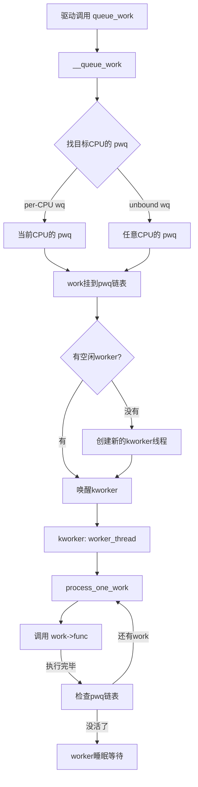

# 10.3.4 workqueue详解

> 所属章节：第10章 中断与时间 > 10.3 底半部机制
>
> 难度：[E][M] | 预计阅读时间：35分钟

## <span class="blue">本节导读

softirq和tasklet搞定了吗？它们够快，但有个硬伤——**不能睡眠**。你在中断下半部里想调用`kmalloc(GFP_KERNEL)`申请内存？不行。想拿一个mutex？更不行。这简直就是戴着镣铐跳舞。<br>

workqueue就是那个解开镣铐的方案。它把中断处理放到**进程上下文**里跑，代价是一点点延迟，换来的是可以做任何事的自由。本节带你深入workqueue的内核实现，看清`queue_work()`之后到底发生了什么，搞懂内核是怎么用线程池来调度这些工作的。<br>

学完后，你将理解workqueue的完整调用链，能根据不同的场景选择合适的workqueue类型，还会知道ordered workqueue是怎么保证执行顺序的。

---

## <span class="blue">workqueue：能睡眠的底半部 [E][M]

### 为什么要有workqueue？

tasklet跑在软件中断上下文，这带来一个根本性限制——**不能调用任何可能睡眠的函数**。你想一下这些常见操作：

- `kmalloc(size, GFP_KERNEL)` — 内存不够时会睡眠等待
- `mutex_lock(&lock)` — 拿不到锁时会睡眠
- `wait_event_timeout()` — 主动等待某个条件
- 访问用户空间内存 — 可能触发页错误（page fault）

这些在tasklet里统统是红线。那如果下半部确实需要做这些事怎么办？<br>

workqueue的回答很干脆：**把活交给内核线程去干**。内核线程跑在进程上下文，和普通进程一样可以被调度、可以睡眠、可以阻塞。唯一的"代价"是上下文切换的开销和稍微增加的延迟。

### 核心数据结构

workqueue的灵魂是两个结构体：

```c
// include/linux/workqueue.h
struct work_struct {
    atomic_long_t data;        // 低8位放标志位，高位放pool_workqueue指针
    struct list_head entry;    // 挂到work链表上
    work_func_t func;          // 实际执行的函数指针
};

struct workqueue_struct {
    struct list_head pwqs;     // pool_workqueue链表（每个CPU一个）
    struct list_head list;     // 全局workqueue链表

    char name[WQ_NAME_LEN];    // 名字，如"events"
    unsigned int flags;        // WQ_UNBOUND, WQ_HIGHPRI等
    int nr_pwqs_to_flush;      // flush时用的计数
    // ...
};
```

`work_struct`是你的"工作任务"，封装了一个函数指针`func`。`workqueue_struct`则是任务的"调度中心"，管理着一组`pool_workqueue`。

> 💡 **提示**：`work_struct`只有24字节（64位系统），非常轻量。你可以把它嵌在自己的结构体里，通过`container_of()`找回父结构体。

### 从queue_work()到真正执行：完整调用链

当你调用`queue_work()`后，内核到底干了什么？这是一条很长的路：

```c
// kernel/workqueue.c
bool queue_work(struct workqueue_struct *wq, struct work_struct *work)
{
    return queue_work_on(WORK_CPU_UNBOUND, wq, work);
}

bool queue_work_on(int cpu, struct workqueue_struct *wq,
                   struct work_struct *work)
{
    bool ret = false;
    unsigned long flags;

    local_irq_save(flags);              // 关中断，防止竞态

    if (!(work->data & WORK_STRUCT_PENDING)) {
        // 把work挂到对应CPU的pool_workqueue上
        __queue_work(cpu, wq, work);
        ret = true;
    }

    local_irq_restore(flags);
    return ret;
}
```

`__queue_work()`是关键。它找到目标CPU对应的`pool_workqueue`（简称pwq），然后把你的`work_struct`挂到pwq的待处理链表上。如果当前没有空闲的worker线程在跑，它会唤醒一个。

被唤醒的worker线程是`kworker/*`内核线程，它的主循环在`worker_thread()`里：

```c
static int worker_thread(void *__worker)
{
    struct worker *worker = __worker;

    for (;;) {
        // 从pwq上取一个work来执行
        if (!process_one_work(worker, work))
            break;  // 没活了，回去睡觉
    }
    return 0;
}
```

`process_one_work()`才是真正的执行者。它会调用你注册的`work->func(work)`。在这个函数里，你已经运行在进程上下文了——可以睡眠、可以阻塞、可以做任何你想做的事。

这里用一张图来理清整个流程：



### 内核线程池：pool_workqueue的运作

每个CPU维护着自己的`worker_pool`，里面有一组`kworker/*`线程。`pool_workqueue`是`workqueue_struct`和`worker_pool`之间的桥梁：

```
workqueue_struct (如 system_wq)
    ├── pwq[CPU0] ──→ worker_pool[CPU0]
    │                     ├── kworker/0:0
    │                     ├── kworker/0:1
    │                     └── ...
    ├── pwq[CPU1] ──→ worker_pool[CPU1]
    │                     ├── kworker/1:0
    │                     └── ...
    └── ...
```

每个`worker_pool`默认最多同时跑两个worker线程（由`max_active`控制）。如果两个都在忙，新的work就排队等着。如果排队太久，worker pool还会动态创建新线程，但不超过`max_active`的上限。

在终端里执行`ps aux | grep kworker`，你会看到一堆这样的线程：

```
root         7  0.0  0.0      0     0 ?        S    09:00   0:00 [kworker/0:0-events]
root        18 0.0  0.0      0     0 ?        S    09:00   0:00 [kworker/0:1-events]
root        25 0.0  0.0      0     0 ?        S    09:00   0:00 [kworker/1:0-mm_percpu_wq]
root        30 0.0  0.0      0     0 ?        S    09:00   0:00 [kworker/u2:0]
```

名字里的`kworker/0:0`表示CPU0上的第0个worker。`kworker/u2:0`里的`u`表示unbound（不绑定特定CPU）。

### 三种内置workqueue类型

内核预定义了三种常用的workqueue，你直接用就行：

| 类型 | 绑定方式 | 优先级 | 并发数 | 适用场景 |
|------|----------|--------|--------|----------|
| `system_wq` (events) | per-CPU绑定 | 普通 | 每个CPU 2个 | 通用异步任务，默认选择 |
| `system_highpri_wq` | per-CPU绑定 | 高优先级 | 每个CPU 2个 | 对延迟敏感的后台任务 |
| `system_unbound_wq` | 不绑定CPU | 普通 | 全局max_active个 | 需要跨CPU负载均衡的场景 |

- `system_wq`是最常用的，你的work会在提交它的那个CPU上执行，利用CPU缓存局部性。
- `system_highpri_wq`的worker线程优先级更高（`MAX_RT_PRIO/2`），调度更及时。
- `system_unbound_wq`不挑CPU，work会被分配到最闲的CPU上执行，适合IO密集型任务。

```c
// 使用内置的system_wq，最简单
extern struct workqueue_struct *system_wq;
schedule_work(&my_work);    // 等价于 queue_work(system_wq, &my_work)

// 或者自己创建一个专用的workqueue
struct workqueue_struct *my_wq;
my_wq = alloc_workqueue("my_wq", WQ_UNBOUND, 2);
// 第2个参数是flags，第3个是max_active
```

### workqueue vs softirq vs tasklet

三者怎么选？看这个对比：

| 特性 | softirq | tasklet | workqueue |
|------|---------|---------|-----------|
| 运行上下文 | 软中断 | 软中断 | **进程上下文** |
| 能否睡眠 | ❌ 不能 | ❌ 不能 | ✅ **可以** |
| 同一work能否并行 | N/A | ❌ 不能 | 取决于max_active |
| 执行延迟 | 最低 | 低 | 中等（需调度） |
| 可以用mutex | ❌ | ❌ | ✅ |
| 可以访问用户空间 | ❌ | ❌ | ✅ |
| 代码复杂度 | 高 | 中 | 低 |

说白了，**追求极致速度选tasklet，需要灵活性选workqueue**。softirq一般只在内核子系统层面直接用，驱动开发很少碰。

### 完整代码示例

下面是一个完整的workqueue使用示例，包含初始化、调度和清理：

```c
#include <linux/module.h>
#include <linux/workqueue.h>
#include <linux/slab.h>

struct my_work_data {
    struct work_struct work;
    int irq_count;
    void *buffer;           // 可以动态申请内存
};

static struct workqueue_struct *my_wq;
static struct my_work_data *work_data;

// Work函数 — 运行在进程上下文，可以睡眠！
static void my_work_handler(struct work_struct *work)
{
    struct my_work_data *data = container_of(work, struct my_work_data, work);

    // ✅ 可以睡眠！用GFP_KERNEL没问题
    data->buffer = kmalloc(1024, GFP_KERNEL);
    if (!data->buffer)
        return;

    // ✅ 可以拿mutex
    // mutex_lock(&my_mutex);

    // ✅ 可以msleep（但要注意下面的陷阱）
    msleep(10);

    printk("Work executed, irq_count=%d\n", data->irq_count);

    kfree(data->buffer);
    // mutex_unlock(&my_mutex);
}

// 顶半部 — 中断处理函数
static irqreturn_t my_irq_handler(int irq, void *dev_id)
{
    // 只记录状态，马上提交work
    work_data->irq_count++;
    queue_work(my_wq, &work_data->work);

    return IRQ_HANDLED;
}

static int __init my_init(void)
{
    // 创建专用workqueue
    my_wq = alloc_workqueue("my_wq", WQ_UNBOUND, 2);
    if (!my_wq)
        return -ENOMEM;

    work_data = kzalloc(sizeof(*work_data), GFP_KERNEL);
    if (!work_data)
        return -ENOMEM;

    // 初始化work
    INIT_WORK(&work_data->work, my_work_handler);

    // 注册中断...
    // request_irq(IRQ_NUM, my_irq_handler, IRQF_SHARED, "my_dev", NULL);

    return 0;
}

static void __exit my_exit(void)
{
    // 关键：先销毁workqueue，确保所有work都完成
    destroy_workqueue(my_wq);
    kfree(work_data);
}

module_init(my_init);
module_exit(my_exit);
```

> ⚠️ **陷阱**：在work函数里调用`msleep()`会阻塞**整个worker线程**，不是只阻塞你的work！如果同一个pwq上还有其他work等着，它们也得排队。如果你确实需要长时间等待，考虑用`msleep_interruptible()`或在单独的线程里处理。

> 🔴 **危险**：`destroy_workqueue()`内部会flush所有pending的work，然后销毁pwq和worker线程。如果你在work函数里尝试访问已经释放的资源，就会oops。确保work里用到的资源在`destroy_workqueue()`之后才被释放。

---

## <span class="blue">并发控制与ordered workqueue [E]

### max_active：控制并发度

创建workqueue时，第三个参数`max_active`决定了同一个pwq上最多能同时跑几个worker：

```c
// 最多同时跑2个worker
struct workqueue_struct *wq = alloc_workqueue("foo", WQ_UNBOUND, 2);

// 不限制（实际上是256，内核硬编码上限）
struct workqueue_struct *wq = alloc_workqueue("bar", WQ_UNBOUND, 0);
```

为什么需要控制？因为workqueue默认的并发度是**每个CPU两个worker**。对于大多数驱动来说够用了。如果你的work都是IO等待型（等硬件响应），提高`max_active`可以让更多work并行。如果work是CPU密集型，太高了反而导致CPU争抢。

### ordered workqueue：按顺序执行

有时候你需要保证work**按提交的顺序执行**，不能并行。怎么实现？<br>

创建unbound workqueue + `max_active = 1`。这样全局只有一个worker在跑，自然就是串行的：

```c
// 方式1：手动配置
struct workqueue_struct *ordered_wq;
ordered_wq = alloc_workqueue("my_ordered", WQ_UNBOUND, 1);

// 方式2：用内核 helper（推荐）
ordered_wq = alloc_ordered_workqueue("my_ordered", 0);
// 内部就是 WQ_UNBOUND + max_active=1
```

> 💡 **提示**：`alloc_ordered_workqueue()`是创建ordered workqueue的推荐方式。它自动帮你配好`WQ_UNBOUND | max_active=1`，省得写错。`max_active=1`意味着全局只有一个worker线程，所有work按FIFO顺序串行执行。

这种workqueue的典型用途：需要严格顺序的块设备IO提交、文件系统元数据操作等。像JFFS2、UBIFS这类文件系统都依赖ordered workqueue来保证操作顺序。

### 调试workqueue

workqueue出问题怎么排查？这几招很管用：

**1. 查看worker线程状态**

```bash
# 看所有kworker线程
$ ps aux | grep kworker
root        12  0.0  0.0      0     0 ?        S    08:00   0:00 [kworker/0:0H-events_highpri]
root        21  0.0  0.0      0     0 ?        S    08:00   0:00 [kworker/1:0-events]
root        30  0.0  0.0      0     0 ?        S    08:00   0:00 [kworker/u2:0-events_unbound]

# 看某个worker的调用栈（卡在哪了）
$ cat /proc/21/stack
[<0>] worker_thread+0x5a/0x3d0
[<0>] kthread+0x11d/0x140
[<0>] ret_from_fork+0x1f/0x30
```

**2. workqueue的sysfs信息**

```bash
# 查看所有workqueue的状态
$ ls /sys/kernel/workqueue/
  cpumask  power  pool_ids  pools

# 查看某个wq的配置
$ cat /sys/kernel/workqueue/pools
shows pool IDs and their configurations
```

**3. 动态开启workqueue调试**

```bash
# 开启workqueue调试日志
# 在代码里打开 CONFIG_DEBUG_WORKQUEUE
# 或者运行时：
echo 1 > /sys/kernel/debug/workqueue/traffic_monitor
```

**4. 检测work是否pending**

```c
// 在驱动代码里检查work状态
if (work_pending(&my_work)) {
    // work还在队列里等待执行
}

// 或者更安全地取消一个已经提交的work
bool canceled = cancel_work_sync(&my_work);
// 返回true表示成功取消，false表示已经执行完了
```

`cancel_work_sync()`是个重量级操作——它会等待正在执行的work完成。在中断上下文里不能调用，会死锁。

---

## <span class="blue">本节总结

| 要点 | 核心内容 |
|------|----------|
| workqueue的本质 | 把中断下半部放到进程上下文的内核线程中执行 |
| 最大优势 | **可以睡眠** — 支持`kmalloc(GFP_KERNEL)`、`mutex_lock()`等 |
| 调用链 | `queue_work()` → `__queue_work()` → pwq链表 → 唤醒kworker → `process_one_work()` → `work->func()` |
| 线程池模型 | 每个CPU一个`worker_pool`，`pool_workqueue`作为桥梁，动态管理kworker线程 |
| 三种内置wq | `system_wq`(默认per-CPU)、`system_highpri_wq`(高优先级)、`system_unbound_wq`(不绑定) |
| ordered wq | `alloc_ordered_workqueue()` = `WQ_UNBOUND + max_active=1`，严格串行 |
| max_active | 控制每个pwq的最大并发worker数，0表示用默认值(256上限) |
| 调试方法 | `ps`看kworker、`/proc/PID/stack`看调用栈、`cancel_work_sync()`取消work |

---

## <span class="blue">下一步

workqueue解决了"底半部不能睡眠"的问题，但如果你处理的是**网络中断**——每秒几万甚至几十万次——tasklet或workqueue的调度开销都可能成为瓶颈。这时候就需要一种更聪明的机制：**NAPI**。它把中断驱动和轮询模式结合在一起，高流量时关闭中断 pure 轮询，低流量时恢复中断。这就是10.3.5要讲的——NAPI中断与轮询的混合模式。

---

## <span class="blue">配套资源

| 资源类型 | 路径/名称 | 说明 |
|----------|-----------|------|
| 图示 | Mermaid流程图 | `queue_work()`到`work->func()`的完整调用链 |
| 代码清单 | work_struct初始化和调度 | 完整驱动示例，含`alloc_workqueue`和`INIT_WORK` |
| 代码清单 | ordered workqueue创建 | `alloc_ordered_workqueue()`用法 |
| 对比表格 | 三种workqueue类型 | `system_wq`/`system_highpri_wq`/`system_unbound_wq`对比 |
| 对比表格 | workqueue vs softirq vs tasklet | 六维度横向对比 |
| 内核源码 | `kernel/workqueue.c` | workqueue核心实现，`queue_work()`、`process_one_work()` |
| 内核源码 | `include/linux/workqueue.h` | `work_struct`、`workqueue_struct`定义 |
| 调试命令 | `ps aux \| grep kworker` | 查看worker线程 |
| 调试命令 | `cat /proc/<pid>/stack` | 查看worker当前调用栈 |
