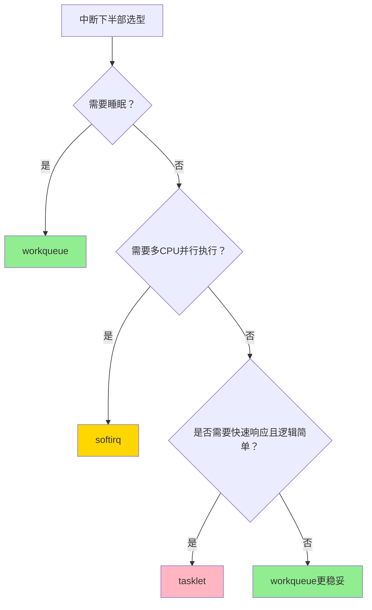

到这儿，softirq、tasklet和workqueue的底裤都扒得差不多了。但真到了coding的时候，很多工程师还是懵——这三个摆在我面前，我挑哪个？

我见过太多人纠结半天，最后拍脑袋选一个，结果上线就炸。与其这样，不如画张决策树，按图索骥。

**知识点94 [I][M] — 三者选择决策树**

先看大图，这张图建议贴在显示器旁边：

第一个问题永远不是"哪个性能好"，而是**你的下半部会不会进入睡眠状态**。这是硬红线，触了就炸——如果你需要调用`kmalloc(GFP_KERNEL)`、`mutex_lock()`、`copy_to_user()`这类可能让出CPU的接口，别想了，直接选workqueue。因为workqueue跑在内核线程上下文，线程可以睡眠；而softirq和tasklet都是中断上下文，睡眠就是直接oops。这条规则没有例外。

好，确定不睡眠了，再看第二个问题：**同一种软中断，需不需要在多个CPU上真正并行执行？** 比如网卡收到海量报文，`NET_RX_SOFTIRQ`需要在所有CPU上同时开足马力收包——这种场景选softirq，因为它支持同类型软中断在多个CPU上并发跑，没有互斥锁的开销。代价呢？你自己搞定并发安全，数据结构的per-CPU拆分、无锁设计都得自己来，这是hard模式。

如果不需要多CPU并行——同类型的处理逻辑只需要串行跑在一个CPU上就够了——那tasklet是个选择。tasklet在设计上保证同类型的tasklet不会同时在多个CPU上执行，相当于内核帮你做了一把隐式的锁，省了不少心。但注意，我说的是"是个选择"，不是"推荐选择"。

为什么这么说？看第三个分支：即便不睡眠且不需要多CPU并行，如果你的处理逻辑比较复杂，需要较长时间的运算，或者未来可能扩展成需要睡眠的样子，那还是workqueue更稳妥。workqueue的弹性最大，线程上下文、可以调度、可以绑核、可以指定优先级，出了问题也好排查。说白了，**workqueue是"保平安"的选择**。

三者的核心差异，我整理成这张表：

| 维度 | softirq | tasklet | workqueue |
|:---|:---|:---|:---|
| 执行上下文 | 中断上下文（不可睡眠） | 中断上下文（不可睡眠） | 进程上下文（可睡眠） |
| 同类型多CPU并行 | **支持** | 不支持（串行化） | 支持（多线程并发） |
| 静态/动态注册 | 编译期静态注册 | 运行时动态注册 | 运行时动态注册 |
| 使用门槛 | 高（需考虑SMP并发） | 低 | 低 |
| 延迟 | 低（软中断级别） | 低（软中断级别） | 较高（线程调度延迟） |
| 典型场景 | 网络收发包、块设备 | 简单快速的中断收尾 | 复杂处理、需睡眠的场景 |
| 内核态度 | 核心机制，不变 | **已deprecated** | 推荐方案 |

表里最后一行值得再强调一下。tasklet从Linux 5.x时代开始被标记为deprecated，内核社区推荐的新代码方案只有两个：**workqueue** 或 **threaded IRQ**。threaded IRQ本质上是把中断上半部也线程化，上半部做完最紧急的ack和mask后，直接唤醒一个专用线程来跑下半部，上下文切换的开销比传统方案大一些，但代码清晰、不会阻塞中断线，调试也舒服。

说实话，早年间的代码库里tasklet到处都是，因为当时workqueue的性能确实差一些——每一次workqueue执行都要走线程调度，延迟波动大。但这些年内核调度器优化了那么多，CFS、workqueue的unbound/bound池化设计做下来，workqueue的延迟已经完全能接受。除非你在做DPDK级别的极致性能优化，否则那点延迟差异根本测不出来。反过来，tasklet的坑——隐性锁、不可睡眠、同类型串行——却隔三差五让人踩一遍。

所以我的建议很朴素：**新代码写workqueue，老代码里的tasklet能迁就迁**。这是知识点94的核心结论。

---

**知识点95 [I] — 选错机制的典型翻车现场**

讲一个我见过好几次的案例。某块设备驱动的工程师为了"追求低延迟"，下半部选了tasklet。数据路径上需要做一次内存分配来准备下一个DMA缓冲区，他顺手就调了`kmalloc(size, GFP_KERNEL)`。然后呢？上线高压力测试，偶发性oops，堆栈指向tasklet执行路径。查了一周，最后发现`GFP_KERNEL`在内存紧张时会触发直接回收（direct reclaim），直接回收要睡眠等待I/O完成——可你在tasklet里啊，中断上下文睡眠，内核直接报"scheduling while atomic"。

换`GFP_ATOMIC`？的确不会睡眠了，但内存紧张时分配失败率飙升，DMA缓冲区申请不到，I/O报错。最终方案只能改成workqueue，问题彻底消失。

这个案例的关键教训不是"tasklet里不能调kmalloc"，而是**选型要从需求倒推，而不是从性能正推**。先问自己"能不能不睡眠"，再问自己"需不需要多CPU并行"，答案自然就出来了。反过来，为了几微秒的延迟优势选tasklet，再在代码里束手束脚地规避睡眠点，是舍本逐末。

你记住：选型时workqueue永远是默认选项，只有当你明确证明workqueue的延迟不达标时，才考虑softirq。至于tasklet——它正在退出历史舞台，新代码就别碰了。
