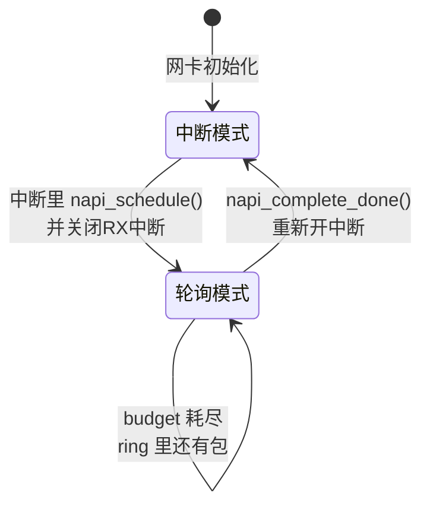

# 10.3.5 NAPI中断与轮询的混合模式

> 所属章节：第10章 中断与时间 > 10.3 底半部机制
>
> 难度：[E→M] | 预计阅读时间：25分钟

## <span class="blue">本节导读</span>

网络收包有两条路：

- 纯中断模式，每来一个包打断 CPU 一次，延迟低但扛不住高流量；
- 纯轮询模式，CPU 不停地查网卡，吞吐高但空转浪费。

NAPI（New API）是 Linux 网络子系统对这两者的折中：**低负载走中断保延迟，高负载切轮询保吞吐**，由驱动和内核协作自动切换。<br>

本节覆盖：

- NAPI 要解决的中断风暴问题、
- 中断/轮询双模式状态机、
- budget 预算机制与 v6.6 的真实默认值，
- 以及用 `ethtool` + `iperf3` 验证混合模式的实验方法。

---

## <span class="blue">NAPI的设计思想与核心机制 [E→M]</span>

### 从中断风暴说起

10.2.3 讲过顶半部执行过长的后果，这里看另一个方向的问题：中断本身太频繁。

一台千兆网卡满载 64 字节小包时，线速约为每秒 148 万个包。每个包触发一次中断，意味着每秒近 150 万次中断处理。<br>
CPU 全部时间耗在进出中断上，没有余力处理协议栈, 这个现象叫**中断风暴**（Interrupt Storm）。

NAPI 的解决思路很直接：**高流量时别再每个包都打断我，让我一次性批处理一批**。

### NAPI的双模式状态机

NAPI 的核心是在中断驱动和轮询驱动之间自动切换：



具体运转流程：

1. **低负载（中断模式）**：网卡收到包，触发 RX 中断。<br>
   驱动的 irq handler 调用 `napi_schedule()`，把 `napi_struct` 挂到当前 CPU 的 `poll_list` 上，同时**关闭该网卡（或该队列）的 RX 中断**——状态切到轮询模式。

2. **高负载（轮询模式）**：NET_RX_SOFTIRQ 的执行函数 `net_rx_action()` 遍历 `poll_list`，调用驱动的 `poll` 函数批量收包。<br>
   单个 NAPI 实例每轮最多处理 `budget` 个包（默认 64）。

3. **回归中断模式**：某一轮 poll 处理的包数 `work_done < budget`，说明 ring 已空，驱动调用 `napi_complete_done()` 并**重新打开 RX 中断**，回到中断模式。<br>
   如果 budget 耗尽还有包，NAPI 实例留在 `poll_list` 里，下一轮 softirq 继续轮询。

关键点在于第 1 步的关中断：进入轮询模式后，新到的包直接进 ring buffer，不打断 CPU；CPU 按自己的节奏批量取走。<br>
中断次数从"每包一次"降为"每批一次"。

### budget（预算）机制

`budget` 是 NAPI 的核心调节参数，控制单次轮询最多处理多少个包。<br>
v6.6 的两层预算：

| 预算 | 作用域 | v6.6 默认值 | 位置 |
|------|--------|-------------|------|
| `weight` | 单个 NAPI 实例每轮 | 64（`NAPI_POLL_WEIGHT`） | include/linux/netdevice.h:2615 |
| `netdev_budget` | 一次 `net_rx_action()` 里所有实例的总包数 | 300 | net/core/dev.c:4447 |
| `netdev_budget_usecs` | 一次 `net_rx_action()` 的总时间 | 2 个 jiffy 对应的微秒数 | net/core/dev.c:4449 |

驱动通过 `netif_napi_add()` 注册时指定 weight；不指定则用默认值 64。<br>
总预算 `netdev_budget` 防止单个 CPU 被收包软中断长时间霸占——300 个包或时间上限到了，`net_rx_action()` 必须让出，剩余实例下轮再处理（这正是 10.3.2 讲的 softirq 防霸占机制在网络子系统的具体体现）。

```c
/* include/linux/netdevice.h，节选 */
struct napi_struct {
	struct list_head	poll_list;   /* 挂到 CPU 的 poll_list */
	unsigned long		state;       /* NAPI_STATE_SCHED 等状态位 */
	int			weight;      /* 每轮预算 */
	int			(*poll)(struct napi_struct *, int);
	struct net_device	*dev;        /* 关联的网络设备 */
	/* ... */
};
```

一个典型 NAPI 驱动的三个环节（基于 e1000e 等驱动的通用结构简化示意，非逐行摘录）：

```c
/* 1. probe 路径：注册 NAPI 实例，指定 poll 函数和 weight */
netif_napi_add(netdev, &adapter->napi, my_poll);   /* 默认 weight=64 */

/* 2. 中断处理函数（顶半部） */
static irqreturn_t my_intr(int irq, void *data)
{
	struct my_adapter *adapter = data;

	/* 关 RX 中断（写网卡中断屏蔽寄存器），防止风暴 */
	writel(RX_INT_MASK, adapter->hw_addr + IMC);

	/* 把 napi_struct 挂到本 CPU 的 poll_list */
	if (napi_schedule_prep(&adapter->napi))
		__napi_schedule(&adapter->napi);

	return IRQ_HANDLED;
}

/* 3. NAPI 轮询函数（NET_RX_SOFTIRQ 上下文） */
static int my_poll(struct napi_struct *napi, int budget)
{
	struct my_adapter *adapter =
		container_of(napi, struct my_adapter, napi);
	int work_done;

	/* 批量收包，最多 budget 个 */
	work_done = my_clean_rx_irq(adapter, budget);

	if (work_done < budget) {
		/* ring 空了：退出轮询，重新开中断 */
		if (napi_complete_done(napi, work_done))
			writel(RX_INT_ENABLE, adapter->hw_addr + IMS);
	}
	/* 否则 budget 耗尽，返回 work_done，下轮 softirq 继续 */

	return work_done;
}
```

> 💡 `weight` 不是越大越好。<br>
> 设太大，单轮 poll 占 CPU 时间太长，会挤压同 CPU 上其他 softirq 和进程；设太小，批处理收益不足。<br>
> 64 是内核长期调优留下的默认值，一般不需要动。

### 内核调度路径

```
网卡 RX 中断到来
    ↓
my_intr()                    [硬中断上下文]
    ├── 写寄存器关 RX 中断
    └── __napi_schedule()  →  napi 加入本 CPU 的 softnet_data->poll_list
                                 ↓
        中断返回路径或 ksoftirqd（见 10.3.2）
                                 ↓
        net_rx_action()        [NET_RX_SOFTIRQ 上下文]
            ├── 遍历 poll_list
            └── napi->poll(napi, weight)
                      ↓
                my_poll()
                      ├── 批量收包（weight 限制）
                      └── napi_complete_done() → 开中断 / 下轮继续
```

> ⚠️ `napi_complete_done()` 只在确认 ring 已空（`work_done < budget`）时才能调用。<br>
> 如果 ring 里还有包就调用并重新开中断，行为依赖具体驱动的实现，常见后果是残留的包要等下一个新包触发中断才被处理——高负载间隙出现不可预期的收包延迟。<br>
> 判空条件写错是 NAPI 驱动最常见的 bug 之一。

### 中断 vs NAPI vs 纯轮询

| 维度 | 纯中断模式 | NAPI 混合模式 | 纯轮询模式 |
|------|-----------|---------------|-----------|
| 触发方式 | 每个包触发中断 | 高负载自动切轮询 | 持续轮询，无中断 |
| 收包延迟 | 最低 | 中等 | 取决于轮询节奏 |
| 最大吞吐 | 受中断开销限制 | 高（10Gbps+ 常见） | 高（DPDK 场景） |
| CPU 占用（低负载） | 最低 | 低 | 最高（空转） |
| CPU 占用（高负载） | 极高（中断风暴） | 中等 | 高（持续占核） |
| 小包场景 | 差 | 好 | 好 |
| 驱动复杂度 | 简单 | 中等 | 简单（但需独占核） |
| 典型用户 | 早期网卡驱动 | e1000e、ixgbe、mlx5 等 | DPDK PMD |

Linux 内核里现代网卡驱动几乎全部默认使用 NAPI。理解 NAPI，就理解了 Linux 网络收包路径的主干。

---

## <span class="blue">NAPI的适用场景与代价 [I]</span>

### 什么时候NAPI收益最大

**最匹配的场景**：

- 千兆及以上网络：1G/10G/25G/100G，速率越高收益越大
- 大量小包场景：DNS 查询、VoIP 信令、DDoS 流量
- 高并发连接：Web 服务器、负载均衡、CDN 节点
- 包处理开销大：带 NAT、ACL、深度校验的网关设备

**不适合的场景**：

- 百兆以下低速网络：中断开销占比小，NAPI 的切换逻辑反而增加复杂度
- 非网络设备：NAPI 是网络子系统专用机制
- 延迟极端敏感：金融撮合这类场景，轮询引入的额外延迟不可接受
- CPU 资源紧张的系统：轮询模式需要 CPU 时间片支撑

### NAPI的代价：延迟换吞吐

混合模式的代价是**收包延迟增加**。<br>
进入轮询模式后，ring 里新到的包不触发中断，要等当前这轮 poll 扫到它，或下一轮 poll 处理。

极端情况：weight=64、平均每包处理 10μs，一批最多 640μs，期间到达的包最坏要等接近这个时间。对比纯中断模式的微秒级响应，差距明显。

实际中没这么极端：ring 通常不会撑满，平均等待约半个轮询周期；多队列网卡每个 RX queue 有独立的 NAPI 实例并行轮询，延迟被进一步摊平。

另一个代价是**驱动复杂度**：irq handler（关中断 + schedule）、poll 函数（批量处理 + budget 判断）、完成判定（complete + 开中断）三个环节环环相扣，判空条件写错就是延迟异常或丢包。

### 实战：用ethtool观察中断合并效果

网卡的中断合并（interrupt coalescing）参数与 NAPI 配合工作：coalescing 控制网卡**产生中断**的节奏，NAPI 控制内核**处理包**的节奏。<br>
用 `ethtool -C` 调整前者，可以直接观察到混合模式的行为变化。

**Step 1**：查看当前 coalescing 配置

```bash
ethtool -c eth0
```

输出形如：

```
Coalesce parameters for eth0:
Adaptive RX: off  TX: off
rx-usecs: 50          # 收到包后最多延迟 50μs 再发中断
rx-frames: 64         # 或攒够 64 帧就发中断（先到为准）
tx-usecs: 50
tx-frames: 64
```

注意区分：`rx-frames` 控制的是网卡**发中断**的时机，不是 NAPI 的 weight/budget。<br>
两者作用在路径的不同端——一个在网卡侧减少中断次数，一个在内核侧限制单轮处理量。

**Step 2**：调大合并粒度，跑吞吐测试

```bash
sudo ethtool -C eth0 rx-usecs 100 rx-frames 128
iperf3 -c 192.168.1.100 -t 30 -P 4
watch -n 1 'grep eth0 /proc/interrupts'
```

**Step 3**：恢复延迟优先配置，对比

```bash
sudo ethtool -C eth0 rx-usecs 0 rx-frames 1
iperf3 -c 192.168.1.100 -t 30 -P 4
```

**观察指标对比**（趋势性结论，数值因硬件而异）：

| 配置 | 中断次数/秒 | 吞吐 | CPU 软中断占比 | 收包延迟 |
|------|------------|------|---------------|----------|
| rx-usecs=0, rx-frames=1 | 极高 | 较低 | 很高 | 最低 |
| rx-usecs=50, rx-frames=64 | 中等 | 最高 | 中等 | 中等 |
| rx-usecs=100, rx-frames=128 | 低 | 较高 | 较低 | 较高 |

> 🔴 生产环境调整 coalescing 参数前先在测试环境验证。<br>
> `rx-frames` 设太大，延迟敏感业务（RPC、游戏网关）可能出现超时；设太小则退化为近似纯中断模式，吞吐下降。没有通用的最优值，按业务特征实测。

---

## <span class="blue">本节总结</span>

NAPI 的本质是用一个状态机调和一对矛盾：中断保延迟，轮询保吞吐。流量低时它是中断驱动，流量高时自动切成轮询，流量退了再切回来。<br>
写网卡驱动它是标配；不写网卡也值得记住这个思想——凡是"事件可能风暴化"的场景（高频 GPIO 计数、存储 completion 队列），"先中断、风暴来了转轮询"都是可选答案。

## <span class="blue">速查表</span>

| 内容 | 要点 |
|------|------|
| NAPI 设计思想 | 低负载中断保延迟，高负载轮询保吞吐，自动切换 |
| 核心 API | `netif_napi_add()` 注册、`__napi_schedule()` 调度、驱动 poll 函数、`napi_complete_done()` 完成 |
| 两层预算 | 单实例 weight=64（NAPI_POLL_WEIGHT）；全局 netdev_budget=300 + 时间上限 |
| 状态切换 | 中断→关中断+schedule→轮询→ring 空→complete+开中断，闭环 |
| 最佳适用 | 千兆以上网络、小包密集、高并发网关 |
| 不适用 | 低速网络、非网络设备、延迟极端敏感场景 |
| 核心代价 | 轮询期间收包延迟增加，驱动判空逻辑复杂 |
| 调优手段 | `ethtool -C` 调中断合并，配合 `iperf3` + `/proc/interrupts` 验证 |
| 源码路径 | `net/core/dev.c`：`net_rx_action()`、`netdev_budget`(:4447) |

---

## <span class="blue">下一步</span>

> 💡 本节只讲 NAPI 的机制本身——驱动与 `net_rx_action()` 之间的协作。<br>
> 数据包进入协议栈之后的完整收包路径（从驱动到 socket），属于第 14 章网络子系统的内容。

10.3.6 底半部选择决策树 —— softirq、tasklet、workqueue、threaded IRQ、NAPI，五种机制各有适用面。<br>
下一节用一棵决策树把选择逻辑固化下来，再配三个选错机制的真实故障案例。

---

## <span class="blue">配套资源</span>

| 资源类型 | 内容 | 路径/命令 |
|----------|------|----------|
| 图示 | NAPI 状态转换图 | 本节 mermaid 图 |
| 表格 | 中断/NAPI/纯轮询三模式对比 | 本节对比表 |
| 代码清单 | NAPI 驱动三环节示意 | 本节代码块 |
| 实战实验 | 中断合并调参实验 | `ethtool -C` + `iperf3` |
| 内核源码 | NAPI 核心调度 | `net/core/dev.c`：`net_rx_action()` |
| 头文件 | napi_struct、NAPI_POLL_WEIGHT | `include/linux/netdevice.h` |
| 调参手册 | 网卡 coalescing 配置 | `man ethtool` |
