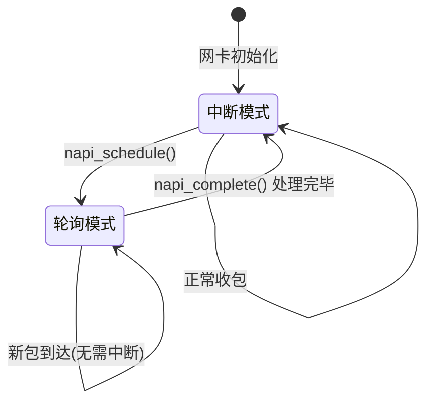

# 10.3.5 NAPI中断与轮询的混合模式

> 所属章节：第10章 中断与时间 > 10.3 下半部机制
>
> 难度：[E][M] | 预计阅读时间：25分钟

## <span class="blue">本节导读</span>

想象一下你是一家快递站的站长。包裹少的时候，每个包裹到了门铃就响一声（中断），你去处理，没问题。但如果双十一来了，每秒几百个包裹，门铃狂响不止——你还每次都放下手里的活去应门，这不疯了吗？<br>

更聪明的做法是：包裹开始爆仓时，先把门铃关了，派个人一直守在传送带边上批量处理（轮询），等这波高峰过去再把门铃打开。<br>

这就是NAPI的核心思想——**"打不过就加入"**。低负载时走中断保延迟，高负载时切轮询保吞吐。本节带你深入这个Linux网络子系统的王牌机制，看看内核是怎么在高性能场景下做这道选择题的。<br>

学完后，你将理解NAPI的状态机运转原理、预算机制，并能通过`ethtool`和`iperf3`亲手验证混合模式的威力。

---

## <span class="blue">NAPI的设计思想与核心机制 [E][M]</span>

### 从"中断风暴"说起

回想10.3.1节讲的内容：中断是外设通知CPU的异步机制，响应快、延迟低。但在网络高负载场景下，这个优势会变成致命的弱点。<br>

一台千兆网卡满载时，每秒能接收约150万个64字节小包。每个包触发一次中断，意味着每秒150万次上下文切换、150万次中断处理函数执行。CPU光是进出中断就累趴了，哪还有力气处理真正的网络数据？<br>

这个问题有个专门的名字——**中断风暴**（Interrupt Storm）。在数据中心和运营商路由器里，这是性能杀手。<br>

NAPI（New API，Linux 2.4/2.6引入）的解决思路很直接：**别每个包都 interrupt 我，让我一次性批处理一批**。

### NAPI的双模式状态机

NAPI的核心是一个状态切换机，在中断驱动和轮询驱动之间智能切换。下面这张图展示了完整的生命周期：



具体怎么运转？来看这个流程：

1. **低负载状态（中断模式）**：网卡收到数据包，触发RX中断。驱动中irq handler调用`napi_schedule()`，把NAPI结构体加入CPU的poll_list，**关闭该网卡的中断**，状态切到轮询模式。

2. **高负载处理（轮询模式）**：内核的软中断（NET_RX_SOFTIRQ）处理线程调用`napi_poll()`，驱动从ring buffer中批量取出数据包处理。每轮最多处理`budget`个（默认64个）。

3. **状态回归**：如果预算耗尽但还有包，NAPI结构体继续留在poll_list，下次软中断继续轮询。如果包处理完了，调用`napi_complete()`，**重新开启中断**，回到中断模式。<br>

说白了，NAPI就像一个智能开关：平时开灯（中断），人多的时候拉闸改成流水作业（轮询），人散了就恢复开灯。

### 预算（budget）机制

`budget`参数是NAPI的心脏。它控制每次轮询最多处理多少个包。

```c
// include/linux/netdevice.h
struct napi_struct {
    struct list_head    poll_list;   // CPU的poll链表
    unsigned long       state;       // NAPI状态位
    int                 weight;      // 预算值（默认NAPI_POLL_WEIGHT=64）
    napi_poll_fn        *poll;       // 轮询函数指针
    struct net_device   *dev;        // 关联的网络设备
    // ...
};
```

```c
// drivers/net/ethernet/intel/e1000e/netdev.c (典型NAPI驱动示例)

// 1. 初始化时注册NAPI
static int e1000e_probe(struct pci_dev *pdev, const struct pci_device_id *ent)
{
    struct net_device *netdev;
    struct e1000_adapter *adapter;
    
    // 分配netdev和私有数据
    netdev = alloc_etherdev(sizeof(*adapter));
    adapter = netdev_priv(netdev);
    
    // 注册NAPI，指定poll函数和weight（预算）
    netif_napi_add(netdev, &adapter->napi, e1000e_poll, 64);
    //                              poll函数 ^    ^ 预算值
}

// 2. 中断处理函数（顶半部）
static irqreturn_t e1000e_intr(int irq, void *data)
{
    struct e1000_adapter *adapter = data;
    
    // 禁用该网卡RX中断，防止风暴
    ew32(IMC, E1000_IMC_RX_SEQ | E1000_IMC_RXT0);
    
    // 调度NAPI轮询（将napi_struct加入poll_list）
    if (likely(napi_schedule_prep(&adapter->napi)))
        __napi_schedule(&adapter->napi);
    
    return IRQ_HANDLED;
}

// 3. NAPI轮询函数（底半部）
static int e1000e_poll(struct napi_struct *napi, int budget)
{
    struct e1000_adapter *adapter = container_of(napi, ...);
    int work_done = 0;
    
    // 批量处理数据包，最多处理budget个
    work_done = e1000e_clean_rx_irq(adapter, budget);
    
    // 如果处理完所有包（work_done < budget），说明ring空了
    if (work_done < budget) {
        napi_complete_done(napi, work_done);  // 完成轮询
        // 重新启用RX中断
        ew32(IMS, E1000_IMS_RX_SEQ | E1000_IMS_RXT0);
    }
    // 否则budget耗尽，返回work_done，内核继续调度轮询
    
    return work_done;
}
```

> 💡 **提示**：`weight`参数（预算）不是越大越好。设成512，单次轮询时间太长，影响其他软中断的响应；设成16，批次太小，达不到批处理的效果。64这个默认值是内核开发者多年调优的经验值。

### 内核调度路径

NAPI的调度发生在软中断上下文。一张图搞清楚调用链：

```
网卡RX中断到来
    ↓
e1000e_intr()  [硬中断上下文]
    ├── 写IMR寄存器，关闭RX中断
    └── __napi_schedule()  →  napi->poll_list 加入 CPU的softnet_data->poll_list
                                ↓
                          ksoftirqd 或 中断返回时
                                ↓
                          net_rx_action()  [软中断上下文]
                                ├── 遍历poll_list
                                └── 调用 napi->poll(napi, budget)
                                           ↓
                                    e1000e_poll()
                                           ↓
                                    ├── 收包处理（budget限制）
                                    └── napi_complete() → 开中断 / 继续轮询
```

> ⚠️ **陷阱**：`napi_complete()`必须在两个条件之一满足时才能调用：
> 1. 本次轮询处理的包数`work_done < budget`（说明ring buffer已空）
> 2. 驱动确实没有更多包可以处理<br>
> 如果在budget没用完、ring buffer还有包的情况下就调了`napi_complete()`，会导致这些包无人处理，直到下一个新包来触发中断——**丢包风险**！

### 中断 vs NAPI vs 纯轮询

三种模式到底怎么选？来看一张全面的对比表：

| 维度 | 纯中断模式 | NAPI混合模式 | 纯轮询模式 |
|------|-----------|-------------|-----------|
| **触发方式** | 每个包触发中断 | 高负载切换轮询 | 定时轮询，无中断 |
| **延迟** | 最低（~几μs） | 中等（几十μs） | 最高（取决于轮询周期） |
| **最大吞吐** | 低（~几百Mbps） | 高（10Gbps+） | 很高（依赖CPU频率） |
| **CPU占用（低负载）** | 最低 | 低 | 最高（空转） |
| **CPU占用（高负载）** | 极高（中断风暴） | 中等 | 高（100%轮询） |
| **小包场景表现** | 极差 | 很好 | 一般 |
| **大包场景表现** | 一般 | 很好 | 很好 |
| **驱动复杂度** | 简单 | 中等 | 简单 |
| **适用场景** | 低速设备、非网络 | **千兆/万兆网卡** | DPDK、专用转发 |
| **内核代表** | 早期网卡驱动 | e1000e、ixgbe、mlx4 | DPDK PMD模式 |

> 💡 **提示**：Linux内核里几乎所有现代网卡驱动都默认用NAPI。你在用的服务器网卡，不管是Intel的e1000e/ixgbe，还是Mellanox的mlx系列，走的都是这套机制。懂了NAPI，你就懂了Linux网络收包的核心骨架。

---

## <span class="blue">NAPI的适用场景与代价 [I]</span>

### 什么时候NAPI大放异彩

NAPI不是银弹，它在特定场景下才能发挥最大价值：<br>

**最匹配的场景**：

- **千兆及以上网络**：1Gbps、10Gbps、25Gbps、100Gbps，越高NAPI收益越大
- **大量小包场景**：DDoS攻击流量、DNS查询、VoIP信令、高频交易报价流
- **高并发连接**：Web服务器、负载均衡器、CDN节点
- **包处理开销大**：需要做复杂校验、NAT、ACL过滤的网关设备<br>

**不适用NAPI的场景**：

- **百兆以下低速网络**：中断开销占比小，NAPI的切换反而增加复杂度
- **非网络设备**：块设备、字符设备用NAPI没有意义
- **低延迟优先于吞吐**：高频交易的撮合引擎，几微秒也珍贵
- **单核CPU系统**：NAPI依赖软中断线程调度，单核上收益有限<br>

### NAPI的代价：延迟换吞吐

混合模式最大的trade-off是**延迟增加**。具体从哪来？<br>

当NAPI处于轮询模式、正在处理一批包时，ring buffer中新到达的包**不会触发中断**——因为中断已经被关掉了。这些包只能在当前轮询结束后（`napi_complete()`重新开中断），或者下一轮`napi_poll()`被处理。<br>

在极端情况下，假设budget=64，处理一个包平均10μs，那么一批包处理要640μs。期间新到达的包最长要等640μs才能被处理。对比纯中断模式（几μs就响应），延迟差了上百倍。<br>

不过实际中没那么恐怖。内核默认 budget=64 且 ring buffer 通常不会撑满，平均等待时间是轮询周期的一半左右。加上现代网卡普遍支持多个RX queue，每个queue有独立的NAPI实例并行轮询，进一步摊平延迟。<br>

另一个隐性代价是**驱动代码复杂度**。纯中断驱动只需要一个irq handler。NAPI驱动需要：irq handler（关中断+schedule）、poll函数（批量处理+budget检查）、完成判断（complete or continue）。三个环节环环相扣，出一个bug就是丢包或中断死锁。

### 实战带练：NAPI模式切换实验

怎么亲手验证NAPI的工作效果？用`ethtool`的coalescing参数可以控制NAPI的触发条件，配合`iperf3`跑吞吐测试。

**Step 1**：查看当前网卡的NAPI/coalescing配置

```bash
# 查看当前中断合并参数
$ ethtool -C eth0
Coalesce parameters for eth0:
Adaptive RX: off  TX: off
stats-block-usecs: 0
sample-interval: 0
pkt-rate-low: 0
pkt-rate-high: 0
rx-usecs: 50          # RX中断延迟微秒数
rx-frames: 64         # RX每批最大帧数（就是budget）
rx-usecs-irq: 0
rx-frames-irq: 0
tx-usecs: 50
tx-frames: 64
```

**Step 2**：调整NAPI触发条件，对比性能

```bash
# 配置更激进的NAPI（更大的batch，更少中断）
$ sudo ethtool -C eth0 rx-usecs 100 rx-frames 128

# 测试TCP吞吐
$ iperf3 -c 192.168.1.100 -t 30 -P 4

# 同时监控中断次数
$ watch -n 1 'cat /proc/interrupts | grep eth0'
```

**Step 3**：恢复到延迟优先模式

```bash
# 更小的batch，更多中断，更低延迟
$ sudo ethtool -C eth0 rx-usecs 0 rx-frames 1

# 再跑同样的iperf3测试，对比吞吐和CPU占用
$ iperf3 -c 192.168.1.100 -t 30 -P 4
```

> 💡 **提示**：`ethtool -C eth0 rx-usecs 50 rx-frames 64` 这行配置的意思是："要么50μs内没处理完，要么攒够64个帧，就触发一次中断/轮询"。两个条件是**或**的关系。`rx-usecs=0`表示不延迟，每个包都可能触发中断（回到纯中断模式）。

**观察指标对比**：

| 配置 | 中断次数/秒 | 吞吐(Gbps) | CPU占用(软中断%) | 延迟(μs) |
|------|------------|-----------|-----------------|---------|
| rx-usecs=0, rx-frames=1 | 极高 | 较低 | 很高 | 最低 |
| rx-usecs=50, rx-frames=64 | 中等 | 最高 | 中等 | 中等 |
| rx-usecs=100, rx-frames=128 | 低 | 较高 | 较低 | 较高 |

> 🔴 **危险**：生产环境下调`ethtool -C`参数前务必先在测试环境验证。把`rx-frames`设太大（如1024），可能导致延迟飙升，RPC超时；设太小则退化为中断模式，吞吐下降。没有一刀切的"最优值"，得根据业务特点实测。

---

## <span class="blue">本节总结</span>

| 内容 | 要点 |
|------|------|
| NAPI设计思想 | 低负载用中断保延迟，高负载切轮询保吞吐，内核自动切换 |
| 核心API | `netif_napi_add()`注册、`napi_schedule()`调度、`napi_poll()`轮询、`napi_complete()`完成 |
| budget参数 | 默认64，控制单次轮询最大包数，吞吐和延迟的关键调节阀 |
| 状态切换 | 中断→`napi_schedule()`→轮询→`napi_complete()`→中断，形成闭环 |
| 最佳适用 | >1Gbps网络、大量小包（DNS/VoIP/DDoS）、高并发网关 |
| 不适用 | <100Mbps低速网、非网络设备、超低延迟优先场景 |
| 核心代价 | 轮询期间延迟增加，驱动复杂度上升 |
| 调优工具 | `ethtool -C`调节rx-usecs/rx-frames，配合`iperf3`+`/proc/interrupts`验证 |
| 源码路径 | `net/core/dev.c`：`net_rx_action()`；驱动层：`netif_napi_add()` |

---

## <span class="blue">下一步</span>

10.3.6 底半部选择决策树 —— tasklet、workqueue、softirq、NAPI，四种底半部机制各有主场。下节我们用一棵决策树帮你理清：什么场景该选谁？什么时候该组合使用？什么时候干脆不用底半部？

---

## <span class="blue">配套资源</span>

| 资源类型 | 内容 | 路径/命令 |
|----------|------|----------|
| 🗺️ 图示 | NAPI状态转换图 | 本节mermaid图 |
| 📊 表格 | 中断/NAPI/纯轮询三模式对比 | 上节对比表 |
| 💻 代码清单 | NAPI驱动完整示例（注册/中断/poll/完成） | 本节代码块 |
| 🔧 实战实验 | NAPI模式切换实验 | `ethtool -C` + `iperf3` |
| 📁 内核源码 | NAPI核心调度逻辑 | `net/core/dev.c: net_rx_action()` |
| 📁 驱动参考 | Intel e1000e NAPI实现 | `drivers/net/ethernet/intel/e1000e/netdev.c` |
| 📁 头文件 | napi_struct定义 | `include/linux/netdevice.h` |
| 🔧 调参手册 | 网卡coalescing配置 | `man ethtool` |
