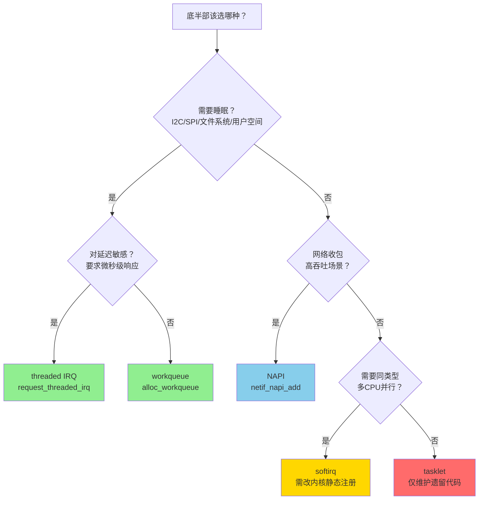

# 10.3.6 底半部选择决策树

> 所属章节：第10章 中断与时间 > 10.3 底半部机制
>
> 难度：[I→M] | 预计阅读时间：15分钟

## <span class="blue"> 本节导读

softirq、tasklet、workqueue、NAPI——前面几节讲完了四种；再加上将在 10.4 展开的 threaded IRQ，五种底半部机制就齐了。实际写驱动时到底选哪个？<br>
选错了轻则延迟超标，重则内核 oops。

> threaded IRQ（中断线程化）：`request_threaded_irq()` 把一个中断的处理拆成两半——顶半部只确认/清除中断源，返回 `IRQ_WAKE_THREAD` 唤醒该中断的专属内核线程，真正的处理在这个线程里执行，因此可以睡眠。<br>
> 机制细节在 10.4 展开；本节只需要它在选型中的位置：**需要睡眠、又要求微秒级延迟时的答案**。

本节覆盖：

- 一棵可直接套用的决策树、
- 五种机制的全维度对比表、
- 每种机制的最小代码骨架，
- 以及三个选错机制导致的真实故障案例。

## <span class="blue"> 决策树：按图索骥选机制

### 决策流程图



整个决策就三个问题：<br>
**能不能睡？** 能睡就排除 softirq/tasklet，剩 workqueue 和 threaded IRQ。<br>
**要不要极致延迟？** 要微秒级响应选 threaded IRQ，否则 workqueue 足够。<br>
**不能睡的场景里**，网络高吞吐选 NAPI；要同类型多核并行只有 softirq（代价是改内核）；tasklet 只在维护老代码时出场。

### 一句话速查

| 场景 | 选它 | 理由 |
|------|------|------|
| 要访问 I2C/SPI/文件系统 | workqueue | 这些操作会睡眠 |
| 要睡眠 + 微秒级延迟 | threaded IRQ | 专属线程，调度路径比 workqueue 短 |
| 网络驱动高 pps 收包 | NAPI | 专为高吞吐收包设计 |
| 改内核子系统、同类型要并行 | softirq | 唯一支持同类型多 CPU 并行 |
| 新驱动代码 | 不用 tasklet | 内核文档明确不推荐，用 workqueue 替代 |

> 💡 拿不准的时候默认选 workqueue：能睡眠、API 简单、行为可预测。<br>
> 性能测试发现延迟不达标，再评估升级到 threaded IRQ 的必要性。
<!-- -->
> 💡 选定机制后还有一个随之而来的问题：底半部与进程上下文访问共享数据时的同步。<br>
> `spin_lock_bh()`、`local_bh_disable()` 这类专门和底半部打交道的原语属于并发主题，统一在第 13 章「并发与同步」展开，本节不再重复。

## <span class="blue"> 五种机制全面对比

| 维度 | softirq | tasklet | workqueue | threaded IRQ | NAPI |
|------|---------|---------|-----------|--------------|------|
| 执行上下文 | 软中断 | 软中断 | 进程上下文（kworker） | 进程上下文（专属 IRQ 线程） | 软中断（NET_RX） |
| 可睡眠 | 否 | 否 | 是 | 是 | 否 |
| 同实例并行性 | 同类型可多 CPU 并行 | 串行 | 受 max_active 限制 | 单个 IRQ 串行 | 每队列一个实例，多队列并行 |
| 典型延迟量级 | 微秒级 | 微秒级 | 数十微秒起，受调度影响 | 微秒到数十微秒 | 微秒级（轮询批次内） |
| 适用场景 | 内核网络/块层子系统 | 遗留驱动维护 | I2C/SPI/文件系统等可睡眠工作 | 低延迟 + 需睡眠 | 网卡高吞吐收包 |
| API 复杂度 | 高（改内核注册） | 低 | 中 | 低 | 中 |
| 内核定位 | 长期核心机制 | 文档明确不推荐新代码使用 | 驱动开发默认选择 | 2.6.30 引入，现代主流 | 网络子系统标准 |

表中延迟数字是典型经验值，实际取决于系统负载、CPU 频率和配置，选型时按数量级理解即可。

## <span class="blue"> 四种机制代码速查

每种机制最核心的初始化与调度代码骨架。

### softirq（以网络 RX 为例）

```c
/* 内核启动时静态注册（内核子系统代码，驱动用不了） */
open_softirq(NET_RX_SOFTIRQ, net_rx_action);

/* 触发 */
raise_softirq(NET_RX_SOFTIRQ);

/* 执行函数 */
static void net_rx_action(struct softirq_action *h)
{
	/* 不可睡眠，不可访问用户空间 */
}
```

### workqueue（驱动默认选择）

```c
static struct work_struct my_work;

static void my_work_handler(struct work_struct *work)
{
	/* 进程上下文——可以睡眠 */
	i2c_transfer(adapter, msg, 1);   /* 合法 */
	msleep(10);                      /* 合法 */
}

/* probe 中初始化 */
INIT_WORK(&my_work, my_work_handler);

/* 顶半部中调度 */
schedule_work(&my_work);    /* 使用 system_wq */
```

### threaded IRQ

```c
static irqreturn_t my_irq_handler(int irq, void *dev_id)
{
	/* 顶半部：只确认/清除中断源，返回唤醒线程 */
	return IRQ_WAKE_THREAD;
}

static irqreturn_t my_thread_fn(int irq, void *dev_id)
{
	/* IRQ 线程上下文——可以睡眠 */
	do_real_work();
	return IRQ_HANDLED;
}

/* probe 中注册；IRQF_ONESHOT 让内核在线程跑完前保持该中断屏蔽，
 * 两个处理函数里都不用手动 disable/enable_irq */
request_threaded_irq(irq, my_irq_handler, my_thread_fn,
		     IRQF_ONESHOT, "my_driver", dev);
```

> ⚠️ 带 `IRQF_ONESHOT` 时不要再在处理函数里调 `disable_irq_nosync()`/`enable_irq()`：<br>
> 内核的线程化机制已经保证了"线程执行期间该中断保持屏蔽"，手动开关反而会打乱这个状态配对，多次 enable 失衡还会触发内核警告。

### NAPI（网络驱动专用）

```c
/* 注册（probe 路径） */
netif_napi_add(netdev, &adapter->napi, my_poll);

/* 顶半部：关 RX 中断 + 调度 */
if (napi_schedule_prep(&adapter->napi))
	__napi_schedule(&adapter->napi);

/* poll 函数 */
static int my_poll(struct napi_struct *napi, int budget)
{
	int work_done = my_clean_rx_irq(adapter, budget);

	if (work_done < budget && napi_complete_done(napi, work_done))
		my_enable_rx_irq();    /* 重新开中断 */
	return work_done;
}
```

## <span class="blue"> 选错机制的故障案例

### 案例1：tasklet里访问I2C → 内核oops

```c
/* 错误示例：tasklet 运行在软中断上下文 */
static void bad_tasklet_handler(unsigned long data)
{
	struct i2c_client *client = (struct i2c_client *)data;
	/* i2c_transfer 内部要等待总线传输完成，会睡眠 */
	i2c_transfer(client->adapter, msg, 1);   /* 软中断上下文睡眠 */
}
DECLARE_TASKLET_OLD(my_tasklet, bad_tasklet_handler);
```

**根因**：软中断上下文没有进程实体，一旦睡眠就没有可被调度回来的对象。<BR>
内核日志里会看到 `BUG: scheduling while atomic`，随后系统状态不再可信。<br>
**修正**：换成 workqueue 或 threaded IRQ。

### 案例2：往自定义softirq里塞重活 → 系统卡顿

有人觉得 softirq 快，把大量计算和慢速外设访问塞进自定义 softirq。结果同一 CPU 上包括 NET_RX 在内的所有 softirq 都被卡住，ssh 断连、ping 不通。

**根因**：`__do_softirq()` 串行执行所有 pending 的 softirq，一个跑得久，其他全部排队。<br>
被踢到 ksoftirqd 后情况也不会好转——ksoftirqd 是普通优先级的内核线程，要和其他进程竞争 CPU，重活在哪里执行都会拖累系统。<br>
**修正**：softirq 里的工作必须短，重活丢给 workqueue。

### 案例3：workqueue处理高频GPIO中断 → 事件积压

一个 50kHz 的 GPIO 脉冲信号，每次边沿都 schedule 一个 work：

```c
static irqreturn_t gpio_irq_handler(int irq, void *dev)
{
	schedule_work(&gpio_work);   /* 每 20μs 一次，kworker 跟不上 */
	return IRQ_HANDLED;
}
```

50kHz 意味着每 20μs 来一次中断，而 workqueue 的执行延迟在数十微秒以上且不稳定。<br>
结果就是 work 不断积压（同一个 work 重复 schedule 还会被丢弃）、事件统计失真。<br>
**修正**：高频事件在顶半部直接计数或采样；必须交给线程处理时用 threaded IRQ 并做批量合并——这正是 NAPI 思想在通用场景的应用。

## <span class="blue"> 本节总结

选型不是背表，是回答三个问题：能不能睡？要不要极致延迟？是不是网络高吞吐？<br>
三个问题答完答案基本唯一——能睡不敏感用 workqueue，能睡又要微秒级用 threaded IRQ，网络高吞吐用 NAPI，tasklet 留给老代码，softirq 留给内核子系统。拿不准就 workqueue，它只有一种错法：用错场景。

## <span class="blue"> 速查表

| 核心要点 | 关键结论 |
|----------|----------|
| 决策第一步 | 是否需要睡眠 → 区分软中断上下文与进程上下文 |
| 能睡眠 + 低延迟 | threaded IRQ |
| 能睡眠 + 延迟不敏感 | workqueue，默认安全选项 |
| 不能睡眠 + 网络高吞吐 | NAPI |
| 不能睡眠 + 同类型并行 | softirq（需改内核） |
| 新代码原则 | 不用 tasklet，内核文档已明确不推荐 |
| 选错后果 | 软中断上下文睡眠 = 崩溃；softirq 跑重活 = 卡顿；workqueue 接高频事件 = 积压 |

## <span class="blue"> 配套资源

| 资源类型 | 内容 |
|----------|------|
| 决策图 | 本节 mermaid 流程图 |
| 速查卡 | 五种机制对比表格 |
| 内核源码 | `kernel/softirq.c`、`kernel/workqueue.c`、`net/core/dev.c` |
| 官方文档 | `Documentation/core-api/workqueue.rst` |
| 验证命令 | `cat /proc/softirqs` 看 softirq 分布；`ps -ef \| grep kworker` 看 workqueue 线程 |

## <span class="blue"> 下一步

10.3.7 底半部常见错误与陷阱<br>
剖析底半部编程中最高发的七类错误：`local_bh_disable` 误用、并发竞态、资源泄漏等，每个都配错误代码与修正方案。
