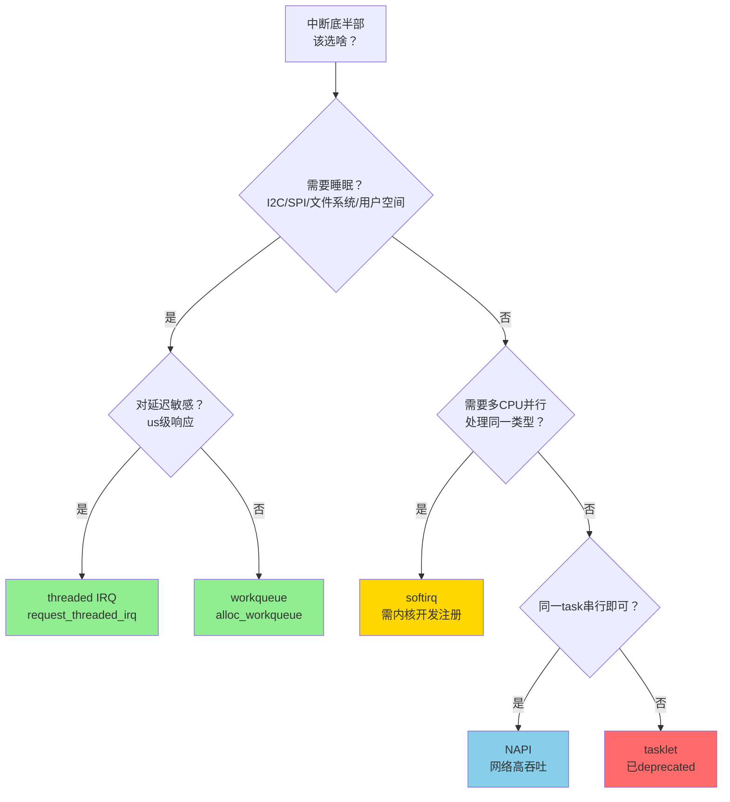

# 10.3.6 底半部选择决策树

> 所属章节：第10章 中断与时间 > 10.3 底半部机制
>
> 难度：[I][M] | 预计阅读时间：15分钟

## <span class="blue"> 本节导读

看完了softirq、tasklet、workqueue、threaded IRQ这四种底半部机制，你是不是有点懵——实际写驱动的时候到底选哪个？<br>
选错了轻则延迟飙高，重则内核oops直接崩。<br>
本节给你一个决策树，像查字典一样对照着选，再送你三个真实踩坑案例，看完就知道什么叫"选择大于努力"。<br>
学完后，你将能在一分钟内确定任何场景该用哪种底半部机制。

## <span class="blue"> 决策树：按图索骥选机制

### 决策流程图



说白了，整个决策过程就三个问题：<br>
**能不能睡？** → 能睡就排除了softirq/tasklet，只剩workqueue或threaded IRQ。<br>
**要不要极致延迟？** → 要us级响应选threaded IRQ，毫秒级workqueue足够。<br>
**同类型要不要多核并行？** → 要并行只有softirq（但你得改内核注册），否则选NAPI（网络）或tasklet（遗留代码）。

### 一句话速查

| 场景 | 选它 | 理由 |
|------|------|------|
| 要访问I2C/SPI/文件系统 | workqueue | 这些操作会睡眠 |
| 要us级延迟+要睡眠 | threaded IRQ | 比workqueue快一个数量级 |
| 网络驱动收包十万pps | NAPI | 专为高吞吐设计 |
| 改内核、同类型要并行 | softirq | 唯一支持多CPU同类型并行 |
| 内核5.9+的新代码 | 别用tasklet | 已deprecated，用workqueue替代 |

> 💡 **提示**：不确定的时候，闭眼选workqueue。它是最安全的默认选项——能睡眠、API简单、行为可预测。等性能测试发现延迟不够了，再考虑升级到threaded IRQ或NAPI。

> ⚠️ **陷阱**：Linux 5.9开始`tasklet`被标记为deprecated，新代码不要再用了。内核社区计划逐步移除tasklet，你现在写的新驱动如果用了它，未来内核版本可能编译不过。

## <span class="blue"> 四种机制全面对比

| 维度 | softirq | tasklet (deprecated) | workqueue | threaded IRQ |
|------|---------|----------------------|-----------|--------------|
| **执行上下文** | 中断上下文（__softirqentry） | 中断上下文 | 进程上下文（内核线程） | 进程上下文（专属线程） |
| **可睡眠** | ❌ 不可 | ❌ 不可 | ✅ 可以 | ✅ 可以 |
| **同类型并行性** | ✅ 多CPU同时执行 | ❌ 同类型串行 | ✅ 多CPU并发（WQ_UNBOUND） | ❌ 单个IRQ串行 |
| **典型延迟** | ~10us | ~10us | ~1-10ms | ~50-200us |
| **适用场景** | 网络/块设备底层 | 遗留代码 | I2C/SPI/文件系统访问 | 低延迟+需睡眠 |
| **API复杂度** | 高（需改内核注册） | 低 | 中 | 低 |
| **内核版本推荐** | 长期稳定 | 5.9+废弃 | 所有版本 | 2.6.30+ |
| **代码位置示例** | net/core/dev.c | 不再推荐 | drivers/i2c/ | drivers/gpio/ |

从延迟维度看，softirq/tasklet处于us级，threaded IRQ是百us级，workqueue是ms级。这个数量级的差距决定了你的选择边界。

## <span class="blue"> 四种机制代码速查

下面给你每种机制最核心的**初始化+调度**代码，抄走就能用。

### softirq（以网络RX为例）

```c
// 内核启动时注册（通常在内核子系统中）
open_softirq(NET_RX_SOFTIRQ, net_rx_action);

// 中断顶半部中触发
raise_softirq(NET_RX_SOFTIRQ);

// 底半部执行函数
static void net_rx_action(struct softirq_action *h)
{
    // 不可睡眠！不可访问用户空间！
    // 处理接收队列中的报文
}
```

### workqueue（最常用，推荐）

```c
// 初始化
static struct work_struct my_work;
static void my_work_handler(struct work_struct *work)
{
    // 进程上下文——可以睡眠！
    i2c_transfer(adapter, msg, 1);  // OK
    msleep(10);                      // OK
}

//  probe中初始化
INIT_WORK(&my_work, my_work_handler);

// 顶半部或需要调度时
schedule_work(&my_work);           // 默认workqueue
// 或创建专用queue：
// my_wq = alloc_workqueue("my_wq", WQ_UNBOUND, 1);
// queue_work(my_wq, &my_work);
```

### threaded IRQ

```c
// 注册时直接指定thread_fn
static irqreturn_t my_irq_handler(int irq, void *dev_id)
{
    // 顶半部：最小化，只关中断源
    disable_irq_nosync(irq);
    return IRQ_WAKE_THREAD;  // 唤醒thread
}

static irqreturn_t my_thread_fn(int irq, void *dev_id)
{
    // 线程上下文——可以睡眠！延迟比workqueue低一个量级
    do_real_work();
    enable_irq(irq);
    return IRQ_HANDLED;
}

// 驱动probe中
request_threaded_irq(irq, my_irq_handler, my_thread_fn,
                     IRQF_ONESHOT, "my_driver", dev);
```

### NAPI（网络驱动专用）

```c
// 初始化
static struct napi_struct napi;
napi_enable(&napi);

// 顶半部（中断）触发NAPI
napi_schedule(&napi);  // 替代netif_rx

// NAPI poll函数
static int my_poll(struct napi_struct *napi, int budget)
{
    int work_done = 0;
    // 批量收包，最多处理budget个
    while (work_done < budget && has_packets()) {
        rx_one_packet();
        work_done++;
    }
    if (work_done < budget)
        napi_complete_done(napi, work_done);
    return work_done;
}
```

## <span class="blue"> 选错机制的灾难案例

### 案例1：tasklet里访问I2C → 内核oops

```c
// 致命错误！tasklet运行在中断上下文
static void bad_tasklet_handler(unsigned long data)
{
    struct i2c_client *client = (struct i2c_client *)data;
    // i2c_transfer内部会msleep等待 → 在中断上下文睡眠 = 死！
    i2c_transfer(client->adapter, msg, 1);  // 💥 OOPS!
}
DECLARE_TASKLET(my_tasklet, bad_tasklet_handler, 0);
```

**根因**：`tasklet`在中断上下文执行，`i2c_transfer`底层需要等待总线就绪，会调用调度器睡眠。中断上下文一旦调度，内核直接崩溃。这个oops日志里你会看到`scheduling while atomic`或者直接在`s3c24xx_i2c_xfer`里挂掉。

**修正**：换成workqueue或threaded IRQ。

### 案例2：softirq里做网络协议栈之外的事 → 系统卡顿

有人觉得softirq快，就把非网络工作塞进去：<br>
在自定义softirq里做大量浮点运算、访问慢速外设。结果同一CPU上的所有softirq（包括网络RX）都被卡住，ssh连不上、ping不通。

**根因**：一个softirq执行太久，会阻塞同CPU上的所有后续softirq。ksoftirqd只在没有其他任务时才跑，优先级并不高。

**修正**：软中断里的工作必须短小精悍，复杂工作丢给workqueue。

### 案例3：workqueue处理高频GPIO中断 → 延迟太大

一个50kHz的GPIO脉冲信号，用workqueue处理每次边沿：

```c
// 每50kHz触发一次，workqueue调度延迟1-10ms
static irqreturn_t gpio_irq_handler(int irq, void *dev)
{
    schedule_work(&gpio_work);  // 频率太高，wq来不及处理
    return IRQ_HANDLED;
}
```

50kHz意味着每20us来一次中断，workqueue调度延迟却是ms级。结果就是中断堆积、workqueue队列爆炸、 eventually丢事件。

**修正**：高频事件要么在顶半部直接处理（如果够快），要么用threaded IRQ，或者考虑批量处理（NAPI思想）。

## <span class="blue"> 本节总结

| 核心要点 | 关键结论 |
|----------|----------|
| **决策第一步** | 是否需要睡眠 → 区分中断上下文 vs 进程上下文 |
| **能睡眠+低延迟** | 选threaded IRQ，延迟百us级 |
| **能睡眠+不敏感** | 选workqueue，最安全的默认选项 |
| **不能睡眠+网络高吞吐** | 选NAPI |
| **不能睡眠+要并行** | 选softirq（需改内核） |
| **新代码铁律** | tasklet已deprecated，不要用 |
| **选错后果** | 中断上下文睡眠=崩溃 / softirq太长=卡顿 / wq高频=丢事件 |

## <span class="blue"> 配套资源

| 资源类型 | 内容 |
|----------|------|
| 📊 决策图 | 本节mermaid流程图，建议保存到笔记本 |
| 📋 速查卡 | 四种机制对比表格，打印贴显示器旁 |
| 🔗 内核源码 | `kernel/softirq.c`、`kernel/workqueue.c`、`net/core/dev.c` |
| 📖 官方文档 | `Documentation/core-api/workqueue.rst` |
| 🔍 验证命令 | `cat /proc/softirqs` 看softirq分布；`ps -ef \| grep kworker` 看workqueue线程 |

## <span class="blue"> 下一步

10.3.7 底半部常见错误与陷阱 —— 我们将深入剖析底半部编程中最容易踩的七个坑，包括`local_bh_disable`误用、并发竞态、资源泄漏等实战问题。准备好了么？
