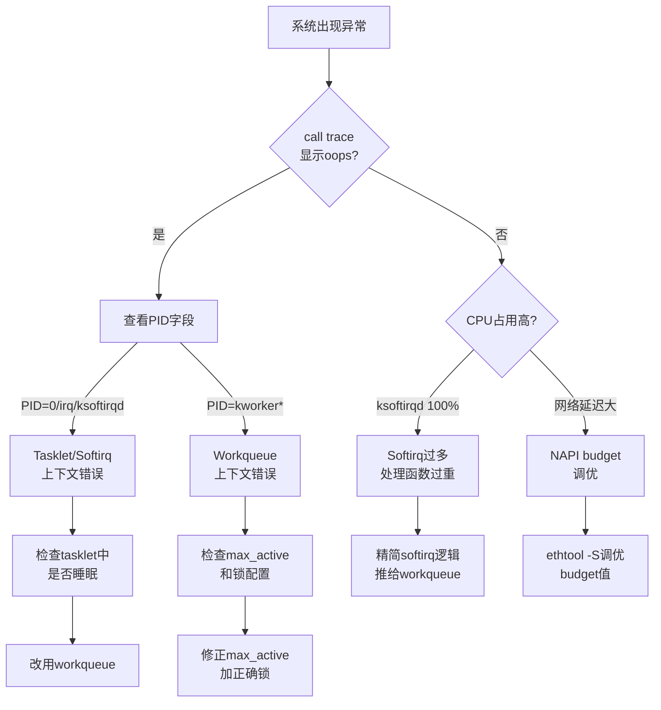

# 10.3.7 底半部常见错误与陷阱

> 所属章节：第10章 中断与时间 > 10.3 底半部机制
>
> 难度：[E] Expert | 预计阅读时间：15分钟

## <span class="blue"> 本节导读

tasklet、workqueue、NAPI……这些底半部机制选好了能提升性能，选错了或者配置不当却能让系统直接崩溃或挂死。本节不按常理出牌——先讲四种最经典的"作死"姿势，再教你用调试工具快速定位问题。<br>

读完本节，你会明白：**tasklet里睡觉为什么一定会oops？ksoftirqd吃掉100% CPU时该往哪看？NAPI budget到底调大还是调小？** 更重要的是，你会拿到一份调试工具速查手册，出了问题不慌。

## <span class="blue"> 四大经典陷阱 [E]

底半部机制看似简单，但几乎每个做过驱动的工程师都在这栽过跟头。来看看这四个"经典翻车现场"。

### 陷阱1：在tasklet里调用睡眠函数

Tasklet运行在**中断上下文**（更准确地说，是softirq上下文），这意味着它没有自己的进程栈，也不参与进程调度。你在这个上下文里调用 `msleep()`、`mutex_lock()` 或者任何可能导致调度的函数，内核会立刻给你颜色看——一个漂亮的oops。

> ⚠️ **陷阱**：Tasklet中调用 `msleep(10)`、`mutex_lock()`、`kmalloc(GFP_KERNEL)` 等可能睡眠的操作 → 触发内核oops，call trace显示 `BUG: scheduling while atomic`。

说白了，tasklet的执行环境跟硬中断底半部一样"没法被打断"。内核检测到你在原子上下文里试图让出CPU，直接panic给你看。<br>

**修正方法**：需要睡眠的操作？搬到workqueue里去。Workqueue运行在进程上下文，可以安心地sleep、lock、等待内存。

### 陷阱2：Softirq过多导致CPU饥饿

如果你把太多逻辑塞进softirq或者tasklet，或者网络流量爆炸导致NET_RX_SOFTIRQ疯狂触发，你会发现一个叫 `ksoftirqd` 的内核线程把某个CPU核心吃到100%。

> ⚠️ **陷阱**：Softirq/tasklet处理函数执行时间过长 → ksoftirqd占用100% CPU → 同CPU上的用户态进程得不到调度 → 系统"假死"。

这就是**softirq饥饿**。Softirq在同一个CPU上可以连续执行、抢占用户态进程，直到没有pending的softirq为止。如果你的网卡中断 storm 来临，softirq处理函数又做得太重，ksoftirqd就会霸占CPU不放。<br>

**修正方法**：在softirq里只做最小化处理，大部分工作推到workqueue或NAPI poll。遇到中断风暴时考虑开启中断亲和性分散负载。

### 陷阱3：Workqueue并发配置错误

`alloc_workqueue()` 的 `max_active` 参数决定了同一个workqueue上最多能并发执行多少个work item。你图省事设了个 `WQ_UNBOUND` + 超大 `max_active`，结果呢？

> ⚠️ **陷阱**：`max_active` 设置过大 → 多个worker并发访问共享资源 → 竞态条件、数据损坏。或者 `max_active=1` 本应串行，却用了 `WQ_UNBOUND` 导致在任意CPU上乱跑，破坏cache局部性。

打个比方，`max_active` 就像车间的工位数。工位太多，工人抢同一个工具；工位太少，活儿排队干不完。<br>

**修正方法**：需要串行执行就用 `alloc_ordered_workqueue()`；需要并发控制就设置合理的 `max_active`，并在work函数里用正确的锁保护共享数据。

### 陷阱4：NAPI Budget设置不合理

`netif_napi_add()` 的 `budget` 参数决定了每次poll回调最多处理多少个数据包。这是个微妙的平衡。

> ⚠️ **陷阱**：Budget太大 → 单次poll循环霸占CPU → 网络延迟抖动增大，其他软中断（比如定时器）被推迟。Budget太小 → 频繁进出poll，吞吐量上不去。

大多数驱动直接用内核默认值（比如64或256）。但在高吞吐场景（10G/25G/100G网卡）下，这个值需要根据实际流量调优。<br>

**修正方法**：结合 `ethtool -S` 观察NAPI统计，根据实际中断频率和包率调整budget。高吞吐场景可考虑增大budget并配合多队列NAPI（每个队列一个napi_struct）。

### 四个陷阱速查表

| 陷阱 | 典型表现 | 根因 | 修正方法 |
|------|---------|------|---------|
| Tasklet中睡眠 | `BUG: scheduling while atomic` oops | Tasklet运行在无进程上下文的softirq上下文 | 需睡眠的操作改用workqueue |
| Softirq过多 | `ksoftirqd` CPU占用100%，用户态卡顿 | Softirq连续执行且处理函数过重 | 精简softirq逻辑，剩余工作推给workqueue/NAPI |
| Workqueue并发过大 | 随机崩溃、竞态、数据不一致 | `max_active`过大，worker并发竞争 | 按需设置max_active，配合正确加锁 |
| NAPI budget不当 | 吞吐低或网络延迟抖动大 | Budget与流量模型不匹配 | 用ethtool观察统计，针对性调优 |

## <span class="blue"> 调试技巧：底半部问题定位 [E]

遇到底半部相关的问题，该往哪看？下面是一份实战验证过的工具清单。

### 调试工具速查表

| 工具/接口 | 用途 | 命令示例 | 关键字段 |
|-----------|------|---------|---------|
| `/proc/softirqs` | 查看各CPU的softirq计数分布 | `cat /proc/softirqs` | HI、TIMER、NET_RX、NET_TX各列数值 |
| `ps` + `grep` | 查看workqueue内核线程 | `ps aux | grep kworker` | kworker/uxx:yy（unbound）或 kworker/xx:yy（per-CPU） |
| `ethtool -S` | 查看网卡NAPI统计 | `ethtool -S eth0` | rx_packets、rx_napi_budget、napi_poll等 |
| `tracepoint` | 追踪workqueue执行事件 | 见下方示例 | workqueue_execute_start、workqueue_execute_end |

> 💡 **提示**：遇到oops先看call trace的最后一行和 `PID` 字段——如果PID显示为0（swapper）、一个irq号或者ksoftirqd，说明崩溃发生在中断/softirq上下文，大概率是底半部代码在搞事情。

### 底半部问题排查流程

遇到问题时按下面的流程走，能帮你快速定位是哪个底半部机制在"作妖"：



### Tracepoint追踪workqueue

内核的workqueue tracepoint可以精确追踪每个work item的执行过程，零开销（未启用时），线上环境也能用。

```bash
# 1. 查看可用的workqueue tracepoint
ls /sys/kernel/debug/tracing/events/workqueue/
# 输出：workqueue_execute_start  workqueue_execute_end  ...

# 2. 启用workqueue追踪
echo 1 > /sys/kernel/debug/tracing/events/workqueue/enable

# 3. 抓取trace（-C参数持续输出新内容）
cat /sys/kernel/debug/tracing/trace_pipe | grep workqueue

# 4. 示例输出解读：
# kworker/0:2-125   [000] ....   123.456: workqueue_execute_start: work struct 0xffff888123456789: function my_driver_work_handler
# kworker/0:2-125   [000] ....   123.789: workqueue_execute_end: work struct 0xffff888123456789

# 5. 用完记得关闭
echo 0 > /sys/kernel/debug/tracing/events/workqueue/enable
```

从trace输出中，你能直接看到：**哪个work函数**（`function` 字段）、**在哪个CPU**（中括号里的 `[000]`）、**哪个kworker线程**（`kworker/0:2-125`）执行的，以及执行了多长时间（两个时间戳之差）。<br>

如果某个work函数执行时间特别长（比如几十毫秒），恭喜你，这就是softirq饥饿或者系统卡顿的元凶之一。

```bash
# 进阶：只追踪特定work函数（用ftrace filter）
echo 'my_driver_work_handler' > /sys/kernel/debug/tracing/set_ftrace_filter
echo function > /sys/kernel/debug/tracing/current_tracer
cat /sys/kernel/debug/tracing/trace_pipe
```

## <span class="blue"> 本节总结

| 要点 | 核心 takeaway |
|------|--------------|
| Tasklet禁忌 | 绝对不能睡眠/调度，只能做原子操作 |
| Softirq负载 | 过重会触发ksoftirqd CPU饥饿，保持轻量 |
| Workqueue并发 | `max_active`不是越大越好，按需配置+加锁 |
| NAPI budget | 太大延迟抖动，太小吞吐不足，需实测调优 |
| 调试三板斧 | `/proc/softirqs` 看分布 → `ps` 看kworker → `tracepoint` 看执行细节 |

底半部机制的设计哲学是"各司其职"：softirq/tasklet做最轻量的快速响应，workqueue做允许睡眠的后续处理，NAPI在高效收包和CPU公平之间找平衡。违反这个哲学的代价，轻则性能下降，重则系统崩溃。

## <span class="blue"> 下一步

**10.4.1 为什么需要线程化中断** —— 传统的中断处理（top half + bottom half）在高并发场景下仍有局限。线程化中断（threaded IRQ）把中断处理函数放到进程上下文执行，彻底解决了"中断上下文不能睡眠"的束缚。下一节我们看看它是怎么工作的，以及RT-PREEMPT补丁为什么离不开它。

## <span class="blue"> 配套资源

| 资源 | 路径/命令 | 说明 |
|------|----------|------|
| 代码清单 | `trace-cmd record -e workqueue:*` | 使用trace-cmd更便捷的追踪方式 |
| 参考文档 | `Documentation/core-api/workqueue.rst` | 内核workqueue官方文档 |
| 内核源码 | `kernel/workqueue.c` | Workqueue核心实现 |
| 内核源码 | `kernel/softirq.c` | Softirq调度逻辑，含ksoftirqd |
| 速查命令 | `watch -n1 cat /proc/softirqs` | 实时监控softirq分布 |
