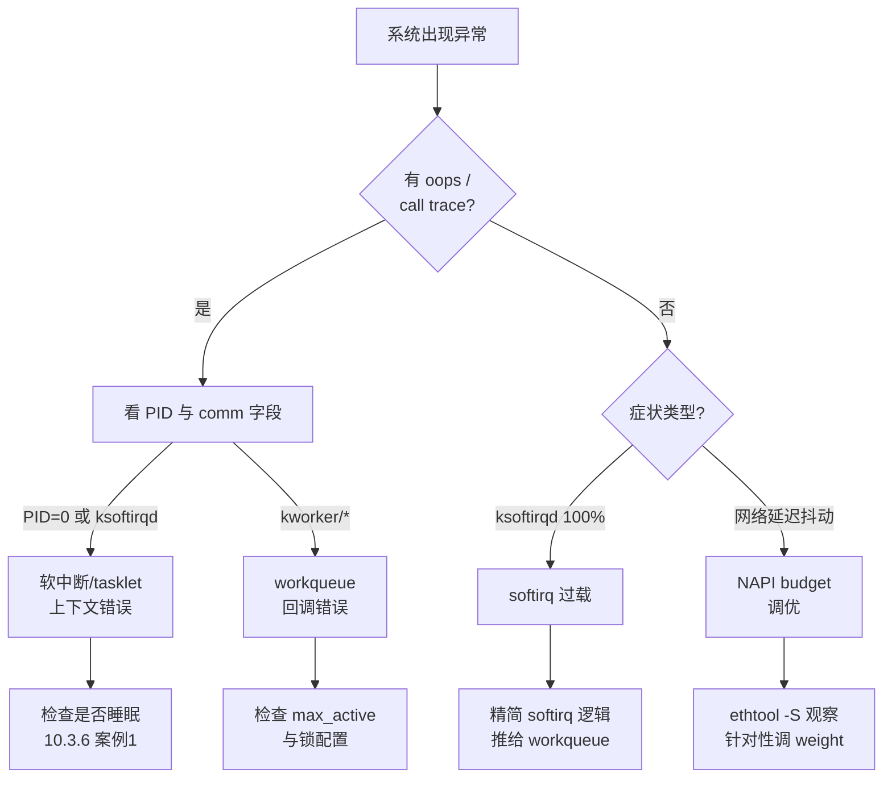

# 10.3.7 底半部常见错误与陷阱

> 所属章节：第10章 中断与时间 > 10.3 底半部机制
>
> 难度：[E] | 预计阅读时间：15分钟

## <span class="blue"> 本节导读

底半部机制选对了只是第一步，用错了照样出问题。本节覆盖：四类最高发的底半部使用错误——tasklet 里睡眠、softirq 过载、workqueue 并发配置失误、NAPI budget 失调，以及一套对应的定位工具和排查流程。

## <span class="blue"> 四大经典陷阱 [E]

### 陷阱1：在tasklet里调用睡眠函数

tasklet 运行在软中断上下文：没有自己的进程栈，不参与进程调度。在这个上下文里调用 `msleep()`、`mutex_lock()`、`kmalloc(GFP_KERNEL)` 等任何可能睡眠的函数，内核立刻报 `BUG: scheduling while atomic`，随后系统状态不再可信。

完整的错误代码示例与根因分析见 10.3.6 案例1，这里只强调修正原则：**需要睡眠的操作，搬到 workqueue 或 threaded IRQ**。这两个机制运行在进程上下文，睡眠、拿 mutex、等待硬件都是合法操作。

### 陷阱2：softirq过载导致CPU饥饿

网络流量暴增导致 NET_RX_SOFTIRQ 被疯狂触发，或者往 softirq/tasklet 里塞了过重的逻辑，典型症状是 `ksoftirqd` 线程把某个 CPU 吃到 100%，该核上的用户进程明显卡顿。

> ⚠️ 注意机制细节：`__do_softirq()` 本身有防霸占限制——单次执行超过 2ms（`MAX_SOFTIRQ_TIME`）或循环超过 10 次（`MAX_SOFTIRQ_RESTART`），就把剩余的 softirq 踢给 ksoftirqd（见 10.3.2）。所以"ksoftirqd 占 100%"恰恰是保护机制生效后的现象：说明 softirq 的产生速度持续超过消化速度，问题出在源头负载或处理逻辑上，而不是 ksoftirqd 本身。

**修正方法**：softirq 处理函数只做最小化处理，重活推给 workqueue；网络场景确认 NAPI 生效；用中断亲和性（10.1.5）把中断负载分摊到多个 CPU。

### 陷阱3：workqueue并发配置错误

`alloc_workqueue()` 的 `max_active` 限制的是同一 pool 上这个 workqueue 最多并发执行几个 work（默认 256，上限 512，见 10.3.4）。配置失误有两个方向：

> ⚠️ `max_active` 设得过大：多个 work 并发执行，如果回调里访问共享数据而没有锁保护，就是竞态和数据损坏。另一个方向：`max_active=1` 只能保证同一时刻一个 work 在跑，如果业务还要求"后提交的 work 看到先提交的 work 的结果"，必须用 `alloc_ordered_workqueue()`——它在 `max_active=1` 之上还保证严格的 FIFO 提交顺序。

**修正方法**：需要严格顺序用 `alloc_ordered_workqueue()`；需要并发就设合理的 `max_active`，并在回调里用锁保护共享数据。

### 陷阱4：NAPI budget设置不合理

`netif_napi_add()` 的 weight 决定单轮 poll 最多处理多少个包，默认 64（`NAPI_POLL_WEIGHT`）。

> ⚠️ weight 太大：单轮 poll 长时间占 CPU，同 CPU 上其他 softirq（如 TIMER）被推迟，网络延迟抖动增大。weight 太小：批处理收益不足，频繁进出 poll，吞吐上不去。大多数驱动直接用默认值 64；10G 以上网卡结合多队列（每个 RX 队列一个独立 NAPI 实例）比单纯调大 weight 更有效。

**修正方法**：用 `ethtool -S` 观察驱动统计字段（丢包、ring 满等计数，字段名因驱动而异），结合实际包率决定是否调整，并配合 10.3.5 的 coalescing 实验方法验证。

### 四个陷阱速查表

| 陷阱 | 典型表现 | 根因 | 修正方法 |
|------|---------|------|---------|
| tasklet 中睡眠 | `BUG: scheduling while atomic` | 软中断上下文无进程实体，不能调度 | 改用 workqueue / threaded IRQ |
| softirq 过载 | ksoftirqd 占 100% CPU，用户态卡顿 | softirq 产生速度持续超过消化速度 | 精简 softirq 逻辑，负载分流 |
| workqueue 并发失误 | 竞态、数据不一致，或顺序错乱 | max_active 与业务并发模型不匹配 | 按需设 max_active / 用 ordered wq |
| NAPI budget 不当 | 吞吐低或延迟抖动大 | weight 与流量模型不匹配 | ethtool 观察统计后针对性调优 |

## <span class="blue"> 调试技巧：底半部问题定位 [E]

### 调试工具速查表

| 工具/接口 | 用途 | 命令示例 | 关键信息 |
|-----------|------|---------|---------|
| `/proc/softirqs` | 各 CPU 的 softirq 计数分布 | `cat /proc/softirqs` | HI、TIMER、NET_RX、NET_TX 各列 |
| `ps` + `grep` | 查看 workqueue 内核线程 | `ps aux \| grep kworker` | kworker/uX:Y（unbound）、kworker/X:Y（per-CPU） |
| `ethtool -S` | 网卡驱动统计 | `ethtool -S eth0` | 丢包、ring 满等计数（字段因驱动而异） |
| tracepoint | 追踪 workqueue 执行事件 | 见下方示例 | workqueue_execute_start/end |

> 💡 分析 oops 日志先看 `PID` 和 `comm` 字段：PID 为 0（swapper）或 comm 显示 ksoftirqd，说明崩溃发生在中断/软中断上下文，优先怀疑底半部代码。

### 底半部问题排查流程



### 用tracepoint追踪workqueue

内核为 workqueue 提供了静态 tracepoint，未启用时开销接近零，线上环境可用：

```bash
# 1. 查看可用的 workqueue tracepoint
ls /sys/kernel/debug/tracing/events/workqueue/
# 输出：workqueue_activate_work  workqueue_execute_start
#       workqueue_execute_end    workqueue_queue_work

# 2. 启用
echo 1 > /sys/kernel/debug/tracing/events/workqueue/enable

# 3. 实时抓取
cat /sys/kernel/debug/tracing/trace_pipe | grep workqueue

# 4. 用完关闭
echo 0 > /sys/kernel/debug/tracing/events/workqueue/enable
```

输出形如：

```
kworker/0:2-125 [000] .... 123.456: workqueue_execute_start: work struct 0xffff888123456789: function my_driver_work_handler
kworker/0:2-125 [000] .... 123.789: workqueue_execute_end: work struct 0xffff888123456789
```

从输出能直接读出：**哪个 work 函数**（function 字段）、**在哪个 CPU**（`[000]`）、**哪个 kworker 线程**（`kworker/0:2-125`），以及执行时长（两个事件的时间戳之差）。某个 work 函数执行几十毫秒，就是卡顿的直接嫌疑对象。

也可以用 trace-cmd 获得更友好的记录与回放：

```bash
trace-cmd record -e workqueue:*
trace-cmd report
```

## <span class="blue"> 本节总结

| 要点 | 核心结论 |
|------|----------|
| tasklet 禁忌 | 软中断上下文绝对不能睡眠，只能做原子操作 |
| softirq 过载 | ksoftirqd 占满 CPU 是结果不是原因，从源头减负 |
| workqueue 并发 | max_active 按业务并发模型配置，顺序要求用 ordered wq |
| NAPI budget | weight 太大延迟抖动、太小吞吐不足，实测调优 |
| 调试路径 | `/proc/softirqs` 看分布 → `ps` 看 kworker → tracepoint 看执行细节 |

底半部机制的设计原则是各司其职：softirq/tasklet 做最轻量的快速响应，workqueue 承接允许睡眠的后续处理，NAPI 在收包效率和 CPU 公平之间取得平衡。违反这个分工的代价，轻则性能下降，重则系统崩溃。

## <span class="blue"> 下一步

**10.4.1 为什么需要线程化中断** —— 顶半部 + 底半部的经典分工仍有局限：底半部里的 softirq/tasklet 依然不能睡眠，workqueue 的调度延迟又不可控。线程化中断（threaded IRQ）给每个中断配一个专属内核线程，在进程上下文里完成主要处理。下一节看它的工作原理，以及 PREEMPT_RT 为什么把它作为基石。

## <span class="blue"> 配套资源

| 资源 | 路径/命令 | 说明 |
|------|----------|------|
| 追踪工具 | `trace-cmd record -e workqueue:*` | workqueue 事件记录与回放 |
| 参考文档 | `Documentation/core-api/workqueue.rst` | 内核 workqueue 官方文档 |
| 内核源码 | `kernel/workqueue.c` | workqueue 核心实现 |
| 内核源码 | `kernel/softirq.c` | softirq 调度与 ksoftirqd |
| 速查命令 | `watch -n1 cat /proc/softirqs` | 实时监控 softirq 分布 |
