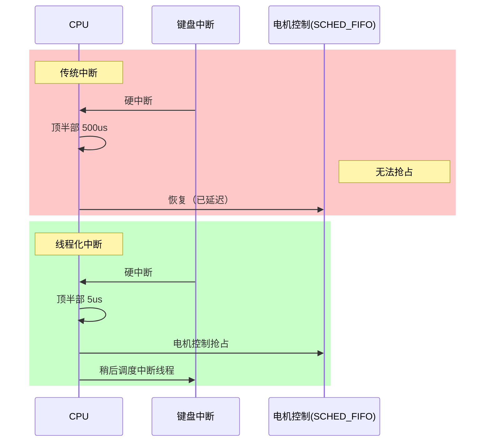

你手里有个工业控制项目。电机控制算法跑在SCHED_FIFO任务里，周期1毫秒。某天测试同事跑过来说："电机偶尔抖一下，周期不稳。"你上ftrace一抓，发现USB键盘来一个中断，顶半部折腾了500多微秒，你的电机控制任务就在那干瞪眼，调度器一点办法都没有。

这就是传统中断模型最让人头疼的地方。**中断上下文里，CPU优先级比任何任务都高。** 哪怕你的SCHED_FIFO实时任务优先级已经拉到最高，中断一来照样让路。更难受的是，中断handler里不能调用会睡眠的函数，不能做太多事——但"太多"的尺度是多少？几十微秒？在工业控制场景里，几十微秒都可能要命。

**知识点98 [I]**

问题的根源在于：中断处理跑在一个特殊上下文里，这个上下文"凌驾于"调度器之上。调度器只能管理线程（task_struct），而中断handler不是线程，没有优先级属性。那能不能把中断handler也变成线程？这就是线程化中断的核心动机。

如果中断的实际处理逻辑跑在线程上下文里，那它就是一个普通的内核线程，调度器可以对它进行完整的优先级管理。USB键盘中断的处理线程优先级设低一点，电机控制任务设高一点，键盘中断自然就不会抢CPU了。PREEMPT_RT补丁解决实时性问题，走的正是这条路。

```c
/* 传统方式：handler跑在中断上下文 */
request_irq(irq, my_handler, flags, "dev", dev);

/* 线程化方式：thread_fn跑在内核线程 */
request_threaded_irq(irq, handler, thread_fn, flags, name, dev);
```

`request_threaded_irq()` 把中断处理拆成两半：`handler`是硬中断顶半部，只干最少的事；`thread_fn`才是真正的处理逻辑，跑在线程里。传NULL给handler，内核会提供默认顶半部，直接唤醒线程。



时序图上很清楚：传统模型里500微秒是调度器插不进手的"死区"；线程化后，顶半部只花几微秒唤醒一下，实时任务立刻抢占。

| 特性 | 传统handler | 线程化thread_fn |
|------|-----------|---------------|
| 运行上下文 | 硬中断上下文 | 内核线程 |
| 可被调度器抢占 | ❌ 否 | ✅ 是 |
| 有优先级 | ❌ 无 | ✅ 可设置 |
| 可睡眠 | ❌ 不可 | ✅ 可以 |
| 切换开销 | 无 | 有 |

**知识点99 [I]**

把尽可能多的中断处理移到线程上下文，这是PREEMPT_RT的核心思想之一。PREEMPT_RT的目标是让Linux成为硬实时系统，关键改动之一就是把中断纳入调度器管理——本质上是把中断handler转成内核线程，每个中断源对应一个`irq/XX-NAME`形式的线程。

硬中断本身能消灭吗？不能完全消灭。外部中断信号来了CPU必须响应，这是硬件机制决定的。但响应之后干什么，是我们说了算的。顶半部只干三件事：记录中断、清除标志、唤醒线程。剩下的全部交给线程。

> ⚠️ **陷阱**：线程化增加了一次上下文切换，顶半部到线程之间有延迟。中断频率极高且每次处理极短的场景，切换开销可能得不偿失。

PREEMPT_RT把这条思路贯彻得很彻底——软中断也线程化了，spinlock改成可睡眠的mutex。主线很清晰：**凡是可能长时间霸占CPU、阻塞高优先级任务的逻辑，都应该让调度器来管理。**
