# 10.4.1 为什么需要线程化中断

> 所属章节：第10章 中断与时间 > 10.4 线程化中断与 PREEMPT_RT
>
> 难度：[I] 中级 | 预计阅读时间：12分钟

## <span class="blue"> 本节导读

你有没有想过——一个USB键盘的中断处理，居然能让你的实时视频采集任务"卡"半毫秒？<br>
本节带你从一个真实的延迟暴增案例出发，理解传统中断模型的根本缺陷，搞清楚为什么 Linux 社区要把中断处理"搬"到线程上下文里运行。<br>
学完后，你会明白 PREEMPT_RT 的核心设计哲学：**内核中几乎所有执行路径，都应该能被更高优先级的任务抢占**。

---

## <span class="blue"> 实时性瓶颈：高优先级任务被中断"绑架" [I]

想象一下这个场景。你的嵌入式设备上跑着一个**视频采集任务**，为了严格按时取帧，你小心翼翼地给它设了 `SCHED_FIFO` 策略、优先级 80——这应该比绝大多数任务都高了吧？<br>

结果某天接了个USB设备，你的视频采集周期突然**抖动到 500us 以上**。帧率不稳，画面撕裂，客户投诉。

你打开 `trace-cmd` 一看，罪魁祸首清清楚楚：

```
#  irq/18-usb_hcd  500.2 us  [==========]  usb_hcd_irq()
#  video-capture    delayed 500us+  (SCHED_FIFO, prio=80)
```

USB 主机控制器的中断处理函数 `usb_hcd_irq()` 硬生生执行了 500 微秒。在这段时间里，你的 `SCHED_FIFO` 任务只能干瞪眼——**中断上下文优先级高于所有进程，调度器根本插不进去**。

这就是传统中断模型的死穴：**中断处理跑在硬件中断上下文，默认具有"绝对优先"，任何进程都无法抢占它**。

```
优先级层级（传统模型）：

  硬件中断上下文  ────────── 最高，不可抢占
        ↑
  软中断 / tasklet  ───────── 次高，不可抢占（同CPU上）
        ↑
  SCHED_FIFO 进程  ────────── 用户态最高调度类
        ↑
  SCHED_OTHER 进程  ───────── 普通进程
```

说白了，你的视频采集任务虽然在进程里"称王"，但中断一来，它就得靠边站。中断处理多久，它就得等多久。

### 线程化思想：把中断变成可调度的实体

既然问题是中断上下文"凌驾"于调度器之上，那解法也呼之欲出——**把中断处理函数搬到线程上下文里执行**。<br>

一旦中断处理变成内核线程，它就有了这些属性：

- 可以被 `SCHED_FIFO` 任务抢占
- 可以单独设置优先级（通过 `irq/N-name` 线程的 nice/RT 优先级）
- 可以参与调度器的负载均衡和亲和性管理
- 可以被 `cpuset`、`cgroup` 等资源管理机制约束

**PREEMPT_RT 补丁的核心思想正是这个：把内核中几乎所有不可抢占的执行路径，都改造成可抢占的**。不止中断线程化，还包括：

- 软中断（softirq）线程化
- 自旋锁变成可抢占的睡眠锁（rt_mutex）
- 中断处理程序线程化

> 💡 **提示**：PREEMPT_RT = 内核中几乎所有路径都可抢占<br>
> PREEMPT_RT（Real-Time Linux）不是一个独立的操作系统，而是一组补丁，目标是让标准 Linux 内核具备硬实时能力。它的核心哲学简单粗暴：**如果一段代码可以睡眠，就应该允许被抢占**。

### 传统中断 vs 线程化中断的调度对比

```mermaid
%%{init: {'theme': 'base', 'themeVariables': {'primaryColor': '#e8f4f8', 'primaryTextColor': '#2c3e50', 'primaryBorderColor': '#3498db', 'lineColor': '#7f8c8d', 'secondaryColor': '#f0f9ff', 'tertiaryColor': '#fff5e6'}}}%%
gantt
    title 传统中断模型 —— 高优先级任务被阻塞
    dateFormat X
    axisFormat %s

    section CPU时间线
    USB中断处理 (500us)   :a1, 0, 500
    视频采集(SCHED_FIFO/80) :crit, a2, 500, 900

    section 问题
    实时任务被阻塞500us   :milestone, m1, 500, 0
```




上面两张图对比一目了然：传统模型下，USB 中断一口吃掉 500us，视频采集全程阻塞；线程化模型下，顶半部只花 10us 响应硬件，然后**主动让出 CPU**，让 `SCHED_FIFO/80` 的视频采集先跑完，USB 中断线程（优先级设得较低）稍后继续执行。

### 与底半部的本质区别

你可能想：这不是和 tasklet/workqueue 底半部差不多吗？区别大了。

| 维度 | 传统底半部（tasklet/workqueue） | 线程化中断（threaded IRQ） |
|:---:|:---:|:---:|
| **执行上下文** | tasklet 在软中断上下文；workqueue 在进程上下文 | 完整的内核线程（`irq/N-name`） |
| **优先级可调** | ❌ 不可调（tasklet优先级固定；workqueue按普通进程） | ✅ 可设 RT 优先级，如 `SCHED_FIFO/50` |
| **顶半部阻塞** | 顶半部仍在硬中断上下文，仍不可抢占 | 顶半部只做最小响应（关中断源），立刻唤醒线程 |
| **抢占性** | tasklet 不可抢占；workqueue可被进程抢占 | 作为线程可被更高优先级任务抢占 |
| **完整线程化** | 仅底半部拆出，顶半部仍是"硬"的 | 整个中断处理在线程中完成 |

<br>

**threaded IRQ 是"完整"的线程化，不只是把底半部拆出来**。顶半部（硬中断 handler）只负责最关键的两件事：确认中断源、关闭该中断线（或 mask），然后立刻唤醒中断线程。真正的处理逻辑全在线程里跑，受调度器管辖。

> ⚠️ **陷阱**：不是所有中断都适合线程化<br>
> 超高频中断（如网络包每秒百万级、GPIO 翻转在 MHz 级别）线程化后，上下文切换开销可能反而拖垮性能。这类场景下，线程化的收益抵不过切换代价，建议保持传统模式或只在 PREEMPT_RT 强制要求下启用。

---

## <span class="blue"> 本节总结

| 要点 | 内容 |
|:---:|:---|
| **核心问题** | 传统中断上下文优先级高于所有进程，导致高优先级实时任务被长时间阻塞 |
| **典型案例** | USB 中断处理 500us → SCHED_FIFO 视频采集任务延迟暴增 |
| **解决思路** | 将中断处理搬到线程上下文，使其受调度器管理、可被更高优先级任务抢占 |
| **关键区别** | threaded IRQ 是整个中断处理的线程化，不只是底半部拆分 |
| **PREEMPT_RT 思想** | 内核中几乎所有路径都应可抢占，包括中断、软中断、锁原语 |
| **适用边界** | 超高频中断不适合线程化（上下文切换开销过高） |

---

## <span class="blue"> 下一步

明白了"为什么"之后，下一节（10.4.2）我们来看看"怎么做"——**`request_threaded_irq()` 的机制与代码路径**。你会从内核源码层面搞清楚：顶半部和线程是怎么衔接的，`irq/N-name` 线程又是什么时候创建的。

---

## <span class="blue"> 配套资源

| 资源类型 | 名称 | 说明 |
|:---:|:---:|:---|
| 📁 内核源码 | `kernel/irq/manage.c` | `request_threaded_irq()` 实现，中断线程创建逻辑 |
| 📁 内核源码 | `kernel/irq/thread.c` | 中断线程的核心调度与唤醒路径 |
| 📁 追踪工具 | `trace-cmd` + `irqsoff` tracer | 测量中断关闭时长和延迟抖动 |
| 📁 实时补丁 | `PREEMPT_RT` (linux-rt) | 主线内核 6.x 已逐步合入 RT 补丁 |
| 📋 验证命令 | `ps -eo pid,comm,rtprio | grep irq/` | 查看系统中中断线程的 RT 优先级 |

---

> 🔴 **危险**：在 PREEMPT_RT 系统上，如果你用 `local_irq_disable()` 粗暴关中断，会被替换为可抢占的锁语义。但混用 RT 内核和传统驱动代码时，假设"关中断 = 绝对原子性"的代码可能引入竞态。迁移到 RT 内核需要全面审计驱动的同步原语。
