# 10.4.1 为什么需要线程化中断

> 所属章节：第10章 中断与时间 > 10.4 线程化中断
>
> 难度：[I] | 预计阅读时间：12分钟

## <span class="blue"> 本节导读

一个 USB 键盘的中断处理，能让实时视频采集任务的周期抖动半毫秒——这不是硬件故障，是传统中断模型的结构性缺陷。<br>
本节覆盖：从一个延迟暴增的真实案例出发，剖析传统中断模型中"中断上下文优先级高于一切进程"的根本问题，引出线程化中断的设计思想，以及 PREEMPT_RT 围绕它建立的核心哲学：**内核中几乎所有执行路径，都应该能被更高优先级的任务抢占**。

---

## <span class="blue"> 实时性瓶颈：高优先级任务被中断压制 [I]

设想这个场景：嵌入式设备上跑着一个**视频采集任务**，为了严格按时取帧，设置了 `SCHED_FIFO` 策略、优先级 80——高于绝大多数任务。

某天接了一个 USB 设备，视频采集周期突然**抖动到 500μs 以上**，帧率不稳。

用 `trace-cmd` 抓到的现场：

```
#  irq/18-usb_hcd  500.2 us  [==========]  usb_hcd_irq()
#  video-capture    delayed 500us+  (SCHED_FIFO, prio=80)
```

USB 主机控制器的中断处理函数 `usb_hcd_irq()` 一次执行了 500μs。在这段时间里，`SCHED_FIFO` 任务只能等待——**中断上下文优先级高于所有进程，调度器无法介入**。

这就是传统中断模型的结构性问题：**中断处理运行在硬件中断上下文，具有绝对优先级，任何进程都无法抢占它**。

```
优先级层级（传统模型）：

  硬件中断上下文  ────────── 最高，不可抢占
        ↑
  软中断 / tasklet  ───────── 次高，不可抢占（同CPU上）
        ↑
  SCHED_FIFO 进程  ────────── 用户态最高调度类
        ↑
  SCHED_OTHER 进程  ───────── 普通进程
```

视频采集任务在进程世界里优先级再高，中断一来也只能等。中断处理多久，它就等多久。

### 线程化思想：把中断变成可调度的实体

问题的根源是中断上下文"凌驾"于调度器之上，解法就是把中断处理搬到线程上下文执行。一旦中断处理变成内核线程，它就获得这些属性：

- 可以被 `SCHED_FIFO` 任务抢占
- 可以单独设置优先级（`irq/N-name` 线程的调度策略与优先级）
- 可以参与调度器的负载均衡和亲和性管理
- 可以被 cpuset、cgroup 等资源管理机制约束

**PREEMPT_RT 的核心思想正是这个：把内核中几乎所有不可抢占的执行路径，改造成可抢占的**。除中断线程化外，还包括：

- 软中断线程化
- 自旋锁替换为可睡眠的 rt_mutex（带优先级继承）
- 高精度定时器到期处理线程化

> 💡 PREEMPT_RT 不是一个独立的操作系统，而是一组针对主线内核的实时化改造（6.12 起已完整合入主线）。它的判断标准很直接：如果一段代码可以睡眠，就应该允许被抢占。

### 传统中断 vs 线程化中断的调度对比

```mermaid
%%{init: {'theme': 'base', 'themeVariables': {'primaryColor': '#e8f4f8', 'primaryTextColor': '#2c3e50', 'primaryBorderColor': '#3498db', 'lineColor': '#7f8c8d', 'secondaryColor': '#f0f9ff', 'tertiaryColor': '#fff5e6'}}}%%
gantt
    title 传统中断模型 —— 高优先级任务被阻塞
    dateFormat X
    axisFormat %s

    section CPU时间线
    USB中断处理 (500us)   :a1, 0, 500
    视频采集(SCHED_FIFO/80) :crit, a2, 500, 900

    section 问题
    实时任务被阻塞500us   :milestone, m1, 500, 0
```




两张图的对比很直观：传统模型下，USB 中断一次吃掉 500μs，视频采集全程被阻塞；线程化模型下，顶半部只花 10μs 响应硬件，然后让出 CPU，`SCHED_FIFO/80` 的视频采集先执行完，优先级较低的 USB 中断线程随后继续。

### 与底半部的本质区别

看起来和 tasklet/workqueue 的底半部思路相似，但有本质区别：

| 维度 | 传统底半部（tasklet/workqueue） | 线程化中断（threaded IRQ） |
|:---:|:---:|:---:|
| 执行上下文 | tasklet 在软中断上下文；workqueue 在进程上下文 | 专属内核线程（`irq/N-name`） |
| 优先级可调 | 不可调（tasklet 固定；workqueue 随系统 wq） | 可设 RT 优先级，如 `SCHED_FIFO/50` |
| 顶半部行为 | 顶半部仍在硬中断上下文，仍不可抢占 | 顶半部只做最小响应（确认并屏蔽中断源），立刻唤醒线程 |
| 抢占性 | tasklet 不可抢占；workqueue 可被抢占 | 作为线程可被更高优先级任务抢占 |
| 线程化范围 | 仅底半部拆出，顶半部仍是硬中断 | 主要处理全部在线程中完成 |

**threaded IRQ 的要点是整个中断处理主体的线程化，不只是底半部拆分**。顶半部只负责确认中断源、屏蔽该中断线，然后立刻唤醒中断线程；真正的处理逻辑全在线程里执行，受调度器管辖。

> ⚠️ 线程化不是无代价的——多一次线程唤醒和上下文切换，超高频中断场景下开销可能超过收益。完整的适用边界分析见 10.4.3。

---

## <span class="blue"> 本节总结

| 要点 | 内容 |
|:---:|:---|
| 核心问题 | 传统中断上下文优先级高于所有进程，高优先级实时任务被长时间阻塞 |
| 典型案例 | USB 中断处理 500μs → SCHED_FIFO 视频采集任务延迟暴增 |
| 解决思路 | 中断处理搬到线程上下文，受调度器管理、可被更高优先级任务抢占 |
| 关键区别 | threaded IRQ 是处理主体的完整线程化，不只是底半部拆分 |
| PREEMPT_RT 思想 | 内核中几乎所有路径都应可抢占：中断、软中断、锁、定时器 |
| 适用边界 | 超高频中断不适合线程化（详见 10.4.3） |

---

## <span class="blue"> 下一步

明确了"为什么"，下一节（10.4.2）看"怎么做"——**`request_threaded_irq()` 的机制与代码路径**：顶半部和线程怎么衔接、`irq/N-name` 线程何时创建、默认优先级从哪来。

---

## <span class="blue"> 配套资源

| 资源类型 | 名称 | 说明 |
|:---:|:---:|:---|
| 内核源码 | `kernel/irq/manage.c` | `request_threaded_irq()` 实现、中断线程创建 |
| 内核源码 | `kernel/sched/core.c` | `sched_set_fifo()`——中断线程默认优先级出处 |
| 追踪工具 | `trace-cmd` + `irqsoff` tracer | 测量中断关闭时长和延迟抖动 |
| 实时补丁 | PREEMPT_RT | 6.12 起完整合入主线，`CONFIG_PREEMPT_RT` 启用 |
| 验证命令 | `ps -eo pid,comm,rtprio \| grep irq/` | 查看中断线程的 RT 优先级 |

---

> 🔴 迁移到 PREEMPT_RT 内核时，需要审计驱动的同步原语假设。RT 把普通 `spinlock_t` 替换为可睡眠的 rt_mutex，"持锁期间不会发生调度"这一类隐含假设不再成立；依赖该假设的代码在 RT 上可能出现真正的并发执行。注意 `local_irq_disable()` 本身不受影响——它依然是真实关闭本地中断。
