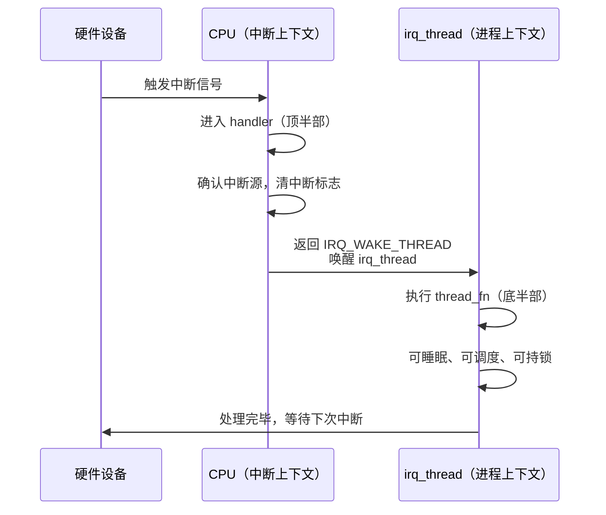

传统 `request_irq()` 有一个让人头疼的矛盾：中断上下文里不能睡眠、不能调度，但偏偏有些中断处理逻辑又特别重——要访问慢速外设、要跟用户态交互，甚至还会触发 `mutex_lock()`。你硬要把这些东西塞进顶半部，轻则系统卡顿，重则触发 `BUG: scheduling while atomic`，整机会当场 panic。

Linux 内核对这个问题给出的答案是**线程化中断（threaded IRQ）**，核心入口就是 `request_threaded_irq()`。这个机制最早在 2.6.30 左右合入主线，目的很明确：把中断处理拆成两个阶段，让"快速响应"和"耗时处理"各回各家。

**知识点 100 [E][M] `request_threaded_irq()` 的两阶段模型**

这个接口的函数签名乍一看跟 `request_irq()` 很像，但仔细看会多出一个参数：

```c
/* kernel/irq/manage.c */
int request_threaded_irq(unsigned int irq,
                         irq_handler_t handler,      /* 顶半部，hardirq handler */
                         irq_handler_t thread_fn,    /* 线程化底半部 */
                         unsigned long flags,
                         const char *name, void *dev);
```

多出来的 `thread_fn` 就是整个机制的灵魂。它的工作方式可以概括成一句话：**顶半部快速"签收"中断，真正的体力活交给一个专门的内核线程去干**。

具体流程是这样的。当中断信号到达时，CPU 先执行注册的 `handler`（顶半部）。这个 handler 的职责极其单纯——确认中断源、读一下关键寄存器、做最紧急的硬件清操作，然后返回一个特殊值 `IRQ_WAKE_THREAD`。`kernel/irq/manage.c` 里的 `irq_thread()` 收到这个信号后，会把 `thread_fn` 投入执行。由于 `thread_fn` 跑在进程上下文里，它可以睡眠、可以调度、可以持有互斥锁，甚至可以跟用户态做比较重的交互，完全不用顾忌中断上下文的那一堆限制。

用一幅时序图来看会更清楚：



这里有几个关键点需要留意。

第一，`handler` 本身是可以为 `NULL` 的。如果你不指定顶半部函数，内核会用一个默认的 do-nothing handler，它只做一件事——返回 `IRQ_WAKE_THREAD`，把全部工作都交给 `thread_fn`。这种模式下，中断处理的起点就是线程上下文，完全没有顶半部的概念。有些驱动开发者在把老代码迁移到线程化中断时喜欢这么做：先把整个 handler 原封不动地丢进 `thread_fn` 里跑起来，验证没问题了，再慢慢拆分出真正的顶半部逻辑。

第二，`irq_thread` 并不是每次中断都临时创建的。在 `request_threaded_irq()` 注册阶段，内核就会通过 `kthread_create()` 把对应的线程创建好并挂起，后续同一个中断源一直复用这个线程。中断来了就唤醒，处理完就再次睡眠等待。这样做的好处是避免了频繁创建和销毁线程的开销，同一个中断源的请求天然是串行处理的，不需要额外的同步机制。

第三，也是最容易踩坑的一点：`thread_fn` 和传统的 `tasklet`、`workqueue` 看起来有点像，但本质不同。`irq_thread` 跟中断源是一一绑定的，内核会在 `thread_fn` 返回前自动帮你屏蔽同类型的中断，避免了重入问题。而 workqueue 就不做这个保证——如果你的 work 还没处理完，新的中断又触发了一次 workqueue 提交，那就会并发执行，锁和同步都得自己来。

代码路径上，整个机制的核心在 `kernel/irq/manage.c` 里。`request_threaded_irq()` 最终会调用到 `__setup_irq()`，在那里完成 `irqaction` 结构体的组装和线程的创建。中断到来时，`handle_irq_event()` 先执行顶半部 `handler`，根据返回值决定下一步：

| handler 返回值 | 含义 | 后续行为 |
|-------------|------|---------|
| `IRQ_WAKE_THREAD` | 唤醒线程处理底半部 | `wake_up_process(irq_thread)` |
| `IRQ_HANDLED` | 已处理，无需底半部 | 直接结束，不唤醒线程 |
| `IRQ_NONE` | 不是本设备的中断 | 通常忽略，可用于共享中断排查 |

如果 `handler` 返回 `IRQ_WAKE_THREAD`，`irq_thread()` 被唤醒后在它的主循环里调用你的 `thread_fn`，等 `thread_fn` 返回后再进入睡眠，等待下一次中断到来。整个循环一直持续到驱动调用 `free_irq()` 注销中断为止。

**知识点 101 [E] 不传 `thread_fn` 时的退化行为**

如果调用 `request_threaded_irq()` 时把 `thread_fn` 填成 `NULL`，会发生什么呢？

答案是：它会**完全退化成 `request_irq()` 的行为**。内核检测到 `thread_fn` 为空，就不会创建 `irq_thread`，你的 `handler` 直接作为传统的中断处理函数在中断上下文里跑完所有逻辑，跟用 `request_irq()` 注册没有任何区别。

这个设计其实挺巧妙的——`request_irq()` 本身在较新的内核里就是一个薄包裹，内部调用的就是 `request_threaded_irq(irq, handler, NULL, flags, name, dev)`。换句话说，线程化中断机制并没有另起炉灶搞一套独立体系，而是在原有中断框架上做了一个自然的延伸。你不需要线程化？没问题，不传 `thread_fn` 就是了，一切照旧，代码路径也完全统一。

对驱动开发者来说，这意味着一件事：如果你一开始不确定要不要用线程化中断，可以先按传统的 `handler` 方式写。后续如果实测发现中断处理太重、 latency 不达标、或者里面确实需要睡眠，只要给 `request_threaded_irq()` 多加一个 `thread_fn` 参数，把重逻辑挪进去，改动成本非常低。说白了，线程化中断不是非用不可的"新范式"，而是内核给你留的一个可随时启用的逃生通道。
