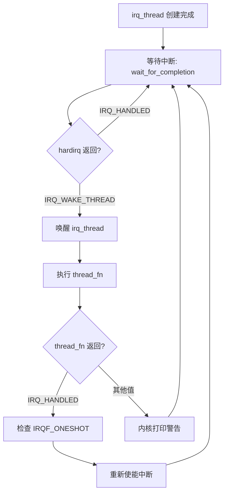

# 10.4.2 request_threaded_irq() 机制

> 所属章节：第10章 中断与时间 > 10.4 线程化中断处理
>
> 难度：[E][M] | 预计阅读时间：25分钟

## <span class="blue"> 本节导读

你是不是也遇到过这种 dilemma（两难困境）？中断处理函数里需要 `msleep()` 等待硬件就绪，但中断上下文又根本不能睡眠；想调用 `i2c_transfer()` 去读传感器数据，却发现里面可能会调度……常规 `request_irq()` 把中断处理死死绑在中断上下文中，灵活度不够。<br>

`request_threaded_irq()` 就是内核给这个问题开的"药方"——把中断处理拆成两个阶段：一个极短的 hardirq 做快速确认，一个可调度的内核线程做"脏活累活"。本节带你深入这个两阶段模型的源码实现，搞清楚 `irq_thread` 从哪来、到哪去、优先级怎么管。学完后，你将能写出既能快速响应硬件、又能在处理中安全睡眠的驱动代码。


## <span class="blue"> 两阶段模型：hardirq + irq_thread [E][M]

### 为什么需要线程化中断？

先回忆一下 `request_irq()` 的痛点。当中断触发时，CPU 跳转到你的 handler，这整个过程运行在中断上下文——不能睡眠、不能调度、栈空间极小。这没问题，如果 handler 只做几件事：读寄存器、清中断标志、唤醒等待队列。但现实很骨感，很多驱动不得不在中断里做大量工作。<br>

`request_threaded_irq()` 的核心思想简单粗暴：**把中断处理劈成两半**。代码定义在 `kernel/irq/manage.c`：

```c
// include/linux/interrupt.h
int request_threaded_irq(unsigned int irq,
                         irq_handler_t handler,      // hardirq：快速处理函数
                         irq_handler_t thread_fn,    // thread_fn：线程化慢处理
                         unsigned long flags,
                         const char *name, void *dev_id);
```

六个参数，前面三个是新面孔。irq 和 flags、name、dev_id 跟 `request_irq()` 一样，不再废话。关键是 `handler` 和 `thread_fn` 这对搭档。

### 两阶段处理流程

当一个中断到来时，内核走的是下面这条路：

```
        硬件中断触发
             │
             ▼
    ┌─────────────────┐
    │   hardirq()     │  ← 中断上下文，关中断（或关本IRQ）
    │  你的handler    │  ← 读状态寄存器、确认中断源
    │                 │  ← 必须极快！返回IRQ_WAKE_THREAD
    └────────┬────────┘
             │ IRQ_WAKE_THREAD
             ▼
    ┌─────────────────┐
    │  irq_thread     │  ← 内核线程，可调度、可睡眠
    │  thread_fn()    │  ← 做真正的工作：I2C/SPI通信、数据处理
    │                 │  ← 返回IRQ_HANDLED
    └─────────────────┘
```

<br>

**第一阶段：hardirq**。这是中断上下文中运行的快速处理函数。你的任务是：确认中断源、读状态寄存器、必要的话关中断。**最重要的事情是返回 `IRQ_WAKE_THREAD`**。这个返回值是一个信号，告诉内核"请把后续工作交给线程来做"。如果返回 `IRQ_HANDLED`，内核认为你已经全部搞定，不会唤醒线程。<br>

**第二阶段：irq_thread**。这是一个由内核自动创建的内核线程（命名格式通常是 `irq/XX-name`）。它平时在睡眠，等 hardirq 返回 `IRQ_WAKE_THREAD` 时被唤醒，然后在进程上下文中执行你的 `thread_fn`。这里你可以 `msleep()`、可以 `mutex_lock()`、可以调用可能睡眠的任何函数——自由度拉满。<br>

> ⚠️ **陷阱**：`thread_fn` 的返回值必须是 `IRQ_HANDLED`，不能返回 `IRQ_WAKE_THREAD`。`thread_fn` 是在线程中执行的，它返回 `IRQ_WAKE_THREAD` 会导致内核打印一条警告日志（`irq handler XXX should not return IRQ_WAKE_THREAD`），然后被忽略。只有 hardirq handler 才有资格返回 `IRQ_WAKE_THREAD`。

### handler 为 NULL 的简化模式

如果你的硬件只需要一个简单的确认操作（比如读一下状态寄存器就完事），没必要自己写 handler。这时候你可以传 `handler = NULL`，内核会自动给你一个"默认 hardirq"——`irq_default_primary_handler()`。这个默认 handler 只做一件事：返回 `IRQ_WAKE_THREAD`。

```c
// kernel/irq/manage.c
/*
 * 默认的primary handler——什么额外工作都不做，
 * 直接把中断"转交"给irq_thread处理
 */
irqreturn_t irq_default_primary_handler(int irq, void *dev_id)
{
    return IRQ_WAKE_THREAD;
}
```

这种模式是最常见的用法。来看一个实际的驱动注册示例：

```c
/* 典型的 request_threaded_irq 使用方式 */
static irqreturn_t my_irq_handler(int irq, void *dev_id)
{
    struct my_device *dev = dev_id;
    u32 status;

    /* 快速读取中断状态寄存器 */
    status = readl(dev->base + REG_IRQ_STATUS);
    if (!(status & MY_IRQ_MASK))
        return IRQ_NONE;          // 不是我们设备的，别捣乱

    /* 关键：清中断标志，否则硬件会持续触发 */
    writel(status, dev->base + REG_IRQ_STATUS);

    return IRQ_WAKE_THREAD;       // 唤醒irq_thread继续处理
}

/* 线程函数——可以睡眠，可以做大量工作 */
static irqreturn_t my_irq_thread_fn(int irq, void *dev_id)
{
    struct my_device *dev = dev_id;
    u8 buf[64];
    int ret;

    /* 可以在进程中睡眠！读I2C传感器数据 */
    ret = i2c_smbus_read_i2c_block_data(dev->client, 0x00, sizeof(buf), buf);
    if (ret < 0) {
        dev_err(&dev->client->dev, "I2C read failed: %d\n", ret);
        return IRQ_HANDLED;
    }

    /* 数据处理——可以调用可能调度的函数 */
    process_sensor_data(dev, buf, ret);

    /* 如果数据准备好，唤醒等待的用户态进程 */
    wake_up_interruptible(&dev->wait_queue);

    return IRQ_HANDLED;           // thread_fn只能返回这个
}

static int my_probe(struct platform_device *pdev)
{
    struct my_device *dev;
    int irq, ret;

    dev = devm_kzalloc(&pdev->dev, sizeof(*dev), GFP_KERNEL);
    irq = platform_get_irq(pdev, 0);
    if (irq < 0)
        return irq;

    /* 注册两阶段中断 */
    ret = devm_request_threaded_irq(&pdev->dev, irq,
                                    my_irq_handler,   // hardirq：快速确认
                                    my_irq_thread_fn, // thread_fn：慢处理
                                    IRQF_TRIGGER_FALLING | IRQF_ONESHOT,
                                    "my_sensor", dev);
    if (ret)
        return ret;

    init_waitqueue_head(&dev->wait_queue);
    return 0;
}
```

注意 `IRQF_ONESHOT` 这个 flag。它告诉内核：**在 irq_thread 完成之前，不要重新使能这个中断**。没有 `IRQF_ONESHOT`，硬件中断会在 hardirq 结束后立即重新打开，而此时 irq_thread 可能还没跑完，导致同一个中断源被再次触发、hardirq 重入。对于线程化中断，`IRQF_ONESHOT` 几乎是标配。

### irq_thread 的生命周期

irq_thread 不是你自己创建的——它是内核在 `__setup_irq()` 里偷偷搞出来的：

```
request_threaded_irq()
    └── setup_irq()
            └── __setup_irq()
                    ├── irq_request_resources()    // 申请IRQ资源
                    └── irq_setup_forced_threading() // 强制线程化检查
                            └── kthread_create(irq_thread, ...) // 创建线程！
```

<br>

线程创建后进入等待状态，流程如下：



<br>

说白了，irq_thread 一辈子就干这几件事：**等中断 → 被唤醒 → 干活 → 回去等**。它的实现代码在 `kernel/irq/manage.c` 的 `irq_thread()` 函数里，核心逻辑围绕 `wait_for_completion(&desc->threads_done)` 和 `action->thread_fn()` 展开。

> 💡 **提示**：如果你的 hardirq handler 返回 `IRQ_HANDLED`（而不是 `IRQ_WAKE_THREAD`），irq_thread **不会被唤醒**。这个机制允许你在 hardirq 里做一个快速判断：如果中断不是来自你的设备（比如共享中断），直接返回 `IRQ_NONE` 或 `IRQ_HANDLED`，避免不必要的线程调度开销。


## <span class="blue"> irq_thread 的优先级与调度策略 [E]

### 默认配置：SCHED_FIFO，优先级 50

irq_thread 既然是线程，就得参与调度。内核给它安排了相当有竞争力的调度参数：

| 属性 | 默认值 | 含义 |
|------|--------|------|
| 调度策略 | SCHED_FIFO | 先进先出实时调度，一旦运行就不被同优先级抢占 |
| 优先级 | 50 | rt_priority = 50，位于实时优先级中段 |
| 亲和性 | 继承中断 affinity | 默认跟中断绑定的 CPU 一致 |

SCHED_FIFO + 优先级 50 的设计很巧妙。它保证了中断处理线程比普通进程（SCHED_NORMAL/CFS）更快得到 CPU，但又不会霸道到抢占更高优先级的关键实时任务。换句话说，irq_thread"很急，但不是最急的"。

### 如何调整优先级

你可以通过 `sched_setscheduler()` 或用户态的 `chrt` 命令来调整 irq_thread 的优先级。在驱动代码中，通常在 probe 时调整：

```c
#include <linux/sched.h>
#include <uapi/linux/sched/types.h>

static int my_irq_priority_adjust(struct my_device *dev)
{
    struct sched_param param = { .sched_priority = 80 };
    struct task_struct *thread = dev->irq_thread;

    /* 把irq_thread提升到更高的实时优先级 */
    if (thread) {
        int ret = sched_setscheduler(thread, SCHED_FIFO, &param);
        if (ret)
            dev_warn(&dev->pdev->dev, "failed to raise irq priority\n");
        return ret;
    }
    return -EINVAL;
}
```

用户态也能调，找到 irq_thread 的 PID 然后用 `chrt`：

```bash
# 找到irq_thread的PID（通常命名格式为 irq/XX-name）
$ ps -eo pid,comm | grep irq
  123 irq/45-my_dev

# 把优先级提升到 90
$ sudo chrt -f -p 90 123

# 查看确认
$ chrt -p 123
pid 123's current scheduling policy: SCHED_FIFO
pid 123's current scheduling priority: 90
```

> ⚠️ **陷阱**：别盲目把 irq_thread 优先级提到 99。优先级越高，抢占能力越强，但也越容易引发优先级反转问题——如果你的 thread_fn 里需要拿一个低优先级线程持有的 mutex，高优先级反而会把自己卡住。更糟的是，如果 irq_thread 卡在某个资源上，这个中断就被"钉死"了，同一条 IRQ 线上的后续中断全都没法处理。

### 优先级反转问题

优先级反转是实时系统中的经典问题。irq_thread 运行在 SCHED_FIFO 下，一旦被一个低优先级的任务持有的锁挡住，就会形成反转。<br>

内核里的解决方案是用 RT-Mutex（`CONFIG_RT_MUTEXES`），它实现了优先级继承协议。如果你的 thread_fn 需要拿 mutex，尽量用 `rt_mutex_lock()` 而不是普通的 `mutex_lock()`。在 PREEMPT_RT 全实时内核中，普通的 `mutex_lock()` 底层就是 RT-Mutex，优先级继承自动生效。<br>

还有一种更务实的做法：在 thread_fn 里**避免拿任何可能被长时间持有的锁**。如果必须同步，考虑用 `spin_lock_irq()`（但你已经在线程上下文中了，直接用 `mutex_lock` 就行）或者把数据通过无锁队列（kfifo）丢给工作队列去处理。说白了，**irq_thread 里只"搬运"数据，不做复杂同步**。


## <span class="blue"> request_irq vs request_threaded_irq：核心对比

| 对比维度 | request_irq() | request_threaded_irq() |
|----------|--------------|----------------------|
| 处理上下文 | 纯中断上下文 | hardirq（中断）+ thread_fn（进程） |
| 能否睡眠 | ❌ 绝对不能 | ✅ thread_fn 中完全可以 |
| 参数数量 | 5 个参数 | 6 个参数（多了 handler + thread_fn） |
| 线程创建 | 不创建 | 自动创建 `irq/XX-name` 内核线程 |
| 典型返回 | `IRQ_HANDLED` / `IRQ_NONE` | hardirq 返回 `IRQ_WAKE_THREAD` |
| ONESHOT 需求 | 一般不需要 | 强烈建议加 `IRQF_ONESHOT` |
| 适用场景 | 快速处理（< 100μs） | 需要睡眠、I/O、复杂处理 |
| 延迟开销 | 最小 | 多一次线程调度上下文切换 |
| 资源占用 | 无额外线程 | 每个中断一个内核线程 |
| handler 为 NULL | 不支持（必需有效 handler） | ✅ 内核提供默认 handler |

<br>

这张表帮你快速判断该用哪个 API。如果你不确定，先问自己一个问题：**handler 里有没有可能需要睡眠的操作？** 有的话，别犹豫，直接上 `request_threaded_irq()`。


## <span class="blue"> 本节总结

| 要点 | 内容 |
|------|------|
| 两阶段模型 | hardirq 快速确认中断 + irq_thread 在进程中做慢处理 |
| 关键返回值 | hardirq 返回 `IRQ_WAKE_THREAD` 才能唤醒线程；`thread_fn` 必须返回 `IRQ_HANDLED` |
| handler=NULL | 内核自动提供默认 handler（`irq_default_primary_handler`），直接转交线程处理 |
| IRQF_ONESHOT | 线程化中断的标配 flag，防止 irq_thread 完成前重入 |
| irq_thread 优先级 | 默认 SCHED_FIFO:50，可通过 `sched_setscheduler()` 或 `chrt` 调整 |
| 优先级反转风险 | 高优先级 irq_thread 可能被低优先级任务的锁卡住，用 RT-Mutex 或避免复杂同步 |
| 源码路径 | `kernel/irq/manage.c` —— `request_threaded_irq()`、`irq_thread()`、`irq_default_primary_handler()` |


## <span class="blue"> 下一步

搞清楚了线程化中断的注册和优先级管理，下一个问题来了：它到底好在哪？代价又是什么？特别是 PREEMPT_RT 实时内核中，为什么几乎所有中断都被强制线程化？10.4.3 将深入分析线程化中断的优势、代价，以及与 PREEMPT_RT 的关系。


## <span class="blue"> 配套资源

| 资源类型 | 内容 | 位置 |
|----------|------|------|
| 核心源码 | `request_threaded_irq()` 实现 | `kernel/irq/manage.c` |
| 核心源码 | irq_thread 主循环 | `kernel/irq/manage.c: irq_thread()` |
| 核心源码 | 默认 primary handler | `kernel/irq/manage.c: irq_default_primary_handler()` |
| 头文件 | 中断 API 声明 | `include/linux/interrupt.h` |
| 用户态工具 | 调整 irq_thread 优先级 | `chrt -f -p <prio> <pid>` |
| 内核配置 | RT-Mutex 支持 | `CONFIG_RT_MUTEXES` |
| 验证方法 | 查看 irq_thread 列表 | `ps -eo pid,rtprio,comm | grep irq/` |
| 图示 | 线程化中断处理流程 | 上文 mermaid 图 |
