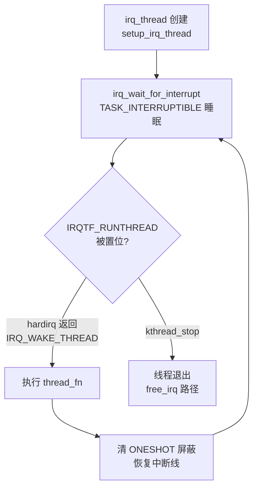

# 10.4.2 request_threaded_irq() 机制

> 所属章节：第10章 中断与时间 > 10.4 线程化中断
>
> 难度：[E→M] | 预计阅读时间：25分钟

## <span class="blue"> 本节导读

中断处理里经常有这样的矛盾：需要 `msleep()` 等待硬件就绪，但中断上下文不能睡眠；需要 `i2c_transfer()` 读传感器，但总线传输内部会调度。`request_irq()` 把处理函数绑死在中断上下文，这类需求无法直接满足。<br>
`request_threaded_irq()` 就是内核给出的方案：中断处理拆成两阶段——极短的 hardirq 做快速确认，可调度的内核线程做耗时处理。<br>
本节覆盖：两阶段模型的工作机制、`irq_thread` 的创建与生命周期、默认优先级的出处与调整方法，以及一个可直接套用的驱动模板。


## <span class="blue"> 两阶段模型：hardirq + irq_thread [E→M]

### API 与角色分工

`request_threaded_irq()` 声明在 `include/linux/interrupt.h`：

```c
int request_threaded_irq(unsigned int irq,
			 irq_handler_t handler,      /* hardirq：快速处理 */
			 irq_handler_t thread_fn,    /* thread_fn：线程化慢处理 */
			 unsigned long flags,
			 const char *name, void *dev_id);
```

`irq`、`flags`、`name`、`dev_id` 与 `request_irq()` 相同——事实上 `request_irq()` 就是 `thread_fn` 传 `NULL` 的 `request_threaded_irq()` 宏封装。关键区别在 `handler` 和 `thread_fn` 这对组合。

### 两阶段处理流程

```
        硬件中断触发
             │
             ▼
    ┌─────────────────┐
    │   hardirq()     │  ← 中断上下文
    │  你的handler    │  ← 读状态寄存器、确认中断源
    │                 │  ← 必须极快，返回 IRQ_WAKE_THREAD
    └────────┬────────┘
             │ IRQ_WAKE_THREAD
             ▼
    ┌─────────────────┐
    │  irq_thread     │  ← 内核线程，可调度、可睡眠
    │  thread_fn()    │  ← 做真正的工作：I2C/SPI 通信、数据处理
    │                 │  ← 返回 IRQ_HANDLED
    └─────────────────┘
```

**第一阶段：hardirq**。运行在中断上下文的快速处理函数。任务是：确认中断源、读状态寄存器、必要时屏蔽中断，然后**返回 `IRQ_WAKE_THREAD`**——这个返回值通知内核"后续工作交给线程"。如果返回 `IRQ_HANDLED`，内核认为处理完毕，不唤醒线程。

**第二阶段：irq_thread**。内核自动创建的内核线程，命名格式 `irq/N-name`。它平时处于睡眠状态，hardirq 返回 `IRQ_WAKE_THREAD` 时被唤醒，在进程上下文执行 `thread_fn`。这里可以 `msleep()`、可以 `mutex_lock()`、可以调用任何可能睡眠的函数。

> ⚠️ `thread_fn` 应当返回 `IRQ_HANDLED`。v6.6 里如果 `thread_fn` 返回 `IRQ_WAKE_THREAD`，`irq_thread()` 会把它当作"唤醒次级 action"的信号调用 `irq_wake_secondary()`（manage.c:1322）——这是给共享次级线程用的机制，普通驱动触发它只会让行为偏离预期。

### handler 为 NULL 的简化模式

如果硬件只需要最简单的确认（比如中断源在 hardirq 阶段已由芯片层屏蔽），可以不写 handler，传 `handler = NULL`。内核自动替换为默认 primary handler（manage.c:1031）：

```c
/*
 * Default primary interrupt handler for threaded interrupts. Is
 * assigned as primary handler when request_threaded_irq is called
 * with handler == NULL. Useful for oneshot interrupts.
 */
static irqreturn_t irq_default_primary_handler(int irq, void *dev_id)
{
	return IRQ_WAKE_THREAD;
}
```

它只做一件事：返回 `IRQ_WAKE_THREAD`，把处理整个转交给线程。这是最常见的用法。完整的驱动示例：

```c
/* 典型的 request_threaded_irq 使用方式 */
static irqreturn_t my_irq_handler(int irq, void *dev_id)
{
	struct my_device *dev = dev_id;
	u32 status;

	/* 快速读取中断状态寄存器 */
	status = readl(dev->base + REG_IRQ_STATUS);
	if (!(status & MY_IRQ_MASK))
		return IRQ_NONE;          /* 不是本设备的中断 */

	/* 清中断标志，否则硬件会持续触发 */
	writel(status, dev->base + REG_IRQ_STATUS);

	return IRQ_WAKE_THREAD;       /* 唤醒 irq_thread 继续处理 */
}

/* 线程函数——可以睡眠，可以做耗时工作 */
static irqreturn_t my_irq_thread_fn(int irq, void *dev_id)
{
	struct my_device *dev = dev_id;
	u8 buf[64];
	int ret;

	/* 进程上下文：I2C 读传感器合法 */
	ret = i2c_smbus_read_i2c_block_data(dev->client, 0x00,
					    sizeof(buf), buf);
	if (ret < 0) {
		dev_err(&dev->client->dev, "I2C read failed: %d\n", ret);
		return IRQ_HANDLED;
	}

	process_sensor_data(dev, buf, ret);

	/* 数据就绪，唤醒等待的用户态进程 */
	wake_up_interruptible(&dev->wait_queue);

	return IRQ_HANDLED;
}

static int my_probe(struct platform_device *pdev)
{
	struct my_device *dev;
	int irq, ret;

	dev = devm_kzalloc(&pdev->dev, sizeof(*dev), GFP_KERNEL);
	irq = platform_get_irq(pdev, 0);
	if (irq < 0)
		return irq;

	ret = devm_request_threaded_irq(&pdev->dev, irq,
					my_irq_handler,   /* hardirq */
					my_irq_thread_fn, /* thread_fn */
					IRQF_TRIGGER_FALLING | IRQF_ONESHOT,
					"my_sensor", dev);
	if (ret)
		return ret;

	init_waitqueue_head(&dev->wait_queue);
	return 0;
}
```

注意 `IRQF_ONESHOT`：它告诉内核**在 irq_thread 执行完之前，保持这条中断线屏蔽**。没有它，hardirq 结束后中断立即重新打开，而 irq_thread 可能还没跑完，同一中断源再次触发导致重入。线程化中断场景下 `IRQF_ONESHOT` 基本是标配（这也呼应 10.3.6 的提示：ONESHOT 语义下不需要在处理函数里手动开关中断）。

### irq_thread 的创建与生命周期

irq_thread 由内核在注册路径上创建，v6.6 的真实链路：

```
request_threaded_irq()
    └── __setup_irq()                    kernel/irq/manage.c
            ├── irq_request_resources()  申请 IRQ 资源
            └── setup_irq_thread()       manage.c:1456
                    └── kthread_create(irq_thread, new, "irq/%d-%s", ...)
```

线程主体是 `irq_thread()`（manage.c:1294）。它的等待方式不是 completion，而是一个经典的可中断睡眠循环（`irq_wait_for_interrupt()`，manage.c:1052）：

```c
static int irq_wait_for_interrupt(struct irqaction *action)
{
	for (;;) {
		set_current_state(TASK_INTERRUPTIBLE);

		if (kthread_should_stop()) {
			/* ... 退出处理 ... */
			return -1;
		}
		if (test_and_clear_bit(IRQTF_RUNTHREAD,
				       &action->thread_flags)) {
			__set_current_state(TASK_RUNNING);
			return 0;      /* 有活干了 */
		}
		schedule();
	}
}
```

hardirq 返回 `IRQ_WAKE_THREAD` 时，中断核心层置位 `IRQTF_RUNTHREAD` 并唤醒线程；`irq_thread()` 主循环检测到该位就执行 `thread_fn`，然后回到睡眠。



irq_thread 的一生就是：**睡眠 → 被唤醒 → 执行 thread_fn → 恢复中断线 → 继续睡眠**，直到 `free_irq()` 时由 `kthread_stop()` 结束。

> 💡 如果 hardirq 返回 `IRQ_HANDLED` 而不是 `IRQ_WAKE_THREAD`，线程不会被唤醒。可以利用这一点做快速过滤：共享中断场景下，hardirq 先查状态寄存器，不是本设备的中断就直接返回 `IRQ_NONE`，避免无谓的线程调度。


## <span class="blue"> irq_thread 的优先级与调度策略 [E]

### 默认值：SCHED_FIFO，优先级 50

irq_thread 创建后立即执行 `sched_set_fifo(current)`（manage.c:1304）。这个函数的定义在 `kernel/sched/core.c:7935`：

```c
void sched_set_fifo(struct task_struct *p)
{
	struct sched_param sp = { .sched_priority = MAX_RT_PRIO / 2 };

	WARN_ON_ONCE(sched_setscheduler_nocheck(p, SCHED_FIFO, &sp) != 0);
}
```

| 属性 | 默认值 | 出处 |
|------|--------|------|
| 调度策略 | SCHED_FIFO | `sched_set_fifo()`，manage.c:1304 |
| 优先级 | 50（`MAX_RT_PRIO/2`） | core.c:7935 |
| 亲和性 | 继承中断 affinity | `irq_thread_check_affinity()` |

`SCHED_FIFO/50` 是一个折中：保证中断线程比普通进程（CFS）更快得到 CPU，又不会抢占优先级更高的关键实时任务（如视频采集的 80）。

### 如何调整优先级

驱动里拿到线程的 `task_struct` 指针后（比如注册成功后通过私有结构保存），用 `sched_setscheduler()` 调整；用户态用 `chrt`：

```bash
# 找到 irq_thread 的 PID
ps -eo pid,comm | grep irq/

# 把 irq/45-my_dev (PID 123) 提升到 SCHED_FIFO/90
sudo chrt -f -p 90 123

# 确认
chrt -p 123
```

> ⚠️ 不要盲目把 irq_thread 优先级拉到 99。优先级越高，越容易撞上优先级反转：thread_fn 里若需要获取一个低优先级线程持有的锁，高优先级线程会被低优先级线程拖住；而 irq_thread 卡住期间，这条 IRQ 线上的后续中断都无法处理。

### 优先级反转问题

irq_thread 运行在 `SCHED_FIFO` 下，一旦被低优先级任务持有的锁挡住，就形成优先级反转。内核层面的解法是带优先级继承（PI）的锁——`rt_mutex` 和 PI-futex，它们会把持锁线程的优先级临时提升到等待者的水平。

对驱动开发者来说，更务实的原则是：**thread_fn 里避免获取可能被长时间持有的锁**。需要与用户态或其他线程交换数据时，优先用 waitqueue、kfifo 这类无锁或短临界区机制，把复杂同步挪出中断线程。锁与优先级继承的完整讨论见第 13 章。


## <span class="blue"> request_irq vs request_threaded_irq：核心对比

| 对比维度 | request_irq() | request_threaded_irq() |
|----------|---------------|------------------------|
| 处理上下文 | 纯中断上下文 | hardirq（中断）+ thread_fn（进程） |
| 能否睡眠 | 不能 | thread_fn 中可以 |
| 本质 | `request_threaded_irq(irq, handler, NULL, ...)` 的宏封装 | 完整两阶段 API |
| 线程创建 | 不创建 | 自动创建 `irq/N-name` 内核线程 |
| hardirq 典型返回 | `IRQ_HANDLED` / `IRQ_NONE` | `IRQ_WAKE_THREAD` |
| ONESHOT 需求 | 不涉及 | 线程化场景基本标配 |
| 适用场景 | 处理极快（10.2.3 的 100μs 经验阈值内） | 需要睡眠、I/O、复杂处理 |
| 额外开销 | 无 | 一次线程唤醒 + 上下文切换 |
| 资源占用 | 无额外线程 | 每个线程化中断一个内核线程 |

判断标准只有一个问题：**handler 里有没有可能睡眠的操作？** 有，就用 `request_threaded_irq()`。


## <span class="blue"> 本节总结

| 要点 | 内容 |
|------|------|
| 两阶段模型 | hardirq 快速确认中断 + irq_thread 在进程上下文做耗时处理 |
| 关键返回值 | hardirq 返回 `IRQ_WAKE_THREAD` 唤醒线程；thread_fn 返回 `IRQ_HANDLED` |
| handler=NULL | 内核替换为 `irq_default_primary_handler()`（manage.c:1031），直接转交线程 |
| IRQF_ONESHOT | 线程执行完前保持中断线屏蔽，防止重入 |
| 线程创建 | `__setup_irq()` → `setup_irq_thread()`（:1456）→ `kthread_create("irq/%d-%s")` |
| 等待机制 | `irq_wait_for_interrupt()`（:1052）：TASK_INTERRUPTIBLE + IRQTF_RUNTHREAD 位 |
| 默认优先级 | `sched_set_fifo()` → SCHED_FIFO/50（core.c:7935），可用 `chrt` 调整 |
| 反转风险 | 高优先级 irq_thread 避免拿长临界区的锁，PI 机制见第 13 章 |


## <span class="blue"> 下一步

机制清楚了，接下来的问题是值不值得用：线程化的收益和代价怎么权衡？为什么 PREEMPT_RT 要把**所有**中断强制线程化？10.4.3 分析线程化中断的适用边界，以及 `threadirqs` 参数与 PREEMPT_RT 的关系。


## <span class="blue"> 配套资源

| 资源类型 | 内容 | 位置 |
|----------|------|------|
| 核心源码 | `irq_default_primary_handler()` | `kernel/irq/manage.c:1031` |
| 核心源码 | `irq_wait_for_interrupt()` | `kernel/irq/manage.c:1052` |
| 核心源码 | `irq_thread()` 主循环 | `kernel/irq/manage.c:1294` |
| 核心源码 | `setup_irq_thread()` / 线程命名 | `kernel/irq/manage.c:1456` |
| 核心源码 | `sched_set_fifo()` 默认优先级 | `kernel/sched/core.c:7935` |
| 头文件 | 中断 API 声明 | `include/linux/interrupt.h` |
| 用户态工具 | 调整 irq_thread 优先级 | `chrt -f -p <prio> <pid>` |
| 验证方法 | 查看 irq_thread 列表 | `ps -eo pid,rtprio,comm \| grep irq/` |
