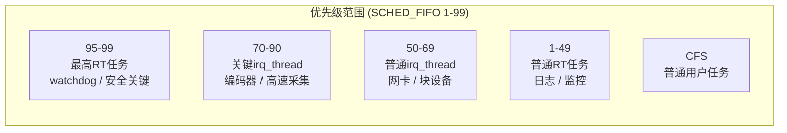

**知识点102 irq_thread的调度策略与优先级调整 [E][M]**

你有没有想过，当一个中断被设置为`threaded irq`之后，那个负责执行`handler`的内核线程到底是什么来头？它可不是`kworker`那种"打零工"的通用线程——每个`irq_thread`都和某一根具体的中断线绑定，一对一，专岗专职。你注册中断时传的`irq_handler_t thread_fn`，最终就是跑在这个线程里的。

既然是线程，那就逃不开调度器的手掌心。`irq_thread`在创建时，内核给它套的是`SCHED_FIFO`策略，优先级固定为50。这个数字不算高也不算低——`SCHED_FIFO`的有效范围是1到99，50恰好卡在中间偏下的位置。为啥选50？这是内核维护者们折中的结果：既保证中断处理不被普通CFS任务饿死，又给真正关键的实时任务留出了余地。

来看一眼它在源码里的面目。`kernel/irq/manage.c`中的`irq_thread`函数在创建线程时调用了`sched_setscheduler()`：

```c
/* kernel/irq/manage.c */
static int irq_thread(void *data)
{
    struct irqaction *action = data;
    
    /* irq_thread默认使用SCHED_FIFO, 优先级50 */
    sched_setscheduler(current, SCHED_FIFO, &param);
    
    while (!wait_for_completion(&action->thread_done)) {
        irqreturn_t handler_fn;
        
        /* 等待中断触发，然后执行thread_fn */
        handler_fn = action->thread_fn(action->irq, action->dev_id);
        ...
    }
    return 0;
}
```

这个默认行为在大多数情况下够用了。但工程现场哪有一刀切的道理？有些中断就是比其他中断金贵，比如工业控制里的位置编码器中断——晚处理一毫秒，机械臂可能就撞墙了。这时候你就得动手调优先级。

有两条路可以走。

第一条路是在注册中断时通过`irq_priority`模块参数或者直接调用`request_threaded_irq()`时传入标志来影响优先级。更直接的做法是在运行时动态调整——拿到`irq_thread`的PID（或者直接用`current`），然后调用`sched_setscheduler()`：

```c
/* 动态提升某irq_thread的优先级 */
struct sched_param param = { .sched_priority = 80 };
int irq_tid = irq_thread_id;  /* 从irqaction或proc中获取 */

sched_setscheduler(irq_task, SCHED_FIFO, &param);
```

第二条路更朴素——通过`/proc`找到`irq/`前缀的线程，用`chrt`命令直接改：

```bash
# 查看irq_thread当前优先级
$ ps -eo pid,comm,rtprio | grep irq
  152  irq/24-eth0         50

# 将其提升到优先级70
$ sudo chrt -f -p 70 152

# 确认修改生效
$ ps -eo pid,comm,rtprio | grep irq/24-eth0
  152  irq/24-eth0         70
```

| 调整方式 | 适用场景 | 持久性 |
|---------|---------|-------|
| `irq_priority`参数 / 注册标志 | 初始化时确定，不需要运行时变动 | 静态固定 |
| `sched_setscheduler()`动态调用 | 需要根据系统状态自适应调整 | 运行时生效，重启丢失 |
| `chrt`命令 | 调试、临时调整、验证优先级影响 | 临时 |

> **陷阱**：`chrt`改完即时生效，但系统重启就丢了。如果你是在产品里做持久化配置，应该在驱动初始化代码里调用`sched_setscheduler()`，而不是依赖外部脚本。

**知识点103 irq_thread优先级设置实践建议 [E]**

优先级这东西，不是越大越好。我见过有新手一上来就把所有`irq_thread`的优先级拉到90多，结果呢？系统的`watchdog`线程抢不到CPU，关键守护进程饿死了，系统不定期重启。说白了，调优先级本质上是在做资源分配的平衡题。

一个实用的层次结构是这样的：



关键中断的`thread`优先级应该比普通CFS任务高，这是底线——否则中断处理被普通任务挤掉，那还叫什么实时？但同时要低于系统里最高优先级的硬实时任务，比如`watchdog`。一般来说，关键`irq_thread`放在70到80之间，普通的留在默认50附近，是一个比较稳当的选择。

这里藏着一个大坑：**优先级反转**。啥意思？假设你的`irq_thread`优先级是80，它要访问一个信号量保护的共享资源。结果一个普通CFS任务（优先级无关，反正CFS不参与RT调度）已经占住了那个信号量。好，你的80级`irq_thread`就得等。问题是，如果这时候又来一个优先级50的`irq_thread`或者普通RT任务，它虽然优先级低于80，但它不依赖那个信号量，所以它跑起来了——而你的80级任务反而被"倒挂"了，被一个隐形的锁链拖住了后腿。

怎么破？

第一，能在`irq_thread`里不拿锁就不拿锁。中断处理路径追求的是快进快出，锁的持有时间越短越好。第二，如果确实需要同步，考虑用`rt_mutex`——它内置了优先级继承（PI, Priority Inheritance）机制，当高优先级任务等锁时，持有锁的低优先级任务会临时"被拔高"到高优先级任务的级别，从而避免中间优先级的任务插进来捣乱。第三，也是最务实的做法：把你需要跟`irq_thread`共享的数据做成无锁的，用环形缓冲区（`kfifo`之类），生产者和消费者各管一摊，谁也不挡谁。

> **陷阱**：别在`irq_thread`里调用会睡眠的函数然后指望调度器帮你兜底。`SCHED_FIFO`任务一旦跑起来，除非主动让出、被更高优先级任务抢占、或者自己阻塞，否则它会一直霸占CPU。你在`thread_fn`里写一个死循环不出来，整个CPU核心就废了。
