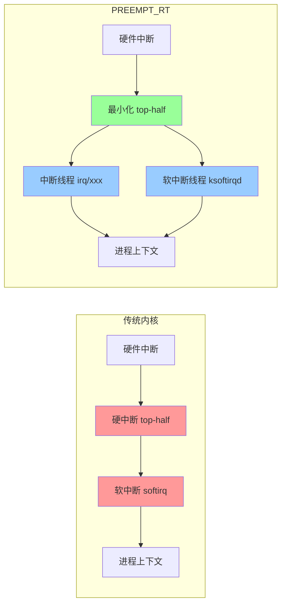
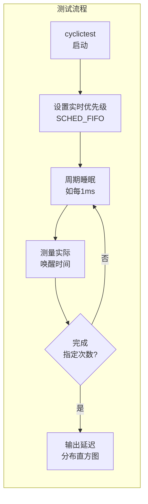

# 10.4.3 线程化中断的优势代价与PREEMPT_RT

> 所属章节：第10章 中断与时间 > 10.4 线程化中断与强制线程化
>
> 难度：[I] ~ [E] | 预计阅读时间：15分钟

## <span class="blue"> 本节导读

线程化中断听起来很美——中断处理函数摇身一变成了普通线程，能睡觉、能排队、能被调度。可你有没有想过，这"自由"的代价是什么？所有中断都适合线程化吗？那高频GPIO中断，你把它改成线程化试试，CPU可能连你的用户进程都跑不动了。

反过来，如果你想让系统里**所有**中断都线程化，又不甘心一个个改驱动代码，那内核里的 PREEMPT_RT 是怎么做到的？它的 `threadirqs` 参数到底动了什么手脚，能让整个内核的中断子系统彻底"民主化"？<br>
学完后，你将学会用一张表格判断"这个中断该不该线程化"，以及用 cyclictest 实测 PREEMPT_RT 带来的延迟改善。

---

## <span class="blue"> 线程化中断：一把双刃剑 [I]

前面10.4.2节你已经学会了 `request_threaded_irq()` 的基本用法。现在问题来了——线程化中断到底值不值得用？说白了，这取决于你的场景。先把利弊摊开来看。

### 优势：终于能睡觉了

传统中断处理函数（top-half）运行在中断上下文中，执行期间中断被屏蔽，而且绝对不能调用可能睡眠的函数。这意味着你没法在中断里做这些事：

- 访问 `mutex`（可能睡眠等待）
- 读写文件系统（底层可能触发 I/O 等待）
- 访问 I2C/SPI 外设（总线传输可能需要睡眠等待）
- 分配大量内存（`kmalloc` 带 `GFP_KERNEL` 可能触发内存回收，进入睡眠）

线程化中断把耗时的活丢给一个 `irq/xxx` 内核线程，这个线程运行在进程上下文中，**可以合法睡眠**。这就解决了硬中断里的"资源受限"困境。

还有个好处你可能没想到——**优先级调度**。普通中断的 top-half 一旦开始跑，其他中断就被屏蔽，优先级是"硬件决定的"。而线程化之后，你可以用 `sched_setscheduler()` 调整中断线程的优先级，甚至用实时调度策略 `SCHED_FIFO`，让关键中断的线程跑得比用户进程还快。

```c
// 把中断线程设为实时调度
struct sched_param param = { .sched_priority = 80 };
struct task_struct *irq_thread = kthread_find_task(irq);
sched_setscheduler(irq_thread, SCHED_FIFO, &param);
```

这么一搞，中断不再是"闯入的野蛮人"，而是跟普通任务一样参与调度，甚至还能享受实时调度的特权。

### 代价：上下文切换不便宜

光有好处没有代价？想得美。线程化引入了一条更长的处理链路：

```
硬中断触发 → 执行最小化 top-half → 唤醒 irq/xxx 线程
→ 调度器选择该线程 → 上下文切换 → 线程执行 bottom-half
```

对比传统中断：

```
硬中断触发 → 执行完整中断处理函数 → 返回
```

多出来的环节是什么？**一次线程唤醒 + 一次上下文切换**。在 ARM64 上，一次上下文切换大约消耗几百纳秒到几微秒（取决于缓存失效程度）。对每秒几千次的中断，这开销可以忽略；但对每秒百万次的高频中断（比如高速 GPIO 翻转、高速 ADC 采样），上下文切换的时间可能比中断处理本身还长。

### 不适合的场景

别看见线程化就上头。以下场景**不适合**用线程化中断：

- **超高频中断**（>100kHz）：上下文切换开销占比太大，CPU 疲于切换，实际干活的时间反而少了
- **极简中断处理**：如果中断只需要读一个寄存器、清一个标志位，几行代码就完事，线程化纯属画蛇添足
- **对延迟极其敏感的场景**：线程化增加了调度延迟的不确定性（取决于调度器什么时候轮到你）

### 一张表说清楚

| 维度 | 线程化中断 | 传统中断 |
|:---|:---|:---|
| **执行上下文** | 进程上下文（`irq/xxx` 线程） | 中断上下文 |
| **可睡眠** | ✅ 可以调用 `mutex`、`kmalloc(GFP_KERNEL)` | ❌ 绝对不能睡眠 |
| **调度策略** | 可调整优先级、可用 `SCHED_FIFO` | 由硬件优先级固定，不可调度 |
| **上下文切换** | 多一次（硬irq → 线程唤醒 → 调度 → 执行） | 无额外切换 |
| **延迟确定性** | 一般（调度延迟可变） | 好（立即执行） |
| **额外开销** | ~1~5μs（调度+切换） | 0 |
| **适用场景** | 需睡眠的资源（I2C/SPI/文件系统）、长耗时处理 | 极简处理、高频中断、超低延迟 |

> 💡 **提示**：做决策时，先问自己两个问题——"这个中断处理需要睡眠吗？""中断频率有多高？"如果第一问"是"且第二问"不高"，线程化就是合理选择。

> ⚠️ **陷阱**：有开发者把 GPIO 按键中断线程化了，结果按键响应没问题，但把同样是这个 GPIO 控制器的高速中断也给拖慢了。同一个中断控制器上的多个中断共享上下文，一个线程化的决策可能影响其他中断。

---

## <span class="blue"> PREEMPT_RT 与 threadirqs：全局强制线程化 [E]

如果你已经感受到了线程化中断的好处，自然会冒出一个念头：能不能不改动驱动代码，就让**所有**中断都线程化？PREEMPT_RT  patch 给出的答案就是 `threadirqs`。

### threadirqs 内核参数：一键全变

在启动参数里加上 `threadirqs`，内核会把**所有非强制不可线程化**的中断都改成线程化模式。这意味着即使是那些没有调用 `request_threaded_irq()` 的老驱动，其中断处理函数也会被包装成一个线程。

```
# 在 U-Boot 或 GRUB 的启动参数中加入
threadirqs

# 启动后检查
$ ps aux | grep irq/
irq/28-eth0       ...  # 网卡中断成了线程
irq/42-mmc0       ...  # MMC 中断也成了线程
irq/16-uart       ...  # 串口中断也变了
```

内核是怎么做到的呢？在 `kernel/irq/manage.c` 中，`irq_finalize_oneshot()` 和 `irq_thread()` 配合，把所有中断处理函数当作 bottom-half 来线程化执行。

不过要留意——`threadirqs` 只在线程化中断被编译进内核时生效（`CONFIG_IRQ_FORCED_THREADING=y`），而且内核会跳过明确标记了 `IRQF_NO_THREAD` 的中断（比如定时器中断、per-CPU 中断）。

> ⚠️ **陷阱**：`threadirqs` 参数会改变**所有**中断的行为，可能导致系统整体中断响应延迟上升、吞吐量下降。生产环境别随便加，除非你确实需要 PREEMPT_RT 的实时保证。

### PREEMPT_RT 的核心思想：内核里几乎没有不可抢占的代码

`threadirqs` 只是 PREEMPT_RT patch 的冰山一角。PREEMPT_RT 的终极目标是：**让 Linux 内核中几乎所有执行路径都可以被抢占**，从而获得微秒级的最坏情况延迟。

传统 Linux 内核里，以下路径是不可抢占的：

- 硬中断处理函数
- 软中断处理（`softirq`）
- 持有自旋锁（`spinlock`）的代码段
- 临界区（`preempt_disable()` 包裹的区域）

PREEMPT_RT 做了大量工作把这些"禁区"逐一攻破：



PREEMPT_RT 的关键改动包括：

1. **spinlock → rt_mutex**：把自旋锁改成可睡眠的实时互斥锁，持有锁时线程可以睡眠而不是忙等
2. **软中断线程化**：`ksoftirqd` 变成真正的调度实体，不再是中断返回时"顺手"执行
3. **高精度定时器**：`hrtimer` 的到期处理也线程化
4. **中断处理线程化**：即前面说的 `threadirqs` 逻辑

这样改造之后，内核里几乎不存在"某个路径跑起来就不让打断"的情况。调度器可以在绝大多数时间点介入，保证高优先级任务及时获得 CPU。

### Mainline 化进展：RT patch 正在被"消化"

PREEMPT_RT patch 曾经是独立的大补丁集，维护者 Thomas Gleixner 团队花了十几年推动合并到主线。关键里程碑：

| 时间 | 进展 |
|:---|:---|
| 2004年 | PREEMPT_RT patch 项目启动 |
| 2015年 | 大部分基础设施合入主线（`CONFIG_PREEMPT` 的增强） |
| 2021年 | Linux 5.15，实时锁基础合入 |
| 2023年 | Linux 6.1，PREEMPT_RT  officially merged into mainline |

到 2024 年初，PREEMPT_RT 的核心机制已经存在于主线内核中，可以通过 `CONFIG_PREEMPT_RT` 启用。不过完整的硬实时保证仍然需要配合实时调度和精心设计的用户代码，光打开内核开关还不够。

### cyclictest：验证实时性的利器

你改了内核配置，启用了 `PREEMPT_RT`，怎么证明它真的管用了？用 `cyclictest`。

`cyclictest` 是 rt-tests 套件里的基准测试工具，它的原理很简单：启动一个周期性运行的实时线程，测量每次唤醒的实际延迟。延迟 = 实际唤醒时间 - 期望唤醒时间。

```bash
# 安装 rt-tests
sudo apt-get install rt-tests    # Debian/Ubuntu
# 或
sudo dnf install rt-tests        # Fedora

# 基本用法：测量10000次周期唤醒的延迟
sudo cyclictest --smp -p 80 -i 1000 -l 10000 -q

# 参数说明：
# --smp    在所有 CPU 上同时测试
# -p 80    实时优先级 80（SCHED_FIFO）
# -i 1000  周期 1000μs（1ms）
# -l 10000 循环 10000 次
# -q       安静模式，只输出摘要
```

典型的输出是这样的：

```
# /dev/cpu_dma_latency set to 0us
# Histogram
000000 00000         # 0μs 延迟的次数
000001 09982         # 1μs 延迟
000002 00012         # 2μs
...
000156 00001         # 最坏情况 156μs
# Total: 010000
# Min Latencies: 00001
# Avg Latencies: 00001
# Max Latencies: 00156
```

> 💡 **提示**：PREEMPT_RT 内核的 cyclictest 最坏情况延迟通常 < 50μs，而开启常规抢占（`CONFIG_PREEMPT`）的普通内核最坏情况可能 > 1ms。这个差距在工业控制、机器人运动控制场景中是决定性的。

#### 实战带练：完整测量步骤

按下面步骤做一次完整的对比测试，亲眼看看 PREEMPT_RT 的效果。

**步骤1**：先测普通内核的基线。

```bash
# 确认当前内核没有 PREEMPT_RT
uname -a
# 输出里应该有 "PREEMPT" 但没有 "PREEMPT_RT"

# 运行测试
sudo cyclictest -a -t 4 -p 80 -i 1000 -l 50000 -q -D 60
# -a       自动绑定到所有 CPU
# -t 4     每个 CPU 4 个线程
# -D 60    跑 60 秒
```

记录输出的 `Max Latencies` 值。普通内核通常几十到几百微秒，极端情况下可能破毫秒。

**步骤2**：切换到 PREEMPT_RT 内核（或加 `threadirqs` 参数）。

```bash
# 在启动参数中加入 threadirqs，重启
# 或切换到编译了 CONFIG_PREEMPT_RT=y 的内核
sudo grub-reboot "Advanced options for Ubuntu>Ubuntu, with Linux 6.1.0-rt"
sudo reboot
```

**步骤3**：再次运行相同的 cyclictest 命令。

**步骤4**：对比两次结果。

```bash
# 普通内核（示例）
# Max Latencies: 1248    # 1.2ms，太刺激了

# PREEMPT_RT 内核（示例）
# Max Latencies: 0032    # 32μs，稳如老狗
```

这个对比实验做完，你就对 PREEMPT_RT 的价值有了体感认识。延迟的"最大值"比"平均值"重要得多——控制系统怕的不是"通常很快"，而是"偶尔慢一次"。



> ⚠️ **陷阱**：cyclictest 测试时如果不设 CPU 隔离（`isolcpus`），后台任务（如 `kswapd`、`kworker`）可能偶发干扰，导致最大延迟偏高。要获得最真实的数据，配合 `isolcpus=1,2,3` 启动参数隔离 CPU，然后把测试线程绑到隔离的 CPU 上。

---

## <span class="blue"> 本节总结

| 概念 | 关键要点 |
|:---|:---|
| **线程化中断优势** | 进程上下文可睡眠、可调优先级、与其他任务公平竞争 |
| **线程化中断代价** | 额外上下文切换（~1~5μs），增加调度延迟 |
| **不适合场景** | 超高频中断（>100kHz）、极简处理、超低延迟需求 |
| **适合场景** | 需睡眠资源访问（I2C/SPI/文件系统）、长耗时 bottom-half |
| **`threadirqs` 参数** | 强制所有中断线程化，无需改驱动代码 |
| **PREEMPT_RT 目标** | 内核中几乎所有路径可抢占，最坏延迟 < 50μs |
| **mainline 进展** | Linux 6.1 正式合并 PREEMPT_RT，2024年可用 `CONFIG_PREEMPT_RT` |
| **cyclictest** | 测量周期任务延迟，对比 PREEMPT_RT vs 普通内核 |

核心决策思路："需要睡眠 → 线程化；频率超高 → 别线程化；全部都要 → PREEMPT_RT + threadirqs"。

---

## <span class="blue"> 下一步

线程化中断解决了"中断处理函数里不能干重活"的问题，但你有没有发现，我们一直在讨论"中断来了之后怎么处理"，却很少关注"中断到底什么时候来"本身。嵌入式系统里大量任务需要定时触发——数据采集、控制环路、状态检测。如果定时器本身就不准，你的线程化中断再好也没用。10.5.1 节我们来聊 Linux 传统定时器的精度问题，看看为什么 `jiffies` 和 `HZ` 在高精度场景下会露馅。

---

## <span class="blue"> 配套资源

| 资源 | 说明 | 获取/路径 |
|:---|:---|:---|
| rt-tests 源码 | cyclictest 等工具 | `git://git.kernel.org/pub/scm/utils/rt-tests/rt-tests.git` |
| PREEMPT_RT wiki | 官方文档和补丁 | https://wiki.linuxfoundation.org/realtime |
| 内核配置 | 启用 PREEMPT_RT | `make menuconfig` → `General setup` → `Preemption Model` → `Fully Preemptible Kernel (RT)` |
| cyclictest 手册 | 参数详解 | `man cyclictest` 或 `cyclictest --help` |
| 关键源码路径 | 中断线程化实现 | `kernel/irq/manage.c: irq_thread()` |
| 关键源码路径 | 强制线程化入口 | `kernel/irq/manage.c: irq_finalize_oneshot()` |
| 参考图示 | 本节 mermaid 图 | 线程化中断对比图、PREEMPT_RT 处理路径图、cyclictest 流程图 |
