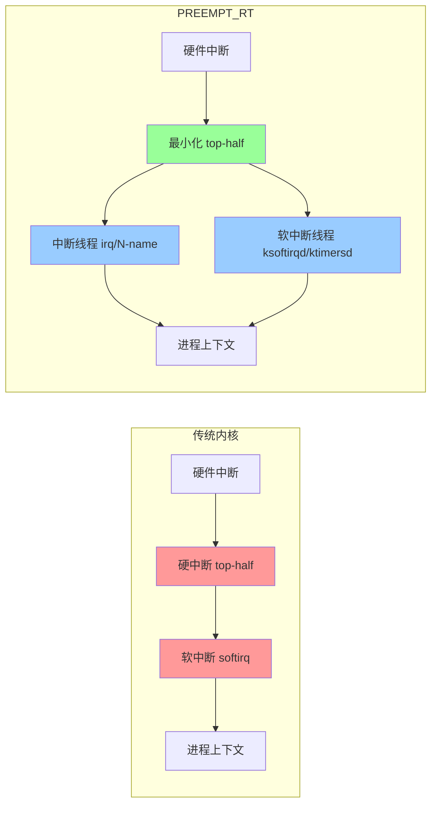

# 10.4.3 线程化中断的优势代价与PREEMPT_RT

> 所属章节：第10章 中断与时间 > 10.4 线程化中断
>
> 难度：[I→E] | 预计阅读时间：15分钟

## <span class="blue"> 本节导读

前两节解决了"为什么"和"怎么用"，本节回答"什么时候该用"：线程化中断的收益与代价如何权衡，哪些场景明确不适合。<br>
本节覆盖：线程化的优劣势对比与不适用场景清单、`threadirqs` 内核参数强制全局线程化的真实实现机制、PREEMPT_RT 的改造全景与合入主线的时间线，以及用 cyclictest 实测延迟改善的完整实验步骤。

---

## <span class="blue"> 线程化中断：收益与代价 [I]

### 优势：进程上下文的完整能力

传统中断处理运行在中断上下文，执行期间本地中断关闭，且不能调用任何可能睡眠的函数。这意味着中断里无法做这些事：

- 获取 `mutex`（可能睡眠等待）
- 读写文件系统（底层可能触发 I/O 等待）
- 访问 I2C/SPI 外设（总线传输需要睡眠等待）
- `kmalloc(GFP_KERNEL)` 分配内存（可能触发回收并睡眠）

线程化中断把耗时的处理交给 `irq/N-name` 内核线程，运行在进程上下文，**可以合法睡眠**，硬中断的"资源受限"问题随之消解。

第二个收益是**优先级可调度**。传统中断的处理优先级由硬件和中断控制器决定，软件无从插手；线程化之后，可以用 `chrt` 或 `sched_setscheduler()` 调整中断线程的调度策略与优先级，让关键中断的处理线程跑赢普通任务，让次要中断（如 USB 键盘）排在实时任务之后——10.4.1 的视频采集案例正是靠这个手段解决的。

### 代价：上下文切换

线程化引入的处理链路更长：

```
硬中断触发 → 执行最小化 top-half → 唤醒 irq/N-name 线程
→ 调度器选择该线程 → 上下文切换 → 线程执行 thread_fn
```

对比传统中断的"触发 → 执行完整 handler → 返回"，多出来的是**一次线程唤醒加一次上下文切换**。ARM64 上一次上下文切换的开销在几百纳秒到几微秒量级（取决于缓存失效程度）。对每秒几千次的中断，这个开销可以忽略；对每秒几十万次的高频中断，切换时间可能超过处理本身。

### 不适合的场景

- **超高频中断**（100kHz 量级及以上）：上下文切换开销占比过大，CPU 时间耗在切换上而不是处理上
- **极简中断处理**：只需要读一个寄存器、清一个标志位的中断，线程化没有收益
- **对延迟抖动极其敏感的场景**：线程化引入了调度延迟的不确定性——线程何时被调度执行，取决于系统当时的负载

### 对比速查

| 维度 | 线程化中断 | 传统中断 |
|:---|:---|:---|
| 执行上下文 | 进程上下文（`irq/N-name` 线程） | 中断上下文 |
| 可睡眠 | 可以调用 `mutex`、`kmalloc(GFP_KERNEL)` | 不能 |
| 调度策略 | 可调优先级、可用 `SCHED_FIFO` | 由硬件决定，软件不可调 |
| 额外开销 | 一次唤醒 + 上下文切换（微秒级） | 无 |
| 延迟确定性 | 取决于调度，有抖动 | 立即执行，确定性好 |
| 适用场景 | 需睡眠的资源访问、耗时处理、实时系统 | 极简处理、高频中断、超低延迟 |

> 💡 决策时问两个问题："这个中断处理需要睡眠吗？""中断频率有多高？"第一个回答"是"且频率不高，线程化就是合理选择。

> ⚠️ 同一个中断控制器的不同中断线各有独立的 action，线程化决策是按中断线独立的；但要注意 GPIO 控制器这类"级联"场景——GPIO 子系统的父中断一旦被线程化，挂在它下面的所有 GPIO 中断的响应路径都会经过这个线程，高频 GPIO 信号会被拖慢。

---

## <span class="blue"> PREEMPT_RT 与 threadirqs：全局强制线程化 [E]

如果想让系统里**所有**中断都线程化，又不逐个改驱动，内核提供了开关：`threadirqs`。

### threadirqs 的真实机制

启动参数加上 `threadirqs` 后，每个中断在注册时都会经过 `irq_setup_forced_threading()`（manage.c:1366）的改造：

```c
static int irq_setup_forced_threading(struct irqaction *new)
{
	if (!force_irqthreads())
		return 0;
	if (new->flags & (IRQF_NO_THREAD | IRQF_PERCPU | IRQF_ONESHOT))
		return 0;                      /* 这三类跳过 */

	/* ... */
	set_bit(IRQTF_FORCED_THREAD, &new->thread_flags);
	new->thread_fn = new->handler;       /* 原 handler 降级为线程函数 */
	new->handler = irq_default_primary_handler;  /* primary 换成默认的 */
	return 0;
}
```

机制一目了然：老驱动的 handler 被挪到 `thread_fn` 位置，primary handler 换成只返回 `IRQ_WAKE_THREAD` 的默认函数——不需要改一行驱动代码，中断处理就被搬进了线程。明确标记 `IRQF_NO_THREAD`（定时器等内核核心中断）、`IRQF_PERCPU` 的中断被跳过。

```
# 启动参数加入 threadirqs 后，系统中断线程随处可见
ps aux | grep irq/
# irq/28-eth0    —— 网卡中断成了线程
# irq/42-mmc0    —— MMC 中断也成了线程
```

> ⚠️ `threadirqs` 改变的是全系统所有中断的行为：整体吞吐会有可感知的下降，换来的是最坏延迟的收敛。它需要和实时调度策略、CPU 隔离等配套手段一起用才有意义，单独加上去通常只有代价没有收益。该参数要求内核编译了 `CONFIG_IRQ_FORCED_THREADING`。

### PREEMPT_RT 的全景：让内核几乎所有路径可抢占

`threadirqs` 只是 PREEMPT_RT 的一个组成部分。PREEMPT_RT 的目标是：**让内核中几乎所有执行路径都可以被抢占**，把最坏情况延迟压到微秒级。

传统内核里不可抢占的路径：

- 硬中断处理
- 软中断处理
- 持有自旋锁的临界区
- `preempt_disable()` 包裹的区域

PREEMPT_RT 逐项改造：



1. **spinlock → rt_mutex**：普通自旋锁替换为带优先级继承、可睡眠的锁，持锁临界区可被抢占
2. **软中断线程化**：softirq 在 ksoftirqd 等线程上下文执行，定时器到期处理在 ktimersd 线程执行
3. **中断处理线程化**：即上面的 `threadirqs` 逻辑，RT 内核默认开启

改造完成后，调度器几乎可以在任意时刻介入，高优先级任务的等待时间有了确定的上界。

### 合入主线的时间线

PREEMPT_RT 从独立补丁集到主线内核，走了二十年：

| 时间 | 进展 |
|:---|:---|
| 2004 年 | PREEMPT_RT 项目启动（Ingo Molnar、Thomas Gleixner 等） |
| 2006–2015 年 | hrtimer、threadirqs、generic irq 等基础设施陆续合入主线 |
| 2021 年 | Linux 5.15 合入实时锁基础（spinlock → rt_mutex 替换） |
| 2024 年 | Linux 6.12 合入最后一块（实时 printk 等），`CONFIG_PREEMPT_RT` 正式可用 |

从 6.12 开始，x86、ARM64、RISC-V 上可以直接在 menuconfig 里选择 `Fully Preemptible Kernel (Real-Time)` 抢占模型，不再需要外挂补丁。但要获得真正的硬实时保证，还需要配合 CPU 隔离、内存锁定、实时优先级设计等系统级手段，只打开内核开关远远不够。

### cyclictest：验证实时性的标准工具

启用 PREEMPT_RT 之后怎么证明有效？用 rt-tests 套件里的 `cyclictest`：启动周期性运行的实时线程，测量"实际唤醒时间 − 期望唤醒时间"的延迟分布。

```bash
# 安装 rt-tests
sudo apt-get install rt-tests    # Debian/Ubuntu

# 基本用法：测量 10000 次周期唤醒的延迟
sudo cyclictest --smp -p 80 -i 1000 -l 10000 -q

# 参数说明：
# --smp    在所有 CPU 上同时测试
# -p 80    实时优先级 80（SCHED_FIFO）
# -i 1000  周期 1000μs
# -l 10000 循环 10000 次
# -q       安静模式，只输出摘要
```

典型输出：

```
# /dev/cpu_dma_latency set to 0us
# Histogram
000000 00000
000001 09982
000002 00012
...
000156 00001
# Total: 010000
# Min Latencies: 00001
# Avg Latencies: 00001
# Max Latencies: 00156
```

> 💡 参考量级：PREEMPT_RT 内核的 cyclictest 最坏延迟通常在几十微秒以内，普通 `CONFIG_PREEMPT` 内核的最坏延迟可达毫秒级。对工业控制、机器人运动控制这类场景，决定性指标是这个最大值，不是平均值。

#### 实战：完整对比实验

**步骤 1**：测普通内核基线。

```bash
# 确认当前内核不是 RT
uname -a
# 输出含 "PREEMPT" 但不含 "PREEMPT_RT"

sudo cyclictest -a -t 4 -p 80 -i 1000 -l 50000 -q -D 60
# -a 绑定所有 CPU，-t 4 每核 4 线程，-D 60 跑 60 秒
```

记录 `Max Latencies`。普通内核通常几十到几百微秒，负载下可能破毫秒。

**步骤 2**：切换到 PREEMPT_RT 内核（`CONFIG_PREEMPT_RT=y`）重启。

**步骤 3**：运行相同命令，对比两次结果。

```
# 普通内核（示例）：Max Latencies: 1248    —— 最坏 1.2ms
# RT 内核（示例）：  Max Latencies: 0032    —— 最坏 32μs
```

控制系统的痛点不是"通常很快"，而是"偶尔慢一次"——对比实验看的就是这个偶发长尾。

> ⚠️ cyclictest 测量时不做 CPU 隔离，后台任务（kswapd、kworker 等）会造成偶发干扰，最大延迟偏高。严谨测量要配合 `isolcpus` 启动参数隔离 CPU，并把测试线程绑定到隔离核上。

---

## <span class="blue"> 本节总结

| 概念 | 关键要点 |
|:---|:---|
| 线程化优势 | 进程上下文可睡眠、优先级可调、实时任务可抢占中断处理 |
| 线程化代价 | 额外一次唤醒 + 上下文切换（微秒级），引入调度抖动 |
| 不适合场景 | 超高频中断、极简处理、延迟抖动敏感场景 |
| 适合场景 | 需睡眠的资源访问（I2C/SPI/文件系统）、耗时处理、实时系统 |
| `threadirqs` | `irq_setup_forced_threading()` 把老 handler 降级为线程函数；NO_THREAD/PERCPU/ONESHOT 跳过 |
| PREEMPT_RT | 锁、软中断、中断、定时器全面线程化/可抢占化；Linux 6.12 起主线可用 |
| cyclictest | 测量周期唤醒延迟分布，关注 Max 而非 Avg |

核心决策原则："需要睡眠 → 线程化；频率超高 → 不线程化；全系统实时 → PREEMPT_RT"。

---

## <span class="blue"> 下一步

到这里，"中断来了之后怎么处理"已经讲完了。但嵌入式系统还有另一半问题：任务需要**定时**触发——数据采集、控制环路、状态轮询。定时从哪来、精度够不够？10.5.1 先看 Linux 传统定时器的精度问题：`jiffies` 和 `HZ` 为什么在高精度场景下不够用。

---

## <span class="blue"> 配套资源

| 资源 | 说明 | 获取/路径 |
|:---|:---|:---|
| rt-tests 源码 | cyclictest 等工具 | `git://git.kernel.org/pub/scm/utils/rt-tests/rt-tests.git` |
| PREEMPT_RT wiki | 官方文档 | https://wiki.linuxfoundation.org/realtime |
| 内核配置 | 启用 PREEMPT_RT | `make menuconfig` → `General setup` → `Preemption Model` → `Fully Preemptible Kernel (Real-Time)` |
| 关键源码 | 强制线程化改造 | `kernel/irq/manage.c: irq_setup_forced_threading()` |
| 关键源码 | 中断线程主循环 | `kernel/irq/manage.c: irq_thread()` |
| cyclictest 手册 | 参数详解 | `man cyclictest` |
