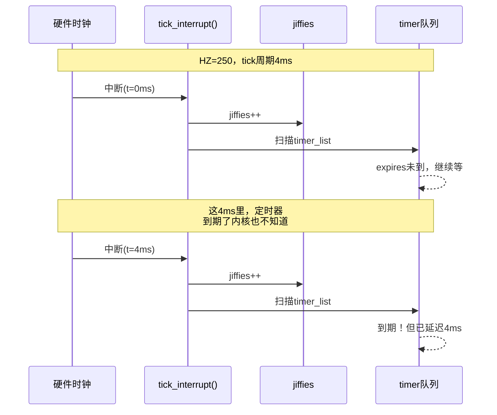

**知识点108 [I]**

见过做工业控制的朋友抱怨内核定时器不准吗？我有个亲身经历——给一个振动传感器写驱动，传感器要求每100微秒读一次ADC，我随手写了`setitimer`，结果发现最小间隔也就1毫秒，采集出来的波形整个糊掉。

问题出在哪？`setitimer`的精度直接受内核编译参数`HZ`的制约。`HZ`是什么？就是内核每秒产生时钟中断的次数。老一点的ARM板子`HZ`配100，tick间隔10毫秒；x86服务器上`HZ`通常是1000，tick间隔1毫秒。这意味着——**`setitimer`的最小精度不可能小于一个tick周期**。

来看段代码就明白了：

```c
#include <sys/time.h>

struct itimerval timer;
timer.it_value.tv_sec     = 0;
timer.it_value.tv_usec    = 100;    /* 想100微秒触发？ */
timer.it_interval.tv_sec  = 0;
timer.it_interval.tv_usec = 100;    /* 周期也是100微秒 */

setitimer(ITIMER_REAL, &timer, NULL);   /* 实际根本达不到 */
```

这段代码表面上设了100微秒的周期定时器，但在`HZ=1000`的系统上，实际最短也只能到1毫秒；`HZ=100`的系统更是直接给你撑到10毫秒。传感器每100微秒读一次的需求？门都没有。

不同`HZ`配置下的精度对比很直观：

| HZ值 | Tick周期 | setitimer实际最小精度 |
|:---:|:---:|:---:|
| 100 | 10 ms | ~10 ms |
| 250 | 4 ms | ~4 ms |
| 300 | 3.33 ms | ~3.33 ms |
| 1000 | 1 ms | ~1 ms |

说白了，`setitimer`这类传统接口本质上是在jiffies的时间轴上排队，而jiffies的"刻度"就是一个tick。刻度有多粗，定时器精度就有多粗。

> **陷阱**：早年有人以为把`tv_usec`填得足够小就能提高精度，甚至填0想让定时器"立刻"触发。但`setitimer`内部会把超时时间换算成jiffies，小于1 tick的值要么被四舍五入成1 tick，要么直接归零导致行为异常。想通过"调小参数"突破HZ限制，完全是方向性错误。

**知识点109 [I]**

那为什么精度被`HZ`焊得这么死？看底层实现就懂了。

传统定时器的核心是`timer_list`结构，用`add_timer()`、`mod_timer()`管理。注意它的`expires`字段——类型是`unsigned long`，存的**不是纳秒，就是jiffies值**：

```c
struct timer_list {
    struct list_head entry;
    unsigned long expires;          /* 到期时间，单位：jiffies */
    void (*function)(unsigned long);
    unsigned long data;
};
```

到期判断很简单：内核把`expires`跟当前`jiffies`一比，小于等于就算到期。关键问题是——**`jiffies`只在tick中断里变**。硬件时钟每1/HZ秒来一次中断，`jiffies`才加一。两次中断之间，内核对时间的感知完全是静止的：



整个到期检查完全寄托在tick中断的轮询上。微秒级的定时精度是刚需，传统定时器的短板暴露无遗。接下来要聊的hrtimer，就是为了打破这个枷锁。
