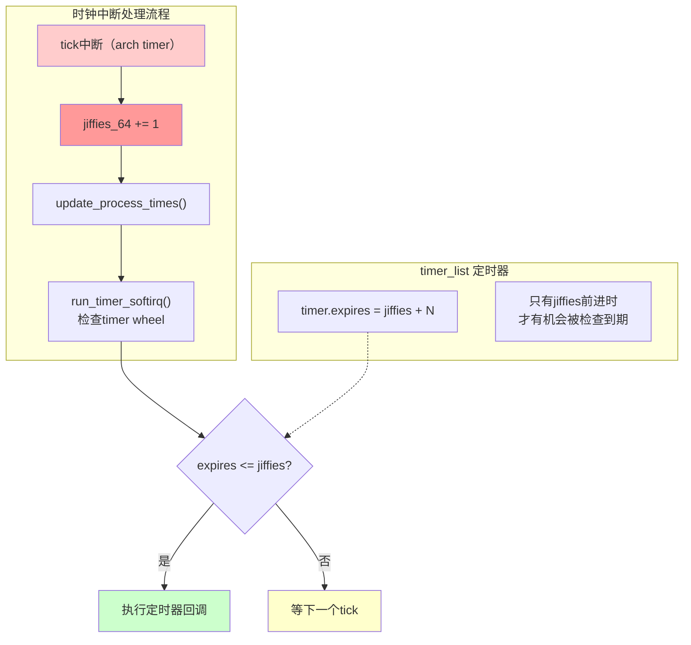

# 10.5.1 传统定时器的精度瓶颈

> 所属章节：第10章 中断与时间 > 10.5 时间子系统
>
> 难度：[I] | 预计阅读时间：12分钟

## <span class="blue">本节导读

需求是每 100μs 读一次 ADC，用 `setitimer(ITIMER_REAL, ...)` 设好 100μs 间隔，实测触发间隔却是 10ms —> 差了 100 倍。<br>
为什么 Linux 的传统定时器做不到微秒级精度？`HZ` 和 `jiffies` 在哪里设了限？<br>

本节覆盖：

- 传统定时器精度的量化公式（`1/HZ`）、
- `jiffies` 与 `timer_list` 的绑定关系、
- 提高 `HZ` 的代价与上限，为后面 hrtimer 的登场做铺垫。

---

## <span class="blue">为什么setitimer做不到100us精度 [I]</span>

场景：工业控制板需要每 100 微秒采集一次传感器数据。<br>
用 `setitimer` 把间隔设成 100μs：

```c
/* setitimer 精度测试：验证传统定时器在 100us 间隔下的实际表现。
 * 预期结果：受内核 HZ（通常 100/250/1000）限制，实际间隔远大于 100us，且抖动明显。
 */

#include <sys/time.h>
#include <signal.h>
#include <stdio.h>
#include <time.h>

#define INTERVAL_US 100    /* 目标间隔：100 微秒（传统 timer 达不到） */

static volatile unsigned long g_count = 0;   /* 累计触发次数 */
static struct timespec g_start;              /* 记录起始时间戳 */

void alarm_handler(int sig)
{
	struct timespec now;
	clock_gettime(CLOCK_MONOTONIC, &now);

	/* 计算从启动到现在的总耗时（微秒） */
	long elapsed_us = (now.tv_sec - g_start.tv_sec) * 1000000
			+ (now.tv_nsec - g_start.tv_nsec) / 1000;

	g_count++;

	/* 每 100 次打印一次平均间隔，平滑单次抖动 */
	if (g_count % 100 == 0)
		printf("count=%lu, avg_elapsed=%ldus, expected=%dus\n",
		       g_count, elapsed_us / g_count, INTERVAL_US);
}

int main(void)
{
	/* 注册 SIGALRM 信号处理函数 */
	signal(SIGALRM, alarm_handler);

	/* 配置 setitimer：ITIMER_REAL 基于实时时间，到期发 SIGALRM */
	struct itimerval itv = {
		.it_value    = { .tv_sec = 0, .tv_usec = INTERVAL_US },   /* 首次到期 */
		.it_interval = { .tv_sec = 0, .tv_usec = INTERVAL_US },   /* 周期间隔 */
	};

	/* 记录基准时间戳。用 CLOCK_MONOTONIC 避免系统时间被 NTP/用户调整干扰，
	 * 保证 elapsed 计算只反映真实流逝的物理时间。 */
	clock_gettime(CLOCK_MONOTONIC, &g_start);
    /* 启动传统间隔定时器。ITIMER_REAL 基于墙上时间（wall-clock），
	 * 到期向本进程发送 SIGALRM。精度受内核 HZ 限制，无法达到 itv 里写的 100us。 */
	setitimer(ITIMER_REAL, &itv, NULL);

	while (1)
		pause();   /* 挂起主线程，等信号唤醒，避免空转 CPU */

	return 0;
}
```

实测平均间隔不是 100μs，而是 4ms 或 10ms——取决于内核配置的 `HZ` 值。<BR>
**传统定时器的最小粒度不是由你指定的微秒数决定的，而是被 `HZ` 限制住了。**

`HZ` 是内核的 tick 频率，表示每秒触发多少次时钟中断。<BR>
每次 tick 到来时，内核才去检查定时器是否到期：

```
tick中断（HZ次/秒）
    │
    ▼
┌─────────────┐
│ jiffies++  │   ← 每次tick，jiffies只在这里+1
└─────────────┘
    │
    ▼
┌─────────────┐
│ run_timer_ │   ← 只在tick路径上检查timer wheel里的定时器
│ softirq()  │
└─────────────┘
```

精度公式：**传统定时器精度 = 1/HZ**。

| HZ值 | 精度（间隔） | 适用场景 | 开销评估 |
|:---:|:---:|:---:|:---:|
| 100Hz | **10ms** | 服务器，低功耗优先 | tick 开销低 |
| 250Hz | **4ms** | 桌面发行版默认，折中方案 | 中等 |
| 300Hz | **3.33ms** | 部分发行版的历史选择 | 中等 |
| 1000Hz | **1ms** | 低延迟交互（音频/游戏） | 上下文切换增多 |

以 `HZ=100` 为例，`jiffies` 每秒只增加 100 次。<br>
`setitimer` 设置的 100μs 换算成 jiffies 不足 1 个 tick，到期检查只能等到下一个 tick : 实际触发间隔被对齐到 10ms。

用户态传入的微秒值在内核里被 `usecs_to_jiffies()`（include/linux/jiffies.h）换算成 jiffy 数，<br>
不足一个 jiffy 的部分向上取整: 但取整也只是"下一个 tick 才检查"，粒度不会变细。

> ⚠️ 不要把 `HZ` 调到 1000 当作解决方案。<br>
> `HZ=1000` 只能把精度拉到 1ms, 对 100μs 的需求仍差 10 倍；同时每秒 1000 次时钟中断意味着更频繁地打断正在运行的任务，缓存失效增多、调度开销变大、功耗上升。

### jiffies与timer_list的绑定关系



关键约束：**所有 timer_list 定时器的到期判断只发生在 tick 中断的处理路径里**。<br>
jiffies 不前进，没有任何代码会去检查定时器是否到期。这就是传统定时器的精度天花板——它被锁定在 tick 的节拍上。

### 为什么提高HZ不是答案

| 提升HZ的代价 | 具体影响 |
|:---:|:---|
| CPU 开销 | 每次 tick 都要更新统计、检查定时器、驱动调度，1000Hz 的这部分开销是 100Hz 的 10 倍 |
| 缓存干扰 | tick 越频繁，打断用户态进程越多，缓存局部性越差 |
| 功耗 | 高频 tick 阻止 CPU 进入深度睡眠（详见 10.6） |
| 精度上限 | 即使 1000Hz 也只有 1ms，够不到微秒级 |

根本原因：传统定时器的设计目标本来就不是微秒级精度。<br>
`timer_list` + `jiffies` 诞生于 Linux 早期，当时的硬件时钟分辨率和调度需求都用不到那么细的粒度。

真正的突破方向是——**让定时器脱离对 jiffies 的依赖，直接基于硬件时钟的纳秒计数编程下一次中断**。<br>
这就是 hrtimer（high resolution timer）要解决的问题。

### 时间子系统分层架构一瞥

```
┌─────────────────────────────────────────────┐
│            用户态接口层                    │
│    setitimer / timer_create / alarm      │
├─────────────────────────────────────────────┤
│            通用时间层                      │
│    hrtimer（高精度）| timer_list（传统）   │
├─────────────────────────────────────────────┤
│            时钟事件层                      │
│    clockevents —— 提供单次/周期事件能力    │
├─────────────────────────────────────────────┤
│            时钟源层                        │
│    clocksource —— 提供单调递增的纳秒计数   │
├─────────────────────────────────────────────┤
│            硬件层                          │
│    ARM Generic Timer / TSC / HPET / APIC  │
└─────────────────────────────────────────────┘
```

传统 `timer_list` 卡在第二层，依赖 `jiffies` 做时间判断。<br>
`hrtimer` 则直接利用第三层 `clockevents` 的 oneshot 能力，把"下一次到期时刻"精确写进硬件定时器——这是微秒级精度的来源。

下一节逐层拆解这个架构。

---

## <span class="blue">本节总结</span>

| 要点 | 内容 |
|:---|:---|
| 精度公式 | 传统定时器精度 = `1/HZ`，由 timer_list 依赖 jiffies 的到期检查机制决定 |
| HZ 选项 | 100Hz(10ms)、250Hz(4ms)、300Hz(3.33ms)、1000Hz(1ms) |
| 根因 | timer wheel 只在 tick 路径上被检查，jiffies 每次 tick 才前进 |
| 调 HZ 的局限 | 1000Hz 仅 1ms 精度，开销显著增加，仍到不了微秒级 |
| 解决方向 | hrtimer 绕过 jiffies，基于 clockevent oneshot 直接编程硬件时钟 |

---

## <span class="blue">下一步</span>

10.5.2 时间子系统分层架构<BR>
——逐层拆解上面的五层图：`clocksource` 怎么提供纳秒计数、`clockevents` 怎么编程下一次中断、`hrtimer` 怎么把两者串起来实现微秒级精度。

---

## <span class="blue">配套资源</span>

| 资源类型 | 路径/说明 |
|:---|:---|
| 源码 | `kernel/time/itimer.c` — `setitimer` 内核实现 |
| 源码 | `kernel/time/timer.c` — timer_list 与 `run_timer_softirq` |
| 源码 | `include/linux/jiffies.h` — jiffies 与 `usecs_to_jiffies()` |
| 代码 | 本节 `setitimer` 精度测试代码（见上文） |
| 实测 | 查看当前 HZ：`zcat /proc/config.gz \| grep CONFIG_HZ` 或 `grep CONFIG_HZ /boot/config-$(uname -r)` |
