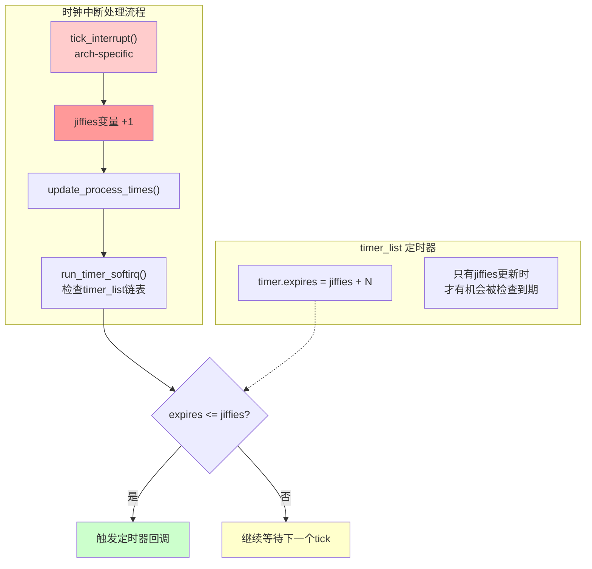

# 10.5.1 传统定时器的精度瓶颈

> 所属章节：第10章 中断与时间 > 10.5 高精度定时器
>
> 难度：[I] | 预计阅读时间：12分钟

## <span class="blue">本节导读</span>

你正在写一个传感器采集程序，需求是每100us读一次ADC。你第一反应是`setitimer(ITIMER_REAL, ...)`，但发现定时器要么10ms才触发一次，要么触发了但精度差得离谱。为什么Linux的传统定时器玩不转微秒级精度？这背后`HZ`和`jiffies`到底卡了什么脖子？本节带你从源码层看懂传统定时器的精度天花板，为后面hrtimer的登场做好铺垫。<br>
学完后，你将清楚知道传统定时器的精度公式（`1/HZ`），能测算自己系统的定时误差，并理解为什么单靠提高`HZ`不是正解。

---

## <span class="blue">为什么你的setitimer做不到100us精度 [I]</span>

想象一下这个场景：你有一块工业控制板，需要每100微秒（us）采集一次传感器数据。你写了段`setitimer`代码，把间隔设成100us，跑起来一看——

```c
// setitimer精度测试：尝试100us触发
#include <sys/time.h>
#include <signal.h>
#include <stdio.h>
#include <time.h>

#define INTERVAL_US 100

static volatile unsigned long g_count = 0;
static struct timespec g_start;

void alarm_handler(int sig)
{
    struct timespec now;
    clock_gettime(CLOCK_MONOTONIC, &now);
    // 计算从start到现在的实际耗时
    long elapsed_us = (now.tv_sec - g_start.tv_sec) * 1000000
                    + (now.tv_nsec - g_start.tv_nsec) / 1000;
    g_count++;
    if (g_count % 100 == 0)  // 每100次打印一次统计
        printf("count=%lu, elapsed=%ldus, expected=%dus\n",
               g_count, elapsed_us / g_count, INTERVAL_US);
}

int main(void)
{
    signal(SIGALRM, alarm_handler);
    struct itimerval itv = {
        .it_value    = { .tv_sec = 0, .tv_usec = INTERVAL_US },
        .it_interval = { .tv_sec = 0, .tv_usec = INTERVAL_US },
    };
    clock_gettime(CLOCK_MONOTONIC, &g_start);
    setitimer(ITIMER_REAL, &itv, NULL);
    while (1) pause();  // 等信号
    return 0;
}
```

运行结果大概率会让你失望——实测间隔不是100us，而是10ms。说白了，**传统定时器的最小粒度不是由你指定的微秒数决定的，而是被`HZ`死死掐住**。

`HZ`是内核的tick频率，表示每秒触发多少次时钟中断。每次tick中断到来时，内核才会去检查定时器是否到期。

```
tick中断（HZ次/秒）
    │
    ▼
┌─────────────┐
│ jiffies++   │   ← 每次tick，jiffies只在这里+1
└─────────────┘
    │
    ▼
┌─────────────┐
│ run_timer_  │   ← 只在这个时候检查timer_list里的定时器
│ softirq()   │     看看哪个到期了
└─────────────┘
```

这就是精度公式：**定时器精度 = 1/HZ**。

| HZ值 | 精度（间隔） | 适用场景 | 开销评估 |
|:---:|:---:|:---:|:---:|
| 100Hz | **10ms** | 桌面/服务器，低功耗优先 | tick开销低 |
| 250Hz | **4ms** | 桌面发行版默认，折中方案 | 中等 |
| 300Hz | **3.33ms** | 某些发行版的历史选择 | 中等 |
| 1000Hz | **1ms** | 需要低延迟交互（音频/游戏） | 上下文切换增多 |

以最常见的`HZ=100`为例，`jiffies`每秒只增加100次。你的`setitimer`设置的100us，在内核里会被换算成`jiffies`——结果直接变成0或1个jiffy，实际执行时就被四舍五入到10ms。

```c
// 内核代码简化的setitimer路径（kernel/time/itimer.c）
// 你的us值在这里被转换成jiffies
unsigned long usecs_to_jiffies(const unsigned int u)
{
    // HZ=100时，100us = 1/10000秒 = 0.01个jiffy → 四舍五入到0或1
    // 1个jiffy = 10ms
    return (u + (1000000 / HZ) - 1) / (1000000 / HZ);
}
```

> ⚠️ **陷阱**：以为把`HZ`无脑调到1000就能解决一切问题。`HZ=1000`确实能把精度拉到1ms，但每秒1000次时钟中断意味着CPU更频繁地打断正在运行的任务，缓存失效增多、上下文切换开销变大，功耗也跟着涨。最关键的一点——**1ms对100us的需求来说还是差十倍**。

> 💡 **提示**：就算你内核编译成了`HZ=1000`，1ms精度仍然满足不了传感器100us的需求。这就好比把水管从10厘米粗换成1厘米粗，但你的要求是1毫米——根本不是一个量级。

### jiffies与timer_list的依赖关系

下面的mermaid图展示了jiffies更新与timer_list检查之间的绑定关系——这是传统定时器精度的根源性限制：



看懂了吗？**timer_list里的所有定时器，它们的"到期判断"只发生在tick中断的处理路径里**。jiffies不更新，没人会去检查定时器到没到期。这就是传统定时器的天花板——它被锁死在tick的节拍里。

### 为什么提高HZ不是万能解

很多新手会有个直觉：精度不够？加频率啊！但现实没那么简单：

| 提升HZ的代价 | 具体影响 |
|:---:|:---|
| CPU开销 | 每次tick都要执行调度、更新统计、检查定时器，1000Hz就是100次/秒的10倍 |
| 上下文切换 | 更多的timer tick意味着更多机会打断用户态进程，缓存局部性变差 |
| 功耗 | 移动/嵌入式场景下，高频tick阻止CPU进入深度睡眠 |
| 精度上限 | 即使1000Hz也到不了微秒级，1ms对很多硬件场景仍是" eternity " |

换个角度想：传统定时器的设计初衷就不是为了微秒级精度。`timer_list`和`jiffies`这套机制诞生于Linux早期，那时候的硬件时钟分辨率有限，调度也不需要那么细的粒度。

真正需要突破的是——**让定时器脱离对jiffies的依赖，直接对接硬件时钟的微秒级计数**。这就是hrtimer（high resolution timer）要解决的问题。

### 时间子系统分层架构一瞥

为了让你对全局有个概念，这是Linux时间子系统的分层架构：

```
┌─────────────────────────────────────────────┐
│            用户态接口层                       │
│    setitimer / timer_create / alarm         │
├─────────────────────────────────────────────┤
│            通用时间层                         │
│    hrtimer（高精度）| timer_list（传统）     │
├─────────────────────────────────────────────┤
│            时钟事件层                         │
│    clockevents —— 提供单次/周期事件能力      │
├─────────────────────────────────────────────┤
│            时钟源层                           │
│    clocksource —— 提供单调递增的纳秒计数     │
├─────────────────────────────────────────────┤
│            硬件层                             │
│    PIT / HPET / TSC / ARM GT / local APIC   │
└─────────────────────────────────────────────┘
```

传统`timer_list`卡在第二层，依赖`jiffies`做时间判断。`hrtimer`则能穿透到第三层`clockevents`，直接基于硬件时钟的纳秒计数来编程下一次中断——这才是微秒级甚至纳秒级精度的底气所在。

---

## <span class="blue">本节总结</span>

| 要点 | 内容 |
|:---|:---|
| 精度公式 | 传统定时器精度 = `1/HZ`，由`timer_list`依赖`jiffies`决定 |
| HZ选项 | 100Hz(10ms)、250Hz(4ms)、300Hz(3.33ms)、1000Hz(1ms) |
| 根因 | `timer_list`只在tick中断时检查，`jiffies`每次tick才+1 |
| 调HZ的局限 | 1000Hz仅到1ms精度，开销已显著增加，仍到不了us级 |
| 解决方向 | hrtimer绕过`jiffies`，直接基于`clockevent`编程硬件时钟 |

---

## <span class="blue">下一步</span>

10.5.2 时间子系统分层架构——我们会深入拆解图中的每一层，搞清楚`clocksource`怎么提供纳秒计数、`clockevents`怎么编程下一次中断，以及`hrtimer`是怎么把两者串起来实现微秒级精度的。

---

## <span class="blue">配套资源</span>

| 资源类型 | 路径/说明 |
|:---|:---|
| 📄 源码 | `kernel/time/itimer.c` — `setitimer`内核实现 |
| 📄 源码 | `kernel/time/timer.c` — `timer_list`与`run_timer_softirq` |
| 📄 源码 | `include/linux/jiffies.h` — `jiffies`相关宏定义 |
| 📋 代码 | 本节`setitimer`精度测试代码（见上文） |
| 🔧 实测 | 你的系统当前`HZ`值：`zcat /proc/config.gz \| grep CONFIG_HZ` 或 `grep "CONFIG_HZ" /boot/config-$(uname -r)` |
