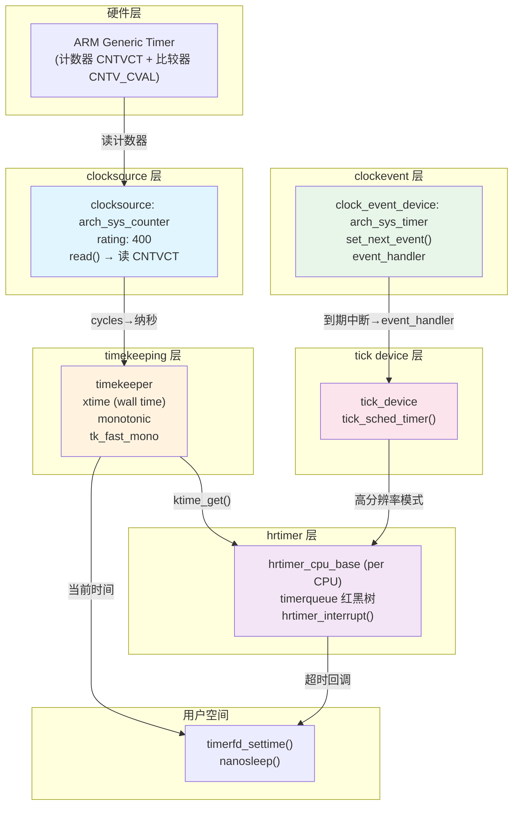

# 10.5.2 时间子系统分层架构

> 所属章节：第10章 中断与时间 > 10.5 时间子系统
>
> 难度：[E→M] | 预计阅读时间：35分钟

## <span class="blue"> 本节导读

系统时间显示（wall time）、程序计时（monotonic time）、调度器周期 tick、微秒级定时<BR>
——这些需求依赖的硬件时钟各不相同，Linux 时间子系统用一套**五层架构**把它们统一起来：

1. 每层职责单一，
2. 层间通过明确接口协作，
3. ARM Generic Timer、
4. x86 TSC、HPET 等各种硬件都能接入同一个框架。<br>
   
本节覆盖：

- 五层架构的逐层拆解、
- 从"读硬件计数器"到"定时器回调执行"的两条数据流、
- clocksource 的 rating 选择与 watchdog 降级机制、
- clockevent 的两种工作模式（基于 v6.6 真实结构）。

---

## <span class="blue"> 五层架构全景：从"读时钟"到"精确定时" [E→M]

### 各层分工

```
┌─────────────────────────────────────┐
│  第5层 hrtimer：高精度定时器框架    │  ← 面向使用方，红黑树管理超时
│    "我要在10.5ms后被叫醒"          │
├─────────────────────────────────────┤
│  第4层 tick device：tick的生产者    │  ← 连接timekeeping与clockevent
│    "每1ms/4ms发一次心跳"           │
├─────────────────────────────────────┤
│  第3层 clockevent："未来叫醒我"    │  ← set_next_event 编程接口
│    oneshot(单次) 或 periodic(周期) │
├─────────────────────────────────────┤
│  第2层 timekeeping：维护时间轴      │  ← wall time + monotonic time
│    "从开机到现在过了多少纳秒"        │     NTP同步、闰秒处理
├─────────────────────────────────────┤
│  第1层 clocksource：提供"现在几点"  │  ← 读取硬件计数器
│    ARM CNTVCT / x86 TSC / HPET     │     抽象为纳秒值
└─────────────────────────────────────┘
```

分层的核心设计点：**clocksource 只管"读时间"，clockevent 只管"设闹钟"，两者完全解耦**。<br>
一块 SoC 上可以用 ARM Generic Timer 同时提供两种能力，也可以用 TSC 做 clocksource、用 local APIC timer 做 clockevent—> 任意组合。

### 数据流全景图



数据流分两条线：<br>
**读时间线**（左侧）：`ktime_get()` → timekeeping 从当前 clocksource 读计数器 → 用 mult/shift 换算成纳秒返回。<br>
**设闹钟线**（右侧）：hrtimer 找到最近到期时刻 → 经 tick device 调用 clockevent 的 `set_next_event()` → 硬件比较器到期产生中断 → `hrtimer_interrupt()` 遍历红黑树执行到期回调。

两条线在 timekeeping 交汇：timekeeping 用 clocksource 跟踪时间流逝，hrtimer 用 timekeeping 提供的当前时间判断超时。

### 五层对比一览

| 层级 | 核心职责 | 关键数据结构 | 核心代码路径 | 典型硬件 |
|:---:|---|---|---|---|
| clocksource | 读取单调递增计数 | `struct clocksource` | `kernel/time/clocksource.c` | ARM CNTVCT、x86 TSC、HPET |
| timekeeping | 维护 wall/monotonic 时间轴、NTP | `struct timekeeper` | `kernel/time/timekeeping.c` | （纯软件层） |
| clockevent | 编程下一次事件触发时刻 | `struct clock_event_device` | `kernel/time/clockevents.c` | ARM Generic Timer、APIC Timer |
| tick device | 产生周期性或动态 tick | `struct tick_device` | `kernel/time/tick-common.c` | （软件适配层） |
| hrtimer | 高精度定时器框架 | `struct hrtimer`、`hrtimer_cpu_base` | `kernel/time/hrtimer.c` | （纯软件框架） |

### 分层解决了什么问题

**1. clocksource 与 clockevent 解耦**<br>
clocksource 回答"现在几点"，clockevent 回答"到点叫我"。<br>
平台可以用快但可能不稳定的 TSC 做 clocksource、用稳定的 HPET 做参考，组合自由。

**2. 硬件更换不影响上层**<br>
ARMv7 换 ARMv8，定时器寄存器变了，只需更新 clocksource/clockevent 驱动的底层读写函数，timekeeping 以上不动。

**3. tick 模式可动态切换**<br>
periodic tick 与 tickless（NO_HZ）的差异被限制在 tick device 层，调度器看到的接口不变（详见 10.6）。

**4. hrtimer 不依赖具体硬件**<br>
hrtimer 只管从红黑树里找最近到期节点，告诉 tick device"下次在这个时刻叫醒我"。底层用哪个硬件定时器，hrtimer 不关心。

> 💡 ARM64 上同一个驱动 `drivers/clocksource/arm_arch_timer.c` 同时注册 clocksource 和 clockevent<br>
> ——这不是两层合并，而是一个驱动扮演两个角色：既提供"读计数器"接口，又提供"设定时器"接口。

---

## <span class="blue"> clocksource、timekeeping与clockevent深入 [E]

### clocksource的rating机制：选最靠谱的源

一个系统可能同时有多个时钟源。<BR>
内核用 **rating 机制**选择，每个 clocksource 注册时带一个评分：

| 时钟源 | rating | 特点 |
|---|:---:|---|
| ARM Generic Timer | 400 | 现代 ARM 首选（drivers/clocksource/arm_arch_timer.c:254） |
| TSC (x86) | 300 | 快，但变频/多路服务器上可能不稳定 |
| HPET | 250 | 稳定但访问慢 |
| ACPI PM Timer | 200 | 稳定但频率低（3.58MHz） |
| jiffies | 1 | 保底选项，始终可用 |

内核选择 **rating 最高且通过 watchdog 校验**的 clocksource 作为活跃源。<br>
注册路径（`kernel/time/clocksource.c`）：

```c
/* 注册流程要点（简化示意） */
clocksource_register(cs)              /* include/linux/clocksource.h 内联 */
    └── __clocksource_register(cs)
            ├── __clocksource_update_freq_scale()  /* 计算 mult/shift */
            ├── clocksource_enqueue()              /* 按 rating 插入链表 */
            └── clocksource_select()               /* 必要时切换活跃源 */
```

`mult`/`shift` 组合是定点数优化：硬件读出 cycles，换算纳秒用 `ns = cycles * mult >> shift`，避免浮点除法。

> ⚠️ TSC rating 高但可能不稳定（变频停转、多路不同步）。<br>
> 内核的 **clocksource watchdog** 会用第二个独立时钟源定期校验 TSC，发现偏差超标就**自动降级**到更稳定的源。<BR>
> dmesg 里出现 `clocksource: switched to ...` 就是这个机制生效了。

### timekeeping层：两条时间轴

v6.6 的 `struct timekeeper`（kernel/time/timekeeping.h）核心字段的逻辑视图：

```c
struct timekeeper {
	struct tk_read_base tkr_mono;   /* .clock 当前clocksource、.cycle_last 上次读数 */
	struct tk_read_base tkr_raw;    /* raw 时钟（不受NTP影响） */
	u64			xtime_sec;      /* wall time 秒部分 */
	unsigned long		xtime_nsec;     /* wall time 纳秒部分 */
	struct tk_fast		tk_fast_mono;   /* monotonic 快速读取缓存 */
	/* ... NTP 调整字段等省略 */
};
```

timekeeping 维护两条独立时间轴：

**Wall Time（CLOCK_REALTIME）**：受 NTP 同步影响。<BR>
NTP 守护进程通过 `adjtimex()` 微调频率和偏移，wall time 可能**跳变**（向前或向后）。

**Monotonic Time（CLOCK_MONOTONIC）**：从开机单调递增，**不随 NTP 跳变**。<BR>
NTP 的调整体现为频率补偿——时钟快了 100ms，monotonic 会走得**慢一点**追平，而不是回拨 100ms。

> 💡 计算超时务必用 `clock_gettime(CLOCK_MONOTONIC)` 或内核的 `ktime_get()`。<BR>
> 用 wall time 算超时，NTP 校时一跳变，定时器就可能提前或延后触发。

### clockevent的两种工作模式

v6.6 的 `struct clock_event_device`（include/linux/clockchips.h，节选真实字段）：

```c
struct clock_event_device {
	void	(*event_handler)(struct clock_event_device *);
	int	(*set_next_event)(unsigned long evt, struct clock_event_device *);
	int	(*set_next_ktime)(ktime_t expires, struct clock_event_device *);
	unsigned int		features;      /* CLOCK_EVT_FEAT_ONESHOT 等 */
	int	(*set_state_periodic)(struct clock_event_device *);
	int	(*set_state_oneshot)(struct clock_event_device *);
	int	(*set_state_shutdown)(struct clock_event_device *);
	/* ... */
	const char		*name;
	int			rating;
	const struct cpumask	*cpumask;
} ____cacheline_aligned;
```

注意 v6.6 已没有老式 `set_mode()` 接口，模式切换由一组 `set_state_*()` 函数承担；`features` 标志位声明硬件能力（如 `CLOCK_EVT_FEAT_ONESHOT`）。

| 模式 | 行为 | 适用场景 |
|---|---|---|
| **PERIODIC** | 硬件按固定周期重复触发 | 传统 tick，无需每次重新编程 |
| **ONESHOT** | 只触发一次，下次需重新调 `set_next_event()` | tickless / hrtimer 精确定时 |

oneshot 模式是 hrtimer 的精度基础：periodic 模式下 tick 间隔固定（如 4ms），一个 2.3ms 后到期的定时器只能对齐到下一个 tick；oneshot 模式下，内核直接把"2.3ms 后"换算成硬件计数值写进比较器，误差只取决于硬件分辨率。

ARM Generic Timer 的 oneshot 编程（drivers/clocksource/arm_arch_timer.c，`arch_timer_set_next_event_virt()`）逻辑：

```c
/* 逻辑要点（简化） */
arch_timer_set_next_event_virt(unsigned long evt, struct clock_event_device *clk)
{
	/* 把"再过 evt 个 cycles"写入 CNTV_TVAL_EL0，
	 * 并使能定时器；计数到 0 触发 PPI 中断 */
}
```

> 🔴 clockevent device 是 **per-CPU** 的。<BR>
> Generic Timer 天然 per-CPU（每个核心有自己的比较器寄存器），但共享的外接定时器在多核上使用时要小心中断路由<BR>
> ——在 CPU0 上设定的事件如果路由到 CPU1 处理，定时器语义就乱了。

---

## <span class="blue"> 本节总结

| 维度 | 核心要点 |
|---|---|
| 五层架构 | clocksource → timekeeping → clockevent → tick device → hrtimer，职责单一 |
| clocksource | rating 机制选最优源；watchdog 检测不稳定源并自动降级 |
| timekeeping | wall time（受 NTP 影响）与 monotonic time（单调递增）双时间轴 |
| clockevent | ONESHOT 是 hrtimer 精度基础；v6.6 用 set_state_* 接口 |
| 分层意义 | 读时间与设闹钟解耦，硬件任意组合，上层不依赖具体实现 |
| 关键原则 | 定时计算一律用 monotonic time |
| 验证命令 | `cat /sys/devices/system/clocksource/clocksource0/current_clocksource` |

---

## <span class="blue"> 下一步

10.5.3 timer wheel 级联实现——传统 timer_list 这一层，内核如何用时间轮高效管理成千上万个到期时间各不相同的定时器，做到 O(1) 插入与批量到期处理。

---

## <span class="blue"> 配套资源

| 资源类型 | 路径/命令 | 说明 |
|---|---|---|
| 核心代码 | `kernel/time/clocksource.c` | clocksource 注册与 rating 选择 |
| 核心代码 | `kernel/time/timekeeping.c` | timekeeping 主逻辑，struct timekeeper 在同目录 timekeeping.h |
| 核心代码 | `kernel/time/clockevents.c` | clockevent 框架 |
| 核心代码 | `kernel/time/hrtimer.c` | 高精度定时器框架 |
| 平台驱动 | `drivers/clocksource/arm_arch_timer.c` | ARM Generic Timer 驱动（v6.6 路径） |
| 查看命令 | `cat /sys/devices/system/clocksource/clocksource0/available_clocksource` | 列出可用时钟源 |
| 查看命令 | `cat /sys/devices/system/clocksource/clocksource0/current_clocksource` | 查看当前活跃时钟源 |
| 查看命令 | `dmesg \| grep -i clocksource` | 时钟源切换日志 |
| 查看命令 | `cat /proc/timer_list` | 系统中所有定时器的详细状态 |
