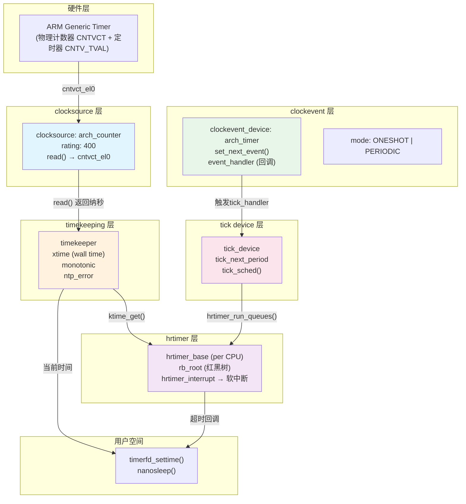

# 10.5.2 时间子系统分层架构

> 所属章节：第10章 中断与时间 > 10.5 Linux时间子系统
>
> 难度：[E][M] | 预计阅读时间：35分钟

## <span class="blue"> 本节导读

想想看：你的手机要显示"现在几点"（wall time），倒计时APP要知道"过了多久"（monotonic time），内核调度器需要周期性tick，音视频播放需要微秒级定时——这些需求全依赖不同硬件时钟，怎么办？<br>

Linux时间子系统的答案是：**五层架构**。每层只干一件事，层与层之间通过明确接口协作。这种设计让ARM的Generic Timer、x86的TSC、HPET等各种硬件都能无缝接入同一个框架。<br>

本节带你逐层拆解这个架构。学完以后，你能清晰描述从"读一个硬件计数器"到"APP收到定时器回调"的完整路径，也能理解为什么TSC不稳定时内核能自动切换到更可靠的时钟源。

---

## <span class="blue"> 五层架构全景：从"读时钟"到"精确定时" [E][M]

### 一句话概括各层分工

时间子系统就像一家精密钟表工厂，五层楼各司其职：

```
┌─────────────────────────────────────┐
│  第5层 hrtimer：高精度定时器框架      │  ← 用户-facing，红黑树管理超时
│    "我要在10.5ms后被叫醒"            │
├─────────────────────────────────────┤
│  第4层 tick device：tick的生产线      │  ← 连接timekeeping与clockevent
│    "每1ms/4ms发一次心跳"             │
├─────────────────────────────────────┤
│  第3层 clockevent："未来叫醒我"      │  ← 提供set_next_event编程接口
│    只触发一次(oneshot)或周期性(periodic)│
├─────────────────────────────────────┤
│  第2层 timekeeping：维护时间轴        │  ← wall time + monotonic time
│    "从开机到现在过了多少纳秒"          │     NTP同步、闰秒处理
├─────────────────────────────────────┤
│  第1层 clocksource：提供"现在几点"    │  ← 读取硬件计数器
│    ARM CNTVCT / x86 TSC / HPET       │     抽象为纳秒值
└─────────────────────────────────────┘
```

这个分层妙在哪里？**clocksource只管"读时间"，clockevent只管"设闹钟"，两者完全解耦**。你的板子上可能用ARM Generic Timer同时提供两种能力，也可能用TSC做clocksource、用APIC timer做clockevent——任意组合都行。

### 数据流全景图

下面这张图展示了一个定时器从注册到触发的完整数据流：



数据流分两条线走：<br>
**读时间线**（左侧）：APP调用 `ktime_get()` → timekeeping从当前clocksource读计数器 → 换算成纳秒返回。<br>
**设闹钟线**（右侧）：hrtimer把下一次超时时间写给tick device → tick device调用clockevent的 `set_next_event()` → 硬件定时器到期产生中断 → 中断里hrtimer红黑树被遍历 → 到期回调被执行。<br>

这两条线在某一点交汇：timekeeping用clocksource来跟踪时间流逝，hrtimer用timekeeping获取当前时间来判断是否超时。

### 五层对比一览

| 层级 | 核心职责 | 关键数据结构 | 核心代码路径 | 典型硬件实现 |
|:---:|---|---|---|---|
| clocksource | 提供读取单调递增计数的接口 | `struct clocksource` | `kernel/time/clocksource.c`<br>`clocksource_register()` | ARM CNTVCT_EL0<br>x86 TSC<br>HPET |
| timekeeping | 维护wall time与monotonic time<br>NTP同步、闰秒 | `struct timekeeper`<br>`tk_fast_mono` | `kernel/time/timekeeping.c`<br>`do_timer()` | （纯软件层） |
| clockevent | 提供programming接口<br>设置下一次事件触发时间 | `struct clock_event_device` | `kernel/time/clockevents.c`<br>`clockevents_config_and_register()` | ARM Generic Timer<br>APIC Timer<br>PIT 8253 |
| tick device | 连接timekeeping和clockevent<br>产生周期性或动态tick | `struct tick_device` | `kernel/time/tick-common.c`<br>`tick_setup_device()` | （软件适配层） |
| hrtimer | 高精度定时器框架<br>红黑树管理、微秒级精度 | `struct hrtimer`<br>`struct hrtimer_base` | `kernel/time/hrtimer.c`<br>`hrtimer_start()` | （纯软件框架） |

### 分层的意义：为什么不是一个大杂烩？

如果没有分层，时间代码会变成什么样？<br>

> 假设你要在ARM平台上加一个定时器。没有分层的话，你得同时修改"读时间的代码"、"设闹钟的代码"、"调度器tick的代码"——牵一发而动全身。<br>

分层之后的好处一目了然：<br>

**1. clocksource与clockevent解耦**<br>
`clocksource`回答"现在几点"，`clockevent`回答"到点了叫我"。一个平台可以用TSC（快但不稳定）做clocksource，用HPET（稳定）做clockevent。反过来也行。这种组合灵活性是分层最核心的价值。<br>

**2. 硬件更换不需要改上层**<br>
ARM从v7换到v8，Generic Timer的寄存器变了？只需要重写clocksource和clockevent的底层读写函数，timekeeping以上完全不动。<br>

**3. tick模式可以动态切换**<br>
periodic tick（固定频率）和tickless（NO_HZ，动态tick）的实现差异被限制在tick device层。调度器看到的tick接口不变。<br>

**4. hrtimer不依赖任何具体硬件**<br>
hrtimer只管在红黑树里找最近要超时的节点，然后告诉tick device "下次叫醒我在这时候"。至于用哪个硬件定时器实现，hrtimer完全不知道也不关心。<br>

> 💡 **提示**：在ARM64上，你经常看到一个驱动（如`arch/arm64/kernel/arch_timer.c`）同时注册了clocksource和clockevent。这不表示两层合并了，而是一个驱动扮演了"两个角色"——它同时提供了"读计数器"和"设定时器"两个独立接口。

---

## <span class="blue"> clocksource、timekeeping与clockevent深入 [E]

### clocksource的rating机制：谁更靠谱用谁

一个系统可能同时有多个时钟源可用。比如x86服务器上同时存在TSC、HPET、ACPI PM Timer。内核怎么选？

答案是**rating机制**。每个clocksource注册时带一个rating分数：

| 时钟源 | 典型rating | 特点 |
|---|---|---|
| TSC (x86) | 300-400 | 纳秒级精度，但可能变频/停转 |
| HPET | 250 | 稳定但访问慢 |
| ACPI PM Timer | 200 | 最稳定但频率低（3.58MHz） |
| ARM Generic Timer | 400 | 现代ARM首选，稳定且快 |
| jiffies | 1 | 保底选项，始终可用 |

内核总是选择**rating最高且通过watchdog检验**的clocksource作为当前活跃源。

来看clocksource注册的核心代码：

```c
/* kernel/time/clocksource.c */

static struct clocksource *clock = &clocksource_jiffies;

void clocksource_register(struct clocksource *cs)
{
    /* 1. 计算该时钟源的精度（纳秒/周期） */
    clocksource_calc_mult_shift(&cs->mult, &cs->shift,
                                cs->freq, NSEC_PER_SEC, 3600);
    /* 2. 加入全局链表 */
    list_add(&cs->list, &clocksource_list);
    /* 3. 按rating排序，选择最佳 */
    clocksource_select();
}

static void clocksource_select(void)
{
    struct clocksource *best = NULL;
    /* 遍历所有已注册的clocksource，选rating最高的 */
    list_for_each_entry(cs, &clocksource_list, list) {
        if (!best || cs->rating > best->rating)
            best = cs;
    }
    if (best && best != clock)
        clock = best;  /* 切换当前活跃时钟源 */
}
```

`mult` 和 `shift` 这个组合很有意思——它们是定点数除法优化。硬件计数器读出来的是cycles，要转成纳秒：`ns = cycles * mult >> shift`。用乘加右移代替浮点除法，速度快得多。<br>

> ⚠️ **陷阱**：TSC的rating虽然高（400），但它有个致命问题——CPU变频时TSC可能停转或频率变化。内核有一个**clocksource watchdog**（在`clocksource_watchdog()`里），它会用第二个独立时钟源（如HPET）定期验证TSC。如果发现TSC走得明显快或慢，内核会**自动降级**到更稳定的时钟源，整个过程不需要用户干预。如果你在x86笔记本上看到`clocksource: switched to hpet`的dmesg日志，八成就是这个机制生效了。

### timekeeping层：两条时间轴

timekeeping的核心数据结构是`struct timekeeper`：

```c
/* kernel/time/timekeeping.h (简化) */
struct timekeeper {
    /* xtime: wall time，从1970年1月1日开始的纳秒数 */
    struct timespec64 xtime_sec;
    u64 xtime_nsec;

    /* 当前使用的clocksource */
    struct clocksource *clock;
    u64 cycle_last;          /* 上次读取的硬件cycles */

    /* NTP调整相关 */
    s64 ntp_error;
    long ntp_tick;           /* NTP微调后的tick长度 */

    /* 影子数据，用于快速读monotonic时间 */
    u64 tk_fast_mono;        /* 缓存的monotonic纳秒值 */
};

/* 全局timekeeper实例 */
static struct timekeeper tk;
```

timekeeping维护两条独立的时间轴：<br>

**Wall Time（xtime / CLOCK_REALTIME）**：受NTP同步影响。NTP守护进程通过`adjtimex()`系统调用微调频率和偏移，让系统时间与网络时间服务器保持一致。这意味着wall time可能会**跳变**（向前跳或向后跳）。<br>

**Monotonic Time（CLOCK_MONOTONIC）**：从系统启动开始单调递增，**不受NTP调整影响**。NTP的调整被换算成频率补偿，体现在时间流逝的快慢上，而不是直接修改monotonic读数。也就是说，如果NTP发现你的时钟快了100ms，它会让monotonic时间走得**慢一点**，而不是回拨100ms。<br>

> 💡 **提示**：写定时器代码时，如果你用 `gettimeofday()`（基于wall time）计算超时，NTP跳变可能导致定时器提前或延后触发。正确做法是使用 `clock_gettime(CLOCK_MONOTONIC)` 或内核里的 `ktime_get()`——这些基于monotonic time，保证单调递增。

### clockevent的两种工作模式

clockevent_device有两个核心操作：`set_next_event()` 和 `set_mode()`。

```c
/* kernel/include/linux/clockchips.h */
struct clock_event_device {
    void (*event_handler)(struct clock_event_device *);
    int (*set_next_event)(unsigned long evt,
                          struct clock_event_device *);
    void (*set_mode)(enum clock_event_mode mode, ...);
    ...
    enum clock_event_mode mode;
};
```

| 模式 | 行为 | 适用场景 |
|---|---|---|
| **PERIODIC** | 硬件自动按固定周期重复触发 | 传统tick（每1ms/4ms），无需每次重新编程 |
| **ONESHOT** | 只触发一次，下次触发需重新调用`set_next_event()` | tickless/dyntick、hrtimer精确定时 |

为什么oneshot模式是hrtimer的基础？<br>

hrtimer要求**任意时刻**的超时精度。用periodic模式，tick间隔固定（比如4ms），一个需要2.3ms后触发的hrtimer只能等到下一个tick（可能等3.7ms），精度大打折扣。用oneshot模式，hrtimer直接算出"从现在开始再过2.3ms"对应的硬件计数值，调用 `set_next_event()` 精确设下去——误差只有几十纳秒。<br>

ARM Generic Timer的oneshot编程大概是这样：

```c
/* arch/arm64/kernel/arch_timer.c */
static int arch_timer_set_next_event(unsigned long evt,
                                      struct clock_event_device *clk)
{
    unsigned long ctrl;
    /* 1. 禁用当前定时器 */
    ctrl = arch_timer_reg_read(..., CNTP_CTL_EL0);
    ctrl &= ~ARCH_TIMER_CTRL_ENABLE;
    arch_timer_reg_write(..., CNTP_CTL_EL0, ctrl);

    /* 2. 写入新的计数值 */
    arch_timer_reg_write(..., CNTP_TVAL_EL0, evt);

    /* 3. 重新启用 */
    ctrl |= ARCH_TIMER_CTRL_ENABLE;
    arch_timer_reg_write(..., CNTP_CTL_EL0, ctrl);

    return 0;
}
```

写入`CNTP_TVAL_EL0`的值是"从现在起再过多少cycles"。计数到0时，定时器中断触发。这就是"未来叫醒我"的底层实现。

> 🔴 **危险**：在SMP系统上，clockevent device是**per-CPU**的。如果你在第1个CPU上调用`set_next_event()`但中断实际在第2个CPU上被处理，会导致定时器事件丢失。Generic Timer天然是per-CPU绑定的（每个核心有自己的`CNTV_TVAL`），所以不会出这个问题。但某些外接定时器（如共享的PIT）在多核上使用时需要特别小心路由配置。

---

## <span class="blue"> 本节总结

| 维度 | 核心要点 |
|---|---|
| **五层架构** | clocksource → timekeeping → clockevent → tick device → hrtimer，每层职责单一 |
| **clocksource** | 通过rating机制自动选择最优时钟源；watchdog自动检测TSC等不稳定源并降级 |
| **timekeeping** | 维护wall time（受NTP影响）和monotonic time（单调递增）；`tk_fast_mono`加速读取 |
| **clockevent** | ONESHOT模式是hrtimer高精度基础；PERIODIC模式用于传统tick |
| **分层意义** | clocksource与clockevent解耦，硬件可任意组合；上层不依赖具体硬件实现 |
| **关键陷阱** | TSC可能不稳定，依赖watchdog自动回退；定时器代码必须用monotonic time |
| **验证命令** | `cat /sys/devices/system/clocksource/clocksource0/current_clocksource` 查看当前时钟源 |

---

## <span class="blue"> 下一步

10.5.3 将深入**timer wheel级联实现**——当hrtimer与低精度timer共存时，内核如何用"级联时间轮"高效管理成千上万个超时定时器，避免每次中断都遍历全量定时器。

---

## <span class="blue"> 配套资源

| 资源类型 | 路径/命令 | 说明 |
|---|---|---|
| 📁 核心代码 | `kernel/time/clocksource.c` | clocksource注册与rating选择 |
| 📁 核心代码 | `kernel/time/timekeeping.c` | timekeeping主逻辑 |
| 📁 核心代码 | `kernel/time/clockevents.c` | clockevent框架 |
| 📁 核心代码 | `kernel/time/hrtimer.c` | 高精度定时器框架 |
| 📁 平台代码 | `arch/arm64/kernel/arch_timer.c` | ARM64 Generic Timer驱动 |
| 🛠️ 查看命令 | `cat /sys/devices/system/clocksource/clocksource0/available_clocksource` | 列出可用时钟源 |
| 🛠️ 查看命令 | `cat /sys/devices/system/clocksource/clocksource0/current_clocksource` | 查看当前活跃时钟源 |
| 🛠️ 查看命令 | `dmesg \| grep -i clocksource` | 查看时钟源切换日志 |
| 🛠️ 查看命令 | `cat /proc/timer_list` | 查看所有已注册timer的详细状态 |
| 📊 图示 | 本节的mermaid架构图 | 五层数据流全景图 |

