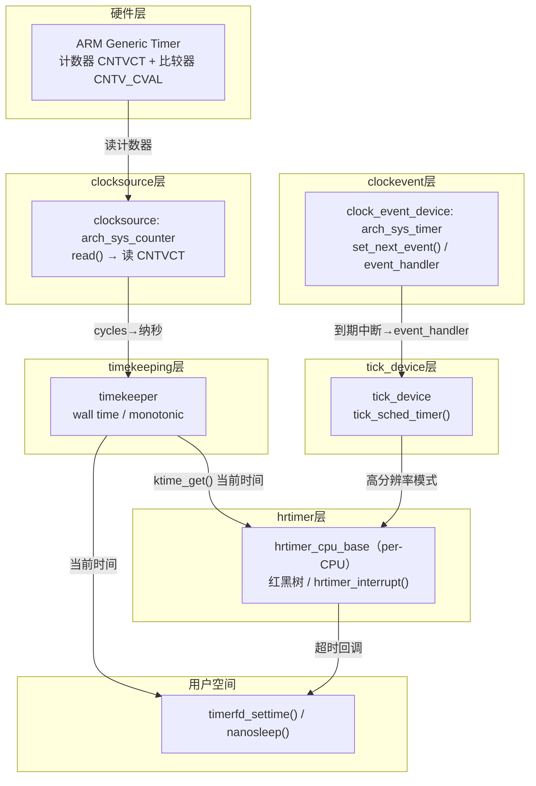

# 10.5.2 时间子系统分层架构

> 所属章节：第10章 中断与时间 > 10.5 时间子系统
>
> 难度：[E→M] | 预计阅读时间：40分钟

## <span class="blue"> 本节导读

上一节看到传统定时器 `timer_list` 被绑死在 jiffies 上，精度天花板是 `1/HZ`；hrtimer 要突破它，靠的是"直接读硬件时钟、直接编程硬件比较器"。但这句话说起来容易，落地有两个现实矛盾：

- **硬件五花八门**：ARM 有 Generic Timer、x86 有 TSC 和 HPET、老平台还有 ACPI PM Timer——寄存器、频率、精度各不相同，内核不可能为每种硬件重写一遍定时逻辑；
- **需求其实只有两类**："告诉我现在几点"（计时）和"到点叫我"（定时），但每类需求在不同硬件上的实现方式完全不同。

Linux 时间子系统的答案是**五层架构**：把"读时间"和"设闹钟"拆成两个互不依赖的抽象，硬件差异被压到最底层驱动里，上面的层一次写好、所有平台复用。本节把这套架构拆开看。

> 本节覆盖：五层架构的动机与逐层职责、从"读硬件计数器"到"定时器回调执行"的两条数据流、clocksource 的 rating 选源与 watchdog 降级、timekeeping 的两条时间轴（wall/monotonic）、clockevent 的 oneshot/periodic 两种模式（基于 v6.6 真实结构）、在板子上亲眼观察这套架构的实验命令。读完你应该能画出五层图并说明每层为什么存在，能在自己的板子上查出当前时钟源与切换历史。

---

## <span class="blue"> 五层架构全景：从"读时钟"到"精确定时" [E→M]

### 各层分工

```
┌─────────────────────────────────────┐
│  第5层 hrtimer：高精度定时器框架    │  ← 面向使用方："我要在 10.5ms 后被叫醒"
├─────────────────────────────────────┤
│  第4层 tick device：tick 的生产者   │  ← 连接 timekeeping 与 clockevent
├─────────────────────────────────────┤
│  第3层 clockevent："未来叫醒我"     │  ← set_next_event 编程接口
├─────────────────────────────────────┤
│  第2层 timekeeping：维护时间轴      │  ← wall time + monotonic time
├─────────────────────────────────────┤
│  第1层 clocksource：提供"现在几点"  │  ← 读硬件计数器，抽象为纳秒值
└─────────────────────────────────────┘
```

分层的核心设计点回应开头的两个矛盾：**clocksource 只管"读时间"，clockevent 只管"设闹钟"，两者完全解耦**。一块 SoC 上可以用 ARM Generic Timer 同时扮演两个角色，也可以用 TSC 做 clocksource、用 local APIC timer 做 clockevent——任意组合，上层无感。

先认识四个贯穿本节的名词，后面不再停下来解释：

> clocksource（时钟源）：一个能读出单调递增计数的硬件设备的软件抽象——ARM 的 CNTVCT 计数器、x86 的 TSC 都是。内核统一把读数换算成纳秒。

<!-- -->

> clockevent（时钟事件设备）：一个能"设定未来某时刻产生中断"的硬件设备的软件抽象——关键部件是比较器：写入一个目标计数值，计数器涨到它就触发中断。ARM Generic Timer 的比较寄存器 CNTV_CVAL 干的就是这件事。

<!-- -->

> wall time（墙上时间，CLOCK_REALTIME）：你 `date` 命令看到的时间，会被校时修改——可能突然跳变。
>
> monotonic time（单调时间，CLOCK_MONOTONIC）：从开机起只增不减、不受校时跳变影响的时间轴。算超时、测间隔一律用它。

<!-- -->

> NTP（网络时间协议）：通过互联网与时间服务器对时的协议。它修正的是 wall time；对 monotonic 只做频率微调（走快/走慢一点追平），绝不回拨。

### 数据流全景图



> 红黑树：一种自平衡的二叉搜索树，按关键字有序排列，查找"最小值"（最近到期的定时器）的代价是 O(log n)。hrtimer 用它管理一个 CPU 上所有待触发的定时器——每次中断后只需问树"下一个是谁"。

数据流分两条线：

**读时间线**：`ktime_get()` → timekeeping 从当前 clocksource 读计数器 → 用 mult/shift 换算成纳秒返回。
**设闹钟线**：hrtimer 从红黑树找到最近到期时刻 → 经 tick device 调用 clockevent 的 `set_next_event()` → 硬件比较器到点触发中断 → `hrtimer_interrupt()` 遍历执行到期回调。

两条线在 timekeeping 交汇：timekeeping 用 clocksource 跟踪时间流逝，hrtimer 用 timekeeping 提供的当前时间判断超时。

### 五层对比一览

| 层级 | 核心职责 | 关键数据结构 | 核心代码路径 | 典型硬件 |
|:---:|---|---|---|---|
| clocksource | 读取单调递增计数 | `struct clocksource` | `kernel/time/clocksource.c` | ARM CNTVCT、x86 TSC、HPET |
| timekeeping | 维护 wall/monotonic 时间轴、NTP 调整 | `struct timekeeper` | `kernel/time/timekeeping.c` | （纯软件层） |
| clockevent | 编程下一次事件触发时刻 | `struct clock_event_device` | `kernel/time/clockevents.c` | ARM Generic Timer、APIC Timer |
| tick device | 产生周期性或动态 tick | `struct tick_device` | `kernel/time/tick-common.c` | （软件适配层） |
| hrtimer | 高精度定时器框架 | `struct hrtimer`、`hrtimer_cpu_base` | `kernel/time/hrtimer.c` | （纯软件框架） |

### 分层兑现了哪四件事

**1. 读时间与设闹钟解耦**——两个需求各占一条独立通路，平台自由组合硬件。

**2. 硬件更换不影响上层**——ARMv7 换 ARMv8，定时器寄存器变了，只需更新 clocksource/clockevent 驱动的底层读写函数，timekeeping 以上不动。

**3. tick 模式可动态切换**——periodic tick 与 tickless（NO_HZ）的差异被限制在 tick device 层，调度器看到的接口不变（详见 10.6）。

**4. hrtimer 不依赖具体硬件**——hrtimer 只管从红黑树里找最近到期节点，告诉下层"在这个时刻叫醒我"。底层用哪个硬件定时器，它不关心。

> 💡 ARM64 上同一个驱动 `drivers/clocksource/arm_arch_timer.c` 同时注册 clocksource 和 clockevent——这不是两层合并，而是一个驱动扮演两个角色：既提供"读计数器"接口，又提供"设定时器"接口。

---

## <span class="blue"> 实验：在板子上亲眼看到这套架构

这套分层不是纸面概念，sysfs 和 dmesg 里都有直接证据。在你的开发板上逐条执行：

```text
# cat /sys/devices/system/clocksource/clocksource0/current_clocksource
arch_sys_counter                      ← 当前活跃时钟源：ARM Generic Timer

# cat /sys/devices/system/clocksource/clocksource0/available_clocksource
arch_sys_counter jiffies              ← 系统里登记在册的全部时钟源
```

读法：`available` 列出候选（这里能看到 jiffies 也注册成了一个 clocksource——rating=1 的保底选项），`current` 是内核按 rating 选出来的当前活跃源。ARM64 平台上看到 `arch_sys_counter` 就是 Generic Timer 的计数器在服役。

时钟源切换的历史在 dmesg 里：

```text
# dmesg | grep -i clocksource
[    0.000000] clocksource: arch_sys_counter: mask: 0xffffffffffffff max_cycles: ...
[    0.000010] sched_clock: 56 bits at 24MHz, resolution 41ns, wraps every ...
[    1.203456] clocksource: jiffies: mask: 0xffffffff max_cycles: 0xffffffff, ...
[    1.204001] clocksource: Switched to clocksource arch_sys_counter
```

最后一行就是 rating 机制落地的证据：jiffies 先顶上（它始终可用），arch_sys_counter 注册完成后内核切换到它。x86 平台上如果 TSC 被 watchdog 判定不稳定，你还会在这里看到反向的 `switched to hpet`——那是降级机制在工作，后面细讲。

所有正在排队的定时器也有花名册：

```text
# cat /proc/timer_list | head -40
Timer List Version: v0.9
HRTIMER_MAX_CLOCK_BASES: 4
...
active timers: ...
```

输出按 CPU 分组列出每个 hrtimer 队列的到期时刻与回调函数名——`hrtimer_cpu_base` 红黑树的用户态投影。调试"定时器到底是谁注册的"类问题时它是第一现场。

---

## <span class="blue"> clocksource 深入：rating 选源与 watchdog 降级 [E]

一个系统可能同时有多个时钟源，内核用 **rating 机制**选择，每个 clocksource 注册时带一个评分：

| 时钟源 | rating | 特点 |
|---|:---:|---|
| ARM Generic Timer | 400 | 现代 ARM 首选（drivers/clocksource/arm_arch_timer.c） |
| TSC (x86) | 300 | 快，但变频/多路服务器上可能不稳定 |
| HPET | 250 | 稳定但访问慢 |
| ACPI PM Timer | 200 | 稳定但频率低（3.58MHz） |
| jiffies | 1 | 保底选项，始终可用 |

内核选择 **rating 最高且通过 watchdog 校验**的 clocksource 作为活跃源。注册路径（`kernel/time/clocksource.c`）：

```c
/* 注册流程要点（简化示意） */
clocksource_register_hz(cs, freq)        /* 内联 helper */
    └── __clocksource_register_scale(cs, 1, freq)
            ├── __clocksource_update_freq_scale()  /* 计算 mult/shift */
            ├── clocksource_enqueue()              /* 按 rating 插入链表 */
            └── clocksource_select()               /* 必要时切换活跃源 */
```

`mult`/`shift` 组合是定点数优化：硬件读出 cycles，换算纳秒用 `ns = cycles * mult >> shift`——一次乘法一次移位，避免浮点除法。这就是为什么读时间这条热路径能在几十纳秒内完成。

> ⚠️ TSC rating 高但可能不稳定（变频停转、多路插槽不同步）。内核的 **clocksource watchdog** 用第二个独立时钟源定期校验它，偏差超标就自动降级到更稳定的源。dmesg 里出现 `clocksource: switched to ...` 就是这个机制生效了——上一节实验命令里让你 grep 的就是这类行。

## <span class="blue"> timekeeping 深入：两条时间轴

v6.6 的 `struct timekeeper`（include/linux/timekeeper_internal.h）核心字段的逻辑视图：

```c
struct timekeeper {
	struct tk_read_base tkr_mono;   /* .clock 当前 clocksource、.cycle_last 上次读数 */
	struct tk_read_base tkr_raw;    /* raw 时钟（不受 NTP 影响） */
	u64			xtime_sec;      /* wall time 秒部分 */
	unsigned long		xtime_nsec;     /* wall time 纳秒部分 */
	struct tk_fast		tk_fast_mono;   /* monotonic 快速读取缓存 */
	/* ... NTP 调整字段等省略 */
};
```

两条时间轴的行为差异是工程上真正要紧的事：

**Wall time（CLOCK_REALTIME）** 受 NTP 同步影响：校时发生时它可能向前或向后**跳变**——`date` 命令手动改时间也算。它回答"人类社会的现在"。

**Monotonic time（CLOCK_MONOTONIC）** 从开机单调递增，不随校时跳变：NTP 的调整只体现为频率补偿——时钟快了 100ms，monotonic 会走得**慢一点**追平，而不是回拨。

> 🔴 计算超时务必用 `clock_gettime(CLOCK_MONOTONIC)` 或内核的 `ktime_get()`。用 wall time 算超时，NTP 校时一跳变，定时器就可能提前或延后触发——生产环境里"夜里定时任务集体错乱"的经典根因之一。

## <span class="blue"> clockevent 深入：oneshot 与 periodic

v6.6 的 `struct clock_event_device`（include/linux/clockchips.h，节选真实字段）：

```c
struct clock_event_device {
	void	(*event_handler)(struct clock_event_device *);
	int	(*set_next_event)(unsigned long evt, struct clock_event_device *);
	int	(*set_next_ktime)(ktime_t expires, struct clock_event_device *);
	unsigned int		features;      /* CLOCK_EVT_FEAT_ONESHOT 等 */
	int	(*set_state_periodic)(struct clock_event_device *);
	int	(*set_state_oneshot)(struct clock_event_device *);
	int	(*set_state_shutdown)(struct clock_event_device *);
	/* ... */
	const char		*name;
	int			rating;
	const struct cpumask	*cpumask;
} ____cacheline_aligned;
```

读这个结构体注意三点：`event_handler` 是中断到来时内核回调的入口；`set_next_event`/`set_next_ktime` 是"设定下一次触发"的两个版本（分别收 cycles 和纳秒时刻）；v6.6 已没有老式 `set_mode()`，模式切换由一组 `set_state_*()` 函数承担，`features` 标志位声明硬件能力。

| 模式 | 行为 | 适用场景 |
|---|---|---|
| **PERIODIC** | 硬件按固定周期重复触发 | 传统 tick，无需每次重新编程 |
| **ONESHOT** | 只触发一次，下次需重新调 `set_next_event()` | tickless / hrtimer 精确定时 |

oneshot 是 hrtimer 的精度基础，对照 10.5.1 就明白它的意义：periodic 模式下 tick 间隔固定（4ms），一个 2.3ms 后到期的定时器只能对齐到下一声钟；oneshot 模式下内核直接把"2.3ms 后"换算成硬件计数值写进比较器，误差只取决于硬件分辨率——**从"等敲钟"变成"定闹钟"，这就是 10.5.1 末尾说的"换计时基准"的具体动作**。

ARM Generic Timer 的 oneshot 编程（drivers/clocksource/arm_arch_timer.c，`arch_timer_set_next_event_virt()`）逻辑：

```c
/* 逻辑要点（简化）：evt = 距当前多少个 cycles */
arch_timer_set_next_event_virt(unsigned long evt, struct clock_event_device *clk)
{
	/* 把 evt 写入 CNTV_TVAL_EL0（相对倒计时寄存器）并使能定时器；
	 * 计数到 0 触发 PPI 中断 */
}
```

> PPI（Private Peripheral Interrupt）：ARM GIC 里每个 CPU 核心私有的一类中断（中断号 16~31），Generic Timer 的定时器中断就是 PPI——每个核的闹钟各响各的，互不打搅。

<!-- -->

> 🔴 clockevent device 是 **per-CPU** 的。Generic Timer 天然 per-CPU（每个核心有自己的比较器寄存器），但共享的外接定时器在多核上使用时要小心中断路由——在 CPU0 上设定的事件如果路由到 CPU1 处理，定时器语义就乱了。

---

## <span class="blue"> 本节总结

五层架构是被两个矛盾逼出来的：硬件五花八门，需求却只有"读时间"和"设闹钟"两类——于是 Linux 把这两类需求各抽象成一层（clocksource/clockevent），硬件差异压进最底层驱动，上层一次写好全平台复用。这就是它回答"为什么分五层"的全部理由，也是你往后看任何平台的定时器子系统时的地图：先找谁注册成 clocksource、谁注册成 clockevent，其余各层位置自然浮现。

工程上带走三条：选源看 rating、watchdog 会自动降级不稳定的源（dmesg 的 switched 行是证据）；oneshot 模式是 hrtimer 精度的物理基础，它把"等敲钟"变成"定闹钟"；算超时一律用 monotonic time，碰 wall time 就是把定时器的命运交给 NTP。

---

## <span class="blue"> 下一步

10.5.3 timer wheel 时间轮实现——传统 timer_list 这一层，内核如何用时间轮高效管理成千上万个到期时间各不相同的定时器，做到 O(1) 插入与批量到期处理。
