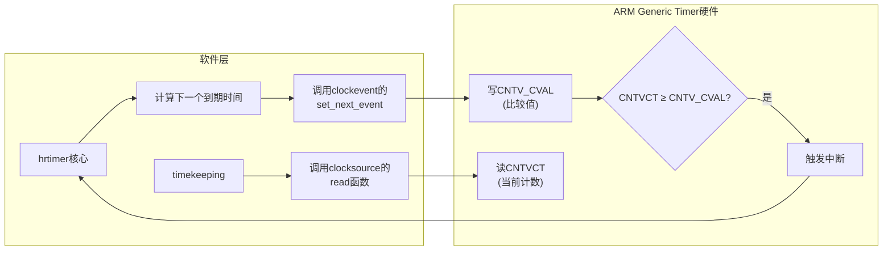

**知识点112 [E]**

hrtimer要想真正干到微秒级，光靠软件层优化是不够的——底下得有硬件撑腰。这就引出了时间子系统里两个最核心的角色：`clocksource`和`clockevent`。它俩一个负责"看时间"，一个负责"定闹钟"，配合好了，hrtimer才能摆脱jiffies的束缚。

先说说`clocksource`。你可以把它理解为内核的"挂钟"——提供一个单调递增的计数器，内核随时读它来获取当前时间。但一块板子上往往不止一个硬件能做这件事，比如ARM SoC上可能同时有：ARM Generic Timer、Synopsys DesignWare APB Timer、某个IP厂商私有的counter。都注册进来，内核用哪个？

答案是看**rating**。

```c
/* include/linux/clocksource.h */
struct clocksource {
    u64 (*read)(struct clocksource *cs);    /* 读当前计数值 */
    u64 mask;
    u32 mult;
    u32 shift;
    u64 max_idle_ns;
    u32 maxadj;
    u32 max_cycles;
    const char *name;
    int rating;                             /* 评分，越高越优 */
    /* ... */
};
```

注册的时候调用`register_clocksource()`，内核会把所有clocksource挂到一个全局链表上。`timekeeping_init()`初始化时会遍历这个链表，挑`rating`最高的那个作为当前使用的时钟源。rating的约定大致是这样：

| rating范围 | 含义 | 典型来源 |
|:---:|:---|:---|
| 1-99 | 兜底备用，精度差 | jiffies（基于tick模拟） |
| 100-199 | 基本可用 | 各种板级timer |
| 300-499 | 高精度推荐 | x86 TSC、ARM arch_timer |

ARM Generic Timer的rating通常设400左右，所以它一注册上来，基本就把其他低分timer挤掉了。如果你想知道自己系统上谁在干活，看`/sys/devices/system/clocksource/clocksource0/current_clocksource`就行。

那`clockevent`又干嘛的？如果说clocksource是"看表"，clockevent就是"设闹钟"。hrtimer要求内核在某个精确的时间点醒来处理定时器，这就需要硬件能在指定时刻触发一次中断。

```c
/* kernel/time/clockevents.c */
struct clock_event_device {
    const char          *name;
    unsigned int        features;
    u64                 max_delta_ns;       /* 最大可设间隔 */
    u64                 min_delta_ns;       /* 最小可设间隔 —— 关键！ */
    int                 rating;

    int  (*set_next_event)(unsigned long delta, struct clock_event_device *);
    int  (*set_state_oneshot)(struct clock_event_device *);
    int  (*set_state_shutdown)(struct clock_event_device *);
    /* ... */
};
```

`set_next_event()`是核心中的核心——hrtimer每次算出下一个最近要到期的定时器时间，就调用这个函数把硬件中断设到那个点。注意这里的`min_delta_ns`，它定义了**programming horizon**，也就是硬件能接受的最短编程时间。你不可能把闹钟设成"1纳秒后响"，CPU来不及反应。ARM Generic Timer的min_delta通常在1微秒量级。

ARM Generic Timer的硬件映射很直观：

- **CNTVCT**（虚拟计数器）→ 不断自增的计数值 → 充当`clocksource`的read()数据来源
- **CNTV_CVAL**（虚拟比较值）→ 写这个寄存器设定比较值，当CNTVCT ≥ CNTV_CVAL时触发中断 → 充当`clockevent`的`set_next_event()`硬件后端



> **陷阱**：`min_delta_ns`是硬性约束。hrtimer传入的delta如果小于这个值，`set_next_event()`会返回`-ETIME`。上层收到这个错误后，通常的做法是force一个tick立刻中断，而不是忽略这个定时器。我见过有人改驱动时把这个值设得过小，表面上精度提升了，实际中断丢失一大堆，hrtimer到期不准反而更糟。programming horizon这东西，硬件说多少就是多少，别硬来。

**知识点113 [E]**

代码层面，这两块的核心实现路径很清晰。

`kernel/time/clockevents.c`是clockevent的核心框架。它负责管理所有注册的`clock_event_device`，提供`clockevents_register_device()`、`clockevents_program_event()`等公共接口。hrtimer通过`tick_program_event()`最终会调到这里的`clockevents_program_event()`，再由它分发到具体硬件驱动的`set_next_event()`。这里还处理了一个很细的边界——如果下一次定时器的时间点已经过去了（比如中断延迟导致），框架会自动force一个即时中断，避免定时器"漏掉"。

ARM平台的具体实现在`drivers/clocksource/arm_arch_timer.c`。这个文件探测CPU上的ARM Generic Timer，分别创建`clocksource`和`clock_event_device`两个实例注册进内核。探测时会读ID_AA64PFR0_EL1（或CP15等效寄存器）判断Timer是否实现、支持哪些特性。驱动的`arch_timer_set_next_event()`函数里，核心逻辑就是一行：把目标delta换算成counter值，写进CNTV_CVAL。

```c
/* drivers/clocksource/arm_arch_timer.c (简化示意) */
static int arch_timer_set_next_event(unsigned long delta,
                                      struct clock_event_device *clk)
{
    unsigned long ctrl;
    u64 cval = arch_counter_get_cntvct();    /* 读当前CNTVCT */

    cval += delta;                           /* 计算目标比较值 */
    write_sysreg(cval, cntv_cval_el0);       /* 写CNTV_CVAL */

    ctrl = arch_timer_reg_read(CTRL);        /* 使能中断 */
    ctrl |= ARCH_TIMER_CTRL_IT_MASK;
    arch_timer_reg_write(CTRL, ctrl);

    return 0;
}
```

这个驱动的代码量不算大，但它是整个ARM Linux时间子系统的根基。你板子上的hrtimer能不能准，根本上就取决于这几行代码跟硬件寄存器的交互是否正确——CNTVCT读出来对不对、CNTV_CVAL写进去后中断来不来、min_delta配得合不合理。调试这类问题的时候，抓一个逻辑分析仪看中断信号跟寄存器写入的时序关系，往往比在内核里打printk来得快。
