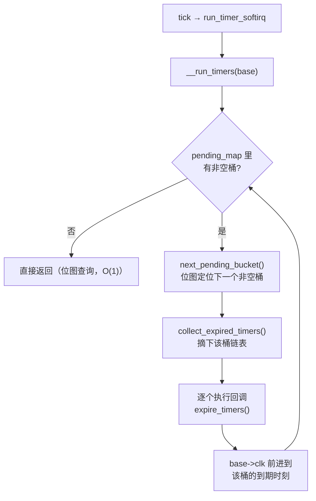
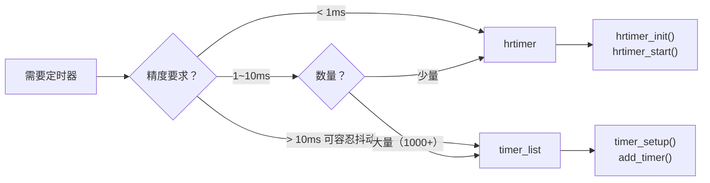

# 10.5.3 Timer Wheel 时间轮实现

> 所属章节：第10章 中断与时间 > 10.5 时间子系统
>
> 难度：[E→M] | 预计阅读时间：20分钟

## <span class="blue">本节导读

10.5.1 留下了一个没展开的细节：每次 tick，`run_timer_softirq()` 要"扫一遍定时器列表，执行到期的"。但系统里同时存在成千上万个定时器（TCP 重传、文件描述符超时、看门狗……），到期时间各不相同——**这个"列表"到底怎么组织，才能让每次查找都快？** 逐个遍历显然不现实。Linux 的答案是**时间轮**（timer wheel），本节拆它的现行实现。

> 注意：本节讲的是 **Linux 4.8 重写之后**的时间轮。网上大量资料（包括旧版内核书）描述的 `tvec_base` + `tv1~tv5` 五级级联结构是 4.8 之前的旧实现，v6.6 里已经不存在。

> 本节覆盖：4.8 重写的动机与新结构（扁平数组 + 位图）、`timer_base` 真实数据结构、各层粒度设计、`calc_index()` 的向上取整与"绝不提前到期"保证、到期处理路径、`timer_delete_sync()` 的同步陷阱、timer_list 与 hrtimer 的选型边界。读完你应该能讲清新时间轮为什么敢取消级联搬迁，并为一个给定场景选出该用 timer_list 还是 hrtimer。

---

## <span class="blue">新时间轮：扁平数组 + 位图 [E→M]

### 新旧实现的差别先讲清楚

旧实现（Linux ≤4.7）是 5 个独立的 `tvec` 数组（tv1 有 256 格，tv2~tv5 各 64 格），低层转完一圈时要把高层桶里的定时器**重新级联（recascade）**回低层——搬迁本身要花时间，定时器越多越亏。

4.8 之后的实现（v6.6 现行）把多级数组合并成**一个扁平数组**，配合一张位图，核心变化有两个（kernel/time/timer.c 顶部注释的意思）：

1. **不再级联搬迁**：定时器入轮后就待在原层级，不往低层搬。
2. **到期时刻向上取整**：粗粒度层级的定时器允许"晚一点"批量到期，但保证**绝不提前到期**。

### timer_base 与桶数组

时间轮是 per-CPU 的，每个 CPU 一个 `timer_base`。v6.6 的真实数据结构（`kernel/time/timer.c`）：

```c
struct timer_base {
	raw_spinlock_t		lock;
	struct timer_list	*running_timer;   /* 正在执行的定时器回调 */
	unsigned long		clk;              /* 本轮子当前处理到的 jiffies */
	unsigned long		next_expiry;      /* 最近的到期时刻 */
	unsigned int		cpu;
	bool			is_idle;
	bool			timers_pending;
	DECLARE_BITMAP(pending_map, WHEEL_SIZE);  /* 位图：哪个桶非空，对应位为 1 */
	struct hlist_head	vectors[WHEEL_SIZE]; /* 扁平桶数组，每桶挂一条定时器链表 */
} ____cacheline_aligned;
```

> 位图（bitmap）：一个比特代表一个是非问题的数组。`pending_map` 用 512/576 个比特回答"哪个桶里有定时器"——扫一遍位图（几次 64 位整数比较）就知道有没有活要干，不用逐个桶遍历。

数组规模由一组常量决定：

```c
#define LVL_BITS	6                       /* 每层 2^6 = 64 个桶 */
#define LVL_SIZE	(1UL << LVL_BITS)       /* 64 */
#if HZ > 100
# define LVL_DEPTH	9                     /* 9 层 */
#else
# define LVL_DEPTH	8                     /* 8 层 */
#endif
#define WHEEL_SIZE	(LVL_SIZE * LVL_DEPTH)  /* 512 或 576 个桶 */
```

8 层（或 9 层）× 64 桶，全部铺平在一个数组里：level 0 占 `vectors[0..63]`，level 1 占 `vectors[64..127]`，依此类推。

### 各层的粒度与覆盖范围

每层的粒度是 `64^lvl` 个 jiffies（`LVL_GRAN(n)`）：

| 层级 | 粒度（jiffies） | 单层覆盖 | 换算（HZ=250） |
|:---:|:---:|:---:|:---:|
| level 0 | 1 | 64 jiffies | 0–256ms |
| level 1 | 64 | 4096 jiffies | 0.26s–16.4s |
| level 2 | 4096 | 262144 jiffies | 16s–17.5min |
| level 3 | 64³ | 64⁴ jiffies | ~18.6h |
| … | … | 指数递增 | 最远层覆盖数十年 |

到期时间越远，放的层级越高、粒度越粗——这正是时间轮的核心思想：**近期的定时器精确到 jiffy，远期的定时器按批量对齐**，用极小的内存和处理开销管理海量定时器。

### calc_index()：入轮时怎么选桶

`add_timer()` 最终走到 `calc_wheel_index()` → `calc_index()`（timer.c）：

```c
static inline unsigned calc_index(unsigned long expires, unsigned lvl,
				  unsigned long *bucket_expiry)
{
	/*
	 * 向上取整到本层粒度，保证定时器绝不提前到期。
	 * 提前到期可能由 tick 边界对齐和高层粒度截断引起。
	 */
	expires = (expires >> LVL_SHIFT(lvl)) + 1;
	*bucket_expiry = expires << LVL_SHIFT(lvl);
	return LVL_OFFS(lvl) + (expires & LVL_MASK);
}
```

上层 `calc_wheel_index()` 按 `delta = expires - clk`（还有多久到期）落入哪个区间来选择层级：delta < 64 进 level 0，delta < 4096 进 level 1，依此类推。选桶全程是位运算和数组索引，与定时器总数无关——这就是 **O(1)** 的含义：一百万个定时器和十个定时器，入轮花的时间一样。

注意向上取整这个设计：level 1 的定时器到期时刻被对齐到 64-jiffy 边界，意味着它可能比设定值**晚**最多一个粒度才到期，但永远不会**早**。这是新实现敢取消级联搬迁的前提——粗粒度定时器本来就不要求精确（看门狗晚 16ms 喂一次毫无影响），批量对齐反而减少了处理次数。

### 到期处理：pending_map 位图

每次 tick（TIMER_SOFTIRQ 上下文）执行 `__run_timers()`（timer.c），处理路径：



`pending_map` 是关键优化：**"有没有定时器要处理"用一次位图扫描回答**，没有非空桶时 tick 上的定时器处理几乎零开销；有的话也只处理到期的桶，不碰其他。配合 10.5.1 的图景看：tick 是钟，时间轮是挂在钟上的高效花名册。

---

## <span class="blue">实验：看一眼系统里的定时器花名册

时间轮的住户在 `/proc/timer_list` 里全体在册（需要 root，输出很长，截取片段感受）：

```text
# head -30 /proc/timer_list
Timer List Version: v0.9
HRTIMER_MAX_CLOCK_BASES: 4
now at 4295178092 nsecs

cpu: 0
 number: 312               ← CPU0 上当前排队的定时器总数
 ...
Timer Resolution: 4 nsecs
...
 active timers:            ← 按桶列出的未到期定时器
 #0:  <...>, timer_fn, S:01, mod_timer, ...
 # expires at 4295180000-4295180000 nsecs [in 1908 to 1908 nsecs]
```

读法：开头是 hrtimer 的时钟基准信息；`cpu: N` 分节对应 per-CPU 的 base；`active timers` 下列出的每一项带到期纳秒时刻和回调函数名。这个文件同时收录 timer_list 与 hrtimer 两族——10.5.4 之后你会认出里面哪些是红黑树住户、哪些是时间轮住户。查"这个定时器到底是谁注册的"时，`timer_fn` 一列就是答案。

---

## <span class="blue">删除与同步：timer_delete_sync() [M]

### API 的新旧名称

v6.6 里这套 API 已经改名，写新代码要用新名字：

| 旧名称（已废弃的包装） | v6.6 新名称 | 语义 |
|---|---|---|
| `del_timer()` | `timer_delete()` | 从轮上摘下，不等回调 |
| `del_timer_sync()` | `timer_delete_sync()` | 摘下，并**忙等正在执行的回调返回** |
| `setup_timer()`（已移除） | `timer_setup()` | 初始化定时器 |

`include/linux/timer.h` 里 `del_timer_sync()` 的注释写得很直白：*"Do not use in new code. Use timer_delete_sync() instead."*

> 💡 v6.6 还提供 `timer_shutdown_sync()`：不仅删除，还禁止定时器被重新 arm——模块卸载路径的推荐用法。

### 同步陷阱

```c
/* 错误示范：回调里等自己完成 → 死锁 */
static void my_timer_callback(struct timer_list *t)
{
	timer_delete_sync(t);   /* 永远等不到自己返回 */
}

/* 正确示范：模块卸载 */
static void __exit my_module_exit(void)
{
	timer_shutdown_sync(&my_timer);  /* 等回调跑完并禁止再 arm */
	kfree(my_private_data);          /* 现在释放才安全 */
}
```

> ⚠️ `timer_delete_sync()` 不能在定时器回调自身里调用（等自己 = 死锁），也不能在硬中断上下文调用（回调可能在另一个 CPU 上执行，中断上下文不允许"等待并发执行完成"这类同步操作）。

### 精度限制与适用场景

时间轮的精度上限仍是 **1/HZ**——到期检查只发生在 tick 上，CPU 繁忙时 softirq 推迟还会带来额外抖动。这一点和 10.5.1 的结论严丝合缝：时间轮优化的是"管理多少个"，不是"精确到多细"。

## <span class="blue">timer_list vs hrtimer：选型 [I]

| 对比维度 | timer_list（timer wheel） | hrtimer |
|:---:|:---:|:---:|
| 底层数据结构 | 扁平多级桶数组 + 位图 | timerqueue 红黑树 |
| 时间基准 | jiffies（tick 驱动） | ktime（纳秒，不受 HZ 限制） |
| 理论精度 | 1/HZ（4ms@250Hz） | 微秒级（依赖硬件） |
| 插入复杂度 | O(1) 位运算定位 | O(log N) 树插入 |
| 到期检查 | tick 上批量处理 | oneshot 编程硬件，按需中断 |
| 回调上下文 | TIMER_SOFTIRQ 软中断 | 硬中断（硬到期类） |
| API | `timer_setup()` / `add_timer()` / `timer_delete_sync()` | `hrtimer_init()` / `hrtimer_start()` / `hrtimer_cancel()` |
| 典型场景 | TCP 超时、看门狗、心跳 | 音视频同步、实时控制、nanosleep |

**选型规则：**

- 精度要求 > 10ms、定时器数量巨大、容忍抖动 → timer_list
- 精度要求 < 1ms、要配合 tickless 省电、实时场景 → hrtimer
- 1–10ms 之间：数量大用 timer_list，数量少用 hrtimer



---

## <span class="blue">本节总结

v6.6 的时间轮是 4.8 重写后的扁平实现：8/9 层 × 64 桶铺在一个数组里，配一张 pending_map 位图回答"有没有活"，不再有旧实现的级联搬迁。它敢取消搬迁的前提是 `calc_index()` 的向上取整——定时器**绝不提前到期**，粗粒度的远期定时器按粒度批量晚到期，用这一点点"晚"换来了 O(1) 插入和空闲 tick 近零开销。

把 10.5.1~10.5.3 连起来看，图景完整了：tick 是钟，时间轮是挂在钟上的花名册，这套组合为"海量、粗粒度"的超时需求做到了极致性价比；它的精度上限仍是 1/HZ，这不是时间轮的失败——微秒级需求本来就该左转 hrtimer，那是下一节的主题。

---

## <span class="blue">下一步

10.5.4 hrtimer 的实现——hrtimer 的红黑树/timerqueue 数据结构、`hrtimer_init()` 到 `hrtimer_start()` 的完整链路，以及它如何借助 clockevent oneshot 突破 HZ 限制实现微秒级精度。
