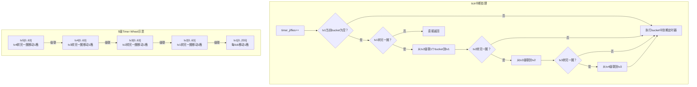
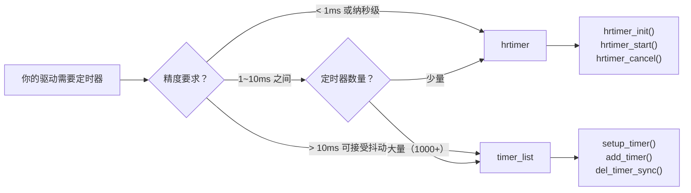

# 10.5.3 Timer Wheel级联实现

> 所属章节：第10章 中断与时间 > 10.5 内核定时器
>
> 难度：[E][M] | 预计阅读时间：18分钟

## <span class="blue">本节导读

你已经知道了jiffies和tick的概念，也看到了内核怎么用它们来驱动时间。但一个关键问题还没回答：**当系统里有成千上万个定时器，到期时间各不相同，内核怎么高效地找到该执行的那一个？** 粗暴地遍历所有定时器显然不现实。Linux内核的解决方案是一套精妙的"5级级联时间轮"（timer wheel）——它像一台机械齿轮组，每tick只需转动一格，到期任务自然落入手中。<br>

学完后，你将理解timer wheel的数据结构、级联机制、add_timer的完整调用链，以及del_timer_sync的同步陷阱。你还会掌握timer_list和hrtimer的选型原则——**什么时候用"粗精度"的老接口，什么时候必须上高精度定时器**。

---

## <span class="blue">Timer Wheel：5级级联数组的数据结构 [E][M]

### 从生活中的"日历提醒"说起

想象你的待办事项按时间分层管理：

- 今天的任务——放在桌面便利贴上，每小时看一眼
- 本周的任务——记在周报里，每天翻一翻
- 本月的任务——存在月历中，每周日统一规划
- 更远的任务——丢进年度计划，月底才想起来整理

**Timer wheel本质上就是这个思路。** 不同到期时间的定时器被放入不同"层级"的bucket中，tick到来时只检查最细粒度那一层的当前bucket。远期的定时器随着高层级"级联"下来，逐步靠近执行点。

### 5级数组的定义

内核源码中（`kernel/time/timer.c`，Linux 5.x之前为`kernel/timer.c`），timer wheel由`tvec_base`结构体管理：

```c
/* kernel/time/timer.c */
struct tvec_base {
    spinlock_t lock;
    struct timer_list *running_timer;   /* 当前正在执行的定时器 */
    unsigned long timer_jiffies;         /* timer wheel当前处理到的jiffies */
    struct tvec_root tv1;               /* 第1级：256个bucket (Linux 4.x后) */
    struct tvec tv2;
    struct tvec tv3;
    struct tvec tv4;
    struct tvec tv5;
};

/* 每级64个bucket的经典定义 */
struct tvec {
    struct list_head vec[64];   /* 64个链表头，每个是一个bucket */
};

struct tvec_root {
    struct list_head vec[256];  /* tv1有256个bucket，覆盖更细粒度 */
};
```

> 💡 **提示**：Linux 4.x后tv1从64扩展为256个bucket，降低hash冲突。本节的"64"描述覆盖经典设计和Linux 3.x行为，理解原理即可。

### 每级的精度与覆盖范围

| 级别 | 数据结构 | Bucket数 | 每个bucket覆盖的jiffies | 总覆盖范围 | 级联条件 |
|:---:|:---:|:---:|:---:|:---:|:---:|
| tv1 | `tvec_root` | 256 | 1 jiffy | 256 jiffies | 每个tick处理1个bucket |
| tv2 | `tvec` | 64 | 256 jiffies | 256×64 = 16,384 jiffies | tv1的256个bucket全部用完 |
| tv3 | `tvec` | 64 | 16,384 jiffies | ~1M jiffies (~11.9h @250Hz) | tv2全部用完 |
| tv4 | `tvec` | 64 | ~1M jiffies | ~64M jiffies (~31.7d @250Hz) | tv3全部用完 |
| tv5 | `tvec` | 64 | ~64M jiffies | ~4G jiffies (~5.4y @250Hz) | tv4全部用完 |

说白了，tv1是最快转动的秒针，tv2-tv5依次是分钟、小时、天、年的指针。**到期时间越远，放的位置越高，需要级联的次数越多。**

### 级联（Cascading）机制

Timer wheel的核心妙处在于**分摊工作量**。每次tick中断只干一件事：

```
tick到来 → 取出tv1当前index的bucket → 执行其中所有到期定时器 → index++
```

当tv1转完一圈（index回到0），就需要从tv2"级联"一批定时器下来：

```
tv1空了一圈 → 取出tv2当前index的bucket → 按到期时间重新散列到tv1 → tv2 index++
```

级联只发生在tv1转完一圈时。更高级的级联同理——tv2空一圈时从tv3级联，以此类推。



这种设计的复杂度是**O(1)**——每次tick的处理时间与系统中定时器总数无关，只取决于当前bucket中有几个定时器。这对于支撑成千上万个并发定时器（TCP连接、文件描述符超时等）至关重要。

### add_timer()的调用链

当你调用`add_timer()`时，内核怎么决定把这个定时器塞进哪个bucket？

```c
/* 你的驱动代码 */
struct timer_list my_timer;
my_timer.expires = jiffies + HZ;  /* 1秒后到期 */
add_timer(&my_timer);              /* 进入timer wheel */

/* ============ 调用链 ============ */

/* 1. 入口 */
void add_timer(struct timer_list *timer)
{
    BUG_ON(timer_pending(timer));   /* 已在timer wheel中则触发BUG */
    __mod_timer(timer, timer->expires, MOD_TIMER_NOTPENDING);
}

/* 2. 核心：根据到期时间计算该放入哪个bucket */
static inline void
internal_add_timer(struct tvec_base *base, struct timer_list *timer)
{
    unsigned long expires = timer->expires;
    unsigned long idx = expires - base->timer_jiffies;
    struct list_head *vec;

    if (idx < 256) {                    /* 落在tv1范围 */
        int i = expires & 255;
        vec = base->tv1.vec + i;
    } else if (idx < 1 << 14) {         /* 落在tv2范围 */
        int i = (expires >> 8) & 63;
        vec = base->tv2.vec + i;
    } else if (idx < 1 << 20) {         /* 落在tv3范围 */
        int i = (expires >> 14) & 63;
        vec = base->tv3.vec + i;
    } else if (idx < 1 << 26) {         /* 落在tv4范围 */
        int i = (expires >> 20) & 63;
        vec = base->tv4.vec + i;
    } else {                            /* 落在tv5范围 */
        int i;
        if ((signed long)idx < 0)       /* 处理溢出的边界情况 */
            i = 0;
        else
            i = (expires >> 26) & 63;
        vec = base->tv5.vec + i;
    }
    list_add_tail(&timer->entry, vec);  /* 挂到对应bucket链表 */
}
```

看明白了吗？**`idx = expires - timer_jiffies`算出还有多久到期**，然后按范围层层判断，最终挂到某一级某个bucket的链表尾部。这个过程完全是O(1)的数组索引——没有遍历，没有平衡树旋转，就是简单的位运算取index。

### del_timer()与del_timer_sync()：同步是道送命题

删除定时器有两种接口，差别看似微妙，实则天差地别：

```c
/* ==== 版本1：del_timer —— 只管从wheel上摘下 ==== */
int del_timer(struct timer_list *timer);
/* 返回1：定时器确实在wheel上，已被删除 */
/* 返回0：定时器已经不在wheel上了（可能已到期，可能从未add） */

/* ==== 版本2：del_timer_sync —— 不仅摘下，还要等它跑完 ==== */
int del_timer_sync(struct timer_list *timer);
/* 如果定时器回调正在另一个CPU上执行，会忙等直到回调返回 */
```

什么时候该用哪个？

- **`del_timer`**：模块卸载路径中，定时器回调不会访问已释放的资源时可用。但你得自己确认回调没在跑。
- **`del_timer_sync`**：模块卸载前，确保定时器回调彻底完成，防止回调访问已释放的模块内存。

> ⚠️ **陷阱**：`del_timer_sync()`不能在中断上下文或定时器回调本身中调用！想想看——如果回调里调用`del_timer_sync(&自己)`，那它在等自己结束，这不就是死锁吗？如果在中断上下文调用，中断不能被抢占，而回调可能在另一个CPU上正跑着呢，你也等不到。

```c
/* ============ 错误示范：死锁 ============ */
static void my_timer_callback(struct timer_list *t)
{
    /* 灾难！在回调里等自己完成 */
    del_timer_sync(t);   /* ← 死锁！永远等不到自己返回 */
}

/* ============ 正确示范：模块卸载 ============ */
static void __exit my_module_exit(void)
{
    /* 1. 先停用定时器，等回调完成 */
    del_timer_sync(&my_timer);
    
    /* 2. 现在安全了，释放资源 */
    kfree(my_private_data);
}
```

### 精度限制的本质

Timer wheel的精度受制于tick周期。如果你的系统配置`HZ=250`，那么tick每4ms来一次，定时器最早在下一个tick被检查。**理论精度 = 1/HZ**（4ms@250Hz，10ms@100Hz，1ms@1000Hz）。

但实际的抖动可能更大——如果当前tick时CPU正忙， softirq推迟执行，那定时器回调就会被顺延到下一个可用的softirq处理时机。这就是为什么timer_list被称为"低精度"定时器的原因。

> 💡 **提示**：timer_list适合"不严格超时"的场景——TCP重传定时器差几毫秒无妨、看门狗喂狗允许一定抖动、LED闪烁肉眼分辨不出几毫秒误差。这些场景下timer_list的O(1)插入/删除开销极轻，是性价比之选。

---

## <span class="blue">timer_list vs hrtimer：精度、开销与选型 [I]

Linux内核有两套定时器子系统并存，不是设计冗余，而是**不同场景有不同取舍**。一张表格说清楚：

| 对比维度 | timer_list（传统timer wheel） | hrtimer（高精度定时器） |
|:---:|:---:|:---:|
| **底层数据结构** | 5级级联数组（hash bucket链表） | 红黑树（按到期时间排序） |
| **时间基准** | jiffies（tick驱动） | ktime（纳秒级，不受HZ限制） |
| **理论精度** | 1/HZ（4ms@250Hz，10ms@100Hz） | 微秒~纳秒级（依赖硬件） |
| **插入复杂度** | O(1) —— 位运算直接定位bucket | O(log N) —— 红黑树插入 |
| **到期检查** | 每个tick检查一次（batch处理） | 独立编程硬件定时器，按需中断 |
| **批量处理** | 天然支持（一个bucket可挂多个） | 逐个处理 |
| **CPU开销** | 极低（tick时批量处理） | 略高（红黑树操作+独立中断） |
| **API风格** | `setup_timer()` → `add_timer()` / `del_timer()` | `hrtimer_init()` → `hrtimer_start()` / `hrtimer_cancel()` |
| **典型场景** | TCP超时、看门狗、LED闪烁、心跳包 | 音视频同步、实时控制、用户态nanosleep |
| **内核版本** | 从0.99就有了，经典API | 2.6.16引入，现代推荐 |
| **在tickless下** | 仍需tick来驱动 | 完美配合tickless，按需唤醒 |

### 选型建议

**无脑选timer_list的情况：**
- 超时精度要求 > 10ms
- 定时器数量巨大（成千上万）
- 场景本身对抖动不敏感（网络超时、 watchdog）

**必须上hrtimer的情况：**
- 精度要求 < 1ms
- 需要与tickless模式配合（移动设备省电）
- 实时性场景（工业控制、音视频）

**一个有趣的现实：** 即便是hrtimer子系统，内部对远期的定时器也会fallback到timer wheel类似的机制（`timerfd`和hrtimer的软中断批处理），只在临近到期时才精确编程硬件。这叫"近精确远粗放"——好钢用在刀刃上。



---

## <span class="blue">本节总结

| 要点 | 核心内容 |
|:---|:---|
| Timer wheel结构 | 5级级联数组tv1-tv5，O(1)插入删除，tick驱动批量处理 |
| 级联机制 | 低级数组用完一圈后从高级级联1个bucket，逐层下放 |
| add_timer路径 | `add_timer → __mod_timer → internal_add_timer`：按`expires - timer_jiffies`的范围选择级别和bucket |
| del_timer vs del_timer_sync | 前者仅摘下，后者等待回调完成；sync版不能在中断/回调中调用 |
| 精度上限 | 1/HZ，适合非严格超时场景 |
| timer_list优势 | O(1)操作、开销极低、适合大批量定时器 |
| hrtimer优势 | 纳秒级精度、配合tickless、红黑树管理 |
| 选型原则 | >10ms用timer_list，<1ms用hrtimer，中间看数量 |

---

## <span class="blue">下一步

10.5.4 hrtimer的实现——我们将深入hrtimer的红黑树数据结构、`hrtimer_init()`到`hrtimer_start()`的完整调用链，以及hrtimer如何编程底层硬件定时器（如ARM的arch_timer）来实现真正的微秒级精度。你会看到为什么hrtimer能突破HZ的限制，以及它和timer wheel在内核中如何和谐共存。

---

## <span class="blue">配套资源

| 资源类型 | 路径/说明 |
|:---|:---|
| 核心源码 | `kernel/time/timer.c` —— timer wheel主实现（Linux 5.x+） |
| 历史源码 | `kernel/timer.c` —— Linux 3.x及之前的timer wheel |
| 数据结构 | `struct tvec_base`, `struct tvec`, `struct tvec_root` |
| 关键函数 | `add_timer()`, `mod_timer()`, `del_timer()`, `del_timer_sync()` |
| hrtimer源码 | `kernel/time/hrtimer.c` —— hrtimer红黑树实现 |
| hrtimer API | `hrtimer_init()`, `hrtimer_start()`, `hrtimer_cancel()` |
| 验证命令 | `cat /proc/timer_list` —— 查看系统所有定时器状态 |
| 延伸阅读 | LWN "The timer wheel" (2005), LWN "hrtimer subsystem" (2006) |

