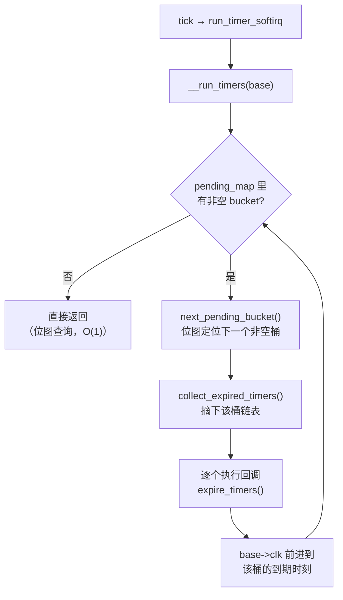
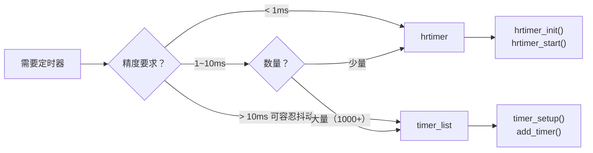

# 10.5.3 Timer Wheel级联实现

> 所属章节：第10章 中断与时间 > 10.5 时间子系统
>
> 难度：[E→M] | 预计阅读时间：18分钟

## <span class="blue">本节导读

系统里同时存在成千上万个定时器（TCP 重传、文件描述符超时、看门狗……），到期时间各不相同，内核怎么高效找到该执行的那些？<br>
逐个遍历显然不现实。Linux 的答案是**时间轮**（timer wheel）。

本节覆盖：

- v6.6 时间轮的真实数据结构（`timer_base` + 扁平 bucket 数组）、
- `calc_index()` 的分层散列逻辑、
- 到期处理路径，
- 以及 `timer_delete_sync()` 的同步陷阱。
  
> 注意：本节讲的是 **Linux 4.8 重写之后**的时间轮。<br>
> 网上大量资料（包括旧版内核书）描述的 `tvec_base` + `tv1~tv5` 五级级联结构是 4.8 之前的旧实现，v6.6 里已经不存在。

---

## <span class="blue">新时间轮：扁平数组 + 位图 [E→M]

### 新旧实现的差别先讲清楚

旧实现（Linux ≤4.7）是 5 个独立的 `tvec` 数组（tv1 有 256 格，tv2~tv5 各 64 格），<br>
低层转完一圈时要把高层 bucket 里的定时器**重新级联（recascade）**回低层: 搬迁本身要花时间。

4.8 之后的实现（v6.6 现行）把多级数组合并成**一个扁平数组**，配合一张位图，核心变化有两个（kernel/time/timer.c 顶部注释原文意思）：

1. **不再级联搬迁**：定时器入轮后就待在原层级，不往低层搬。
2. **到期时刻向上取整**：粗粒度层级的定时器允许"晚一点"批量到期，但保证**绝不提前到期**。

### timer_base 与桶数组

v6.6 的真实数据结构（`kernel/time/timer.c`）：

```c
struct timer_base {
	raw_spinlock_t		lock;
	struct timer_list	*running_timer;   /* 正在执行的定时器回调 */
	unsigned long		clk;              /* 本轮子当前处理到的 jiffies */
	unsigned long		next_expiry;      /* 最近的到期时刻 */
	unsigned int		cpu;
	bool			is_idle;
	bool			timers_pending;
	DECLARE_BITMAP(pending_map, WHEEL_SIZE);  /* 哪些 bucket 非空 */
	struct hlist_head	vectors[WHEEL_SIZE]; /* 扁平 bucket 数组 */
} ____cacheline_aligned;
```

数组规模由一组常量决定：

```c
#define LVL_BITS	6                       /* 每层 2^6 = 64 个 bucket */
#define LVL_SIZE	(1UL << LVL_BITS)       /* 64 */
#if HZ > 100
# define LVL_DEPTH	9                     /* 9 层 */
#else
# define LVL_DEPTH	8                     /* 8 层 */
#endif
#define WHEEL_SIZE	(LVL_SIZE * LVL_DEPTH)  /* 512 或 576 个 bucket */
```

8 层（或 9 层）× 64 桶，全部铺平在一个数组里：level 0 占 `vectors[0..63]`，level 1 占 `vectors[64..127]`，依此类推。

### 各层的粒度与覆盖范围

每层的粒度是 `64^lvl` 个 jiffies（`LVL_GRAN(n)`）：

| 层级 | 粒度（jiffies） | 单层覆盖 | 换算（HZ=250） |
|:---:|:---:|:---:|:---:|
| level 0 | 1 | 64 jiffies | 0–256ms |
| level 1 | 64 | 4096 jiffies | 0.26s–16.4s |
| level 2 | 4096 | 262144 jiffies | 16s–17.5min |
| level 3 | 64³ | 64⁴ jiffies | ~18.6h |
| … | … | 指数递增 | 最远层覆盖数十年 |

到期时间越远，放的层级越高、粒度越粗<BR>
——这正是时间轮的核心思想：**近期的定时器精确到 jiffy，远期的定时器按批量对齐**，用极小的内存和处理开销管理海量定时器。

### calc_index()：入轮时怎么选桶

`add_timer()` 最终走到 `calc_wheel_index()` → `calc_index()`（timer.c:516）：

```c
static inline unsigned calc_index(unsigned long expires, unsigned lvl,
				  unsigned long *bucket_expiry)
{
	/*
	 * 向上取整到本层粒度，保证定时器绝不提前到期。
	 * 提前到期可能由 tick 边界对齐和高层粒度截断引起。
	 */
	expires = (expires >> LVL_SHIFT(lvl)) + 1;
	*bucket_expiry = expires << LVL_SHIFT(lvl);
	return LVL_OFFS(lvl) + (expires & LVL_MASK);
}
```

上层 `calc_wheel_index()` 按 `delta = expires - clk`（还有多久到期）落入哪个区间来选择层级：<BR>
delta < 64 进 level 0，delta < 4096 进 level 1，依此类推。<BR>
选桶全程是位运算和数组索引，**O(1)**。

注意向上取整这个设计：level 1 的定时器到期时刻被对齐到 64-jiffy 边界，意味着它可能比设定值**晚**最多一个粒度才到期，但永远不会**早**。<BR>
这是新实现敢取消级联搬迁的前提——粗粒度定时器本来就不要求精确，批量对齐反而减少了处理次数。

### 到期处理：pending_map 位图

每次 tick（TIMER_SOFTIRQ 上下文）执行 `__run_timers()`（timer.c:1995），处理路径：



`pending_map` 是关键优化：**"有没有定时器要处理"这个问题用一次位图扫描回答**，没有非空桶时 tick 上的定时器处理几乎零开销。有的话也只处理到期的桶，不碰其他。

---

## <span class="blue">删除与同步：timer_delete_sync() [M]

### API 的新旧名称

v6.6 里这套 API 已经改名，写新代码要用新名字：

| 旧名称（已废弃的包装） | v6.6 新名称 | 语义 |
|---|---|---|
| `del_timer()` | `timer_delete()` | 从轮上摘下，不等回调 |
| `del_timer_sync()` | `timer_delete_sync()` | 摘下，并**忙等正在执行的回调返回** |
| `setup_timer()`（已移除） | `timer_setup()` | 初始化定时器 |

`include/linux/timer.h` 里 `del_timer_sync()` 的注释写得很直白：*"Do not use in new code. Use timer_delete_sync() instead."* 

> 另外 v6.6 还提供了 `timer_shutdown_sync()`: 不仅删除，还禁止定时器被重新 arm，模块卸载路径的推荐用法。

### 同步陷阱

```c
/* 错误示范：回调里等自己完成 → 死锁 */
static void my_timer_callback(struct timer_list *t)
{
	timer_delete_sync(t);   /* 永远等不到自己返回 */
}

/* 正确示范：模块卸载 */
static void __exit my_module_exit(void)
{
	timer_shutdown_sync(&my_timer);  /* 等回调跑完并禁止再 arm */
	kfree(my_private_data);          /* 现在释放才安全 */
}
```

> ⚠️ `timer_delete_sync()` 不能在定时器回调自身里调用（等自己 = 死锁），也不能在硬中断上下文调用（回调可能在另一个 CPU 上执行，中断上下文不允许忙等睡眠类同步原语<BR>
> ——虽然它是忙等，但语义上属于"等待并发执行完成"，中断上下文使用是自找麻烦）。

### 精度限制与适用场景

时间轮的精度上限仍是 **1/HZ**：到期检查只发生在 tick 上，CPU 繁忙时 softirq 推迟还会带来额外抖动。

> 💡 timer_list 适合"不严格超时"的场景：TCP 重传差几毫秒无妨、看门狗喂狗允许抖动、LED 闪烁肉眼无感。<BR>
> 这些场景下 O(1) 的插入/删除和批量到期处理是性价比最优解。

---

## <span class="blue">timer_list vs hrtimer：选型 [I]

| 对比维度 | timer_list（timer wheel） | hrtimer |
|:---:|:---:|:---:|
| 底层数据结构 | 扁平多级 bucket 数组 + 位图 | timerqueue 红黑树 |
| 时间基准 | jiffies（tick 驱动） | ktime（纳秒，不受 HZ 限制） |
| 理论精度 | 1/HZ（4ms@250Hz） | 微秒级（依赖硬件） |
| 插入复杂度 | O(1) 位运算定位 | O(log N) 树插入 |
| 到期检查 | tick 上批量处理 | oneshot 编程硬件，按需中断 |
| 回调上下文 | TIMER_SOFTIRQ 软中断 | 硬中断（硬到期类） |
| API | `timer_setup()` / `add_timer()` / `timer_delete_sync()` | `hrtimer_init()` / `hrtimer_start()` / `hrtimer_cancel()` |
| 典型场景 | TCP 超时、看门狗、心跳 | 音视频同步、实时控制、nanosleep |

**选型规则：**

- 精度要求 > 10ms、定时器数量巨大、容忍抖动 → timer_list
- 精度要求 < 1ms、要配合 tickless 省电、实时场景 → hrtimer
- 1–10ms 之间：数量大用 timer_list，数量少用 hrtimer



---

## <span class="blue">本节总结

| 要点 | 核心内容 |
|:---|:---|
| 现行实现 | 4.8 重写：扁平 bucket 数组（64 桶 × 8/9 层）+ pending_map 位图，无级联搬迁 |
| 粒度设计 | level n 粒度 64ⁿ jiffies，近期精确、远期批量对齐 |
| 关键保证 | calc_index 向上取整——**绝不提前到期**，允许按粒度批量晚到期 |
| 到期处理 | 位图回答"有没有活"，非空桶才处理，空闲 tick 零开销 |
| API 现状 | `timer_setup`/`timer_delete_sync`/`timer_shutdown_sync` 为现行名称，del_* 系是废弃包装 |
| 同步陷阱 | sync 版不能在中断上下文或回调自身中调用 |
| 选型 | >10ms 用 timer_list，<1ms 用 hrtimer，中间看数量 |

---

## <span class="blue">下一步

10.5.4 hrtimer 的实现——hrtimer 的红黑树/timerqueue 数据结构、`hrtimer_init()` 到 `hrtimer_start()` 的完整链路，以及它如何借助 clockevent oneshot 突破 HZ 限制实现微秒级精度。

---

## <span class="blue">配套资源

| 资源类型 | 路径/说明 |
|:---|:---|
| 核心源码 | `kernel/time/timer.c` — 现行时间轮实现（`timer_base`、`calc_index()`、`__run_timers()`） |
| 头文件 | `include/linux/timer.h` — `timer_setup()`、`timer_delete_sync()` 等 API 与废弃包装 |
| 数据结构 | `struct timer_base`、`vectors[WHEEL_SIZE]`、`pending_map` |
| 验证命令 | `cat /proc/timer_list` — 查看系统所有定时器状态 |
| 延伸阅读 | LWN "Clockevents and dyntick"；内核源码 `kernel/time/timer.c` 顶部设计注释 |
