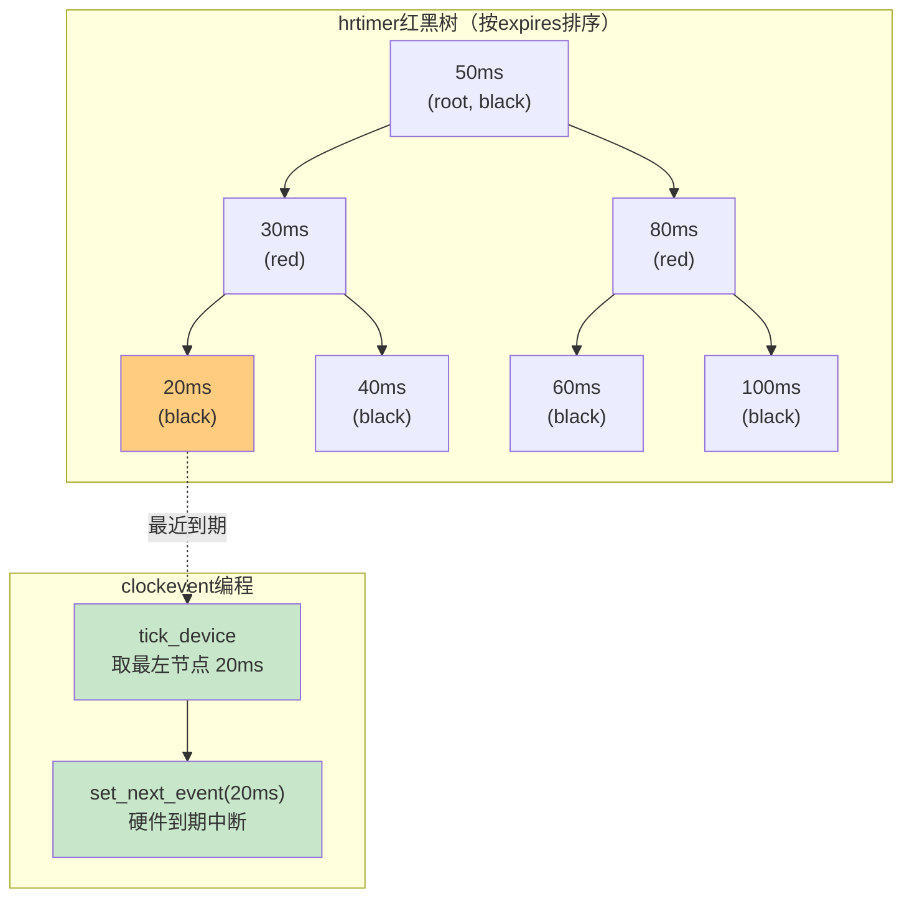
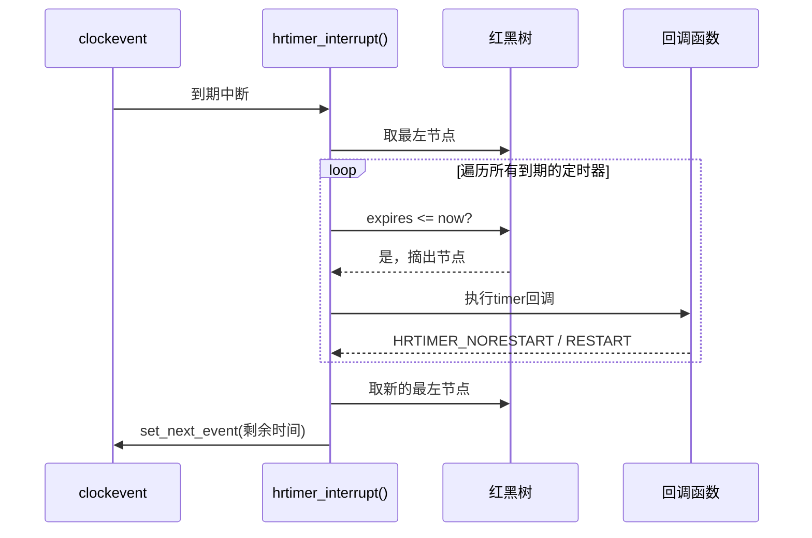

传统`timer_list`的根问题在于"时间的度量"和"事件的触发"被混在了一起——`expires`存的是jiffies，到期只能靠tick中断轮询。hrtimer的思路完全不同：**它把定时器管理和事件触发彻底拆开**，靠clockevent的oneshot能力直接对硬件编程，精度从此跟HZ说拜拜。

**知识点114 [E][M] hrtimer的核心机制**

hrtimer把时间戳换成了**纳秒级的绝对时间**。`struct hrtimer`里的`expires`字段类型是`ktime_t`，本质上是64位纳秒计数：

```c
struct hrtimer {
    struct timerqueue_node      node;       /* 红黑树节点，按到期时间排序 */
    enum hrtimer_restart        (*function)(struct hrtimer *);
    struct hrtimer_clock_base   *base;
    u8                          state;
    /* ... */
};

struct timerqueue_node {
    struct rb_node node;
    ktime_t expires;                        /* 纳秒级绝对时间 */
};
```

`timerqueue_node`把每个hrtimer挂进一颗**红黑树**，按`expires`从小到大排序。插入和删除都是O(log n)，取最左节点就是下一个要到期的，O(1)。比传统`timer_list`的链表扫描高效太多了。



红黑树每个CPU独立维护一颗（`hrtimer_bases`数组），避免跨CPU锁竞争。调用`hrtimer_start()`时，内核选择对应的base插入，然后检查新定时器是否比当前最紧急的还早到期——如果是，就**重新编程clockevent**把中断提前。

这就是hrtimer不受HZ限制的秘诀：内核**每次根据红黑树里最紧急的定时器，直接告诉硬件"X纳秒后来中断我"**，不需要等固定tick来轮询。

硬件中断到来时，`hrtimer_interrupt()`执行：



处理完到期定时器后，`hrtimer_interrupt()`取新的最左节点，计算剩余时间，再调用`set_next_event()`重新编程。红黑树空了就不设了，让CPU安心睡觉——这就是NO_HZ_idle的基础。

hrtimer两种基本模式：

| 模式 | 含义 | 典型用途 |
|------|------|----------|
| `HRTIMER_MODE_ABS` / `HRTIMER_MODE_ABS_PINNED` | 绝对时间，到指定时间点触发 | 音视频同步、调度deadline |
| `HRTIMER_MODE_REL` / `HRTIMER_MODE_REL_PINNED` | 相对时间，从调用时刻起算 | 超时处理、周期性采样 |

带`_PINNED`后缀表示定时器绑定在**当前CPU**，不随进程迁移。实时场景里这个很关键——你在CPU 0设了一个10微秒后触发的定时器，到期前进程被调度到CPU 1，如果定时器跟着迁移，base切换和锁操作都会引入额外延迟。

来看使用代码：

```c
#include <linux/hrtimer.h>
#include <linux/ktime.h>

static struct hrtimer hr_timer;

static enum hrtimer_restart my_hrtimer_callback(struct hrtimer *timer)
{
    pr_info("hrtimer fired at %llu ns\n", ktime_to_ns(ktime_get()));
    return HRTIMER_NORESTART;   /* 只触发一次 */
}

static int __init my_init(void)
{
    ktime_t ktime;

    ktime = ktime_set(0, 100 * 1000);   /* 100微秒 */

    hrtimer_init(&hr_timer, CLOCK_MONOTONIC, HRTIMER_MODE_REL);
    hr_timer.function = my_hrtimer_callback;

    hrtimer_start(&hr_timer, ktime, HRTIMER_MODE_REL);

    return 0;
}

static void __exit my_exit(void)
{
    hrtimer_cancel(&hr_timer);
}
```

如果想做成周期性的，回调里返回`HRTIMER_RESTART`并用`hrtimer_forward_now()`推进到期时间：

```c
static enum hrtimer_restart my_periodic_callback(struct hrtimer *timer)
{
    /* 处理本次到期 */
    do_work();
    /* 把到期时间推进100微秒，从当前时间算起 */
    hrtimer_forward_now(timer, ns_to_ktime(100 * 1000));
    return HRTIMER_RESTART;
}
```

`hrtimer_forward_now()`和`HRTIMER_RESTART`的配合是周期性hrtimer的标准写法。注意它是"从当前时间向前推"，而不是简单地在原expires上加——这样能避免累积漂移。

留意`hrtimer_init()`的第二个参数：`CLOCK_MONOTONIC`是单调时钟，不受系统时间调整影响；用`CLOCK_REALTIME`的话，`date`改系统时间会导致定时器提前或推迟触发，通常不是你想要的。

> **陷阱**：`hrtimer_cancel()`会等回调执行完才返回，这意味着它**可能在回调内部阻塞**。如果你的回调里又调了`hrtimer_cancel()`——死锁。这种情况应该用`hrtimer_try_to_cancel()`，它在回调执行时返回-1。另外，`hrtimer_start()`对已经pending的定时器的行为在不同版本里有差异，稳妥的做法是先`hrtimer_cancel()`再`hrtimer_start()`，别依赖隐式取消的语义。我见过一个驱动栽在这上面，移植内核版本时定时器行为异常，查了好几天。

**知识点115 [I] hrtimer的精度保证**

说到底，hrtimer能达到多高的精度，瓶颈不在软件层，而在**硬件**。

hrtimer的软件路径本身开销很小：红黑树操作O(log n)，回调走软中断上下文，没有多余的轮询。真正决定精度下限的是底层clockevent。当前主流ARM平台上，Generic Timer的计数器频率通常几MHz到几十MHz（比如19.2MHz对应约52纳秒一个cycle）。`set_next_event()`往比较寄存器写cycle值，硬件计数到达就自动触发中断。

理论上精度可达**微秒级甚至亚微秒级**——前提是中断延迟够低。实际中，总线竞争、Cache miss、关中断临界区、SMM/EL3固件劫持都会让精度打折。x86上的SMM有时会"偷走"CPU几百微秒，hrtimer只能等着。

追求极致精度，除了用hrtimer还要绑到隔离CPU（`isolcpus`）、用`SCHED_FIFO`调度、关掉CPU动态调频。软件框架选对了，只是第一步——毕竟硬件层面的干扰，内核再高明的算法也挡不住。
