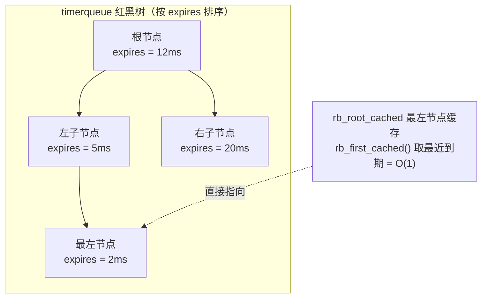
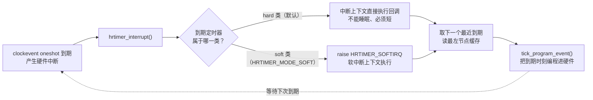

# 10.5.4 hrtimer 的实现

> 所属章节：第10章 中断与时间 > 10.5 时间子系统
>
> 难度：[E→M] | 预计阅读时间：20分钟

## <span class="blue">本节导读

10.5.1 的实验已经把结论钉死了：timer_list 站在 tick 上，HZ=250 时任何请求都被量化到 4ms 边界。10.5.3 的时间轮把"扫一遍列表"优化成 O(1) 定位，但检查的时机没变——还是在 tick 上。**时间轮优化的是定时器的数量，不是精度**。

微秒级需求靠谁？靠 hrtimer（高精度定时器）。10.5.1 结尾说它"换计时基准"，本节把这句话拆开：基准换成了什么、定时器怎么组织、到期那一刻内核代码怎么走。

> 本节覆盖：hrtimer 凭什么突破 HZ 限制（clockevent oneshot）、管理海量定时器的数据结构（timerqueue 红黑树与最左缓存）、v6.6 `hrtimer_interrupt()` 的真实处理流程、hard/soft 两个到期类，以及 ABS/REL/PINNED/SOFT 的选型与一个可编译验证的最小模块实验。

---

## <span class="blue">突破点：不再等敲钟

timer_list 的精度天花板来自一件事：**检查定时器的时机被绑在 tick 上**（10.5.1）。hrtimer 的突破不是把 tick 弄快，而是根本不站在 tick 上——它基于 clockevent 的 **oneshot 模式**：硬件定时器不再周期性地敲钟，而是"设定一个精确的到期时刻，到点触发一次"。

内核每次处理完到期的定时器，就计算出下一个最近的到期时刻，把它写进硬件比较寄存器，然后硬件自己看着办：

```
timer_list:  tick → tick → tick → tick   定时器只能对齐到 tick 边界

hrtimer:     ━━━━━━━━━━━━━━━━━━━━━━━━━━  平时没有 tick
                      ↑
                 到期时刻精确触发          精度取决于硬件分辨率
```

"精确的到期时刻"需要一个比 jiffies 细得多的时间表示：

> ktime_t：内核的纳秒级时间类型（v6.6 里就是一个 64 位有符号整数，单位纳秒）。hrtimer 全家桶——到期时间、时间差、时钟读取——都用它表示，配套的换算宏是 `ns_to_ktime()` / `us_to_ktime()` / `ms_to_ktime()` / `ktime_add()` / `ktime_get()`（读当前时刻）。看到 hrtimer 代码里的 `ktime_t`，直接读成"一个纳秒数"即可。

精度不再和 HZ 挂钩，而是取决于底层时钟硬件的分辨率。ARM SoC 的 Generic Timer 通常运行在几十 MHz，理论分辨率进入纳秒级；实际精度还受中断延迟、C-state 唤醒等因素影响——那是 10.5.5 要专门对付的问题。

## <span class="blue">timerqueue：红黑树 + 最左缓存

hrtimer 用**红黑树**（具体封装为 `timerqueue`）按到期时间排序管理定时器。v6.6 的 `struct hrtimer`（include/linux/hrtimer.h，真实字段）：

```c
struct hrtimer {
	struct timerqueue_node		node;         /* 红黑树节点，内含到期时刻 expires */
	ktime_t				_softexpires; /* soft 到期类的最早到期时刻 */
	enum hrtimer_restart	(*function)(struct hrtimer *);  /* 到期回调 */
	struct hrtimer_clock_base	*base;        /* 所属时钟基（哪个时钟、哪个 CPU） */
	u8				state;
	u8				is_rel;       /* 相对/绝对模式 */
	u8				is_soft;      /* soft 到期类 */
	u8				is_hard;      /* hard 到期类 */
};
```

一个常见误解要纠正：**红黑树里"最近到期"的节点不是根节点，而是最左节点**（中序遍历的第一个）。红黑树只保证树高平衡；v6.6 的 timerqueue 用的是带最左缓存的红黑树变体 `rb_root_cached`（include/linux/timerqueue.h），取最近到期节点走 `rb_first_cached()` 直接读缓存——所以"取最近到期的定时器"是 O(1)，插入/删除才是 O(log n)。



注意根节点（12ms）并不是最近到期的——最左节点（2ms）才是。这就是最左缓存存在的意义：oneshot 模式每次都要问"下一个到期的是谁"，这个问题必须 O(1) 回答，否则每次中断处理都要遍历树，微秒级精度就无从谈起。

## <span class="blue">hrtimer_interrupt()：v6.6 的真实流程

oneshot 定时器到期触发硬件中断后，进入 `hrtimer_interrupt()`（kernel/time/hrtimer.c）。v6.6 的真实结构（精简保留主干）：

```c
void hrtimer_interrupt(struct clock_event_device *dev)
{
    struct hrtimer_cpu_base *cpu_base = this_cpu_ptr(&hrtimer_bases);
    ktime_t expires_next, now, entry_time, delta;
    unsigned long flags;
    int retries = 0;

    cpu_base->nr_events++;              /* 统计中断次数 */
    dev->next_event = KTIME_MAX;        /* 先释放硬件事件，避免嵌套干扰 */

    raw_spin_lock_irqsave(&cpu_base->lock, flags);   /* 硬中断上下文，用 raw 自旋锁 */
    entry_time = now = hrtimer_update_base(cpu_base); /* 读时钟源、对齐到当前时间 */
retry:
    cpu_base->in_hrtirq = 1;            /* 标记：正在 hrtimer 中断中（影响 timer 入队路径） */
    cpu_base->expires_next = KTIME_MAX; /* 重编程前清空，run_queues 会重新填 */

    /* soft 类定时器到期：不在这里跑回调，抛 HRTIMER_SOFTIRQ 等软中断处理 */
    if (!ktime_before(now, cpu_base->softirq_expires_next)) {
        cpu_base->softirq_expires_next = KTIME_MAX;
        cpu_base->softirq_activated = 1;
        raise_softirq_irqoff(HRTIMER_SOFTIRQ);
    }

    /* 直接执行所有到期的 hard 类定时器回调（高精度定时器的硬保证路径） */
    __hrtimer_run_queues(cpu_base, now, flags, HRTIMER_ACTIVE_HARD);

    expires_next = hrtimer_update_next_event(cpu_base); /* 找出下一个最早到期时刻 */
    cpu_base->expires_next = expires_next;
    cpu_base->in_hrtirq = 0;
    raw_spin_unlock_irqrestore(&cpu_base->lock, flags);

    /* 编程硬件时钟：把下一个到期时刻写进 clock event device */
    if (!tick_program_event(expires_next, 0)) {
        cpu_base->hang_detected = 0;    /* 编程成功，清 hang 标志 */
        return;
    }
    /* ... 编程失败（如已过期/嵌套中断）：重试并带 hang 检测，防止 CPU 被死锁 ... */
}
}
```

主干只有三步：处理到期回调（soft 类抛软中断、hard 类就地执行）→ 从红黑树取下一个最近到期 → 编程硬件。最后一步的入口函数值得认识一下：

> tick_program_event()：把"下一个到期时刻"写进 clockevent 硬件比较寄存器的内核内部入口（kernel/time/tick-oneshot.c）。它不是驱动 API，是时间子系统自己用的——但你跟踪"定时器到底哪一刻变成硬件中断"时，终点就是它。它返回非零表示硬件编程失败（比如给的时刻已经过去），调用方负责重试。

比旧资料里的版本多一个重要细节：**v6.6 的 hrtimer 分 hard/soft 两个到期类**。

- hard 类（`HRTIMER_ACTIVE_HARD`）在中断上下文直接执行；
- soft 类（标记 `is_soft`，由 `HRTIMER_MODE_SOFT` 指定）被抛给 `HRTIMER_SOFTIRQ` 在软中断上下文执行。

> 注意 hard/soft 的默认方向：不显式带 `HRTIMER_MODE_SOFT` 的 hrtimer 都是 **hard 类**——包括 nanosleep 的唤醒定时器（hrtimer.c 里用 `HRTIMER_MODE_REL`），它的回调在硬中断上下文做唤醒。规则在 PREEMPT_RT 上反转：未显式标记 `HRTIMER_MODE_HARD` 的 hrtimer 一律被移到 soft 类执行（RT 下回调里可能睡眠，见 10.4.3）。所以写驱动时别假设"反正会走软中断"——非 RT 内核上默认就是硬中断上下文。

到期遍历本身是增量式的：从最左节点开始，收集所有 `expires <= now` 的节点执行回调，遇到第一个未到期节点就停——排序保证了后面的只会更晚。

整个触发-处理-再编程的循环：



> ⚠️ hard 类 hrtimer 的回调在**硬中断上下文**执行：不能睡眠、不能 `kmalloc(GFP_KERNEL)`，执行时间过长会推迟同 CPU 上后续定时器并拉长 irqsoff 时间。回调必须短，重活用 workqueue 接走（见 10.3.4）。

---

## <span class="blue">模式选型与代码实战 [I]

四种基本模式加一个 SOFT 标记：

| 模式 | 时间基准 | CPU 绑定 | 适用场景 |
|:---:|:---:|:---:|:---|
| `HRTIMER_MODE_ABS` | 绝对时间 | 不绑定 | 指定精确时刻触发 |
| `HRTIMER_MODE_ABS_PINNED` | 绝对时间 | 绑定启动它的 CPU | 访问 per-CPU 数据的定时任务 |
| `HRTIMER_MODE_REL` | 相对时间 | 不绑定 | 普通延迟，允许迁移 |
| `HRTIMER_MODE_REL_PINNED` | 相对时间 | 绑定启动它的 CPU | 本 CPU 内的周期任务 |

`HRTIMER_MODE_SOFT` 可与上述组合（如 `HRTIMER_MODE_REL_SOFT`），把回调放到 HRTIMER_SOFTIRQ 执行。`PINNED` 的意义：不绑定时，定时器回调可能随负载均衡迁到别的 CPU 执行；访问 per-CPU 数据或有缓存亲和要求的场景必须用 `PINNED`。

### 实验：一个可编译的最小 hrtimer 模块

写一个模块，加载后请求"100 微秒后叫我"，回调里打印触发时所在的 CPU。先写 `hrtimer_demo.c`：

```c
/* hrtimer_demo.c — 观察 hrtimer 的 100us 单次触发 */
#include <linux/module.h>
#include <linux/hrtimer.h>
#include <linux/ktime.h>

static struct hrtimer demo_timer;

static enum hrtimer_restart demo_cb(struct hrtimer *timer)
{
	pr_info("hrtimer_demo: fired on CPU %d\n", smp_processor_id());
	return HRTIMER_NORESTART;   /* 单次触发，用完即弃 */
}

static int __init demo_init(void)
{
	/* 初始化和启动必须用同一个模式，这里都是 REL */
	hrtimer_init(&demo_timer, CLOCK_MONOTONIC, HRTIMER_MODE_REL);
	demo_timer.function = demo_cb;
	hrtimer_start(&demo_timer, us_to_ktime(100), HRTIMER_MODE_REL);
	return 0;
}

static void __exit demo_exit(void)
{
	hrtimer_cancel(&demo_timer);   /* 还没触发就撤掉；已触发则是空操作 */
}

module_init(demo_init);
module_exit(demo_exit);
MODULE_LICENSE("GPL");
```

回调返回值是新概念，先解释再看编译：

> HRTIMER_NORESTART / HRTIMER_RESTART：回调的返回值，告诉内核"用完即弃"还是"再来一轮"。返回 RESTART 之前必须先用 `hrtimer_forward_now(timer, 间隔)` 把到期时刻向前推进一个周期，否则到期时刻还停在刚才那一刻，内核会认为它"立刻又到期了"，回调被反复调用直到卡死。周期定时器的标准写法就是回调末尾这两行：`hrtimer_forward_now(...)` + `return HRTIMER_RESTART;`。

同目录放 Makefile，编译运行（与 10.5.1 实验同一套流程）：

```makefile
obj-m += hrtimer_demo.o
```

```bash
# 板子上本机编译：
make -C /lib/modules/$(uname -r)/build M=$PWD modules

# 交叉编译（在 PC 上，指向你的内核源码树）：
make -C <内核源码路径> M=$PWD ARCH=arm64 CROSS_COMPILE=aarch64-linux-gnu- modules

# 加载、观察、卸载：
insmod hrtimer_demo.ko
dmesg | tail -5
rmmod hrtimer_demo
```

预期输出：

```text
[  234.567] hrtimer_demo: fired on CPU 2
```

把它和 10.5.1 的实验对照着看：那边请求"下一声钟"，拿到的永远是 4000μs 的整数倍；这边请求 100μs，触发发生在 100μs 本身——中间没有等任何 tick 边界。这就是两套机制的差别在板子上的样子。

> 🔴 `hrtimer_init()` 与 `hrtimer_start()` 的模式必须一致。两边不匹配时到期时间会完全错乱（ABS 时刻被当成 REL 偏移之类）。内核开启 `CONFIG_DEBUG_OBJECTS_TIMERS` 时能捕获部分这类误用，但默认配置下不会替你兜底——写完自己对一遍。

### 高负载下的行为

红黑树插入/删除是 O(log n)：1024 个定时器约 10 次比较，4096 个约 12 次。定时器数量本身不会成为瓶颈。

真正影响精度的是回调执行时间：`hrtimer_interrupt()` 顺序执行所有到期回调，某个回调跑几百微秒，排在它后面的定时器就整体顺延。两条纪律：

1. 回调只做最短路径的工作（置标志、唤醒线程、提交 work）。
2. 硬中断上下文禁止一切可能睡眠的操作。

---

## <span class="blue">本节总结

hrtimer 的精度来自 clockevent oneshot 的按需触发：到期时刻直接编程进硬件比较器，不再等 tick；它的扩展性来自 timerqueue 红黑树——O(log n) 管理任意数量，O(1) 最左缓存回答"下一个是谁"。v6.6 起分 hard/soft 两个到期类：默认是 hard 类、回调跑在硬中断上下文，必须短且不能睡眠；SOFT 需显式标记，把回调让渡给 HRTIMER_SOFTIRQ，代价是自己的触发延迟变差。

和 10.5.1 的 timer_list 对照着收个尾：timer_list 的基准是 jiffies、检查在 tick 上、精度 1/HZ、回调在 TIMER_SOFTIRQ 软中断；hrtimer 的基准是纳秒时钟、触发靠硬件比较器、精度到硬件分辨率、回调默认在硬中断上下文。一个管毫秒到秒级的海量粗活，一个管微秒级的精细活——内核里两套机制并存，不是新旧替代，是分工。

模式选型一句话：普通延迟用 REL，精确时刻用 ABS，CPU 亲和加 PINNED，回调长且对延迟不敏感才考虑 SOFT。

---

## <span class="blue">下一步

10.5.5 hrtimer 精度与 CPU idle——hrtimer 机制本身精度很高，但 CPU 进入深 C-state 后，唤醒延迟可能让微秒级定时退化成数百微秒。下一节分析这个实际工程中最常见的 hrtimer 精度杀手。
