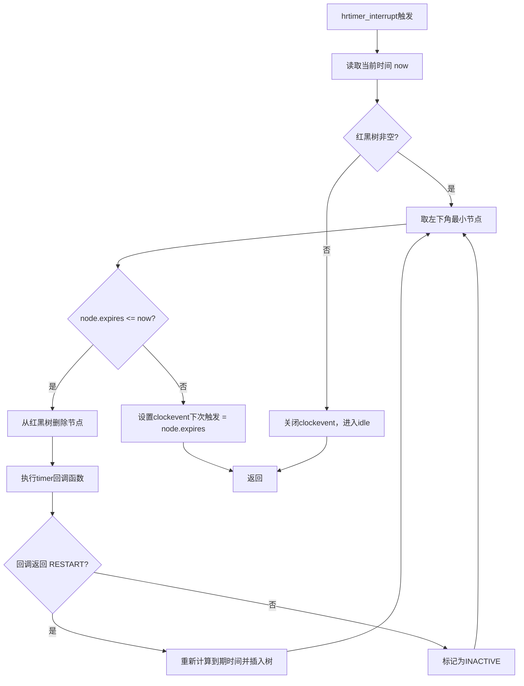

# 10.5.4 hrtimer的实现

> 所属章节：第10章 中断与时间 > 10.5 hrtimer高精度定时器
>
> 难度：[E][M] | 预计阅读时间：20分钟

## <span class="blue"> 本节导读

你有没有想过，为什么`setitimer()`的精度卡在毫秒级怎么也上不去，而内核却能实现微秒级甚至纳秒级的定时？秘密就在于`hrtimer`——内核的高精度定时器子系统。本节带你深入`hrtimer`的核心实现，搞懂它为什么能突破`HZ`的枷锁，以及红黑树是怎么撑起整个定时器管理的。<br>
学完后，你将理解`hrtimer`的底层架构，能写出正确的`hrtimer_init()`和`hrtimer_start()`代码，并知道不同模式（ABS_PINNED vs REL）该在什么时候用。

---

## <span class="blue"> hrtimer为什么精度不受HZ限制？ [E][M]

### 打破HZ枷锁：clockevent oneshot模式

传统定时器`timer_list`为什么精度差？说白了，它依赖周期性的tick中断。假设`HZ=250`，tick每4ms才来一次，你的定时器最快也只能4ms触发一次。精度被`HZ`这个"天花板"死死按住。

`hrtimer`是怎么跳出这个坑的？它基于`clockevent`的**oneshot模式**。oneshot的意思是：时钟硬件触发一次中断后就停下来，不再周期性滴答。内核在每次处理完定时器后，主动计算下一个最近的到期时间，重新编程硬件。这就像你约人见面，不是每隔4分钟看一次表，而是定好闹钟到点就响——精准、不浪费。

```
传统timer:  tick → tick → tick → tick  (固定周期，4ms)
            ↑定时器只能在这里被检查

hrtimer:    ━━━━━━━━━━━━━━━━━━━━━━━━━  (无tick，完全静默)
                 ↑                    
              到期了！立刻触发        (微秒级精度)
```

> 💡 **提示**：高分辨率模式下，`hrtimer`精度可达约1微秒。实际数值取决于硬件时钟源的质量和clockevent驱动的实现。

这种设计意味着精度不再与`HZ`挂钩，而是取决于底层硬件时钟的分辨率。现代ARM SoC上的`arch_timer`（ARM架构定时器）通常运行在几十MHz，理论分辨率轻松进入纳秒级。

### 红黑树：按到期时间排序的"时间线"

`hrtimer`怎么管理成千上万个定时器，还要快速找到最近到期的那个？内核用的是**红黑树**（Red-Black Tree）。

每个`hrtimer`节点在树上按到期时间排序——到期越早，位置越靠左。树根节点永远是最近要到期的定时器。插入和删除的时间复杂度都是`O(log n)`，哪怕有上千个定时器，操作次数也不过是十几次比较。

```
        [expires=100ms]          ← 根节点 = 最近的定时器
           /        \
    [50ms]          [200ms]
      /   \          /    \
  [30ms] [80ms]  [150ms] [300ms]

中序遍历：30ms → 50ms → 80ms → 100ms → 150ms → 200ms → 300ms
```

来看`hrtimer`在红黑树中的关键数据结构（`include/linux/hrtimer.h`）：

```c
struct hrtimer {
    struct timerqueue_node  node;       // 红黑树节点，包含expires时间
    enum hrtimer_restart    (*function)(struct hrtimer *); // 回调函数
    struct hrtimer_clock_base *base;    // 所属的时钟基（MONOTONIC/REALTIME）
    u8                      state;      // HRTIMER_STATE_INACTIVE/ENQUEUED/etc
    // ...
};
```

`timerqueue_node`内部嵌套了`struct rb_node`，这就是红黑树的链接纽带。`node.expires`存储到期时间，`rb_node`存储左右子树指针和颜色标记。

### hrtimer_interrupt()：到期处理的"发动机"

当oneshot时钟到期触发中断后，`hrtimer_interrupt()`登场。它的工作清晰而高效：

```
hrtimer_interrupt() 处理流程
│
├─ 1. 获取当前时间（monotonic时钟）
│
├─ 2. 遍历红黑树，找到所有 expires <= 当前时间的节点
│   │
│   ├─ 从根节点开始向左下遍历
│   ├─ 节点到期？→ 从树中删除，执行回调
│   └─ 节点未到期？→ 停止遍历（后续节点更晚）
│
├─ 3. 重新设置clockevent的下一个到期时间
│   └─ 取红黑树新的根节点（最早的未到期定时器）
│
└─ 4. 返回
```



这个遍历是**增量式**的。假设当前时间是`T`，红黑树中所有`expires <= T`的节点都被视为到期。遍历从左下角（最小值）开始，一路向右收集所有到期节点。因为红黑树是排序的，一旦遇到第一个未到期的节点，就可以立即停下来——后面的节点到期时间只会更晚。

来看关键源码逻辑（位于`kernel/time/hrtimer.c`）：

```c
/**
 * hrtimer_interrupt - hrtimer中断顶层处理函数
 * @dev: clockevent设备
 */
void hrtimer_interrupt(struct clock_event_device *dev)
{
    struct hrtimer_cpu_base *cpu_base = this_cpu_ptr(&hrtimer_bases);
    ktime_t expires, now;
    
    // 1. 获取当前时间
    now = ktime_get_update_offsets_now();
    
    // 2. 遍历所有到期的hrtimer
    while ((expires = __hrtimer_get_next_event(cpu_base)) != KTIME_MAX) {
        if (expires > now)
            break;  // 最早的定时器都还没到，停止
        
        // 处理到期定时器：执行回调
        __run_hrtimer(cpu_base, now);
    }
    
    // 3. 重新编程clockevent
    if (expires != KTIME_MAX)
        tick_program_event(expires, 1);
    else
        tick_program_event(KTIME_MAX, 1);  // 没有定时器了
}
```

> ⚠️ **陷阱**：`hrtimer`的回调函数在中断上下文执行！如果你的回调里做了太多事情——比如长时间循环、申请内存、调用可能睡眠的函数——会阻塞其他`hrtimer`的处理，甚至影响整个系统的实时性。记住：`hrtimer`回调必须短小精悍，能快则快。

---

## <span class="blue"> hrtimer的两种模式与高负载精度保证 [I]

### 四种模式速查

`hrtimer`不像传统定时器那样简单地"相对延迟N毫秒"。它提供了更精细的控制，核心区分在于两点：时间是**绝对**还是**相对**？执行是否**绑定特定CPU**？

| 模式 | 时间基准 | CPU绑定 | 适用场景 |
|:---:|:---:|:---:|:---|
| `HRTIMER_MODE_ABS` | 绝对时间 | 不绑定 | 跨CPU的精确时间调度 |
| `HRTIMER_MODE_ABS_PINNED` | 绝对时间 | 绑定当前CPU | 固定CPU上的硬实时任务 |
| `HRTIMER_MODE_REL` | 相对时间 | 不绑定 | 普通延迟，到期可能迁移 |
| `HRTIMER_MODE_REL_PINNED` | 相对时间 | 绑定当前CPU | 本CPU内延迟，不迁移 |

绝对时间用`ktime_t`直接指定到期的具体时刻（如"在单调时钟T=100ms时触发"）；相对时间则是"从现在开始过N纳秒触发"。

`PINNED`标志的含义很重要：它告诉内核这个定时器必须绑在**启动它的那个CPU**上执行。没有这个标志，负载均衡可能会把你的定时器回调搬到别的CPU去——这在大多数场景没问题，但如果你有CPU亲和性要求（比如访问该CPU的per-CPU数据），就必须用`PINNED`。

### 代码实战：两种模式的用法

下面展示`hrtimer_init()`和`hrtimer_start()`的完整使用示例：

```c
#include <linux/hrtimer.h>
#include <linux/ktime.h>

static struct hrtimer my_timer;

/* 回调函数：必须返回 enum hrtimer_restart */
static enum hrtimer_restart my_callback(struct hrtimer *timer)
{
    pr_info("hrtimer fired at CPU %d!\n", smp_processor_id());
    
    // 不重启：这个定时器只触发一次
    return HRTIMER_NORESTART;
    
    // 如果需要周期性触发，返回RESTART并设置新的到期时间：
    // hrtimer_forward_now(timer, ms_to_ktime(10));
    // return HRTIMER_RESTART;
}

/* ========== 模式1：相对时间 ========== */
static void setup_relative_timer(void)
{
    // 初始化：使用MONOTONIC时钟，REL模式（相对时间）
    hrtimer_init(&my_timer, CLOCK_MONOTONIC, HRTIMER_MODE_REL);
    my_timer.function = my_callback;
    
    // 从现在开始，100微秒后触发
    hrtimer_start(&my_timer, us_to_ktime(100), HRTIMER_MODE_REL);
}

/* ========== 模式2：绝对时间 + 绑定CPU ========== */
static void setup_abs_pinned_timer(void)
{
    ktime_t abs_time;
    
    // 初始化：MONOTONIC时钟，ABS_PINNED模式
    hrtimer_init(&my_timer, CLOCK_MONOTONIC, HRTIMER_MODE_ABS_PINNED);
    my_timer.function = my_callback;
    
    // 计算绝对到期时间：当前时间 + 500微秒
    abs_time = ktime_add(ktime_get(), us_to_ktime(500));
    
    // 在指定的绝对时刻触发，且绑定当前CPU
    hrtimer_start(&my_timer, abs_time, HRTIMER_MODE_ABS_PINNED);
}
```

> 🔴 **危险**：`HRTIMER_MODE_ABS`和`HRTIMER_MODE_REL`的数值不同，如果你在`hrtimer_init()`里用`REL`初始化，却在`hrtimer_start()`里传`ABS`，内核不会报错，但定时器的到期时间会完全错乱——可能是几纳秒后，也可能是几十年后。务必保持init和start的模式一致！

### 高负载下的精度保证

系统里有几百个`hrtimer`同时跑，精度还能保证吗？这是红黑树的优势所在。

插入一个新定时器的时间复杂度是`O(log n)`。就算有1024个定时器，也只需要约10次比较。删除和处理到期同样是`O(log n)`。这意味着`hrtimer_interrupt()`的处理时间不会随定时器数量线性爆炸。

```
定时器数量 vs 红黑树操作次数：
  16个   → 最多4次比较
  64个   → 最多6次比较
  256个  → 最多8次比较
  1024个 → 最多10次比较
  4096个 → 最多12次比较
```

当然，如果某个回调函数执行时间过长，后面的定时器就会被推迟——这不是红黑树的问题，而是回调设计的问题。高负载下的精度保证有两个前提：

1. **回调必须简短**。执行几十微秒可以，几毫秒就太长了。
2. **不要在中断上下文睡眠**。`hrtimer`回调跑在硬中断上下文，`msleep()`、`kmalloc(GFP_KERNEL)`这些操作是非法的。

> 💡 **提示**：如果你需要在中断里做"重活"，正确姿势是把工作"抛"出去——在`hrtimer`回调里触发一个`tasklet`或调度一个`workqueue`，让`hrtimer`本身尽快返回。

---

## <span class="blue"> 本节总结

| 对比项 | 传统timer_list | hrtimer |
|:---:|:---:|:---:|
| 精度依赖 | `HZ`（毫秒级） | 硬件时钟（微秒级） |
| 时钟模式 | 周期性tick | clockevent oneshot |
| 数据结构 | 基于链表（per-CPU） | 红黑树（全局排序） |
| 插入复杂度 | `O(1)`（头插） | `O(log n)` |
| 找最近到期 | `O(n)`遍历 | `O(log n)`取根 |
| 模式选择 | 无 | ABS/REL/PINNED组合 |
| 回调上下文 | 软中断 | 硬中断 |

`hrtimer`通过clockevent oneshot模式摆脱了`HZ`的限制，用红黑树实现了高效的多定时器管理。理解它的关键在于两点：一是oneshot硬件如何支持"按需触发"，二是红黑树如何保证`O(log n)`的查找和插入。模式选择上，普通延迟用`REL`，需要精确时钟点的用`ABS`，CPU亲和性要求用`PINNED`。

---

## <span class="blue"> 下一步

10.5.5 hrtimer精度问题与CPU idle——为什么CPU进入idle状态后hrtimer可能不准？`no_hz_idle`和`tick_nohz_stop_sched_tick()`是怎么影响高精度定时的？深入探讨CPU idle与hrtimer的微妙关系。

---

## <span class="blue"> 配套资源

| 资源 | 路径 | 说明 |
|:---|:---|:---|
| 核心头文件 | `include/linux/hrtimer.h` | `struct hrtimer`定义、模式枚举 |
| 实现源码 | `kernel/time/hrtimer.c` | `hrtimer_interrupt()`、`__run_hrtimer()` |
| clockevent接口 | `include/linux/clockchips.h` | oneshot模式定义 |
| 红黑树实现 | `lib/rbtree.c` | 内核通用红黑树 |
| 示例代码 | 本节代码片段 | `hrtimer_init()` + `hrtimer_start()`两种模式 |
