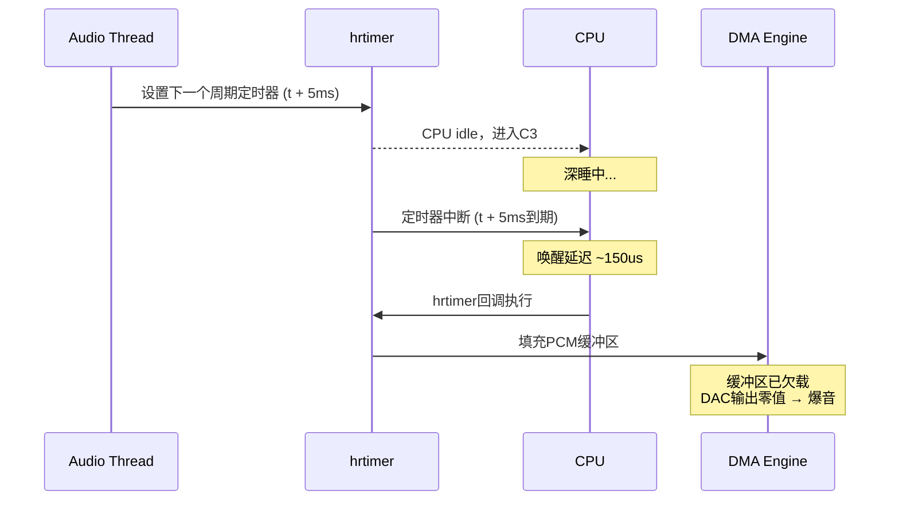

hrtimer的设计精度是微秒级的，这在内核文档里写得清清楚楚。但有一个坑，很多人栽过——CPU的电源管理。你的hrtimer代码写得再漂亮，CPU一旦"睡死"过去，什么精度都是空谈。

**知识点118 [E]**

现代CPU为了省电，idle时会逐级进入更深的C-state。C0是运行态，C1浅睡，C2、C3越来越深。每深一级，功耗更低，但唤醒代价更高。从C1恢复可能只要几微秒，从C3或更深的C-state回来，动辄上百微秒，某些处理器上甚至能到毫秒级。

这对hrtimer的打击是直接的。hrtimer的到期处理依赖中断，而中断来了之后CPU得先醒过来才能执行handler。如果CPU正躺在C-state深处，中断只是把它叫醒的"闹钟"，从睁眼到起身还需要时间。这段时间里，你的高精度定时器就像个普通定时器一样被晾在那儿。

我见过一个案例。某款嵌入式设备上做音频回放，用hrtimer驱动PCM缓冲区的周期填充。大部分时候声音正常，但偶尔会"咔"地爆音一下，毫无规律。抓trace一看，爆音的点总是和CPU进入深C-state重合——hrtimer到期了，但handler被推迟了将近200微秒，PCM缓冲区空了，DMA没数据可传，DAC直接输出了零值，就是那一声"咔"。

这个问题特别讨厌的是它的偶发性。负载低的时候CPU更容易进深C-state，问题反而更频繁。负载高的时候CPU没空睡觉，一切正常。跟用户报告"我的程序不忙的时候反而出错"，人家觉得你在扯淡。



**知识点119 [I]**

解决思路很简单粗暴：让对延迟敏感的CPU别睡那么死。

Linux的cpuidle子系统在sysfs里暴露了每个CPU每个C-state的disable开关。对于承载实时任务的CPU，可以把深C-state关掉：

```bash
# 查看cpu0的所有C-state
ls /sys/devices/system/cpu/cpu0/cpuidle/
# state0 state1 state2 state3 ...

# 逐个禁用深C-state（保留最浅的C1）
echo 1 > /sys/devices/system/cpu/cpu0/cpuidle/state3/disable
echo 1 > /sys/devices/system/cpu/cpu0/cpuidle/state2/disable

# 批量处理所有CPU
for cpu in /sys/devices/system/cpu/cpu[0-9]*; do
    cpuidir="$cpu/cpuidle"
    for state in $cpuidir/state[2-9]*; do
        [ -w "$state/disable" ] && echo 1 > "$state/disable"
    done
done
```

在内核代码里也能做，搜索`cpuidle`相关的驱动，找到对应的state descriptor把`disabled`标志置上就行。不过生产环境直接用sysfs更灵活。

| C-state | 典型唤醒延迟 | 对hrtimer影响 | 建议 |
|---------|-----------|------------|------|
| C0 (Running) | 0 | 无 | 理想状态 |
| C1/C1E | 1-3 μs | 轻微 | 通常保留 |
| C2/C3 | 10-100 μs | 中等 | 视场景决定 |
| C6/C7 | 100-500 μs | 严重 | 延迟敏感任务禁用 |
| C8+ | 500+ μs | 致命 | 必须禁用 |

> **陷阱**：只关`state*`不够。某些BIOS/UEFI层面有"Auto C-state"或"Package C-state"的独立控制，OS关掉的只是per-core的C-state，整包级别的深睡眠可能还在生效。如果关了C-state问题还在，检查`/sys/devices/system/cpu/cpuidle/current_driver`确认当前驱动，再往上排查平台固件设置。另外，`intel_idle`驱动注册的state编号和实际的硬件C-state并不总是一一对应，disable之前先用`cat /sys/devices/system/cpu/cpu0/cpuidle/state*/name`确认你关的是哪个级别。

说白了，hrtimer的精度不只是软件问题，它是一个软硬件协同的契约。CPU睡得太死，就是单方面撕毁契约。
