# 10.5.6 Alarm Timer与POSIX Timer

> 所属章节：第10章 中断与时间 > 10.5 高精度定时器
>
> 难度：[E] Expert | 预计阅读时间：15分钟

## <span class="blue">本节导读

你的IoT设备每晚11点自动上报一次传感器数据，上报完就进入深度休眠。问题来了——休眠后CPU停钟、总线断电，普通的`hrtimer`谁来帮你叫醒系统？<br>

本节带你认识两位"时间管理高手"：`alarm timer`——让系统在suspend状态下也能被RTC芯片准时叫醒；以及`POSIX timer`——用户空间实现微秒级定时的标准武器。你还会搞清一个关键区别：`hrtimer`在运行时精准，`alarm timer`在休眠时靠谱，它们其实是接力赛跑的搭档，不是竞争对手。<br>

学完后，你将能根据系统状态（运行/休眠/用户空间）选对定时器，写出跨电源状态的可靠定时逻辑。

## <span class="blue">Alarm Timer：Suspend状态下的定时唤醒 [E]

`hrtimer`再精确，也怕一件事——系统进入`suspend`（挂起/深度休眠）。一旦`suspend`，CPU时钟停止，整个时间子系统"冻住"，`hrtimer`的到期事件无人处理，你的定时任务就泡汤了。

那怎么办？让RTC（实时时钟）来兜底。

### RTC：系统休眠时的"守夜人"

RTC是一块独立供电的硬件，靠纽扣电池维持，哪怕主系统断电它也在走字。`alarm timer`的巧妙之处就在于：**把定时请求委托给RTC的alarm（闹钟）功能**。

流程很清晰：

1. 内核通过`rtc-wakealarm`接口向RTC芯片设置一个未来的唤醒时间点
2. 系统进入`suspend`，CPU、总线、外设纷纷断电
3. RTC到了设定时刻，拉高唤醒引脚（通常是`WAKE#`或`IRQ`）
4. 电源管理芯片检测到唤醒信号，重新上电、恢复系统
5. 内核resume后，`alarm timer`的回调被执行

说白了，`alarm timer`就是`hrtimer`在suspend状态下的"替补队员"。

### 设备树里的wakeup-source

想让RTC承担唤醒职责，设备树里需要显式声明：

```dts
// arch/arm64/boot/dts/xxx.dts
&rtc {
    compatible = "nxp,pcf8563";
    interrupt-parent = <&gpio>;
    interrupts = <25 IRQ_TYPE_LEVEL_LOW>;
    wakeup-source;        // <-- 关键：声明该RTC可作为唤醒源
};
```

`wakeup-source`这个属性告诉电源管理框架：这个设备有能力把系统从sleep状态拉回来。

### 内核中使用Alarm Timer

```c
#include <linux/alarmtimer.h>

static struct alarm my_alarm;

// 初始化alarm timer
void alarm_init(struct alarm *alarm, enum alarmtimer_type type,
                alarm_callback_t *callback);

// 设置绝对到期时间（以ktime_t为单位）
int alarm_start(struct alarm *alarm, ktime_t exp);

// 取消alarm
int alarm_cancel(struct alarm *alarm);
```

`alarmtimer_type`有两种选择：

| 类型 | 时钟基 | 说明 |
|------|--------|------|
| `ALARM_REALTIME` | `CLOCK_REALTIME` | 基于 wall-clock 时间，受系统时间调整影响 |
| `ALARM_BOOTTIME` | `CLOCK_BOOTTIME` | 包含休眠时间，不受NTP/手动调时影响 |

对于IoT定时上报这种场景，`ALARM_BOOTTIME`通常是更安全的选择——不会因为管理员手动调了一下系统时间就把今晚的任务跳过。

> 💡 **提示**：`alarm timer`的精度受RTC硬件限制，通常为毫秒级（~1ms），远不如`hrtimer`的微秒级精度。如果你需要us级定时，别指望RTC——它在休眠时根本不走那么快。

---

## <span class="blue">POSIX Timer：用户空间的高精度定时 [E]

内核里有`hrtimer`，用户空间怎么办？`POSIX timer`（`timer_create`/`timer_settime`家族）就是标准答案。

### 核心API三步走

```c
#include <time.h>
#include <signal.h>

// 第一步：创建定时器
timer_t timerid;
struct sigevent sev = {
    .sigev_notify = SIGEV_THREAD,           // 到期时创建新线程执行回调
    .sigev_notify_function = timer_handler,  // 回调函数
    .sigev_notify_attributes = NULL,
};
timer_create(CLOCK_MONOTONIC, &sev, &timerid);

// 第二步：设置到期时间和间隔
struct itimerspec its = {
    .it_value = { 1, 0 },         // 首次到期：1秒后
    .it_interval = { 0, 500000000 }, // 周期：500ms
};
timer_settime(timerid, 0, &its, NULL);

// 第三步：清理
timer_delete(timerid);
```

### 通知方式的选择

`sigevent.sigev_notify`决定定时器到期时怎么通知你：

| 通知方式 | 值 | 行为 | 适用场景 |
|----------|-----|------|----------|
| 发送信号 | `SIGEV_THREAD_ID` | 向指定线程发送实时信号（如`SIGRTMIN`） | 轻量通知，信号处理函数中处理 |
| 创建线程 | `SIGEV_THREAD` | 每次到期创建新线程执行回调函数 | 需要丰富上下文的重度处理 |
| 无 | `SIGEV_NONE` | 不通知，仅能通过`timer_gettime`查询 | 调试/轮询场景 |

> ⚠️ **陷阱**：`SIGEV_THREAD`每次到期都会创建一个新线程！如果你的定时器周期是1ms，每秒就要创建1000个线程——上下文切换和线程创建的开销会把CPU吃光。高频场景务必改用`SIGEV_THREAD_ID`配合信号处理，或者在回调里只做最小化工作（如写eventfd），把重活交给固定线程池。

### 底层映射到hrtimer

 POSIX timer并非独立实现，它在内核里最终会落到`hrtimer`上。流程是：

```
用户空间              内核空间
   |                      |
   | timer_create()       |  alloc_posix_timer()
   |--------------------->|  -> hrtimer_init()  
   |                      |
   | timer_settime()      |  posix_timer_rearm()
   |-------------------->|  -> hrtimer_start() 
   |                      |
   |    <---到期回调----  |  hrtimer_interrupt
   |                      |  -> posix_timer_fn()
   |                      |  -> 通知用户空间
```

`kernel/time/posix-timers.c`里的`posix_timer_fn()`就是连接`hrtimer`和POSIX timer通知机制的桥梁。

---

## <span class="blue">三种定时器全景对比

| 特性 | hrtimer | alarm timer | POSIX timer |
|------|---------|-------------|-------------|
| **运行上下文** | 内核空间 | 内核空间 | 用户空间 |
| **时钟源** | CPU本地时钟（perfcnt/tsc） | RTC硬件时钟 | 内核`hrtimer`（间接） |
| **生效时机** | 系统运行时（RUNNING） | 系统suspend时 | 进程运行时 |
| **精度** | 微秒级（~1us） | 毫秒级（~1ms，受RTC限制） | 微秒级（~1us） |
| **API** | `hrtimer_init()` / `hrtimer_start()` | `alarm_init()` / `alarm_start()` | `timer_create()` / `timer_settime()` |
| **适用场景** | 内核驱动精准延时、调度 | 定时唤醒休眠设备 | 用户空间高频采样、实时控制 |
| **suspend后** | 停止，丢失到期事件 | 继续工作，可唤醒系统 | 进程冻结后停止 |
| **典型用例** | PWM生成、SPI时序 | IoT定时上报、夜间任务 | 音视频同步、数据采集 |

### hrtimer与alarm timer的"接力"模型

```mermaid
gantt
    title 系统生命周期中两种定时器的有效区间
    dateFormat X
    axisFormat %s
    
    section 系统状态
    RUNNING       :a1, 0, 40
    SUSPEND       :a2, 40, 70
    RESUME/RUNNING :a3, 70, 100
    
    section hrtimer
    有效工作       :b1, 0, 40
    冻结（停止）    :b2, 40, 70
    恢复工作       :b3, 70, 100
    
    section alarm timer
    待命（未激活）  :c1, 0, 38
    已设置RTC闹钟   :c2, 38, 40
    有效工作（唤醒）:c3, 40, 70
    回调执行       :c4, 70, 72
    待命           :c5, 72, 100
```



上图展示了完整的"接力"过程：系统运行时`hrtimer`全权负责高精度定时；进入suspend前，`alarm timer`把最后期限写给RTC，然后`hrtimer`冻结；RTC到期后唤醒系统，`alarm timer`回调执行；resume后`hrtimer`重新接管日常定时任务。

### POSIX Timer完整示例

下面是一个使用`SIGEV_THREAD`的完整用户空间程序，周期1秒打印时间戳：

```c
// posix_timer_demo.c
// gcc -o posix_timer_demo posix_timer_demo.c -lrt

#define _GNU_SOURCE
#include <stdio.h>
#include <time.h>
#include <signal.h>
#include <unistd.h>

static int tick_count = 0;

void timer_handler(union sigval val)
{
    struct timespec ts;
    clock_gettime(CLOCK_MONOTONIC, &ts);
    printf("[tick %d] monotonic time: %ld.%09ld\n",
           ++tick_count, ts.tv_sec, ts.tv_nsec);
}

int main(void)
{
    timer_t timerid;
    struct sigevent sev = {
        .sigev_notify = SIGEV_THREAD,
        .sigev_notify_function = timer_handler,
        .sigev_value.sival_ptr = &timerid,
    };

    // 创建基于CLOCK_MONOTONIC的定时器
    if (timer_create(CLOCK_MONOTONIC, &sev, &timerid) == -1) {
        perror("timer_create");
        return 1;
    }

    // 1秒周期
    struct itimerspec its = {
        .it_value    = { 1, 0 },      // 首次1秒后到期
        .it_interval = { 1, 0 },      // 之后每秒一次
    };
    timer_settime(timerid, 0, &its, NULL);

    printf("Timer started, press Ctrl+C to exit...\n");
    while (tick_count < 10)
        pause();   // 等信号/回调

    timer_delete(timerid);
    return 0;
}
```

运行效果：

```
$ ./posix_timer_demo
Timer started, press Ctrl+C to exit...
[tick 1] monotonic time: 12345.123456789
[tick 2] monotonic time: 12346.123457012
[tick 3] monotonic time: 12347.123456901
```

间隔稳定在1秒左右，精度在微秒级别。

> 💡 **提示**：选择`CLOCK_MONOTONIC`而非`CLOCK_REALTIME`作为POSIX timer的时钟源。`CLOCK_REALTIME`会受NTP同步或手动调时影响——如果你在定时中途把系统时间往后拨了一小时，基于`REALTIME`的定时器就会"傻等"一个小时。

---

## <span class="blue">本节总结

| 主题 | 核心要点 |
|------|----------|
| **alarm timer** | 基于RTC，在`suspend`时继续工作，负责定时唤醒系统 |
| **wakeup-source** | 设备树中声明RTC可作为唤醒源，是电源管理框架的"通行证" |
| **hrtimer vs alarm timer** | 运行时精准 vs suspend时靠谱，二者是互补接力关系 |
| **POSIX timer** | 用户空间标准高精度API，底层映射到内核`hrtimer` |
| **SIGEV_THREAD陷阱** | 每次到期创建新线程，高频场景开销巨大，慎用 |
| **时钟源选择** | 内核用`BOOTTIME`，用户空间用`MONOTONIC`，避开`REALTIME`的时间跳变 |

### 什么时候选哪个？

- 内核驱动 + 系统运行中 + us级精度 → **hrtimer**
- 内核驱动 + 需要suspend唤醒 → **alarm timer**
- 用户空间程序 + us/ms级精度 → **POSIX timer**
- 混合需求 → **组合策略**：运行时`hrtimer`/`POSIX timer`，suspend前切到`alarm timer`

---

## <span class="blue">下一步

**10.6.1 Periodic Tick的问题**——我们现在已经掌握了各种定时器的用法，但整个定时子系统的基础是"tick"（周期性时钟中断）。这个tick真的不可或缺吗？高分辨率定时器时代，每秒几百次甚至上千次的tick会不会太浪费了？下一节，我们来聊聊"tickless"（无滴答）内核是怎么解决这个问题的。

---

## <span class="blue">配套资源

| 资源 | 路径/命令 | 说明 |
|------|-----------|------|
| alarm timer实现 | `kernel/time/alarmtimer.c` | 内核alarm timer核心代码 |
| POSIX timer实现 | `kernel/time/posix-timers.c` | 用户空间timer_create的底层实现 |
| RTC唤醒框架 | `drivers/rtc/class.c` | RTC设备注册与唤醒源管理 |
| 查看系统RTC | `cat /sys/class/rtc/rtc0/wakealarm` | 读取当前设置的RTC唤醒时间 |
| 调试POSIX timer | `cat /proc/timer_list` | 查看系统中所有定时器状态 |
| 设备树绑定文档 | `Documentation/devicetree/bindings/rtc/` | 各RTC芯片的DT绑定说明 |
| 本节约例代码 | `posix_timer_demo.c` | 上方完整示例程序 |
