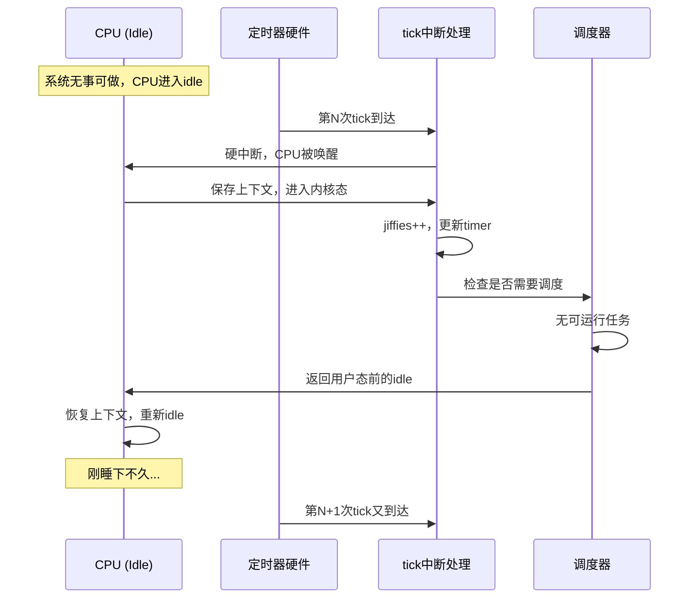

你有没有遇到过这种情况——笔记本电脑合着盖子放在包里，拿出来的时候烫得像个暖手宝，电量也掉了一大半？或者服务器明明没有任何业务负载，风扇却转个不停？这些问题，很多时候都跟内核里那个"尽职过头"的periodic tick有关。

早年间，Linux内核采用了一种简单直接的定时策略：不管系统在忙什么，时钟中断都会按照固定的频率（由`HZ`决定，通常是100到1000次每秒）准时触发。这种设计在二十年前没问题——那时候的CPU也没什么深度睡眠的概念，唤醒一下成本不高。但放在今天的多核处理器和移动设备上，这个机制就成了功耗大户。

**知识点120 [I][M]**

咱们来算一笔账。假设你的内核编译时`HZ=1000`，意味着每秒要有1000次定时器中断。每次中断到来时，即使CPU本来闲得发慌、什么事都没有，它也得乖乖地从idle状态爬起来，做这么一套动作：

```c
/* 典型的tick中断处理路径（简化示意） */
tick_periodic()
{
    /* 1. 保存当前CPU的寄存器上下文 */
    /* 2. 执行irq_enter()，更新硬中断统计 */
    /* 3. 调用do_timer()，更新全局jiffies */
    /* 4. 遍历该CPU的timer wheel，检查到期定时器 */
    /* 5. 触发调度器：update_rq_clock()、calc_delta()...
     *    判断是否需要重新调度 */
    /* 6. 执行irq_exit()，处理软中断 */
    /* 7. 恢复上下文，返回 */
}
```

这套流程走下来，在x86上大概要几百个时钟周期，ARM上可能更多。1000次每秒 × 几百个周期 × 多个CPU核心，积少成多。实测数据显示，一个完全idle的系统上，仅仅是这些tick中断的处理开销，就能占到5%到10%的CPU时间。注意，是"完全idle"——也就是说系统明明无事可做，却硬生生被唤醒了一千次，啥正事没干，光顾着"起床→打个卡→继续睡"了。

更烦人的是，这些tick还特别喜欢"挑时候"。你可能刚把手头的活干完，CPU刚进入idle打算歇一会儿，tick就响了。调度器跑一趟，发现没有可运行的任务，又把你打发回idle。来来回回，上下文保存和恢复的指令流水冲刷（pipeline flush），Cache也凉了一半。



| 开销项 | 每次tick代价 | 1000Hz年累计（单核） |
|:---|:---|:---|
| 上下文保存/恢复 | ~200-400 周期 | 约6.3×10¹² 周期 |
| jiffies更新 + timer遍历 | ~300-500 周期 | 约9.4×10¹² 周期 |
| 调度器检查（calc_delta等） | ~400-800 周期 | 约1.3×10¹³ 周期 |
| Cache/TLB失效率上升 | 难以量化，显著 | — |

**陷阱**：有人以为把`HZ`调到250或者100就能万事大吉。确实能减少tick次数，但这只是个折中——降低了精度不说，该醒还是得醒，只不过从每秒1000次变成了250次。病根没除。

**知识点121 [I]**

上面说的那点CPU时间其实还不是最要命的。真正让笔记本电脑发热、手机掉电的，是tick对CPU电源管理的破坏。

现代处理器都有所谓的C-state（或者叫C-state，C0/C1/C3/C6/C10…）。C0是运行状态，数字越大代表睡眠越深，功耗越低，但醒来的延迟也越长。一个完全idle的CPU本可以一路滑到C6甚至C10，功耗从几十瓦降到几毫瓦。但tick中断一来，CPU刚想往深处走，就被拽回C0跑一趟调度器，然后又重新往C-state爬。这一来一回，不仅没睡成深度睡眠，反复的状态迁移本身也耗电。

我做过一个实测：一台x86笔记本，关闭所有用户态进程，让系统纯idle。开1000Hz tick的时候，CPU的平均C-state停留在C1附近，整机功耗大约8-12瓦；而如果能彻底关掉tick（也就是后面要说的NO_HZ模式），CPU能稳在C6/C7，整机功耗直接降到2-3瓦。差了三到四倍。

这就是电池设备待机时莫名其妙掉电的元凶之一。内核知道CPU没事做，但那个固执的tick说不行，你得起来打卡。移动设备、IoT节点、数据中心里成千上万台的idle服务器——这个问题积少成多，浪费的电可不是小数目。

所以问题来了：我们能不能只在"有事"的时候才唤醒CPU？答案是能。这就是下一节要讲的tickless（NO_HZ）机制的设计初衷。
