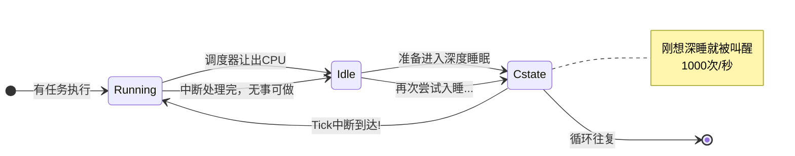

# 10.6.1 传统Tick的"骚扰"问题

> 所属章节：第10章 中断与时间 > 10.6 动态Tick与Tickless内核
>
> 难度：[I] | 预计阅读时间：10分钟

## <span class="blue"> 本节导读

你的开发板明明啥事都没干，CPU温度却降不下来，功耗也居高不下。问题出在哪？很可能是内核的"periodic tick"在搞鬼——即使CPU闲得发慌，它也要每秒把你叫醒HZ次。本节量化这个开销有多大，看看它怎么拖慢你的电池续航，最后引出Linux解决这个问题的方案：tickless。<br>
学完后，你会明白为什么嵌入式内核通常要配成`NO_HZ_IDLE`模式，以及`CONFIG_HZ`这个参数对功耗的实际影响。

## <span class="blue"> Periodic Tick：一个"好心办坏事"的设计 [I]

想象这样一个场景：深夜里你的闹钟每隔1秒响一次，每次响铃后你看一眼手机发现没人找你，然后继续睡。整个晚上你一次完整的深度睡眠都没达成——这就是CPU在传统periodic tick模式下的真实写照。

Periodic tick的本质，是内核配置一个固定频率的定时器中断。每次中断到达，CPU被迫从idle状态醒来，执行一系列固定动作：保存现场、执行定时器中断处理函数`tick_handle_periodic()`、更新jiffies全局计数、检查是否需要重新调度。这一套流程走下来，CPU忙活了几十个微秒，却发现"今天没啥活可干"，悻悻地回到idle。

问题来了：**这个tick的频率跟系统有没有活干毫无关系**。你的系统可能在跑100个线程的满负载，也可能只剩一个idle进程在"打盹"，tick照样不请自来。

Linux通过`CONFIG_HZ`配置这个频率。不同数值下，后果截然不同：

| 配置 (CONFIG_HZ) | 中断次数/秒 | Idle时典型CPU占用 | 主要用途 |
|:---:|:---:|:---:|:---|
| 100 | 100次 | ~0.5-1% | 服务器，低延迟敏感度 |
| 250 | 250次 | ~1-2% | 桌面/通用发行版默认 |
| 300 | 300次 | ~1.5-3% | 历史遗留，某些发行版 |
| 1000 | 1000次 | **5-10%** | 嵌入式开发板常见配置 |

1000Hz意味着什么？**每秒1000次把CPU从深度睡眠中硬拉出来**。每次虽然只忙几十微秒，但累积效应惊人。更重要的是，每次tick把CPU从C-state（CPU节能状态）中踢出来，阻止它进入更深层的C-state。

CPU的C-state层级越深，唤醒延迟越长，但休眠功耗越低：

```
C0  →  C1  →  C3  →  C6  →  C8
运行   浅睡    中睡    深睡    极深睡
功耗 ↑                    ↓ 越低
唤醒延迟 ↓                ↑ 越长
```

每次tick到来，CPU即便处于C6深睡，也得回到C0跑一轮中断处理。处理完回到idle，刚准备重新进入深睡，下一个tick又来了。**CPU永远没有机会在深层C-state停留足够久**，导致功耗居高不下。



> ⚠️ **陷阱**：很多嵌入式开发板为了获得"更精确的定时"，内核默认编译成1000Hz。结果设备空闲时功耗是250Hz配置的3-4倍，电池续航直接打骨折。你在做产品时千万别照搬开发板的默认配置，务必根据场景重新评估。

## <span class="blue"> 嵌入式场景下的功耗灾难 [I]

对于插电的服务器来说，tick开销那点电费九牛一毛。但对于电池供电的物联网设备、手持终端、穿戴设备，这就完全是另一回事了。

假设你的设备搭载一颗ARM Cortex-A53，电池容量2000mAh：

- 在C0全速运行时，功耗约500mW
- 在C6深睡时，功耗可能降到10mW以下
- 但1000Hz tick把CPU反复拽回C0，idle时实际功耗可能维持在50-100mW

**idle功耗比理论值高出5-10倍**，续航从理论上的数周变成几天甚至几小时。这还没算tick导致的内存总线唤醒、cache刷新等连带开销。

Linux社区当然意识到了这个问题。从2.6.21内核开始，引入了动态tick（Dynamic Tick）机制，后来逐步演进为`NO_HZ`系列选项：`NO_HZ_IDLE`在CPU空闲时关闭tick，`NO_HZ_FULL`甚至在CPU有任务时也试图关闭tick。这就是下一节要讲的内容。

> 💡 **提示**：如果你在内核开了`NO_HZ_IDLE`之后发现`top`命令显示的CPU使用率不太对劲，别慌。`top`默认基于tick采样的统计模型，tickless模式下采样点变少，精度自然下降。想看准确的CPU时间，改用`perf`或者读取`/proc/[pid]/stat`中的纳秒级计数器。

## <span class="blue"> 本节总结

| 要点 | 内容 |
|:---|:---|
| Periodic Tick的本质 | 固定频率(HZ)的定时器中断，与系统负载无关 |
| 主要开销 | 上下文切换、中断处理、调度检查，1000Hz时占5-10% CPU |
| 功耗影响 | 阻止CPU进入深层C-state，idle功耗高出5-10倍 |
| 嵌入式危害 | 电池设备续航严重缩水，默认1000Hz往往是元凶 |
| 解决方案方向 | NO_HZ_IDLE / NO_HZ_FULL，让tick按需触发 |

## <span class="blue"> 下一步

我们已经看到了periodic tick的"罪状"——无论CPU忙不忙，它都铁面无私地每秒来HZ次。Linux的解决方案是什么？下一节 **10.6.2 NO_HZ_IDLE模式** 将深入动态tick的核心机制：当CPU进入idle时，tick不再周期性触发，而是根据下一个定时器到期时间按需编程，让CPU真正"睡个好觉"。

## <span class="blue"> 配套资源

| 资源 | 说明 |
|:---|:---|
| 内核配置项 | `CONFIG_HZ`、`CONFIG_NO_HZ_IDLE`、`CONFIG_NO_HZ_FULL` |
| 验证命令 | `zcat /proc/config.gz \| grep HZ` 查看当前内核的HZ配置 |
| 代码路径 | `kernel/time/tick-common.c` — tick核心逻辑 |
| 调试接口 | `/sys/devices/system/clocksource/clocksource0/current_clocksource` 查看当前clocksource |
