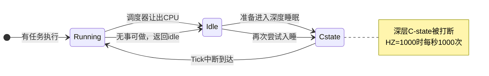

# 10.6.1 传统Tick的空转问题

> 所属章节：第10章 中断与时间 > 10.6 tickless
>
> 难度：[I] | 预计阅读时间：10分钟

## <span class="blue"> 本节导读

开发板明明空闲，CPU 温度和功耗却降不下来——常见原因之一是 periodic tick：即使 CPU 没有任何任务，它也要每秒把 CPU 叫醒 `HZ` 次。

本节覆盖：

- periodic tick 空转开销的量化、
- 它阻止 CPU 进入深 C-state 的机制、
- 对电池设备续航的影响，
- 以及 Linux 的解决方向 NO_HZ。

## <span class="blue"> Periodic Tick：与负载无关的固定开销 [I]

Periodic tick 的本质：内核配置一个固定频率的定时器中断。<BR>
每次中断到来，CPU 被迫从 idle 状态醒来，执行固定动作——保存现场、运行 `tick_handle_periodic()`（10.1.1 已讲这条链）、更新 jiffies、检查调度。<BR>
一轮下来几十微秒，然后发现无事可做，又回到 idle。

问题在于：**这个频率与系统有没有活干完全无关**。满载 100 个线程时是它，只剩 idle 进程时也是它。

Linux 用 `CONFIG_HZ` 配置这个频率。<BR>
不同取值下的空转开销：

| 配置 (CONFIG_HZ) | 中断次数/秒 | idle 时典型 CPU 占用（经验值） | 主要用途 |
|:---:|:---:|:---:|:---|
| 100 | 100 次 | ~0.5–1% | 服务器 |
| 250 | 250 次 | ~1–2% | 桌面/通用发行版默认 |
| 300 | 300 次 | ~1.5–3% | 部分发行版的历史选择 |
| 1000 | 1000 次 | 数个百分点，且严重阻碍深睡 | 低延迟场景 |

1000Hz 意味着**每秒 1000 次把 CPU 从睡眠中拉出来**。每次只忙几十微秒，但更重要的代价不在 CPU 占用本身——而在 C-state。

```
C0  →  C1  →  C3  →  C6  →  C8
运行   浅睡    中睡    深睡    极深睡
功耗 高 ──────────────────────→ 低
唤醒延迟 短 ──────────────────→ 长
```

C-state 越深功耗越低，但进入和退出都需要时间。每次 tick 到来，处于深睡的 CPU 必须回到 C0 处理中断；处理完刚要重新深入睡眠，下一个 tick 又到了。<BR>
**CPU 永远没有机会在深层 C-state 停留**，idle 功耗因此降不下来。



> ⚠️ 很多开发板的默认内核配置是 `HZ=1000`——这是为开发调试的低延迟体验准备的，不是为产品功耗准备的。<BR>
> 产品化时必须按场景重新评估这个配置，直接照搬开发板配置是 idle 功耗偏高的常见原因。

## <span class="blue"> 嵌入式场景的功耗账 [I]

对插电服务器，tick 空转的电费可以忽略；对电池设备则是另一本账。<BR>
以一颗 ARM Cortex-A53、2000mAh 电池的设备为例（量级估算）：

- C0 全速运行：功耗约 500mW
- C6 深睡：功耗可降到 10mW 以下
- 1000Hz tick 反复把 CPU 拉回 C0：idle 实际功耗维持在 50–100mW

**idle 功耗比理论值高出 5–10 倍**，理论数周的续航缩到几天。<BR>
这还没算 tick 引起的内存总线唤醒、cache 失效等连带开销。

Linux 从 2.6.21 引入动态 tick（Dynamic Tick），后来演进为 `NO_HZ` 系列选项：`NO_HZ_IDLE` 在 CPU 空闲时停 tick，`NO_HZ_FULL` 进一步在 CPU 只剩一个任务时也停 tick。

下一节深入机制。

> 💡 开了 `NO_HZ_IDLE` 后发现 `top` 显示的 CPU 使用率对不上，不要慌：`top` 默认基于 tick 采样统计，tick 停了采样点变少，精度自然下降。<BR>
> 准确的 CPU 时间用 `perf` 或 `/proc/[pid]/stat` 的纳秒计数。统计失真的完整讨论在 10.6.4。

## <span class="blue"> 本节总结

| 要点 | 内容 |
|:---|:---|
| Periodic Tick 本质 | 固定频率（HZ）的定时器中断，与负载无关 |
| 直接开销 | 中断处理 + 调度检查，HZ=1000 时每秒 1000 次 |
| 主要代价 | 阻止 CPU 进入深层 C-state，idle 功耗高 5–10 倍 |
| 嵌入式危害 | 电池设备续航严重缩水，开发板默认 HZ=1000 常是元凶 |
| 解决方向 | NO_HZ_IDLE / NO_HZ_FULL，tick 按需触发 |

## <span class="blue"> 下一步

periodic tick 的问题量化完了，Linux 的解决方案是什么？

下一节 **10.6.2 NO_HZ_IDLE 模式** 深入动态 tick 的实现：CPU 进 idle 时 tick 怎么停、内核怎么算出"最多能睡多久"、哪些事件会提前唤醒，以及 RCU 在 tick 停了之后怎么推进。

## <span class="blue"> 配套资源

| 资源 | 说明 |
|:---|:---|
| 内核配置项 | `CONFIG_HZ`、`CONFIG_NO_HZ_IDLE`、`CONFIG_NO_HZ_FULL` |
| 验证命令 | `zcat /proc/config.gz \| grep CONFIG_HZ` 查看当前内核 tick 频率 |
| 代码路径 | `kernel/time/tick-common.c` — tick 核心逻辑 |
| 代码路径 | `kernel/time/tick-sched.c` — 动态 tick 实现 |
