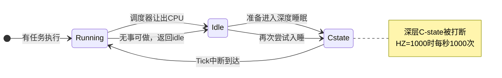

# 10.6.1 传统 Tick 的空转问题

> 所属章节：第10章 中断与时间 > 10.6 tickless
>
> 难度：[I] | 预计阅读时间：10分钟

## <span class="blue">本节导读

10.5 一路把定时器讲到微秒级，但有个角色一直没被审问：**周期性 tick 本身**。它是 timer_list 的心跳（10.5.1），hrtimer 时代它还在每秒敲 HZ 次钟——这还有必要吗？

先看一个真实症状：开发板明明空闲，CPU 温度和功耗却降不下来。常见原因之一就是 periodic tick——即使 CPU 没有任何任务，它也要每秒把 CPU 叫醒 `HZ` 次。

> 本节覆盖：periodic tick 空转开销的量化、它阻止 CPU 进入深 C-state 的机制、一个数一数空转 tick 的观察实验、电池设备上的功耗账，以及 Linux 的解决方向 NO_HZ。

---

## <span class="blue">Periodic Tick：与负载无关的固定开销 [I]

Periodic tick 的本质：内核配置一个固定频率的定时器中断。每次中断到来，CPU 被迫从 idle 状态醒来，执行固定动作——保存现场、运行 `tick_handle_periodic()`（10.1.1 已讲这条链）、更新 jiffies、检查调度。一轮下来几十微秒，然后发现无事可做，又回到 idle。

问题在于：**这个频率与系统有没有活干完全无关**。满载 100 个线程时是它，只剩 idle 进程时也是它。

Linux 用 `CONFIG_HZ` 配置这个频率。不同取值下的空转开销：

| 配置 (CONFIG_HZ) | 中断次数/秒 | idle 时典型 CPU 占用（经验值） | 主要用途 |
|:---:|:---:|:---:|:---|
| 100 | 100 次 | ~0.5–1% | 服务器 |
| 250 | 250 次 | ~1–2% | 桌面/通用发行版默认 |
| 300 | 300 次 | ~1.5–3% | 部分发行版的历史选择 |
| 1000 | 1000 次 | 数个百分点，且严重阻碍深睡 | 低延迟场景 |

1000Hz 意味着**每秒 1000 次把 CPU 从睡眠中拉出来**。每次只忙几十微秒，但更重要的代价不在 CPU 占用本身——而在 C-state。

```
C0  →  C1  →  C3  →  C6  →  C8
运行   浅睡    中睡    深睡    极深睡
功耗 高 ──────────────────────→ 低
唤醒延迟 短 ──────────────────→ 长
```

C-state 越深功耗越低，但进入和退出都需要时间（10.5.5 有详细对照表）。每次 tick 到来，处于深睡的 CPU 必须回到 C0 处理中断；处理完刚要重新深入睡眠，下一个 tick 又到了。**CPU 永远没有机会在深层 C-state 停留**，idle 功耗因此降不下来。



> ⚠️ 很多开发板的默认内核配置是 `HZ=1000`——这是为开发调试的低延迟体验准备的，不是为产品功耗准备的。产品化时必须按场景重新评估这个配置，直接照搬开发板配置是 idle 功耗偏高的常见原因。

## <span class="blue">观察：数一数空转的 tick [I]

"CPU 空闲时 tick 还在敲"这件事可以直接在板子上看到。先确认自己内核的 HZ 配置，再数空闲时定时器中断的增长速度：

```bash
# 查看当前内核的 HZ 配置
zcat /proc/config.gz | grep CONFIG_HZ
# CONFIG_HZ=250

# 系统空闲时，间隔 5 秒读两次定时器中断计数
grep -i timer /proc/interrupts
sleep 5
grep -i timer /proc/interrupts
```

ARM64 板子上的典型输出（定时器中断在 `/proc/interrupts` 里的名字因平台而异，常见 `arch_timer`、也可能叫 `timer` 或 `local timer`）：

```text
 27:    1234567     0     0     0     0     0     0     0  GICv3  27 Level  arch_timer

# 5 秒后：
 27:    1235817     0     0     0     0     0     0     0  GICv3  27 Level  arch_timer
```

系统什么都没干，计数涨了 1250——正好是 `250 Hz × 5 秒`。这 1250 次中断每一次都把 CPU 从睡眠里拉出来一次，"空转"两个字在数字上就是这个意思。等下一节开了 `NO_HZ_IDLE`，可以再跑一遍同样的实验：空闲时这个计数会几乎不动，那就是 tick 停掉的样子。

## <span class="blue">嵌入式场景的功耗账 [I]

对插电服务器，tick 空转的电费可以忽略；对电池设备则是另一本账。以一颗 ARM Cortex-A53、2000mAh 电池的设备为例（量级估算）：

- C0 全速运行：功耗约 500mW
- C6 深睡：功耗可降到 10mW 以下
- 1000Hz tick 反复把 CPU 拉回 C0：idle 实际功耗维持在 50–100mW

**idle 功耗比理论值高出 5–10 倍**，理论数周的续航缩到几天。这还没算 tick 引起的内存总线唤醒、cache 失效等连带开销。

Linux 从 2.6.21 引入动态 tick（Dynamic Tick），后来演进为 `NO_HZ` 系列选项：`NO_HZ_IDLE` 在 CPU 空闲时停 tick，`NO_HZ_FULL` 进一步在 CPU 只剩一个任务时也停 tick。机制细节下一节展开。

> 💡 开了 `NO_HZ_IDLE` 后发现 `top` 显示的 CPU 使用率对不上，不要慌：`top` 默认基于 tick 采样统计，tick 停了采样点变少，精度自然下降。准确的 CPU 时间用 `perf` 或 `/proc/[pid]/stat` 的纳秒计数。统计失真的完整讨论在 10.6.4。

---

## <span class="blue">本节总结

periodic tick 的问题不在 CPU 占用本身——几十微秒的中断处理不算什么——而在它把 C-state 锁死在浅层：CPU 刚进深睡就被下一个 tick 拉出来，idle 功耗因此比理论值高 5–10 倍，电池设备的续航直接缩一个量级。实验里那个空闲也稳定上涨的中断计数，就是它的心跳。

这个开销与负载无关，满载和空载一个价，这正是它不合理的地方。解决方向不是把 HZ 调小（精度换功耗，两头不全），而是让 tick 按需触发——`NO_HZ_IDLE` 空闲时停、`NO_HZ_FULL` 单任务也停，下一节展开机制。

---

## <span class="blue">下一步

10.6.2 NO_HZ_IDLE 模式——periodic tick 的问题量化完了，看 Linux 的解法：CPU 进 idle 时 tick 怎么停、内核怎么算出"最多能睡多久"、哪些事件会提前唤醒，以及 RCU 在 tick 停了之后怎么推进。
