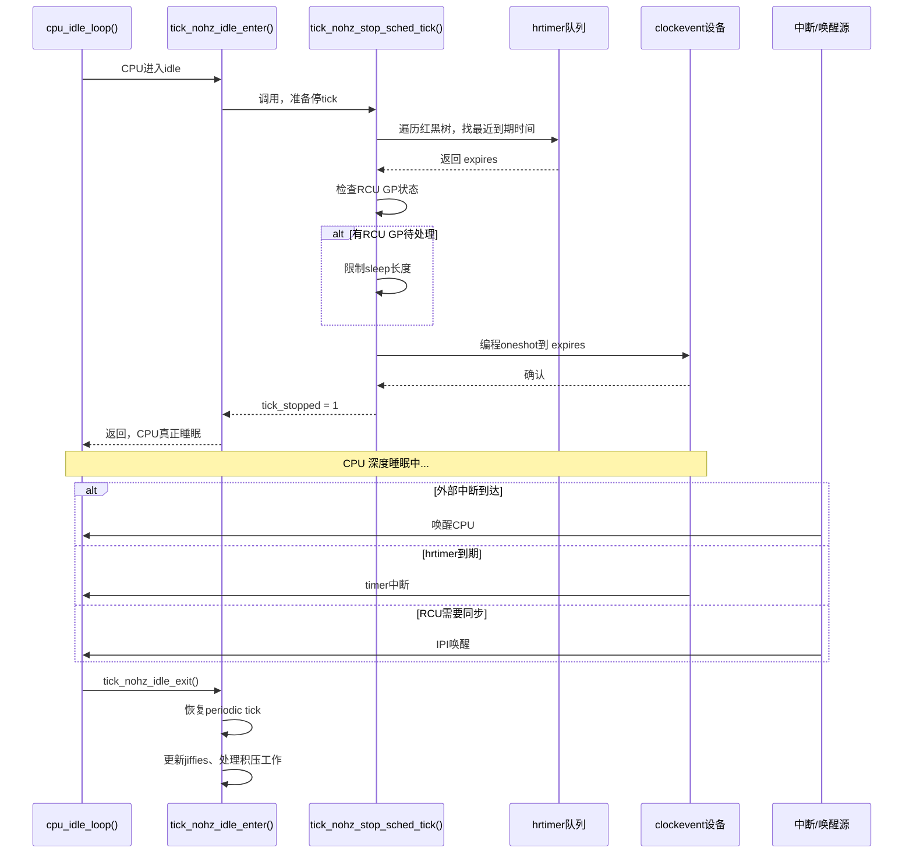

十年前我刚接触NO_HZ的时候，linux-smp邮件列表里 Thomas Gleixner 和 Ingo Molnar 吵得正欢——tick到底能不能在idle时完全停掉？当时大部分开发者的直觉是：关了tick，内核岂不是成了瞎子，连定时器都不知道什么时候该响了？最终这个争论催生了我们现在要说的 `NO_HZ_IDLE` 模式。说白了，idle CPU真的不需要每隔1毫秒醒一次看看有没有活干——它完全可以睡个踏实觉，只在有确切的事情要处理时才醒来。

**知识点122 [E][M] `NO_HZ_IDLE` 的实现机制：idle CPU 如何停掉 tick 又不错过该做的事**

整个流程的起点在 `kernel/time/tick-sched.c` 里。当你追踪一个CPU进入idle的路径时，会看到 `cpu_idle_loop()` 最终调用到 `tick_nohz_idle_enter()`。这个函数本身没干太多脏活，真正的逻辑藏在 `tick_nohz_stop_sched_tick()` 里面。

```c
/* kernel/time/tick-sched.c */
void tick_nohz_idle_enter(void)
{
    struct tick_sched *ts = this_cpu_ptr(&tick_cpu_sched);

    WARN_ON_ONCE(ts->timer_expires_base);
    ts->inidle = 1;          /* 标记：我现在是idle状态 */
    ts->idle_active = 1;
    tick_nohz_stop_sched_tick(ts, 0);
}
```

`tick_nohz_stop_sched_tick()` 做的事情可以拆成三步。

**第一步：计算还能睡多久。** 内核不会盲目地关掉tick，而是先问自己——下一次有什么确定的事件需要我处理？它会遍历 `hrtimer` 红黑树队列，找到最近一个即将到期的定时器。假设现在 jiffies 是 1000，而最近的 hrtimer 在 1100 jiffies 后到期，那 CPU 理论上可以安全地睡上 100ms（假设 HZ=1000）。这个计算过程在 `tick_nohz_get_sleep_length()` 里面完成，返回值是一个 `ktime_t`，表示允许的最大休眠时长。

```c
/* tick_nohz_stop_sched_tick 核心逻辑示意 */
static void tick_nohz_stop_sched_tick(struct tick_sched *ts, int cpu)
{
    ktime_t expires;
    u64 basemono, next_tick;
    
    /* 获取当前 mono 时间 */
    basemono = ktime_get();
    
    /* 从 hrtimer 队列里找出最近的到期时间 */
    expires = tick_nohz_get_sleep_length(ts, &basemono, &next_tick);
    
    /* 如果确实可以停一段时间... */
    if (!ts->tick_stopped) {
        ts->tick_stopped = 1;
        ts->idle_jiffies = ts->jiffies_jiffies;
        ts->idle_sleeps++;
        
        /* 把 clockevent 设备编程到下一个到期时间 */
        tick_nohz_program_kthread_tick(expires, 0);
        /* 或者直接停掉，让硬件中断唤醒 */
        tick_nohz_switch_to_nohz();
    }
    /* ... */
}
```

**第二步：编程 clockevent 设备。** 找到最近的到期时间后，内核不再按固定的 tick 周期（比如每1ms）去唤醒CPU，而是把时钟设备编程成「oneshot」模式——只设一个单次闹钟，时间到了才触发中断。这个闹钟的时间点就是上一步算出来的 `expires`。如果期间没有更早的唤醒源，CPU就可以一路睡到那时候。

**第三步：设置唤醒条件。** 但事情没那么简单。即使hrtimer在100ms后才到期，也不意味着CPU一定能睡满100ms。有三种情况会提前把它叫醒：

| 唤醒源 | 触发条件 | 说明 |
|--------|---------|------|
| 外部中断 | 硬件IRQ到达 | 网卡收包、磁盘IO完成、IPI等 |
| hrtimer到期 | 之前编程的oneshot到期 | 定时器需要处理，内核必须运行 |
| RCU grace period | 当前CPU是最后一个quiescent state的持有者 | RCU需要这个CPU报告状态才能推进GP |

第三点尤其值得注意。RCU grace period（GP）的推进依赖每个CPU报告quiescent state。如果一个CPU深度睡眠，不参加RCU的同步，整个GP就会被卡住，影响内存回收、`synchronize_rcu()` 的返回时间。所以在真正停tick之前，`tick_nohz_stop_sched_tick()` 会检查当前是否有待处理的RCU GP需要这个CPU参与。如果有，它会限制睡眠时间，确保CPU不会睡过头。

下面这个时序图展示了完整的进入和退出流程：



`tick_nohz_idle_exit()` 的逻辑相对直接：重新把 clockevent 切回 periodic 模式，更新 jiffies（因为睡眠期间可能漏掉了好几个tick），然后让CPU回到正常调度路径。这里有个细节——退出时更新的 jiffies 可能一次性跳好几个，这就是为什么你在 `/proc/stat` 里看到idle CPU的 "system" 时间不是均匀增长的原因。

> **老手经验**：如果你在 `trace_printk` 里看到 `tick_nohz_stop_sched_tick` 频繁进入但睡眠时长只有几微秒，说明你的系统上hrtimer太密集了，或者RCU GP太频繁。这时候 `NO_HZ_IDLE` 的收益会大打折扣。可以用 `tracefs/tracing/events/timer/tick_stop` 来追踪实际的停tick事件和睡眠长度。

**知识点123 [I] 配置与验证**

开启 `NO_HZ_IDLE` 非常简单，内核配置项只有一个：

```
Kernel Features  --->
    Timers subsystem  --->
        [*] Tickless system (dynamic ticks)
        ( )   Idle tick
```

对应的 `.config` 里就是 `CONFIG_NO_HZ_IDLE=y`。注意这个选项和 `CONFIG_NO_HZ_FULL` 是互斥的——后者把动态tick的范围扩展到busy CPU（用在HPC/实时场景），而前者只针对idle CPU。一般服务器和桌面选 `NO_HZ_IDLE` 就够了。

验证是否生效不需要写程序，直接看 `/proc/timer_list`：

```bash
$ cat /proc/timer_list | grep -A5 "Tick Device:"
Tick Device: mode:     1
Per CPU device: 0
Clock Event Device: lapic-deadline
 next_event:         1234567890123 nsecs
 set_next_event:     lapic_next_deadline
 ...
```

如果 `mode: 1` 表示当前是 `CLOCK_EVT_MODE_ONESHOT`，也就是动态tick已经启用了。更直观的办法是开一个终端持续打印 jiffies，同时让系统尽可能idle：

```bash
$ watch -n 0.1 'cat /proc/timer_list | grep jiffies'
```

在 `NO_HZ_IDLE` 生效的系统上，你会观察到 jiffies 不是匀速增长的——它可能在某个窗口内完全不动（CPU在深度睡眠），然后突然跳一下（CPU醒来处理pending事件）。如果 jiffies 始终匀速前进，说明tick根本没有停掉，需要检查 `CONFIG_NO_HZ_IDLE` 是否真的编进内核了，或者 `nohz=off` 这样的启动参数是不是被误加了。

还有一个有意思的观察点：`/proc/timer_list` 里每个CPU的 `now` 字段。idle CPU的 `now` 和它最后一次tick的时间戳差距可能很大，这正是深度睡眠的直接证据。
