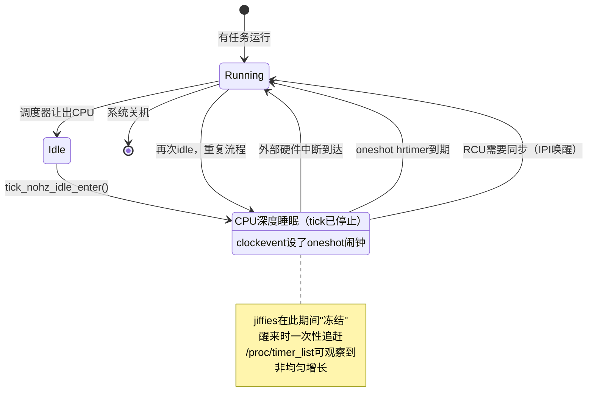

# 10.6.2 NO_HZ_IDLE模式

> 所属章节：第10章 中断与时间 > 10.6 动态Tick与Tickless内核
>
> 难度：[E][M] | 预计阅读时间：25分钟

## <span class="blue"> 本节导读

上一节我们算过账——1000Hz的tick每秒把CPU从深睡中拽出来1000次，idle功耗直接翻5-10倍。那能不能干脆把tick关掉，让CPU踏踏实实睡觉？答案是能，但有个前提：**你得保证不会睡过头，该醒的时候必须醒**。这就像一个闹钟管理大师，不是取消所有闹钟，而是把不必要的闹钟全去掉，只在有正事的时候才响铃。<br>
本节深入`NO_HZ_IDLE`的内核实现：CPU进入idle时，tick是怎么停掉的？内核怎么知道下一次该什么时候醒？哪些事件会强制提前唤醒？还有最棘手的问题——RCU grace period怎么办，没了tick它怎么推进？<br>
学完后，你会掌握动态tick的核心代码路径，能在开发板上验证`NO_HZ_IDLE`是否真正生效，还能避开几个常见的调试陷阱。

## <span class="blue"> NO_HZ_IDLE的实现机制：从停tick到精准唤醒 [E][M]

### tick_nohz_idle_enter()：停tick的入口

故事从CPU没事可干开始。当调度器发现所有进程都阻塞了，`cpu_idle_loop()`会一路调用到`tick_nohz_idle_enter()`——这就是动态tick的"登机口"。

```c
/* kernel/time/tick-sched.c */
void tick_nohz_idle_enter(void)
{
    struct tick_sched *ts = this_cpu_ptr(&tick_cpu_sched);

    /* 安全检查：上次离开idle时timer应该已经清掉了 */
    WARN_ON_ONCE(ts->timer_expires_base);
    
    ts->inidle = 1;          /* 标记：我现在在idle */
    ts->idle_active = 1;
    
    /* 真正的逻辑在这里 */
    tick_nohz_stop_sched_tick(ts, 0);
}
```

这个函数本身是个"前台接待"，真正的决策都在`tick_nohz_stop_sched_tick()`里完成。但进入之前，内核会先检查一个一致性条件：`timer_expires_base`必须为NULL。如果不为NULL，说明上次离开idle时有定时器没清干净，这是个BUG——内核通过`WARN_ON_ONCE`发出警告。

### tick_nohz_stop_sched_tick()：三步决策法

这个函数是NO_HZ_IDLE的心脏。它的任务可以拆解为三个紧密衔接的步骤。

**第一步：问hrtimer——"下次什么时候有活干？"**

内核不会盲目停tick。它首先要搞清楚：如果不被其他事情打断，CPU最多能睡多久？答案藏在hrtimer的红黑树队列里。

```c
/* tick_nohz_stop_sched_tick 核心逻辑 */
static void tick_nohz_stop_sched_tick(struct tick_sched *ts, int cpu)
{
    ktime_t expires, basemono, next_tick;
    u64 expires_next = U64_MAX;
    
    /* 获取当前monotonic时间 */
    basemono = ktime_get();
    
    /* 遍历hrtimer红黑树，找到最近的到期时间 */
    expires = tick_nohz_get_sleep_length(ts, &basemono, &next_tick);
    
    /* hrtimer_calc_next_expiry() 遍历所有挂起的hrtimer */
    /* 找到最小到期时间，存入 expires_next */
    /* ... */
}
```

`tick_nohz_get_sleep_length()`内部的逻辑是这样运转的：它调用`hrtimer_get_next_event()`，后者遍历当前CPU上所有挂起的`hrtimer`，从红黑树中找出最近的到期时间点。假设遍历后发现，下一个到期的hrtimer在12毫秒后触发，那CPU理论上可以安全地休眠12毫秒。

但"理论上"不等于"实际上"。还有几个因素会缩短这个时长：

- **RCU grace period**：如果当前有RCU GP在等待这个CPU报告quiescent state，那它不能睡太久
- **调度器的rebalance tick**：负载均衡可能需要这个CPU参与
- **printk的deferred输出**：有些日志输出依赖tick来刷新

所以`tick_nohz_get_sleep_length()`返回的不是"最佳情况"，而是"允许的最大休眠时长"——一个综合考虑了所有约束后的保守值。

**第二步：把clockevent编程为oneshot模式**

知道了能睡多久，接下来就是把硬件时钟设备"设个闹钟"。传统的periodic tick模式下，clockevent设备每隔`1/HZ`秒自动触发一次。NO_HZ模式下，内核把它切换到oneshot模式——只设一个单次定时，到期后自动停止，不会重复。

```c
    /* 如果tick还没停... */
    if (!ts->tick_stopped) {
        ts->tick_stopped = 1;           /* 标记：tick已停止 */
        ts->idle_jiffies = ts->jiffies_jiffies;
        ts->idle_sleeps++;              /* 统计idle睡眠次数 */
        ts->idle_active = 1;
        
        /* 编程clockevent到下一个到期时间 */
        tick_nohz_program_kthread_tick(expires, 0);
        
        /* 或者更直接的方式 */
        tick_nohz_switch_to_nohz();
    }
```

这里的`expires`就是第一步算出来的那个最近到期时间。clockevent硬件收到这个指令后，会在指定时间点产生一个中断。如果中间没有其他唤醒源，CPU就可以一路睡到那时候。

> 💡 **提示**：你可以通过`/sys/kernel/debug/tracing/events/timer/tick_stop/trace`来追踪实际的停tick事件。开启trace后，你会看到每次`tick_nohz_stop_sched_tick`的调用参数，包括预期的休眠时长和实际的编程时间。如果休眠时长总是只有几微秒，说明你的系统hrtimer太密集，NO_HZ的收益会大打折扣。

**第三步：设置唤醒条件——谁能提前叫醒CPU？**

设好闹钟不等于万无一失。有三种"紧急情况"会迫使CPU提前结束睡眠：

| 唤醒源 | 触发条件 | 说明 | 优先级 |
|:-------|:---------|:-----|:------:|
| 外部硬件中断 | 网卡收包、磁盘IO完成、GPIO中断等 | 硬件IRQ不经过hrtimer，直接由中断控制器送达 | 最高 |
| hrtimer到期 | 之前编程的oneshot定时器到期 | 内核必须处理定时器回调，通常是调度或IO超时 | 高 |
| RCU grace period同步 | RCU需要当前CPU报告quiescent state | 如果该CPU是最后一块"拼图"，GP会被卡住 | 中 |

前两个好理解——硬件中断和定时器到期都是"有正事要做"。但RCU这个有点绕，值得单独拆解。

### RCU在NO_HZ下的特殊处理

RCU（Read-Copy-Update）是内核里无处不在的同步机制。它的核心操作之一是grace period（GP）——一个确保所有读者都退出的观察窗口。GP的推进有个前提：**每个CPU都必须至少报告一次quiescent state**（简单说就是"离开临界区"）。

在传统periodic tick模式下，每个tick到来时，CPU顺手就把quiescent state报了。但NO_HZ模式下tick停了，CPU可能在深度睡眠中完全"失联"。如果一个CPU迟迟不报quiescent state，整个GP就被卡在那里，后续的内存回收、`synchronize_rcu()`调用者都会被阻塞。

内核怎么解决这个问题？代码路径在`tick_nohz_stop_sched_tick()`里有一行关键检查：

```c
    /* RCU限制睡眠时间 */
    if (rcu_needs_cpu(basemono, &next_rcu)) {
        /* RCU需要这个CPU，限制休眠时长 */
        if (ktime_to_ns(next_rcu) < ktime_to_ns(expires))
            expires = next_rcu;
        ts->rcu_needs_cpu = 1;
    }
```

`rcu_needs_cpu()`会检查当前是否有活跃的RCU grace period在等待这个CPU。如果有，它会返回一个`next_rcu`时间——告诉你"最晚这个时间点必须醒来一次"。内核会把`expires`限制为`min(expires, next_rcu)`，确保不会因为深度睡眠而拖慢RCU。

> ⚠️ **陷阱**：RCU grace period在NO_HZ下**可能延长**。如果一个CPU进入idle后，RCU恰好需要它参与，但唤醒时间被限制得很短，那GP的完成时间会波动。在极端情况下，如果系统频繁进出idle、hrtimer密集、RCU负载又高，GP的延迟可能从正常情况下的几毫秒变成几十毫秒。这对延迟敏感的RCU用户（比如网络协议栈的`call_rcu()`路径）是个隐患。

### tick_nohz_idle_exit()：恢复tick

有进就有出。当唤醒源到来，CPU从idle回来，会调用`tick_nohz_idle_exit()`：

```c
/* kernel/time/tick-sched.c */
void tick_nohz_idle_exit(void)
{
    struct tick_sched *ts = this_cpu_ptr(&tick_cpu_sched);

    if (!ts->idle_active || !ts->tick_stopped)
        return;  /* tick没停，没什么好恢复的 */
    
    ts->idle_active = 0;
    ts->inidle = 0;
    ts->tick_stopped = 0;
    
    /* 更新jiffies——睡眠期间可能漏掉了多个tick */
    tick_do_update_jiffies64(ktime_get());
    
    /* 把clockevent切回periodic模式（如果需要） */
    tick_nohz_restart_sched_tick();
    
    /* 处理idle期间积压的工作 */
    ts->idle_exits++;
}
```

退出时的关键动作有两个。一是**更新jiffies**——因为tick停了，jiffies计数器在睡眠期间"冻住"了。`tick_do_update_jiffies64()`会根据实际的经过时间，一次性把jiffies"追赶"到正确值。这就解释了为什么在NO_HZ系统上观察jiffies会看到**跳跃式增长**——它不是匀速+1，而是停几毫秒后突然+几十。

二是**恢复clockevent模式**。如果CPU醒来后还有任务要执行，tick需要恢复为periodic模式，确保调度器能正常运作。

下面这张图展示了完整的状态转换：



> 🔴 **危险**：`NO_HZ`模式下，**jiffies的精度大幅降低**。传统periodic tick中，jiffies每`1/HZ`秒稳增1，你可以粗略用它做短时间的延迟估算。但在NO_HZ下，jiffies可能在几毫秒内完全不动，然后一跳几十甚至几百。如果你写的驱动里有类似`jiffies + HZ/10 > future`这样的高精度判断，或者依赖jiffies做微秒级的超时计算， Behavior会变得不可预测。**不要把jiffies当高精度时钟用**，需要精度的地方用`ktime_get()`或`hrtimer`。

## <span class="blue"> NO_HZ_IDLE的配置与验证 [I]

### 内核配置

开启`NO_HZ_IDLE`只需要一个配置项：

```
General setup  --->
    Timers subsystem  --->
        [*] Tickless system (dynamic ticks)
        (X) Idle tick
```

对应的`.config`行是`CONFIG_NO_HZ_IDLE=y`。注意它和`CONFIG_NO_HZ_FULL`是互斥的——前者只在idle CPU上停tick，后者试图连busy CPU的tick也停掉（用于HPC和极低延迟实时场景）。绝大多数嵌入式设备选`NO_HZ_IDLE`就够了，这也是主流发行版的默认配置。

编译进内核后，你还可以通过启动参数临时关闭：

```bash
# 在bootargs中加入，强制关闭动态tick
nohz=off
```

这在调试时很有用——怀疑NO_HZ引起问题的时候，可以用这个参数回归传统模式对比验证。

### 验证方法一：/proc/timer_list

最权威的验证方式是读`/proc/timer_list`：

```bash
# 查看当前tick模式
cat /proc/timer_list | grep -A10 "Tick Device:"
```

如果看到`mode: 1`，表示clockevent工作在`CLOCK_EVT_MODE_ONESHOT`，NO_HZ已启用。`mode: 2`则是传统的`CLOCK_EVT_MODE_PERIODIC`。

更直观的验证是观察jiffies的增长模式：

```bash
# 连续打印jiffies，观察是否均匀增长
watch -n 0.1 'cat /proc/timer_list | grep "jiffies:"
```

在NO_HZ生效的系统上，你会看到jiffies**不是匀速前进**的——它可能在某个窗口完全不动（CPU在深度睡眠），然后突然跳一下（CPU醒来处理pending事件）。如果jiffies始终均匀+1，说明tick根本没停掉。

### 验证方法二：trace事件

```bash
# 挂载tracefs
mount -t debugfs none /sys/kernel/debug

# 开启tick_stop事件追踪
echo 1 > /sys/kernel/debug/tracing/events/timer/tick_stop/enable
cat /sys/kernel/debug/tracing/trace_pipe
```

你会看到类似这样的输出：

```
          <idle>-0     [000] d.h.  1234.567: tick_stop: success=1 expires=1234567890
```

`success=1`表示成功停掉了tick，`expires`是下一次预定的唤醒时间（纳秒级时间戳）。

### tick_nohz的副作用

| 副作用 | 影响范围 | 应对策略 |
|:-------|:---------|:---------|
| jiffies精度降低 | 依赖jiffies做精细超时的代码 | 改用hrtimer或ktime_get |
| CPU时间统计失真 | top、vmstat等基于tick采样的工具 | 改用perf event计数 |
| RCU grace period波动 | `synchronize_rcu()`延迟不稳定 | 评估延迟上限，必要时用`synchronize_rcu_expedited()` |
| 负载均衡延迟 | 进程迁移在tick停期间无法触发 | 内核会自动限制最长睡眠时间 |

> 💡 **提示**：`/proc/timer_list`中jiffies的不均匀增长是NO_HZ生效的**铁证**。但如果你看到的不是"停一阵子然后跳一下"，而是"每次只跳1、但间隔不均匀"，说明可能只有部分CPU在idle状态——多核系统中这是正常的，活跃CPU上的tick照常运转。

## <span class="blue"> 实战带练：完整Tickless验证实验（5步）

找一块ARM开发板（或x86虚拟机），跟着下面5步验证NO_HZ_IDLE是否真正在工作。

**Step 1：确认内核编译选项**

```bash
$ zcat /proc/config.gz | grep NO_HZ
CONFIG_NO_HZ_COMMON=y
CONFIG_NO_HZ_IDLE=y
# CONFIG_NO_HZ_FULL is not set
CONFIG_NO_HZ=y
```

看到`CONFIG_NO_HZ_IDLE=y`，说明内核支持动态tick。

**Step 2：确认运行时模式**

```bash
$ cat /proc/timer_list | grep -B2 -A8 "Tick Device:"
Tick Device: mode:     1
Per CPU device: 0
Clock Event Device: arch_sys_timer
 next_event:         17143748000000 nsecs
 set_next_event:     arch_timer_set_next_event_phys
 set_state_periodic: arch_timer_set_state_periodic
 set_state_oneshot:  arch_timer_set_state_oneshot
```

`mode: 1`就是oneshot模式。如果看到`mode: 2`，说明还在periodic模式。

**Step 3：观察jiffies的非均匀增长**

开两个终端。终端1跑这个脚本让系统尽可能idle：

```bash
# 终端1：让系统idle（除了这个sleep，不做任何事）
while true; do sleep 1; done
```

终端2观察jiffies：

```bash
# 终端2：快速采样jiffies
$ while true; do
    cat /proc/timer_list | grep "jiffies:"
    usleep 10000  # 10ms采样一次
  done
```

预期输出应该是jiffies稳定一段时间（比如40-60ms），然后突然跳几十。这就是NO_HZ_IDLE在工作的直接证据。

**Step 4：用trace确认tick_stop事件**

```bash
# 开启tick相关trace事件
echo 1 > /sys/kernel/debug/tracing/events/timer/tick_stop/enable
echo 1 > /sys/kernel/debug/tracing/events/timer/tick_start/enable

# 读取trace
cat /sys/kernel/debug/tracing/trace_pipe | head -20
```

应该能看到`tick_stop`和`tick_start`的交替输出，中间的间隔时间越长，说明CPU睡得越香。

**Step 5：对比NO_HZ开/关的功耗差异**

如果开发板有功耗测量能力（或者通过温度间接反映），对比两种模式的idle功耗：

```bash
# 先按上面的步骤确认NO_HZ启用，记录idle功耗/温度
# 然后reboot，在bootargs中加入 nohz=off，重复测量
```

在1000Hz配置下，NO_HZ_IDLE通常能把idle功耗降低30-50%。如果差距不明显，检查是否有其他定时器（比如highres timer密集调度）在阻止深度睡眠。

## <span class="blue"> 本节总结

| 要点 | 内容 |
|:-----|:-----|
| 停tick入口 | `tick_nohz_idle_enter()` → `tick_nohz_stop_sched_tick()` |
| 休眠时长计算 | 遍历hrtimer红黑树，找最近到期时间；受RCU约束限制 |
| 编程硬件 | clockevent切换到oneshot模式，设单次闹钟 |
| 三种唤醒源 | 外部硬件中断、hrtimer到期、RCU grace period同步 |
| RCU处理 | `rcu_needs_cpu()`限制睡眠时长，防止GP被卡住 |
| 恢复tick | `tick_nohz_idle_exit()`更新jiffies、恢复periodic模式 |
| 配置项 | `CONFIG_NO_HZ_IDLE=y`，与NO_HZ_FULL互斥 |
| 验证铁证 | `/proc/timer_list`中jiffies不均匀增长 |
| 关键副作用 | jiffies精度降低、RCU GP可能延长、CPU统计失真 |
| 危险警告 | 不要依赖jiffies做高精度计时，改用ktime_get/hrtimer |

## <span class="blue"> 下一步

`NO_HZ_IDLE`解决了idle CPU的tick浪费问题，但如果CPU上有任务在跑呢？比如一个绑核的实时线程，它跑的时候tick照样每秒来HZ次，打断它的执行。下一节 **10.6.3 NO_HZ_FULL与cpuidle协同** 将探索更激进的方案：在busy CPU上也关闭tick，让选定CPU上的任务完全不受tick干扰——这需要和cpuidle框架深度配合，也带来了一系列新的工程挑战。

## <span class="blue"> 配套资源

| 资源 | 路径/命令 | 说明 |
|:-----|:----------|:-----|
| 核心代码 | `kernel/time/tick-sched.c` | `tick_nohz_idle_enter/exit/stop_sched_tick` |
| hrtimer遍历 | `kernel/time/hrtimer.c` | `hrtimer_get_next_event()` |
| RCU限制 | `kernel/rcu/tree_nocb.h` | `rcu_needs_cpu()`实现 |
| jiffies更新 | `kernel/time/tick-internal.h` | `tick_do_update_jiffies64()` |
| 验证命令 | `cat /proc/timer_list \| grep -A10 "Tick Device:"` | 查看当前tick模式 |
| trace事件 | `/sys/kernel/debug/tracing/events/timer/tick_stop/` | 追踪停tick事件 |
| 启动参数 | `nohz=off` | 临时禁用NO_HZ |
| 配置项 | `CONFIG_NO_HZ_IDLE`、`CONFIG_NO_HZ_FULL` | 互斥，二选一 |
| 功耗对比 | `/sys/class/power_supply/` | 电池设备可对比idle电流 |
