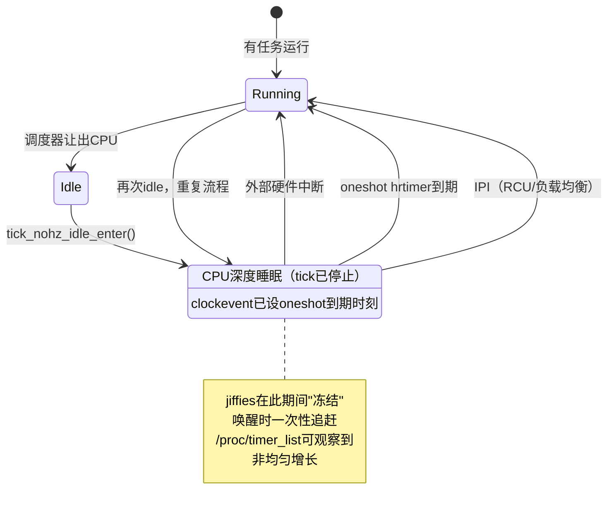

# 10.6.2 NO_HZ_IDLE 模式

> 所属章节：第10章 中断与时间 > 10.6 tickless
>
> 难度：[E→M] | 预计阅读时间：25分钟

## <span class="blue">本节导读

10.6.1 算了账：1000Hz 的 tick 每秒把 CPU 从深睡中拉出 1000 次，idle 功耗高 5–10 倍。那能不能把 tick 停掉？

能，但前提是**保证该醒的时候一定醒**——停 tick 不是取消闹钟，而是把闹钟精确设到"下一件正事"的时刻。本节看 Linux 怎么兑现这个保证。

> 本节覆盖：`NO_HZ_IDLE` 的完整实现路径（基于 v6.6 `tick-sched.c` 真实代码）：进 idle 时 tick 怎么停、"最长能睡多久"怎么算、三类唤醒源、RCU 的特殊处理、唤醒时 jiffies 怎么追赶，以及在开发板上验证 NO_HZ 是否生效的完整实验。

---

## <span class="blue">NO_HZ_IDLE 的实现机制：从停 tick 到精准唤醒 [E→M]

### tick_nohz_idle_enter()：停 tick 的入口

调度器发现没有可运行任务时，CPU 进入 idle 循环，一路调到 `tick_nohz_idle_enter()`（kernel/time/tick-sched.c:1159）。v6.6 真实代码：

```c
void tick_nohz_idle_enter(void)
{
	struct tick_sched *ts;

	lockdep_assert_irqs_enabled();

	local_irq_disable();

	ts = this_cpu_ptr(&tick_cpu_sched);

	WARN_ON_ONCE(ts->timer_expires_base);

	ts->inidle = 1;
	tick_nohz_start_idle(ts);

	local_irq_enable();
}
```

两个看点：`WARN_ON_ONCE(ts->timer_expires_base)` 是一致性检查——上次离开 idle 时有定时器没清干净就是 BUG；`tick_nohz_start_idle()` 标记进入 idle 状态。真正决定"停不停 tick"的逻辑，在 idle 循环随后调用的 `tick_nohz_stop_sched_tick()`（:966）里。

### tick_nohz_next_event()：算出"最多能睡多久"

停 tick 之前，内核必须先回答：不被打断的话，CPU 最多能睡多久？答案由 `tick_nohz_next_event()`（:801）计算——它遍历本 CPU 的 hrtimer 队列找出最近的到期时刻，同时检查一堆"不许睡"的约束：

```c
static ktime_t tick_nohz_next_event(struct tick_sched *ts, int cpu)
{
	/* ... */
	/*
	 * RCU 或 arch 层需要这个 CPU 保持 tick 时，
	 * 直接放弃停 tick（返回 0 到期时刻，调用方随即返回）
	 */
	if (rcu_needs_cpu() || arch_needs_cpu() ||
	    /* ... 其他约束 ... */)
		/* 无法停 tick */

	/* 否则：遍历 hrtimer，算出最近到期时刻 next_event */
}
```

`tick_nohz_stop_sched_tick()` 拿到这个结果后做决策：能停就把 clockevent 编程到该到期时刻，不能停就保持 periodic tick。除了 RCU，参与决策的约束还包括：

- **调度器的负载均衡**：nohz 的 CPU 可能需要参与 rebalance
- **timer wheel 里挂着的传统定时器**（10.5.3）：`timer_base->next_expiry`
- **printk 延迟输出**：部分日志刷新依赖 tick

所以最终编程进硬件的，是所有约束取最小后的"允许的最大休眠时长"。

### 编程 clockevent 为 oneshot

确定能睡多久后，clockevent 设备从 periodic 切到 **oneshot** 模式：只设一个单次到期时刻，触发后自动停止，不再周期滴答（oneshot 机制见 10.5.2）。如果中途没有其他唤醒源，CPU 就一直睡到那个时刻。

> 💡 想观察停 tick 的实际行为，用 trace 事件：`/sys/kernel/debug/tracing/events/timer/tick_stop/`。如果看到的预期休眠时长总是只有几微秒，说明系统里 hrtimer 太密集，NO_HZ 的收益会大打折扣。

### 三类唤醒源

设好闹钟不等于能睡满。三类事件会提前把 CPU 叫醒：

| 唤醒源 | 触发条件 | 说明 |
|:-------|:---------|:-----|
| 外部硬件中断 | 网卡收包、IO 完成、GPIO 中断等 | 硬件 IRQ 不经 hrtimer，由中断控制器直接送达 |
| hrtimer 到期 | oneshot 编程的定时器到期 | 调度、IO 超时等内核定时任务 |
| RCU / IPI | 其他 CPU 发处理器间中断 | RCU 同步、负载均衡等跨核协作 |

前两类好理解，RCU 这一类值得单独拆。

### RCU 在 NO_HZ 下的特殊处理

> RCU（Read-Copy Update）：内核里读写极高频场景用的同步机制——读者不加锁直接读，写者复制一份改完再替换指针，然后等所有"正在读旧数据"的读者读完，才能安全释放旧数据。这段"等读者读完"的等待期叫 **grace period**（宽限期，简称 GP）；CPU 报告"我手上没有正在进行的 RCU 读操作"的时刻叫 **quiescent state**（静默状态）。GP 要等所有 CPU 都报告过 quiescent state 才算结束。

RCU 的 GP 推进有个前提：**每个 CPU 都要至少报告一次 quiescent state**。periodic tick 时代，每次 tick 顺手就报了；tick 停掉后，深睡的 CPU 可能长期"失联"，整个 GP 被卡住，`synchronize_rcu()` 的调用方全部被阻塞。

内核的对策有两层：

1. **停 tick 前询问**：`tick_nohz_next_event()` 里调 `rcu_needs_cpu()`——RCU 正等着这个 CPU 报告时，干脆不停 tick。
2. **dynticks 状态上报**：进 idle 时 CPU 把自己标记为 dyntick-idle 状态，RCU 把这个状态本身视作一次 quiescent state 报告，GP 可以跳过深睡的 CPU 推进。

> ⚠️ 实际影响：NO_HZ 下 RCU GP 的完成时间会波动。系统频繁进出 idle、hrtimer 密集、RCU 负载又高时，GP 延迟可能从几毫秒变成几十毫秒。对延迟敏感的 RCU 使用者（如网络协议栈的 `call_rcu()` 路径），评估时要考虑这个上界，必要时用 `synchronize_rcu_expedited()`。

### tick_nohz_idle_exit()：唤醒与追赶

唤醒源到来，CPU 离开 idle，调用 `tick_nohz_idle_exit()`（:1339）：

```c
void tick_nohz_idle_exit(void)
{
	struct tick_sched *ts = this_cpu_ptr(&tick_cpu_sched);
	bool idle_active, tick_stopped;
	ktime_t now;

	local_irq_disable();

	WARN_ON_ONCE(!ts->inidle);
	WARN_ON_ONCE(ts->timer_expires_base);

	ts->inidle = 0;
	idle_active = ts->idle_active;
	tick_stopped = ts->tick_stopped;

	if (idle_active || tick_stopped)
		now = ktime_get();

	if (idle_active)
		tick_nohz_stop_idle(ts, now);        /* 结算本次 idle 时长 */

	if (tick_stopped)
		tick_nohz_idle_update_tick(ts, now); /* 恢复 tick */

	local_irq_enable();
}
```

关键动作之一是 **jiffies 追赶**：tick 停着的时候 jiffies"冻住"了，恢复时内核根据实际经过时间一次性把 jiffies 补到正确值。这解释了 NO_HZ 系统上 jiffies 的**跳跃式增长**——不是匀速 +1，而是停一段时间然后突然加几十。



> 🔴 NO_HZ 下 **jiffies 的短期精度不可依赖**。periodic tick 时代 jiffies 每 1/HZ 稳定 +1，可以粗略估算短延迟；NO_HZ 下它可能几十毫秒不动然后一次跳几十。驱动里凡是用 jiffies 做精细超时判断的地方，改用 `ktime_get()` 或 hrtimer。

## <span class="blue">NO_HZ_IDLE 的配置与验证 [I]

### 内核配置

```
General setup  --->
    Timers subsystem  --->
        [*] Tickless system (dynamic ticks)
        (X) Idle tick
```

对应 `.config`：`CONFIG_NO_HZ_IDLE=y`。它与 `CONFIG_NO_HZ_FULL` 互斥——前者只在 idle 时停 tick，后者试图连运行态的 tick 也停（下一节）。绝大多数嵌入式设备选 `NO_HZ_IDLE`，也是主流发行版默认。

调试时可用启动参数临时关闭做对比：`nohz=off`。

### 验证一：/proc/timer_list

```bash
cat /proc/timer_list | grep -A10 "Tick Device:"
```

输出示例：

```text
Tick Device: mode:     1
Per CPU device: 0
Clock Event Device: arch_sys_timer
 next_event:         17143748000000 nsecs
 set_next_event:     arch_timer_set_next_event_phys
 set_state_periodic: arch_timer_set_state_periodic
 set_state_oneshot:  arch_timer_set_state_oneshot
```

`mode: 1` 表示 tick 设备工作在 oneshot 模式（`TICKDEV_MODE_ONESHOT`），`0` 为 periodic（`TICKDEV_MODE_PERIODIC`，枚举定义在 kernel/time/tick-sched.h:7-10）——tickless 的前提是这个值已经是 1。

### 验证二：jiffies 的非均匀增长

```bash
# 连续采样 jiffies
while true; do
    grep "jiffies:" /proc/timer_list
    sleep 0.01
done
```

NO_HZ 生效时，jiffies **不是匀速前进的**：稳定一段时间（CPU 深睡），然后突然跳几十（唤醒追赶）。如果始终均匀 +1，说明 tick 根本没停。

10.6.1 数 tick 中断计数的实验在这里也可以再跑一遍：空闲时隔 5 秒读两次 `/proc/interrupts` 的 `arch_timer` 计数，NO_HZ 生效时增量会远小于 `HZ × 5`——CPU 睡着的那段，tick 真的没来。

> 💡 多核系统上只有 idle 的 CPU 才停 tick，活跃 CPU 的 tick 照常——所以观察时要确认被观察的 CPU 确实处于 idle。

### 验证三：trace 事件

```bash
echo 1 > /sys/kernel/debug/tracing/events/timer/tick_stop/enable
cat /sys/kernel/debug/tracing/trace_pipe
```

输出形如：

```text
<idle>-0 [000] d.h. 1234.567890: tick_stop: success=1 dependency=NONE
```

`success=1 dependency=NONE` 表示成功停 tick；`success=0` 表示被依赖条件挡下，`dependency` 字段会给出具体子系统（如 `RCU`、`POSIX_TIMER`）。

v6.6 只有 `tick_stop` 事件，没有 `tick_start`——tick 恢复不产生 trace，睡眠时长要结合唤醒中断的时间戳推算。

---

## <span class="blue">本节总结

NO_HZ_IDLE 的机制一句话就能说清：进 idle 时算出"最多能睡多久"（最近 hrtimer 到期与 RCU/调度等约束取最小），把 clockevent 从周期切到 oneshot 编程该时刻，唤醒时一次性追赶 jiffies。停 tick 不是取消闹钟，而是把闹钟精确设到下一件正事——"该醒的时候一定醒"由这套约束计算保证。

工程上带走四条：jiffies 在 NO_HZ 下短期精度不可依赖，精细计时一律用 ktime/hrtimer；`top`、`vmstat` 的 CPU 统计会因 tick 采样变少而失真，要看准的用 `perf`；RCU GP 延迟会波动，敏感路径评估上界或换 expedited 版本；验证 tickless 是否生效，看 jiffies 非均匀增长和 `tick_stop` trace 的 success/dependency 字段。

---

## <span class="blue">下一步

10.6.3 NO_HZ_FULL 与 cpuidle 协同——`NO_HZ_IDLE` 解决了空闲 CPU 的空转问题，但 CPU 上有任务在跑时呢？一个绑核的实时线程运行时，tick 照样每秒来 HZ 次打断它。下一节看更激进的方案：运行态也停 tick，以及 tick 停了之后 cpuidle 能把 CPU 送多深。
