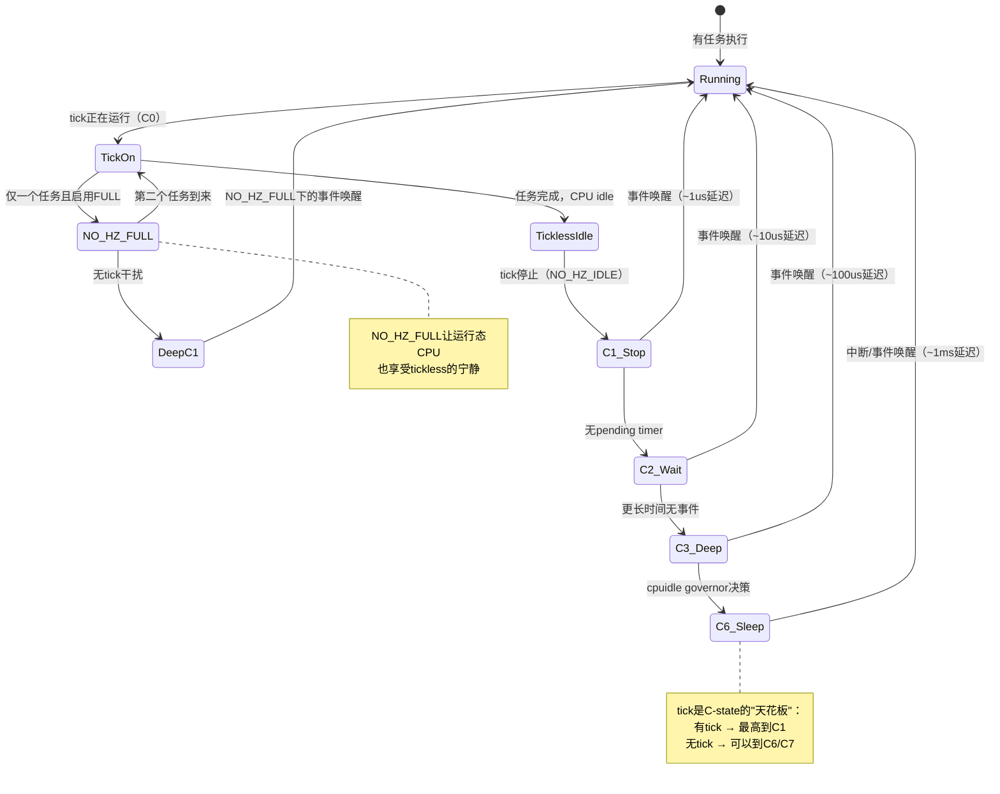

# 10.6.3 NO_HZ_FULL与cpuidle协同

> 所属章节：第10章 中断与时间 > 10.6 tickless内核与调度器时间
>
> 难度：[E][M] | 预计阅读时间：20分钟

## <span class="blue"> 本节导读

你已经了解了基础的tickless机制（NO_HZ_IDLE）——CPU idle时停掉tick来省电。但Linux社区并不满足于此：如果CPU上只有一个任务在跑， tick还有什么存在的必要？本节带你深入两个进阶话题：<br>

- **NO_HZ_FULL** —— 比NO_HZ_IDLE更激进的tickless方案，连运行态的tick都干掉<br>
- **tickless与cpuidle的深层协同** —— 无tick后CPU能进入多深的睡眠？唤醒延迟要付出什么代价？<br>

学完后，你将理解为什么实时系统偏爱NO_HZ_FULL，以及为什么音频设备在deep idle下会爆音。更重要的是，你能做出有数据支撑的权衡决策——功耗 vs 延迟，不再凭感觉。

---

## <span class="blue"> NO_HZ_FULL：连运行态的tick都停掉 [E]

### 从NO_HZ_IDLE到NO_HZ_FULL的飞跃

NO_HZ_IDLE解决的是"CPU没事干时别瞎折腾"的问题。但你想过没有——**如果CPU上只跑一个任务，scheduler tick照样每隔1ms来敲门**，这个tick能干什么？检查是否需要抢占？只有一个任务，抢占个寂寞。更新进程统计？可以等到任务主动让出CPU再说。时间记账？hrtimer精度足够应付。

说白了，NO_HZ_IDLE是"idle时偷懒"，NO_HZ_FULL则是"能懒则懒"——**只要CPU上只有一个可运行任务，tick就完全停止**。

这个机制在内核代码里长什么样？看`kernel/time/tick-sched.c`中的判断逻辑：

```c
/* kernel/time/tick-sched.c */
static bool tick_nohz_full_cpu(int cpu)
{
    /* 检查该CPU是否在nohz_full_mask中 */
    if (!cpumask_test_cpu(cpu, tick_nohz_full_mask))
        return false;
    
    /* 检查该CPU上是否只有一个running任务 */
    if (cpu_rq(cpu)->nr_running > 1)
        return false;
    
    /* 确认当前任务允许tick停止 */
    if (!can_stop_full_tick())
        return false;
    
    return true;
}
```

核心条件就三个：CPU在`nohz_full`列表中、只有一个running任务、当前任务的上下文允许停tick。

### 配置与启用

要启用NO_HZ_FULL，需要两步：

**第一步：编译时开启**

```bash
# 内核配置
CONFIG_NO_HZ_FULL=y        # 开启full tickless
CONFIG_NO_HZ_IDLE=y        # 基础tickless（依赖项）
CONFIG_CPU_ISOLATION=y     # CPU隔离支持（关键依赖）
```

**第二步：启动参数指定**

```bash
# 内核启动参数
nohz_full=1-3              # CPU 1/2/3开启FULL tickless
isolcpus=1-3               # 必须配合！隔离这些CPU
```

> ⚠️ **陷阱**：`nohz_full`和`isolcpus`必须成对出现。只设`nohz_full`不配`isolcpus`，内核日志里会刷出一堆警告，tick实际上根本停不下来。为什么？因为`isolcpus`把CPU从负载均衡域里摘出来，防止调度器把其他任务塞过去。没有这个隔离保证，tick不敢停——万一新任务来了怎么办？

### 什么时候tick会重新回来？

NO_HZ_FULL不是"一劳永逸"地关掉tick。以下几种情况tick会短暂回归：

| 触发条件 | 说明 |
|---------|------|
| 第二个任务被调度到该CPU | 必须恢复tick来做调度决策 |
| hrtimer到期 | 用户态的定时器需要处理 |
| 收到IPI（处理器间中断） | 其他CPU有事情通知你 |
| 系统调用返回用户态 | 检查是否有挂起的工作 |

tick恢复后，等再次只剩一个任务时，又会自动停掉。整个过程对用户态透明。

### NO_HZ_IDLE vs NO_HZ_FULL 核心对比

| 对比维度 | NO_HZ_IDLE | NO_HZ_FULL |
|---------|-----------|-----------|
| tick停止时机 | CPU进入idle时 | 只有一个running任务时 |
| 是否需要isolcpus | 不需要 | **必须** |
| 适用场景 | 通用省电 | 实时任务专用CPU |
| 中断干扰程度 | 低（只在idle时安静） | 极低（运行时也安静） |
| 调度延迟改善 | 有限 | 显著（无tick打断） |
| 内核版本 | 2.6.21+ | 3.10+ |
| 典型用户 | 手机/笔记本 | 高频交易/工业控制 |

说白了，NO_HZ_FULL是把一个CPU"借"给一个任务专用，让任务享受近似裸机的执行环境——没有 scheduler tick 来打断你的关键路径。测试数据显示，启用NO_HZ_FULL后，用户态任务的调度延迟抖动可以从几十微秒降低到个位数微秒。

---

## <span class="blue"> tickless与cpuidle协同：睡得多深，醒得多慢 [I][M]

### CPU的"睡眠等级"——C-State

停掉tick只是第一步。tick没了，CPU才能真正"睡个好觉"。但这里的"睡觉"也分深浅——在cpuidle框架里，这叫**C-State**（C-state / 电源状态）。

```
     C0          C1          C2          C3/C6/C7
    [运行] ---- [打盹] ---- [小睡] ---- [深睡]
      |           |           |            |
   全速运行   停止时钟    降低电压    关闭缓存
   功耗最高   缓存保持    部分断电    可能丢上下文
              ~1us唤醒    ~10us唤醒   ~100us-1ms唤醒
```

C-state越深，CPU睡得越死，功耗越低，但醒过来的时间越长。这张表格是关键决策依据：

| C-State | 状态描述 | 典型功耗 | 唤醒延迟 | 是否保持cache | 适用场景 |
|---------|---------|---------|---------|-------------|---------|
| C0 | CPU全速运行 | 100% | 0 | 是 | 任务执行中 |
| C1 | 停止内部时钟 | ~70% | ~1μs | 是 | 短暂等待spinlock |
| C1E | C1+降低电压 | ~50% | ~5μs | 是 | 轻负载间歇 |
| C2 | 更深idle，部分断电 | ~30% | ~10-50μs | 是 | IO等待 |
| C3 | 关闭L1/L2 cache | ~10% | ~100μs | 可能 | 较长idle |
| C6 | 保存状态到内存 | ~3% | ~500μs-1ms | 否 | 深度睡眠 |
| C7+ | 核心完全关闭 | <1% | ~1-3ms | 否 | 极低功耗需求 |

> 💡 **提示**：你可以通过`/sys/devices/system/cpu/cpu0/cpuidle/`查看本机支持的C-state。每个`stateN`目录下有`name`、`latency`、`power`等文件，直接读就能看到实际数值：
> ```bash
> cat /sys/devices/system/cpu/cpu0/cpuidle/state1/name      # 可能输出 "C1"
> cat /sys/devices/system/cpu/cpu0/cpuidle/state1/latency   # 唤醒延迟（微秒）
> cat /sys/devices/system/cpu/cpu0/cpuidle/state1/power     # 相对功耗
> ```

### tickless如何解锁更深的C-state？

这是整个协同机制的核心逻辑链，用状态图来理解最直观：



关键 insight：**scheduler tick是C-state的"天花板"**。每1ms来一次tick，CPU最高只能进C1——更深的C-state还没来得及进去就被tick叫醒了。tickless把这个天花板捅破了，cpuidle governor才有机会把CPU送进C3甚至C6。

### 那代价呢？音频爆音的惨痛教训

功耗降了，但唤醒延迟变长了。这个trade-off在绝大多数场景下没什么感觉——谁会注意到从1μs变成100μs的唤醒延迟呢？**但音频设备会**。

看一个真实案例：某嵌入式设备播放48kHz音频，音频驱动依赖hrtimer每20.8μs（1/48000）触发一次DMA传输。启用NO_HZ_IDLE + deep C-state后，CPU在进入C3/C6后，hrtimer的精度开始漂移——原来微秒级的精度，现在因为CPU从deep sleep唤醒要花几百微秒，**DMA传输偶尔错过时间窗口，用户听到的就是"咔嗒"爆音**。

```
时间线：
  |--DMA1--|--DMA2--|--DMA3--|--DMA4--|--DMA5--|
                              ^ CPU进C3了
  |--DMA1--|--DMA2--|--DMA3--|..延迟..|--DMA5--|
                              ^ hrtimer到期但没按时唤醒
                                      ^ 到这里才唤醒，DMA4丢了！
```

根本原因是：**CPU从C3/C6唤醒的时间 > hrtimer的容忍窗口**。

怎么解决？有几种策略：

**策略一：禁用deep idle（简单粗暴）**

```bash
# 禁用CPU 0的C3状态
# 找到对应的state编号，然后：
echo 1 > /sys/devices/system/cpu/cpu0/cpuidle/state3/disable

# 或者干脆只保留C1
for i in /sys/devices/system/cpu/cpu*/cpuidle/state*/disable; do
    echo 1 > "$i"
done
echo 0 > /sys/devices/system/cpu/cpu0/cpuidle/state1/disable
```

> 💡 **提示**：上面的`state*`编号因CPU型号而异。`cat /sys/devices/system/cpu/cpu0/cpuidle/state*/name`先看一下哪个state对应你要禁用的C-state，别盲操作。你也可以用`cpupower idle-info`一键查看所有状态的完整信息。

**策略二：保留"热CPU"给延迟敏感任务（推荐）**

```bash
# 内核启动参数：CPU 0专跑音频，禁deep idle；其余CPU正常省电
nohz_full=1-3 isolcpus=1-3 intel_idle.max_cstate=1
# 音频任务绑到CPU 0
 taskset -c 0 ./audio_player
```

这个思路叫**热CPU策略**——给延迟敏感的任务留一个"永远醒着"的CPU，其余CPU尽情deep sleep省电。CPU 0不隔离、不深睡，保证音频驱动的hrtimer及时响应；CPU 1-3用NO_HZ_FULL跑后台任务，享受tickless红利。

**策略三：使用pm_qos约束**

```bash
# 从用户空间设置延迟约束，告诉cpuidle：
# "系统要求的最大唤醒延迟是50μs，别进比C2更深的state"
echo 50 > /sys/devices/system/cpu/cpuidle/low_power_idle_system_residency_us
```

pm_qos（Power Management Quality of Service）是内核的延迟约束框架。用户空间或驱动可以通过它告诉cpuidle governor："我需要N微秒以内的响应时间"，governor据此限制C-state深度。

### cpuidle governor如何决策？

你可能好奇：谁决定CPU该进哪个C-state？答案是**cpuidle governor**。

```
用户态/驱动
    |
    v
+---------------+     +-----------------+     +--------------+
| pm_qos约束    | --> | cpuidle governor | --> | C-state驱动  |
| (延迟上限)    |     | (menu/ladder)    |     | (intel_idle  |
+---------------+     +-----------------+     |  /acpi_idle) |
        ^                                      +--------------+
        |                                            |
        +-------- 反馈唤醒延迟数据 <-------------------+
```

`menu` governor（默认）会综合考虑以下因素：

1. **预测下次事件时间**：基于历史统计数据，猜CPU多久后会醒来
2. **pm_qos延迟约束**：不能进超过约束的C-state
3. **功耗/延迟的trade-off**：目标函数 = 功耗节省 / (退出延迟 + 预测误差惩罚)

`ladder` governor则更保守，按固定的"梯子"逐级深入，适合桌面场景。实时系统通常偏好`menu`，因为它对延迟约束响应更灵敏。

---

## <span class="blue"> 本节总结

| 主题 | 核心要点 |
|------|---------|
| NO_HZ_FULL机制 | CPU上仅一个任务时完全停掉tick，需配合isolcpus使用 |
| 启用条件 | `CONFIG_NO_HZ_FULL=y` + `nohz_full=1-3` + `isolcpus=1-3` |
| C-State层级 | C0→C1→C2→C3→C6，越深功耗越低、唤醒越慢 |
| tickless与cpuidle关系 | tick是C-state的"天花板"，tickless解锁更深的C-state |
| 音频爆音根因 | deep C-state唤醒延迟 > hrtimer精度要求 |
| 解决策略 | 禁用deep idle / 热CPU策略 / pm_qos延迟约束 |
| 核心trade-off | 功耗 vs 延迟，需要根据具体场景做决策 |

> 🔴 **危险**：生产环境启用NO_HZ_FULL前，务必用`cyclictest`或`oslat`做延迟测试。`oslat`（OS Latency）专门检测内核内部活动（tick、timer、softirq）对任务的干扰，是验证NO_HZ_FULL效果的利器：
> ```bash
> # 在NO_HZ_FULL的CPU上运行
> oslat --cpu-list 1 --duration 60
> # 理想情况下，内部活动导致的延迟应接近0
> ```

---

## <span class="blue"> 下一步

你已经掌握了tickless的全貌——从基础的NO_HZ_IDLE到激进的NO_HZ_FULL，再到与cpuidle的深度协同。但tickless不是银弹，它引入了一些调试上的麻烦：<br>

**10.6.4 tickless副作用与调试** —— 当tick不再规律跳动时，`/proc/stat`的CPU统计还准吗？如何用`ftrace`追踪一个"没有tick"的CPU上发生了什么？内核提供了哪些工具来诊断tickless相关的问题？<br>

咱们继续往下挖。

---

## <span class="blue"> 配套资源

| 资源 | 路径/命令 | 说明 |
|------|----------|------|
| NO_HZ_FULL配置检查 | `zcat /proc/config.gz \| grep NO_HZ_FULL` | 确认内核编译选项 |
| C-state信息查看 | `cpupower idle-info` | 一键查看所有C-state参数 |
| 当前CPU频率/idle | `cpupower monitor` | 实时监控C-state驻留时间 |
| C-state手动禁用 | `/sys/devices/system/cpu/cpuN/cpuidle/state*/disable` | 逐个禁用深层C-state |
| 延迟测试工具 | `oslat --cpu-list 1 --duration 60` | 检测NO_HZ_FULL效果 |
| pm_qos设置 | `/sys/devices/system/cpu/cpuidle/low_power_idle_*` | 系统级延迟约束 |
| 关键源码路径 | `kernel/time/tick-sched.c` | tick调度核心逻辑 |
| 关键源码路径 | `drivers/cpuidle/` | cpuidle驱动与governor |
| 关键源码路径 | `kernel/power/qos.c` | pm_qos约束框架 |
