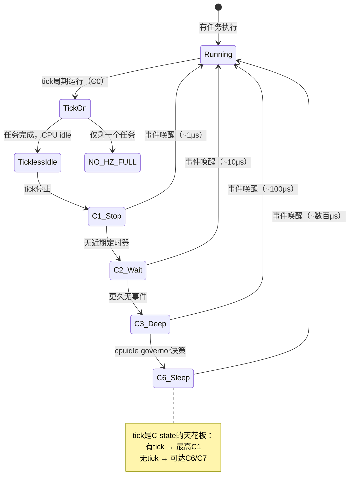
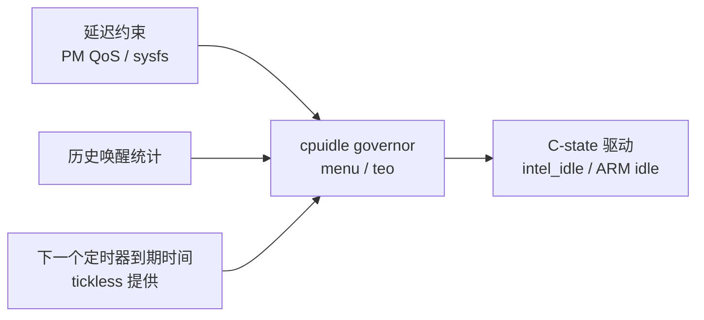

# 10.6.3 NO_HZ_FULL与cpuidle协同

> 所属章节：第10章 中断与时间 > 10.6 tickless
>
> 难度：[E→M] | 预计阅读时间：20分钟

## <span class="blue"> 本节导读

`NO_HZ_IDLE` 只解决空闲时的空转。但 CPU 上只跑一个任务时，scheduler tick 每毫秒来一次又能做什么？抢占检查——只有一个任务；负载均衡——没有别的任务可均衡。本节覆盖两个进阶主题：**NO_HZ_FULL**——运行态也停 tick 的激进方案，以及 **tickless 与 cpuidle 的协同**——tick 停了 CPU 才能睡多深、唤醒延迟的代价怎么管。

---

## <span class="blue"> NO_HZ_FULL：连运行态的tick都停掉 [E]

### 机制：三个条件

`NO_HZ_IDLE` 是"idle 时停 tick"，`NO_HZ_FULL` 则是"**只要 CPU 上只剩一个可运行任务，tick 就停**"。v6.6 里判定分两层：

第一层，CPU 是否在 nohz_full 范围内——`tick_nohz_full_cpu()` 是 include/linux/tick.h:194 的宏，只做掩码查询：

```c
#define tick_nohz_full_cpu(_cpu) ({					\
	bool __ret = false;						\
	if (tick_nohz_full_enabled())					\
		__ret = cpumask_test_cpu((_cpu), tick_nohz_full_mask);	\
	__ret;								\
})
```

第二层，能不能真的停——`can_stop_full_tick()`（tick-sched.c:303）检查一系列 **tick 依赖位**：

```c
static bool can_stop_full_tick(int cpu, struct tick_sched *ts)
{
	if (unlikely(!cpu_online(cpu)))
		return false;
	if (check_tick_dependency(&tick_dep_mask))           /* 全局依赖 */
		return false;
	if (check_tick_dependency(&ts->tick_dep_mask))       /* 本CPU依赖 */
		return false;
	if (check_tick_dependency(&current->tick_dep_mask))  /* 当前任务依赖 */
		return false;
	if (check_tick_dependency(&current->signal->tick_dep_mask))
		return false;
	return true;
}
```

依赖位覆盖 POSIX CPU timer、perf 事件、调度统计这类"没 tick 就没法工作"的功能——有这些依赖在，tick 不能停。至于"只剩一个任务"这个条件，由调度器侧维护：运行队列上 `nr_running > 1` 时，调度器通过 `nohz_full_kick` 向该 CPU 发 IPI 恢复 tick。

### 配置与启用

```bash
# 编译时
CONFIG_NO_HZ_FULL=y        # full tickless
CONFIG_CPU_ISOLATION=y     # CPU 隔离（NO_HZ_FULL 的依赖项）

# 启动参数
nohz_full=1-3              # CPU 1/2/3 启用
isolcpus=domain,1-3        # 配合隔离，防止调度器把任务塞过去
```

> ⚠️ `nohz_full` 必须配合 CPU 隔离使用。不做隔离，负载均衡随时可能把第二个任务迁到该 CPU，tick 会被反复打断恢复，`NO_HZ_FULL` 失去意义。内核文档的推荐写法是 `isolcpus=domain,<cpu列表>`。

### tick什么时候回归

NO_HZ_FULL 不是永久关 tick，以下情况 tick 短暂恢复：

| 触发条件 | 说明 |
|---------|------|
| 第二个任务被调度到该 CPU | 调度器发 nohz_full_kick IPI 恢复 tick |
| hrtimer 到期 | 该 CPU 上的定时器需要处理 |
| 收到 IPI | 跨核协作（RCU、负载均衡等） |
| tick 依赖功能启用 | posix cpu timer、perf 等被使用时 |

任务再次只剩一个时，tick 自动停止。全程对用户态透明。

### NO_HZ_IDLE vs NO_HZ_FULL

| 对比维度 | NO_HZ_IDLE | NO_HZ_FULL |
|---------|-----------|-----------|
| tick 停止时机 | CPU 进入 idle | 只剩一个可运行任务 |
| 需要 CPU 隔离 | 不需要 | **需要** |
| 适用场景 | 通用省电 | 实时任务专用 CPU |
| 运行时干扰 | idle 时无 tick | 运行态也无 tick |
| 引入版本 | 2.6.21 | 3.10 |
| 典型用户 | 手机/笔记本 | 工业控制、专用计算核 |

NO_HZ_FULL 的本质是把一个 CPU 划给单个任务专用，让它获得近似独占硬件的执行环境——没有 scheduler tick 打断关键路径，调度延迟抖动显著收敛。

---

## <span class="blue"> tickless与cpuidle协同：睡得多深，醒得多慢 [I→M]

### C-State 决策依据

tick 停了之后，CPU 能睡多深由 cpuidle 框架的 C-state 决定：

| C-State | 状态 | 典型唤醒延迟（量级） | cache 保持 | 适用场景 |
|---------|------|:---:|:---:|---------|
| C0 | 全速运行 | 0 | 是 | 任务执行中 |
| C1 | 停止内部时钟 | ~1μs | 是 | 极短等待 |
| C2 | 部分断电 | ~10–50μs | 是 | IO 等待 |
| C3 | 关闭部分 cache | ~100μs | 可能丢失 | 较长 idle |
| C6 | 状态保存到内存 | ~500μs | 否 | 深度睡眠 |
| C7+ | 核心近完全关闭 | ~1ms+ | 否 | 极致省电 |

> 💡 设备的真实参数在 `/sys/devices/system/cpu/cpu0/cpuidle/state*/`（`name`、`latency`、`power`），或用 `cpupower idle-info` 一次看全。

### tick是C-state的天花板

协同的核心逻辑一句话：**scheduler tick 决定了 C-state 能进多深**。每 1ms 一次 tick，CPU 最深只能停在 C1——更深的状态还没来得及进就被 tick 叫醒。tickless 拿掉这个限制后，cpuidle governor 才有机会把 CPU 送进 C3、C6。



### 代价：唤醒延迟撞上实时任务

功耗降了，唤醒延迟上来了。大多数场景无感，但**周期极短的实时任务会撞上**。10.5.5 的音频爆音案例就是典型：48kHz 音频驱动用 hrtimer 每 20.8μs 补一次 DMA，CPU 进 C3/C6 后唤醒要数百微秒，hrtimer 回调迟到、DMA 缓冲区欠载——爆音。

根因一句话：**CPU 从深 C-state 唤醒的时间 > hrtimer 的容忍窗口**。三种对策（细节与持久化方法见 10.5.5）：

**策略一：禁用深 C-state**

```bash
# 先确认编号对应的 state 名称
cat /sys/devices/system/cpu/cpu0/cpuidle/state*/name

# 禁用深睡的那个 state（编号因平台而异，别照抄）
echo 1 > /sys/devices/system/cpu/cpu0/cpuidle/state3/disable
```

**策略二：热 CPU 策略（推荐）**

```bash
# 启动参数：音频 CPU 不深睡，其余核隔离跑后台
nohz_full=1-3 isolcpus=domain,1-3

# 音频任务绑定到未隔离、禁深睡的 CPU 0
taskset -c 0 ./audio_player
```

给延迟敏感任务留一个"始终浅睡"的 CPU，其余 CPU 尽情深睡省电——功耗与延迟各取所需。

**策略三：延迟约束接口**

```bash
# 告诉 cpuidle：系统可接受的最大唤醒延迟
echo 50 > /sys/devices/system/cpu/cpuidle/low_power_idle_system_residency_us
```

设置后，cpuidle governor 不会选择唤醒延迟超过约束的 C-state。驱动也可以通过 PM QoS 接口（`/dev/cpu_dma_latency`）按任务动态设置约束——音频播放时收紧、暂停时放开。

### cpuidle governor 怎么决策

谁决定进哪个 C-state？cpuidle governor。主线内核主要是 `menu` 和 `teo` 两个（10.5.5 已对比）：都基于"预测下次唤醒时间"选状态——预测 idle 越长选得越深，同时受延迟约束封顶。`teo` 对近期唤醒事件的利用更积极，倾向选较浅状态；`menu` 偏省电取向。



注意第三条输入：tickless 算出的"下一个定时器到期时刻"正是 governor 预测 idle 时长的重要依据——tickless 与 cpuidle 的数据流在这里闭环。

---

## <span class="blue"> 本节总结

| 主题 | 核心要点 |
|------|---------|
| NO_HZ_FULL 条件 | CPU 在 nohz_full_mask + 仅剩一个任务 + 无 tick 依赖位 |
| 启用方式 | `CONFIG_NO_HZ_FULL=y` + `nohz_full=` + `isolcpus=domain,` 隔离 |
| tick 恢复 | 第二个任务到来时 nohz_full_kick IPI 恢复 |
| tickless ↔ cpuidle | tick 是 C-state 天花板，停了才能进 C3/C6 |
| 爆音根因 | 深 C-state 唤醒延迟 > hrtimer 容忍窗口 |
| 对策 | 禁深 C-state / 热 CPU 策略 / PM QoS 延迟约束 |
| 核心权衡 | 功耗与延迟按场景取舍，热 CPU 策略可以兼得 |

> 🔴 生产环境启用 NO_HZ_FULL 前，用 `cyclictest` 或 rt-tests 里的 `oslat` 做延迟验证。`oslat` 专门测量内核内部活动（tick、timer、softirq）对任务的干扰：
> ```bash
> oslat --cpu-list 1 --duration 60
> ```
> NO_HZ_FULL 生效的 CPU 上，内部活动引入的延迟应接近零。

---

## <span class="blue"> 下一步

tickless 的全貌已经清楚——从 NO_HZ_IDLE 到 NO_HZ_FULL，再到与 cpuidle 的协同。但 tick 不再规律之后，一批依赖 tick 的统计与调试手段会失真：**10.6.4 tickless 副作用与调试**——`/proc/stat` 的 CPU 统计还准吗？怎么在一台"没有 tick"的 CPU 上追踪问题？

---

## <span class="blue"> 配套资源

| 资源 | 路径/命令 | 说明 |
|------|----------|------|
| 配置检查 | `zcat /proc/config.gz \| grep NO_HZ_FULL` | 确认编译选项 |
| C-state 信息 | `cpupower idle-info` | 查看所有 C-state 参数 |
| C-state 禁用 | `/sys/devices/system/cpu/cpuN/cpuidle/state*/disable` | 逐个禁用深层 state |
| 延迟测试 | `oslat --cpu-list 1 --duration 60` | 验证 NO_HZ_FULL 效果 |
| 延迟约束 | `/sys/devices/system/cpu/cpuidle/low_power_idle_*` | 系统级约束 |
| 核心源码 | `kernel/time/tick-sched.c` | `can_stop_full_tick()`(:303)、`tick_nohz_full_cpu` 使用点 |
| 头文件 | `include/linux/tick.h` | `tick_nohz_full_cpu` 宏（:194） |
| cpuidle | `drivers/cpuidle/` | 驱动与 governor（menu/teo） |
