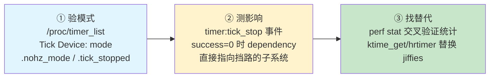

# 10.6.4 tickless副作用与调试

> 所属章节：第10章 中断与时间 > 10.6 tickless
>
> 难度：[I] | 预计阅读时间：15分钟

## <span class="blue"> 本节导读

本节覆盖：tickless 的三个常见副作用——CPU 使用率统计失真、jiffies 精度问题、RCU grace period 延迟——的成因与应对，以及一套确认 tickless 状态的调试工具：`/proc/timer_list` 的真实字段解读、`timer:tick_stop` trace 事件、用 perf 做交叉统计。jiffies 与 RCU 的机制原理已在 10.6.2 展开，本节聚焦"出了症状怎么确认、怎么办"。

---

## <span class="blue"> 副作用一：CPU使用率统计失真

`/proc/stat` 的 CPU 时间记账默认基于 tick 粒度：每次 tick 中断采样一次当前 CPU 在做什么，把这一整个 tick 区间计入 user、system、idle、iowait 等对应的桶。`top`、`vmstat` 再以固定间隔读 `/proc/stat`，用两次读数的差值算占比。

tickless 打破了这个前提：tick 停掉期间，计数不前进。一个短任务如果整段落在停 tick 的区间内，`/proc/stat` 里看不到它的任何痕迹，`top` 就显示 0%——不是任务没跑，是记账的采样时钟没在走。

应对办法是绕开 tick 记账，用 PMU 硬件计数器：

```bash
# perf stat 基于 CPU cycles 等硬件事件计数，与 tick 间隔无关
perf stat -a sleep 5
```

做性能基准对比时，还可以加内核参数 `nohz=off` 临时关掉 tickless，取一组基线数据再对比。

---

## <span class="blue"> 副作用二：jiffies精度（机制见10.6.2）

`jiffies` 只在 tick 到来时更新。tickless 下 tick 间隔不固定，jiffies 不再是均匀走时的时间基准——10.6.2 的"验证二：jiffies 的非均匀增长"一节有实测数据，这里不重复。

落到写代码上，规则只有一条：

> ⚠️ 需要精度的等待和超时判断，不要用 `jiffies` 差值、`msleep(1)` 这类低精度接口。tickless 下 `msleep(1)` 的实际延迟可能拖到几十毫秒。音频缓冲、传感器采样这类对时序敏感的路径，用 hrtimer 或 `ktime_get()` 系列。

---

## <span class="blue"> 副作用三：RCU grace period延迟（机制见10.6.2）

RCU 回收旧数据前，要等所有 CPU 都经过一次 quiescent state。NO_HZ 下处于 dyntick-idle 的 CPU 被 RCU 直接视作 quiescent state，正常路径不会卡住——机制细节见 10.6.2 的"RCU在NO_HZ下的特殊处理"。

真正的风险在异常路径：如果某段内核代码长时间既不 idle 也不让出 CPU（比如关抢占的长循环），grace period 会被拉长，外在症状是内存回收变慢、`synchronize_rcu()` 延迟出现尖刺。

缓解手段是 `CONFIG_RCU_FAST_NO_HZ`。开启后，RCU 在需要推进 grace period 时用一个超时定时器主动唤醒 CPU，而不是无限等下去——用少量额外唤醒换 GP 延迟上界：

```
Kernel Hacking  --->
    RCU Debugging  --->
        [*] RCU fast no_hz
```

---

## <span class="blue"> 三大副作用速查

| 副作用 | 典型症状 | 根因 | 应对 |
|:-------|:---------|:-----|:-----|
| CPU 统计失真 | top / vmstat 读数偏低或波动 | `/proc/stat` 按 tick 粒度记账，tick 停了计数不走 | `perf stat` 走 PMU；基准测试时 `nohz=off` 对比 |
| jiffies 精度 | 超时判断忽长忽短 | jiffies 只在 tick 时更新 | hrtimer / `ktime_get()`（机制见 10.6.2） |
| RCU GP 延迟 | `synchronize_rcu()` 延迟尖刺、内存回收慢 | 异常路径长期不经过 quiescent state | `CONFIG_RCU_FAST_NO_HZ` 兜底（机制见 10.6.2） |

---

## <span class="blue"> 调试工具箱

调试顺序固定为三步，每步对应一件工具：



### /proc/timer_list：确认tick设备状态

`/proc/timer_list` 由 `kernel/time/timer_list.c` 生成，先看每个 CPU 的 tick 设备块：

```
Tick Device: mode:     1
Per CPU device: 0
Clock Event Device: arch_timer
 max_delta_ns:   17179869183
 min_delta_ns:   1000
 mult:           42949672
 shift:          25
 mode:           1
 next_event:     1234567890 nsecs
 set_next_event: arch_timer_set_next_event_phys
 oneshot:        arch_timer_set_next_event_phys
 event_handler:  hrtimer_interrupt
```

两个 `mode` 字段都要看：

- `Tick Device: mode: 1`：tick 设备处于 `TICKDEV_MODE_ONESHOT`（0 是 PERIODIC）。tickless 的前提是 oneshot，周期模式下谈不上停 tick。
- `mode: 1`（Clock Event Device 块内）：底层 clockevent 硬件当前也处于 oneshot 状态。

接着是同一块后面的 per-CPU `tick_sched` 统计（字段名前带点，是 `timer_list.c` 里 `P(x)` 宏的输出格式）：

```
  .nohz_mode      : 2
  .last_tick      : 1230000000
  .tick_stopped   : 1
  .idle_jiffies   : 4370012000
  .idle_calls     : 12345
  .idle_sleeps    : 12300
  .idle_entrytime : 1234000000
  ...
jiffies: 4370012345
```

| 字段 | 含义 |
|:-----|:-----|
| `.nohz_mode` | `kernel/time/tick-sched.h` 的枚举：0=INACTIVE（未启用）、1=LOWRES、2=HIGHRES。配了高分辨率定时器的平台应为 2 |
| `.tick_stopped` | 1 表示当前 tick 处于停止状态，0 表示在走 |
| `.idle_calls` / `.idle_sleeps` | 进入 idle 的次数 vs 真正停 tick 成功的次数。两者差距大，说明停 tick 经常被约束条件挡下（hrtimer 太密、RCU 有挂起的工作），tickless 收益打折 |

### timer:tick_stop trace事件

v6.6 里 tick 相关的 trace 事件只有一个：`timer` 子系统的 `tick_stop`（事件定义在 `include/trace/events/timer.h`，触发点在 `tick-sched.c` 的 `trace_tick_stop()` 调用处）。没有对应的 `tick_start` 事件——tick 恢复不产生 trace。

```bash
# 挂载 debugfs（若未挂载）
mount -t debugfs none /sys/kernel/debug

# 启用事件并实时查看
echo 1 > /sys/kernel/debug/tracing/events/timer/tick_stop/enable
cat /sys/kernel/debug/tracing/trace_pipe
```

输出格式为 `success=%d dependency=%s`：

```
<idle>-0 [000] d.h. 1234.567890: tick_stop: success=1 dependency=NONE
```

- `success=1 dependency=NONE`：成功停 tick。
- `success=0`：停 tick 被挡下，`dependency` 字段直接给出是哪个子系统的依赖——`POSIX_TIMER`、`PERF_EVENTS`、`SCHED`、`CLOCK_UNSTABLE`、`RCU`、`RCU_EXP`。这个字段是排查"为什么我的系统停不下 tick"的第一手证据。

批量记录用 trace-cmd：

```bash
trace-cmd record -e timer:tick_stop sleep 10
trace-cmd report | grep tick_stop
```

### 统计交叉验证

怀疑 top 读数失真时，用不受 tick 影响的口径交叉验证：

```bash
# 硬件计数器口径
perf stat -a sleep 5

# /proc/stat 口径（tick 记账）
cat /proc/stat | head -1
sleep 5
cat /proc/stat | head -1
```

两组数据差距明显，说明 tick 记账在你的负载特征下失真，性能分析应以 perf 口径为准。

---

> 💡 `CONFIG_NO_HZ_FULL` 的副作用比 `CONFIG_NO_HZ_IDLE` 大得多：NO_HZ_FULL 下单任务 CPU 连运行态的 tick 都停，jiffies 近乎冻结，RCU 与调度统计的约束也更复杂。除非负载形态匹配（HPC、独占核的实时处理），否则从 NO_HZ_IDLE 起步，评估清楚收益再考虑 FULL。

---

## <span class="blue"> 本节总结

| 要点 | 内容 |
|:-----|:-----|
| CPU 统计失真 | `/proc/stat` 按 tick 记账，tick 停了计数不走；用 `perf stat`（PMU）交叉验证 |
| jiffies 精度 | tickless 下不可做精确计时，用 hrtimer / `ktime_get()`；机制见 10.6.2 |
| RCU GP 延迟 | 正常路径由 dyntick-idle 视作 quiescent state 兜底；异常路径靠 `CONFIG_RCU_FAST_NO_HZ` 限制延迟上界 |
| 验证模式 | `/proc/timer_list`：`Tick Device: mode: 1`（oneshot）+ `.nohz_mode` + `.tick_stopped` |
| 诊断停不下 tick | `timer:tick_stop` 事件，`success=0` 时 `dependency` 字段直接指向挡路的子系统 |
| 收益评估 | `.idle_calls` vs `.idle_sleeps` 的差距反映停 tick 成功率 |

调试顺序建议：先用 `/proc/timer_list` 确认 tickless 确实在生效，再用 `tick_stop` 事件量化停 tick 的频率与失败原因，最后对照副作用速查表逐项排查。问题拆成"验模式 → 测影响 → 找替代"三步，路径就清晰了。

---

## <span class="blue"> 下一步

> **10.7.1 实战：GPIO中断延迟排查**
>
> 第10章的知识拼图到这就齐了。接下来是两节综合实战——10.7.1 的 GPIO 中断延迟排查用 ftrace irqsoff 抓到顶半部里的慢操作，10.7.2 的音频偶发爆音用 hrtimer 精度测试量化出深 C-state 的唤醒延迟。你会用到本章几乎所有的调试工具，从 ftrace 到 timer_list，从 irq affinity 到 tickless 分析。

---

## <span class="blue"> 配套资源

| 资源 | 路径/命令 | 用途 |
|:-----|:----------|:-----|
| 验证 tick 设备模式 | `cat /proc/timer_list` | 查看 `Tick Device: mode`、`.nohz_mode`、`.tick_stopped` |
| tick 事件 tracepoint | `/sys/kernel/debug/tracing/events/timer/tick_stop/` | 追踪停 tick 成功/失败及依赖项 |
| trace-cmd 批量记录 | `trace-cmd record -e timer:tick_stop sleep 10` | 采集停 tick 行为 |
| perf 精确统计 | `perf stat -a sleep 5` | 绕过 tick 记账，获取真实 CPU 占用 |
| RCU 配置 | `CONFIG_RCU_FAST_NO_HZ` | 限制 tickless 下 GP 延迟上界 |
| 临时关闭 tickless | 内核参数 `nohz=off` | 取基准数据做对比 |
| 相关源码 | `kernel/time/tick-sched.c` | tickless 核心实现，`tick_nohz_*` 函数族 |
| 相关源码 | `kernel/time/timer_list.c` | `/proc/timer_list` 的输出格式定义 |
| 相关源码 | `kernel/time/tick-sched.h` | `enum tick_nohz_mode`、`struct tick_sched` 字段含义 |
| 相关源码 | `include/trace/events/timer.h` | `tick_stop` 事件定义 |
