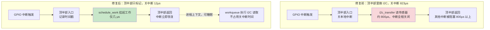

# 10.7.1 实战：GPIO中断延迟排查

> 所属章节：第10章 中断与时间 > 10.7 综合实战
>
> 难度：[E→M] | 预计阅读时间：15分钟

## <span class="blue"> 本节导读

本节覆盖：一个完整的 GPIO 中断延迟排查流程——工业 PLC 控制板要求中断响应在 100μs 以内，实测偶尔超过 1ms。从逻辑分析仪确认症状开始，用 ftrace irqsoff tracer 抓到顶半部里的 I2C 传输，修复后关中断时长从 823μs 降到 12μs。这是一类"粗延迟"问题的标准打法：现象确认 → 工具采集 → 根因定位 → 修复 → 数据验证。

---

## <span class="blue"> GPIO中断延迟排查：五步走完 [E→M]

场景：产线上的 PLC 控制板，要求 GPIO 收到中断信号后 100 微秒内必须响应，实测偶尔超过 1 毫秒。响应超时会造成产线误动作，必须定位到根因。<br>

按下面的步骤排查。

### 步骤1：症状确认——用数据说话，别靠猜

问题描述得再清楚，没有数据都是空谈。第一步：用逻辑分析仪抓实际波形，确认问题真实存在。<br>

```bash
# 在测试板上生成一个已知周期的GPIO中断源
# 用另一根GPIO翻转作为响应信号
echo 200 > /sys/class/gpio/export          # 导出GPIO 200（响应信号）
echo out > /sys/class/gpio/gpio200/direction

# 运行测试程序，在中断处理中翻转GPIO200
cd /opt/plc_test && ./gpio_latency_test
```

逻辑分析仪同时抓取中断输入和GPIO200输出，测量两者的边沿间隔时间。<br>

**预期结果**：正常情况80~100μs，但偶尔出现1200μs+的毛刺。<br>

> 💡 先用工具测量再下结论。凭"感觉系统有延迟"就开始调，调了一圈发现是测试方法不对的情况很常见。

### 步骤2：选择工具——ftrace irqsoff tracer

延迟来自哪里？顶半部跑太久？被其他中断抢了？调度导致的？irqsoff tracer专门记录关中断的时段，是这类问题的利器。<br>

```bash
# 挂载debugfs（通常已经挂载）
mount -t debugfs none /sys/kernel/debug

# 进入ftrace目录
cd /sys/kernel/debug/tracing

# 关闭tracer，清空buffer
echo 0 > tracing_on
echo > trace

# 选择irqsoff tracer——它会记录关中断时间最长的那段
echo irqsoff > current_tracer

# 设置过滤，只关心中断关闭超过50μs的
echo 50000 > tracing_thresh    # 单位：纳秒，即50μs

# 开始采集
echo 1 > tracing_on

# 运行测试程序产生延迟
cd /opt/plc_test && ./gpio_latency_test --duration=30s

# 停止采集
echo 0 > tracing_on

# 查看结果
cat trace
```

### 步骤3：数据采集和分析——从trace里找罪魁祸首

trace输出通常是这样的格式（截取关键部分）：<br>

```
# tracer: irqsoff
#
# irqsoff latency trace v1.1.5 on 5.10.65-rt53
# --------------------------------------------------------------------
# latency: 823 us, #4/4, CPU#1  |  (M:preempt VP:0, KP:0, SP:0 HP:0 #P:4)
#    -----------------
#    | task: irq/45-gpio123-750 (TID: 750)
#    -----------------
#
#                   _------=> CPU#
#                  / _-----=> irqs-off
#                 | / _----=> need-resched
#                || / _---=> hardirq/softirq
#                ||| / _--=> preempt-depth
#                |||| /
#                |||||     delay
#   cmd   pid    ||||| time |  caller
#      \   /      |||||  \   |  /
   <...>-750     1d...    0us!: _raw_spin_lock_irqsave <-gpio_irq_handler
   <...>-750     1d..1   10us+: i2c_transfer <-sensor_read_raw
   <...>-750     1d..1  823us+: _raw_spin_unlock_irqrestore <-gpio_irq_handler
```

这段 trace 的解读：<br>

| 字段 | 含义 | 本例数值 |
|------|------|----------|
| `latency: 823 us` | 本次关中断的总时长 | **823μs，远大于目标100μs** |
| `CPU#1` | 发生在CPU1上 | CPU1 |
| `task: irq/45-gpio123-750` | 关中断期间运行的任务 | GPIO中断线程 |
| `_raw_spin_lock_irqsave` | 开始关中断的位置 | GPIO中断处理入口 |
| `i2c_transfer` | 关中断期间执行的函数 | I2C数据传输！ |
| `_raw_spin_unlock_irqrestore` | 开中断的位置 | GPIO中断返回 |

问题清楚：GPIO 的顶半部里调了 `i2c_transfer`，硬中断里直接走 I2C 总线读传感器，一次就是 800 多微秒。这期间本地中断关闭，其他中断全部进不来，延迟超标是必然结果。<br>

### 步骤4：根因定位——I2C驱动在顶半部执行800μs

为什么会这样？去翻那个传感器的驱动代码（假设是`drivers/iio/temperature/some-sensor.c`）：<br>

```c
// 问题代码——顶半部里直接读I2C！
static irqreturn_t sensor_irq_handler(int irq, void *dev_id)
{
    struct sensor_state *st = dev_id;
    u8 buf[4];

    // 🔴 错误：在硬中断里做I2C传输！
    i2c_master_recv(st->client, buf, 4);   // 这条语句耗时~800μs

    // 简单处理读到的数据
    st->last_reading = buf[0] << 8 | buf[1];

    return IRQ_HANDLED;  // 没有唤醒底半部！
}
```

这个驱动的作者犯了一个典型的错误：**在顶半部（硬中断上下文）里执行慢速I2C操作**。I2C总线速率通常只有100kHz或400kHz，读4个字节加上各种协议开销，几百微秒很正常。但硬中断里这几百微秒是关中断的，整个系统的响应性都被拖垮了。<br>

修复前后的中断路径对比：



### 步骤5：修复验证——移到workqueue + 重新测量

正确的做法是什么？顶半部只干一件事：标记中断到来，然后交给底半部去慢慢读I2C。<br>

```c
// 修复后的代码——顶半部快速返回，I2C移到workqueue
static irqreturn_t sensor_irq_handler(int irq, void *dev_id)
{
    struct sensor_state *st = dev_id;

    // ✅ 正确：顶半部只做最少的工作
    st->irq_timestamp = ktime_get_ns();

    // 调度workqueue去处理I2C读取
    schedule_work(&st->i2c_work);

    return IRQ_HANDLED;
}

static void sensor_i2c_work_fn(struct work_struct *work)
{
    struct sensor_state *st = container_of(work, struct sensor_state, i2c_work);
    u8 buf[4];

    // I2C操作现在运行在进程上下文，可以睡眠
    i2c_master_recv(st->client, buf, 4);

    st->last_reading = buf[0] << 8 | buf[1];

    // 处理完后通知上层
    complete(&st->read_done);
}
```

改完后编译、部署，重新跑测试：<br>

```bash
# 重新加载驱动
rmmod some_sensor
insmod some_sensor.ko

# 再次用ftrace验证
echo 0 > /sys/kernel/debug/tracing/tracing_on
echo > /sys/kernel/debug/tracing/trace
echo irqsoff > /sys/kernel/debug/tracing/current_tracer
echo 50000 > /sys/kernel/debug/tracing/tracing_thresh
echo 1 > /sys/kernel/debug/tracing/tracing_on
./gpio_latency_test --duration=60s
echo 0 > /sys/kernel/debug/tracing/tracing_on
cat /sys/kernel/debug/tracing/trace | head -30
```

**修复后的trace**：<br>

```
# latency: 12 us, #4/4, CPU#1
#    -----------------
#    | task: irq/45-gpio123-812
#    -----------------
#
#   cmd   pid    ||||| time |  caller
#      \   /      |||||  \   |  /
   <...>-812     1d...    0us!: _raw_spin_lock_irqsave <-gpio_irq_handler
   <...>-812     1d..1    3us+: gpio_set_value <-gpio_irq_handler
   <...>-812     1d..1   12us+: _raw_spin_unlock_irqrestore <-gpio_irq_handler
```

关中断时间从823μs降到12μs！再用逻辑分析仪验证实际GPIO响应延迟：<br>

| 指标 | 修复前 | 修复后 | 目标 |
|------|--------|--------|------|
| 最大关中断时长 | 823μs | 12μs | <100μs |
| GPIO响应延迟 | 1200μs | **45μs** | <100μs |
| 测试时长 | 30s | 60s | — |
| 延迟超标次数 | 12次 | **0次** | 0 |

> ⚠️ 修复后必须用数据验证，不要假设修复一定有效。只改不测的常见结局是：延迟从 800μs 搬到了另一个触发场景。每个修复都要闭环验证。

---

## <span class="blue"> 本节总结

| 内容 | 要点 |
|------|------|
| **GPIO延迟排查SOP** | 症状确认 → ftrace irqsoff → trace分析 → 根因定位 → 修复验证 |
| **顶半部铁律** | 硬中断里不能执行慢操作（I2C/SPI/printf），应移到 workqueue 或线程化中断的 thread_fn 里延后处理 |
| **irqsoff tracer** | `tracing_thresh` 过滤噪音，`latency` 字段给总时长，`task` 字段定位责任方 |
| **闭环验证** | 修复后必须重测：关中断时长 823μs→12μs，GPIO 响应延迟 1200μs→45μs |

---

## <span class="blue"> 下一步

> **10.7.2 实战：音频爆音排查与排错方法论**
>
> 本节的 GPIO 延迟是"粗延迟"——800μs 级别，ftrace 一抓一个准。下一节看"细延迟"：音频偶发爆音，平均值完全正常、偶尔迟到几百微秒，靠看 trace 看不出来，需要用精度测试模块量化。最后把两个案例提炼成一套通用的排错方法论。

---

## <span class="blue"> 配套资源

| 资源 | 内容 | 路径/说明 |
|------|------|-----------|
| ftrace使用流程 | irqsoff tracer完整步骤 | 本节步骤2 |
| 修复前后路径对比图 | mermaid图 | 本节步骤4 |
| 内核文档 | ftrace官方文档 | `Documentation/trace/ftrace.rst`（内核源码树） |
| 参考书籍 | 《Linux设备驱动程序》第10章 | 中断处理经典参考 |
