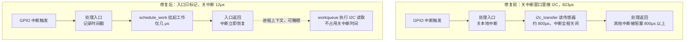

# 10.7.1 实战：GPIO 中断延迟排查

> 所属章节：第10章 中断与时间 > 10.7 综合实战
>
> 难度：[E→M] | 预计阅读时间：15分钟

## <span class="blue">本节导读

10.1 到 10.6 把中断与时间的机制和工具备齐了，从这一节开始实战：用它们排查两个真实问题。

第一个问题：工业 PLC 控制板要求 GPIO 中断响应在 100μs 以内，实测偶尔超过 1ms。从逻辑分析仪确认症状开始，用 ftrace irqsoff tracer 抓到顶半部里的 I2C 传输，修复后关中断时长从 823μs 降到 12μs。这是一类"粗延迟"问题的标准打法：现象确认 → 工具采集 → 根因定位 → 修复 → 数据验证。

---

## <span class="blue">GPIO 中断延迟排查：五步走完 [E→M]

场景：产线上的 PLC 控制板，要求 GPIO 收到中断信号后 100 微秒内必须响应，实测偶尔超过 1 毫秒。响应超时会造成产线误动作，必须定位到根因。

按下面的步骤排查。

### 步骤1：症状确认——用数据说话，别靠猜

问题描述得再清楚，没有数据都是空谈。第一步：用逻辑分析仪抓实际波形，确认问题真实存在。

```bash
# 在测试板上生成一个已知周期的GPIO中断源
# 用另一根GPIO翻转作为响应信号
echo 200 > /sys/class/gpio/export          # 导出GPIO 200（响应信号）
echo out > /sys/class/gpio/gpio200/direction

# 运行测试程序，在中断处理中翻转GPIO200
cd /opt/plc_test && ./gpio_latency_test
```

逻辑分析仪同时抓取中断输入和 GPIO200 输出，测量两者的边沿间隔时间。

**预期结果**：正常情况 80~100μs，但偶尔出现 1200μs+ 的毛刺。

> 💡 先用工具测量再下结论。凭"感觉系统有延迟"就开始调，调了一圈发现是测试方法不对的情况很常见。

### 步骤2：选择工具——ftrace irqsoff tracer

延迟来自哪里？顶半部跑太久？被其他中断抢了？调度导致的？irqsoff tracer 专门记录关中断的时段，是这类问题的利器。

```bash
# 挂载debugfs（通常已经挂载）
mount -t debugfs none /sys/kernel/debug

# 进入ftrace目录
cd /sys/kernel/debug/tracing

# 关闭tracer，清空buffer
echo 0 > tracing_on
echo > trace

# 选择irqsoff tracer——它会记录关中断时间最长的那段
echo irqsoff > current_tracer

# 设置过滤，只关心中断关闭超过50μs的
echo 50000 > tracing_thresh    # 单位：纳秒，即50μs

# 开始采集
echo 1 > tracing_on

# 运行测试程序产生延迟
cd /opt/plc_test && ./gpio_latency_test --duration=30s

# 停止采集
echo 0 > tracing_on

# 查看结果
cat trace
```

### 步骤3：数据采集和分析——从 trace 里找罪魁祸首

trace 输出通常是这样的格式（截取关键部分）：

```text
# tracer: irqsoff
#
# irqsoff latency trace v1.1.5 on 6.6.0
# --------------------------------------------------------------------
# latency: 823 us, #4/4, CPU#1  |  (M:preempt VP:0, KP:0, SP:0 HP:0 #P:4)
#    -----------------
#    | task: irq/45-gpio123-750 (TID: 750)
#    -----------------
#
#                   _------=> CPU#
#                  / _-----=> irqs-off
#                 | / _----=> need-resched
#                || / _---=> hardirq/softirq
#                ||| / _--=> preempt-depth
#                |||| /
#                |||||     delay
#   cmd   pid    ||||| time |  caller
#      \   /      |||||  \   |  /
   <...>-750     1d...    0us!: _raw_spin_lock_irqsave <-gpio_irq_handler
   <...>-750     1d..1   10us+: i2c_transfer <-sensor_read_raw
   <...>-750     1d..1  823us+: _raw_spin_unlock_irqrestore <-gpio_irq_handler
```

这段 trace 的解读：

| 字段 | 含义 | 本例数值 |
|------|------|----------|
| `latency: 823 us` | 本次关中断的总时长 | **823μs，远大于目标 100μs** |
| `CPU#1` | 发生在 CPU1 上 | CPU1 |
| `task: irq/45-gpio123-750` | 关中断期间运行的任务 | GPIO 中断线程 |
| `_raw_spin_lock_irqsave` | 开始关中断的位置 | GPIO 中断处理入口 |
| `i2c_transfer` | 关中断期间执行的函数 | I2C 数据传输！ |
| `_raw_spin_unlock_irqrestore` | 开中断的位置 | GPIO 中断返回 |

注意 `task:` 那一行的名字：`irq/45-gpio123` 是内核给 IRQ 45 创建的线程化中断线程（10.4.2 讲的 threaded IRQ 在 ps 里就是这个样子）——这个驱动用了 threaded IRQ，但线程函数里依然关了中断做慢操作，问题一点没绕开。

问题清楚了：GPIO 中断的处理路径里调了 `i2c_transfer`，直接走 I2C 总线读传感器，一次就是 800 多微秒。这期间本地中断关闭，其他中断全部进不来，延迟超标是必然结果。

### 步骤4：根因定位——I2C 传输在关中断窗口里执行 800μs

为什么会这样？去翻那个传感器的驱动代码（假设是 `drivers/iio/temperature/some-sensor.c`）：

```c
/* 问题代码——中断处理路径里直接读 I2C */
static irqreturn_t sensor_irq_handler(int irq, void *dev_id)
{
	struct sensor_state *st = dev_id;
	u8 buf[4];

	/* 错误：关中断窗口里做 I2C 传输 */
	i2c_master_recv(st->client, buf, 4);   /* 这条语句耗时约 800μs */

	st->last_reading = buf[0] << 8 | buf[1];

	return IRQ_HANDLED;
}
```

这个驱动的作者犯了一个典型的错误：**在关中断的窗口里执行慢速 I2C 操作**。I2C 总线速率通常只有 100kHz 或 400kHz，读 4 个字节加上各种协议开销，几百微秒很正常。但这几百微秒里本地中断是关的，整个系统的响应性都被拖垮了。

修复前后的中断路径对比：



### 步骤5：修复验证——移到 workqueue + 重新测量

正确的做法是什么？中断路径里只干一件事：标记中断到来，然后交给底半部去慢慢读 I2C。

```c
/* 修复后的代码——中断入口快速返回，I2C 移到 workqueue */
static irqreturn_t sensor_irq_handler(int irq, void *dev_id)
{
	struct sensor_state *st = dev_id;

	/* 入口只做最少的工作：记录时间戳 */
	st->irq_timestamp = ktime_get_ns();

	/* 把 I2C 读取调度给 workqueue，随即返回 */
	schedule_work(&st->i2c_work);

	return IRQ_HANDLED;
}

static void sensor_i2c_work_fn(struct work_struct *work)
{
	/* container_of：从 work 成员的地址反推出外层结构体的地址 */
	struct sensor_state *st = container_of(work, struct sensor_state, i2c_work);
	u8 buf[4];

	/* 进程上下文执行，可以睡眠，慢速 I2C 不再阻塞中断 */
	i2c_master_recv(st->client, buf, 4);

	st->last_reading = buf[0] << 8 | buf[1];

	/* 通知上层读取完成 */
	complete(&st->read_done);
}
```

> 💡 这个驱动本来就用 `request_threaded_irq()` 注册了线程化中断（10.4.2），那更省事的修法是：I2C 读取直接放进 `thread_fn`，连 workqueue 都不用——thread_fn 本身就是进程上下文、可以睡眠。10.3.6 的底半部选择决策树在这里同样适用：I2C/SPI 这类会睡眠的总线操作，归宿是 threaded IRQ 的 thread_fn 或 workqueue，而不是关中断的窗口。

改完后编译、部署，重新跑测试：

```bash
# 重新加载驱动
rmmod some_sensor
insmod some_sensor.ko

# 再次用ftrace验证
echo 0 > /sys/kernel/debug/tracing/tracing_on
echo > /sys/kernel/debug/tracing/trace
echo irqsoff > /sys/kernel/debug/tracing/current_tracer
echo 50000 > /sys/kernel/debug/tracing/tracing_thresh
echo 1 > /sys/kernel/debug/tracing/tracing_on
./gpio_latency_test --duration=60s
echo 0 > /sys/kernel/debug/tracing/tracing_on
cat /sys/kernel/debug/tracing/trace | head -30
```

**修复后的 trace**：

```text
# latency: 12 us, #4/4, CPU#1
#    -----------------
#    | task: irq/45-gpio123-812
#    -----------------
#
#   cmd   pid    ||||| time |  caller
#      \   /      |||||  \   |  /
   <...>-812     1d...    0us!: _raw_spin_lock_irqsave <-gpio_irq_handler
   <...>-812     1d..1    3us+: gpio_set_value <-gpio_irq_handler
   <...>-812     1d..1   12us+: _raw_spin_unlock_irqrestore <-gpio_irq_handler
```

关中断时间从 823μs 降到 12μs。再用逻辑分析仪验证实际 GPIO 响应延迟：

| 指标 | 修复前 | 修复后 | 目标 |
|------|--------|--------|------|
| 最大关中断时长 | 823μs | 12μs | <100μs |
| GPIO 响应延迟 | 1200μs | **45μs** | <100μs |
| 测试时长 | 30s | 60s | — |
| 延迟超标次数 | 12 次 | **0 次** | 0 |

> ⚠️ 修复后必须用数据验证，不要假设修复一定有效。只改不测的常见结局是：延迟从 800μs 搬到了另一个触发场景。每个修复都要闭环验证。

---

## <span class="blue">本节总结

GPIO 延迟这类"粗延迟"的标准打法是五步闭环：逻辑分析仪拿真实数据 → irqsoff tracer 抓关中断现场 → trace 里的 task 与函数栈指出责任方 → 中断路径只留标记、慢活移交 workqueue 或 thread_fn → 重测验证。

本节最重要的不是工具命令，而是两条纪律：关中断的窗口里只做不得不做的事（823μs 的 I2C 传输就是反面教材，I2C/SPI 这类会睡眠的操作归宿在 threaded IRQ 或 workqueue）；修复必须用数据闭环，不能假设有效。irqsoff tracer 的使用要点也就三个：`tracing_thresh` 过滤噪音、`latency` 字段给总时长、`task` 字段定位责任方。

---

## <span class="blue">下一步

10.7.2 实战：音频爆音排查与排错方法论——本节的 GPIO 延迟是"粗延迟"，800μs 级别，ftrace 一抓一个准。下一节看"细延迟"：音频偶发爆音，平均值完全正常、偶尔迟到几百微秒，靠看 trace 看不出来，需要用精度测试模块量化。最后把两个案例提炼成一套通用的排错方法论。
